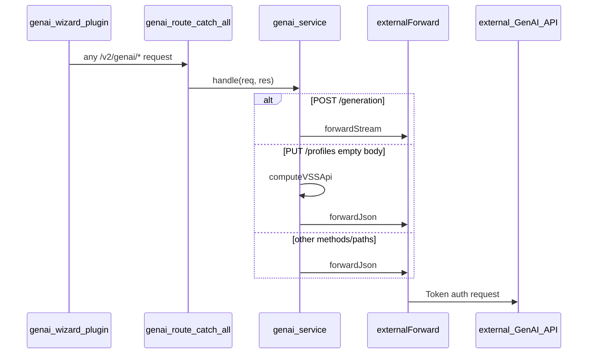

# GenAI service (plugin proxy)

The backend exposes GenAI endpoints under `/v2/genai/*` for the genai-wizard plugin and related integrations. These routes authenticate the caller with the normal backend JWT middleware, then call the external GenAI API directly using configurable credentials.

This replaces the former **genai-proxy** sidecar. The Prototype tab SDV Copilot (`GENAI_SDV_APP_ENDPOINT` site config) is a separate flow and is not handled by these routes.

## Architecture

Two backend modules handle all GenAI traffic:

| Module | Role |
|---|---|
| [`src/services/externalForward.service.js`](../src/services/externalForward.service.js) | Generic authenticated HTTP forwarder (JSON + SSE streaming, base URL map, error mapping) |
| [`src/services/genai.service.js`](../src/services/genai.service.js) | Thin GenAI adapter: path/environment parsing, profile VSS fallback, delegates to the forwarder |

[`src/routes/v2/system/genai.route.js`](../src/routes/v2/system/genai.route.js) uses a single catch-all handler after `auth()` — no per-endpoint controllers.



## Environment variables

| Variable | Required | Description |
|---|---|---|
| `EXTERNAL_GENAI_URL` | Yes (for GenAI features) | Default upstream GenAI base URL |
| `EXTERNAL_GENAI_DEVICE_TOKEN` | Yes (for GenAI features) | Upstream device token (`Authorization: Token …`) |
| `EXTERNAL_GENAI_URL_DEV` | No | Upstream URL when path includes `/dev` environment segment |
| `EXTERNAL_GENAI_URL_PROD` | No | Upstream URL when path includes `/prod` environment segment |
| `EXTERNAL_GENAI_URL_STAGING` | No | Upstream URL when path includes `/staging` environment segment |
| `GENAI_URL` | No (deprecated) | Legacy sidecar proxy target; used only when `EXTERNAL_GENAI_*` is unset |

When neither built-in external config nor `GENAI_URL` is set, GenAI routes return `503` with `{ message: 'GenAI service is not implemented' }`.

## Path handling

The GenAI adapter parses optional environment segments from the request path and forwards to the matching upstream base URL:

| Incoming path | Upstream path | Base URL |
|---|---|---|
| `/generation` | `/generation` | default |
| `/generation/dev` | `/generation` | dev |
| `/profiles/model-1` | `/profiles/model-1` | default |
| `/profiles/model-1/prod` | `/profiles/model-1` | prod |
| `/conversations/{id}/history` | same | default |
| `/actuator/info` | same | default |

## Profile upsert without body

If `PUT /v2/genai/profiles/{modelId}` is called without a VSS payload, the backend computes the model API locally via `apiService.computeVSSApi(modelId)` and transforms it to the GenAI profile format. This replaces the old sidecar hardcoded call to `playground-be`.

## Migration from genai-proxy sidecar

1. Set on the main backend container:

```env
EXTERNAL_GENAI_URL=http://genai:8080
EXTERNAL_GENAI_DEVICE_TOKEN=your-device-token
```

2. Remove the sidecar configuration:

```env
# Remove
GENAI_URL=http://genai-proxy:8080
```

3. Remove the `genai-proxy` service from Docker Compose.

4. Restart the backend and verify:
   - `POST /v2/genai/generation` streams SSE events
   - `GET /v2/genai/actuator/info` returns upstream version
   - Plugin profile ensure (`PUT /v2/genai/profiles/{modelId}`) succeeds

## Debugging

Enable development logging (`NODE_ENV=development`) to see `[genai]` debug lines for upstream requests, stream lifecycle, and profile upsert fallbacks.
