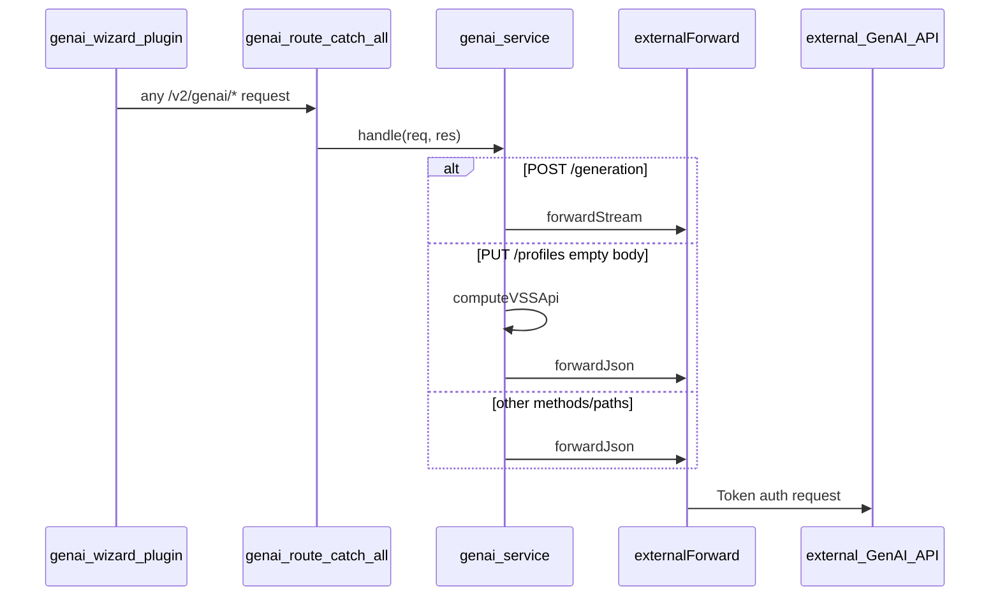

# GenAI service (plugin proxy)

The backend exposes GenAI endpoints under `/v2/genai/*` for the genai-wizard plugin and related integrations. These routes authenticate the caller with the normal backend JWT middleware, then call the external GenAI API directly using configurable credentials.

This replaces the former **genai-proxy** sidecar. The Prototype tab SDV Copilot (`GENAI_SDV_APP_ENDPOINT` site config) is a separate flow and is not handled by these routes.

## Architecture

Backend modules for GenAI traffic:

| Module | Role |
|---|---|
| [`src/services/externalForward.service.js`](../src/services/externalForward.service.js) | Generic authenticated HTTP forwarder (JSON + SSE streaming, base URL map, error mapping) |
| [`src/services/genai.service.js`](../src/services/genai.service.js) | Thin GenAI adapter: path/environment parsing, profile VSS fallback, delegates to the forwarder |
| [`src/services/serviceToken.service.js`](../src/services/serviceToken.service.js) | Issues short-lived service keys (issuers can be added to the map) |

[`src/routes/v2/system/genai.route.js`](../src/routes/v2/system/genai.route.js) authenticates all callers, serves `GET /token` locally, then uses a catch-all for upstream GenAI forwarding.



## Environment variables

| Variable | Required | Description |
|---|---|---|
| `EXTERNAL_GENAI_URL` | Yes (for GenAI features) | Upstream GenAI base URL |
| `EXTERNAL_GENAI_DEVICE_TOKEN` | Yes (for GenAI features) | Upstream device token (`Authorization: Token …`) |
| `GENAI_URL` | No (deprecated) | Legacy sidecar proxy target; used only when `EXTERNAL_GENAI_*` is unset |

When neither built-in external config nor `GENAI_URL` is set, forwarded GenAI routes return `503` with `{ message: 'GenAI service is not implemented' }`. `GET /v2/genai/token` does not require GenAI upstream config. Issuer credentials are injected by the platform environment and are not operator-configured.

## Service tokens

`GET /v2/genai/token?service=azure-speech` (JWT required) mints a short-lived key for a configured third-party service. Long-lived secrets come from the platform environment; the backend returns only what the client needs to call that service.

This path is handled **before** the GenAI catch-all and is never forwarded to the external GenAI API.

| Query | Description |
|---|---|
| `service` | Issuer id. Currently `azure-speech`. |

| Condition | Status |
|---|---|
| Missing or unknown `service` | 400 |
| Issuer credentials not provided by the platform | 503 |
| Upstream mint fails | 200 with `auth: "subscription"` (falls back to the original key) instead of 502 |
| Success | 200 |

Example success:

```json
{
  "service": "azure-speech",
  "token": "<sts-token-or-subscription-key>",
  "region": "eastus",
  "auth": "authorization"
}
```

`auth` is `authorization` when Azure STS succeeds, or `subscription` when STS is unreachable and the backend falls back to the original subscription key. The client must use Speech SDK `fromAuthorizationToken` vs `fromSubscription` accordingly.

Add another issuer by registering a function on the `ISSUERS` map in `serviceToken.service.js` and including the id in `SUPPORTED_SERVICES`.

## Path handling

The GenAI adapter strips optional `/dev`, `/prod`, or `/staging` path segments and always forwards to `EXTERNAL_GENAI_URL`:

| Incoming path | Upstream path |
|---|---|
| `/generation` | `/generation` |
| `/generation/dev` | `/generation` |
| `/profiles/model-1` | `/profiles/model-1` |
| `/profiles/model-1/prod` | `/profiles/model-1` |
| `/conversations/{id}/history` | same |
| `/actuator/info` | same |

## Profile upsert without body

If `PUT /v2/genai/profiles/{modelId}` is called without a VSS payload, the backend computes the model API locally via `apiService.computeVSSApi(modelId)` and transforms it to the GenAI profile format. This replaces the old sidecar hardcoded call to `playground-be`.

## Migration from genai-proxy sidecar

1. Set on the main backend container:

```env
EXTERNAL_GENAI_URL=http://genai:8080
EXTERNAL_GENAI_DEVICE_TOKEN=your-device-token
```

2. Remove the sidecar configuration:

```env
# Remove
GENAI_URL=http://genai-proxy:8080
```

3. Remove the `genai-proxy` service from Docker Compose.

4. Restart the backend and verify:
   - `POST /v2/genai/generation` streams SSE events
   - `GET /v2/genai/actuator/info` returns upstream version
   - Plugin profile ensure (`PUT /v2/genai/profiles/{modelId}`) succeeds

## Debugging

Enable development logging (`NODE_ENV=development`) to see `[genai]` debug lines for upstream requests, stream lifecycle, and profile upsert fallbacks.
