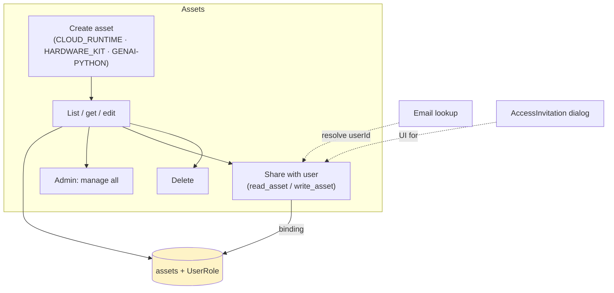
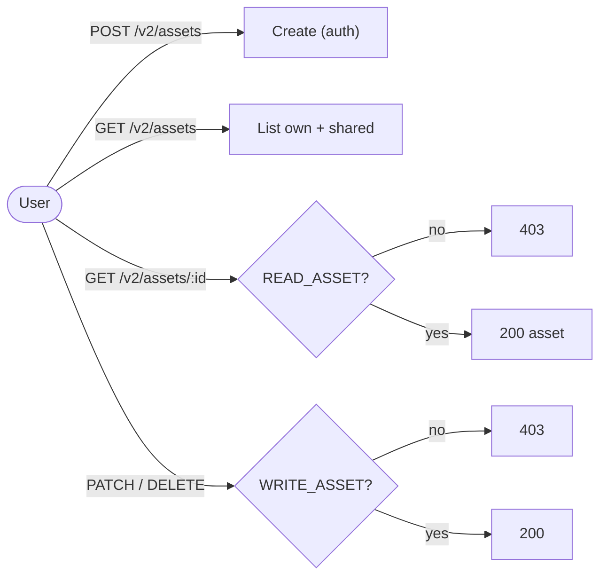
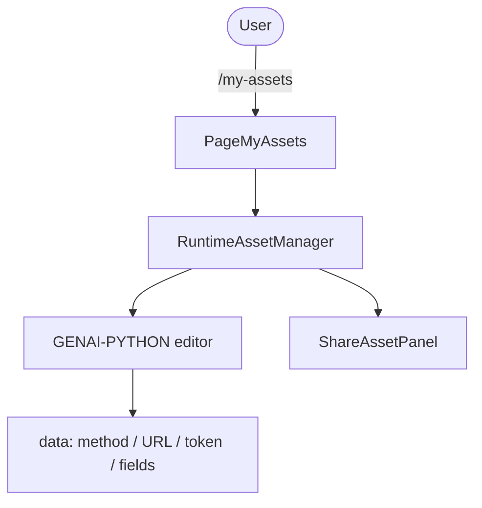
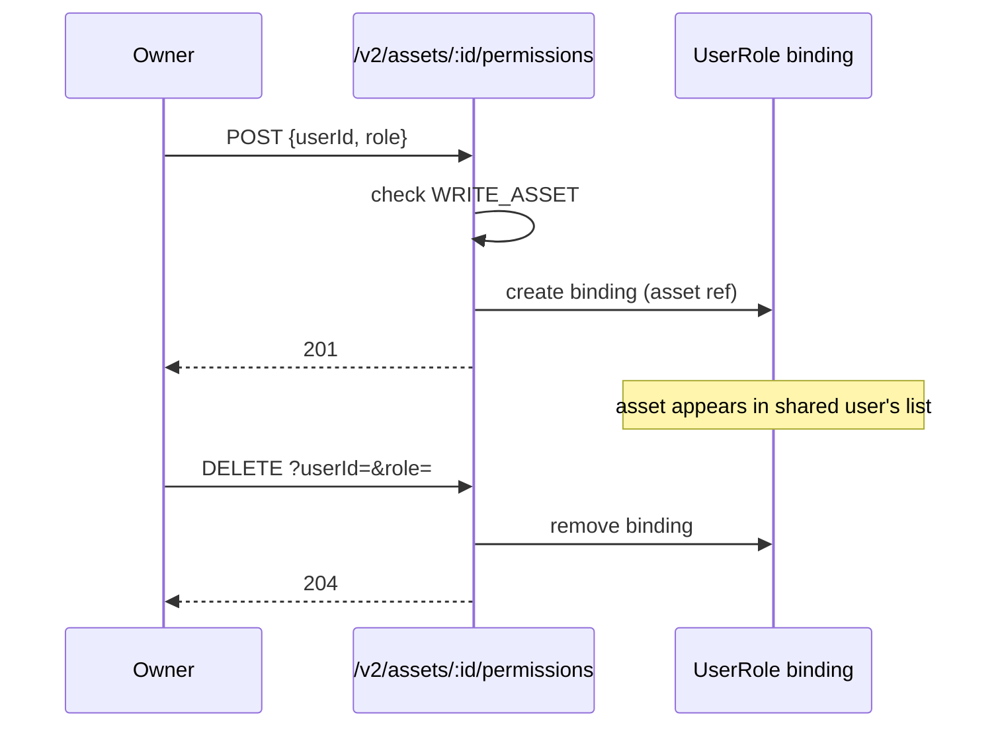
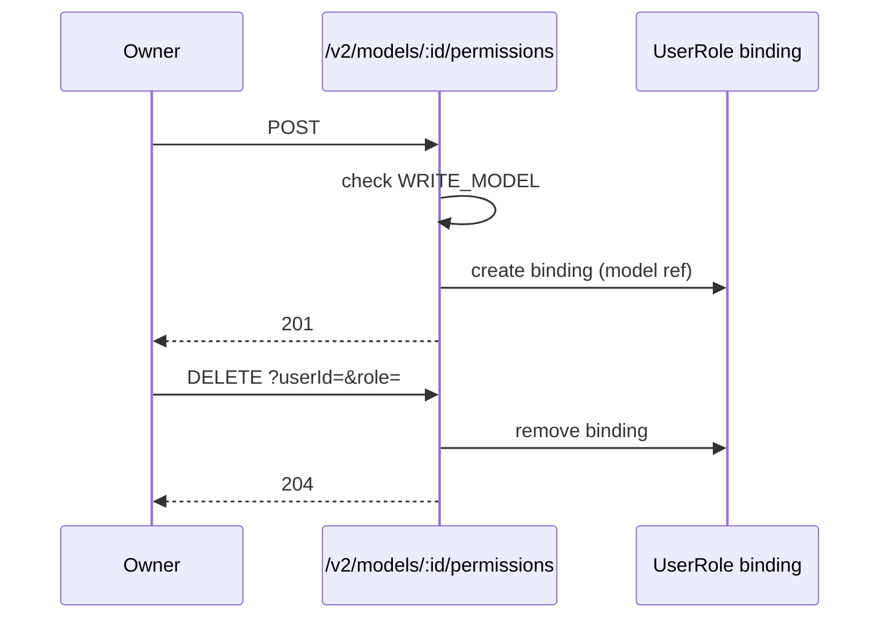
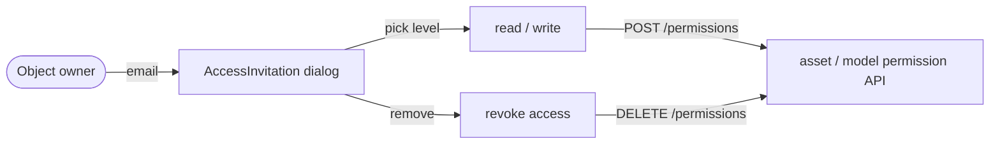

# Cluster: Assets & Sharing

Create and manage your own resources (cloud runtimes, hardware kits, GenAI configs), share them with collaborators, and invite others to contribute to models.

**Implementation:** `backend/src/routes/v2/user-management/asset.route.js`, `backend/src/models/asset.model.js`, `frontend/src/pages/PageMyAssets.tsx`, `frontend/src/components/organisms/RuntimeAssetManager.tsx`, `frontend/src/components/molecules/ShareAssetPanel.tsx`.

---

## Capabilities in this cluster

| ID | Capability |
|----|------------|
| [CAP-ASSET-01](#cap-asset-01--user-assets-crud) | User assets CRUD |
| [CAP-ASSET-02](#cap-asset-02--admin-all-assets-view) | Admin all-assets view |
| [CAP-ASSET-03](#cap-asset-03--my-assets) | My Assets |
| [CAP-ASSET-04](#cap-asset-04--asset-sharing) | Asset sharing |
| [CAP-ASSET-05](#cap-asset-05--model-contributors) | Model contributors |
| [CAP-ASSET-06](#cap-asset-06--access-invitation) | Access invitation |
| [CAP-ASSET-07](#cap-asset-07--user-lookup-by-email) | User lookup by email |

## CAP-ASSET-01 — User assets CRUD

### Description

As a user, I can create, view, edit, and delete my own assets of the types enabled on the instance (default: Cloud Runtime, Hardware Kit, GenAI Python), so that I keep my runtime, kit, and GenAI configurations in one place.

### Who uses it / value

End users (manage their runtimes/kits/GenAI configs); admins (oversight).

### Acceptance criteria

- When I create an asset (pick a type from the enabled types, enter a name, and save), it appears in My Assets; when I open it, I see its details; when I edit it, the change persists; when I delete it and confirm, it is gone from my list.
- When I try to create an asset of a type not enabled on the instance, that type is not offered in the type picker.
- When I try to view, edit, or delete another user's asset that hasn't been shared with me, I am prevented from accessing it.
- When I am not signed in, I am prevented from opening My Assets or performing any asset action.
- When a create, edit, or delete fails, I see an error and my list is unchanged.

### API contract

- `GET /v2/assets` (auth) → `200` — list own + shared assets; query `name`, `type`, `sortBy`, `limit`, `page`.
- `POST /v2/assets` (auth) → `200` — create; body `{ name: string, type: string, data: any }`.
- `GET /v2/assets/:id` (auth + `READ_ASSET`, owner bypass) → `200` — get asset (includes `readAccessUsers` / `writeAccessUsers` when caller has `WRITE_ASSET`); `404` if not found.
- `PATCH /v2/assets/:id` (auth + `WRITE_ASSET`, owner bypass) → `200` (empty body) — update; body `{ name?, type?, data? }` (min 1 field); `404` if not found.
- `DELETE /v2/assets/:id` (auth + `WRITE_ASSET`, owner bypass) → `200` — delete; `404` if not found.
- Asset types are restricted to the `USER_ASSET_TYPES` site-config (default `['CLOUD_RUNTIME','HARDWARE_KIT','GENAI-PYTHON']`) — enforced in the UI type picker, not at the validation layer (`type` is `Joi.string().required()`, not constrained to the allow-list).
- `data` is `Joi.any()` — no schema or size guard.
- No rate limiting — `authLimiter` is defined but not wired to the asset routes.

### Quality control

Create a `CLOUD_RUNTIME` asset and confirm it appears in My Assets; edit it and confirm the change persists; delete it and confirm it is gone; access another user's asset without sharing and confirm `403`.

### Security

All routes auth; get/update/delete gated by `READ_ASSET`/`WRITE_ASSET` permission on the asset; types gated by `USER_ASSET_TYPES`.

**Coverage:**
- **Auth:** Required on all asset routes.
- **Authorization:** `READ_ASSET` for get, `WRITE_ASSET` for update/delete (owner bypass); create is auth-only; list returns own + shared assets.
- **Input validation:** Validated on create/get/update/delete; `data` has no schema or size guard; `type` is not constrained to `USER_ASSET_TYPES` at the validation layer.
- **Rate limiting:** Not applied — `authLimiter` is defined but not wired to the asset routes.
- **Secrets:** Asset `data` may hold GenAI tokens or runtime credentials — stored at rest with no app-level encryption.

**Risks:**
- **Cross-user asset access:** a missing `READ_ASSET`/`WRITE_ASSET` check would let any authenticated user read or modify another user's assets, exposing runtime configs, hardware-kit identity and GenAI tokens. *Mitigation:* the system gates get/update/delete on `READ_ASSET`/`WRITE_ASSET` (owner bypass); keep the check on every route.
- **Type bypass:** if the `USER_ASSET_TYPES` gate were skipped, users could create asset types outside the allowed set, introducing untrusted config shapes the frontend/backend aren't built to handle safely. *Mitigation:* none currently — enforce the `USER_ASSET_TYPES` allow-list in the validation layer.
- **Arbitrary `data` abuse:** because `data` is arbitrary, a missing type/size guard could let a user store oversized payloads, exhausting per-user storage. *Mitigation:* none currently — add a schema/size guard on `data`.

### Personal data processing

No — this capability does not process personal data. `created_by` is a userId reference; asset `data` holds credentials/secrets (AutoWRX-operational), not personal data.

**Risks:**
- none — no personal data processed.

### AutoWRX data

Asset `data` (arbitrary config — endpoint URLs, tokens, kit identity) stored in `assets` with `created_by`.

**Coverage:**
- **Stored data:** `name`, `type`, `data` (Mixed), `created_by`, timestamps — persisted in the `assets` collection.
- **Retention:** Indefinite until hard-deleted (no soft delete, no TTL).
- **Encryption:** No app-level at-rest encryption; in transit TLS deployment-dependent.
- **Logging:** Standard logger; no asset-data logging observed.

**Risks:**
- **Secrets in cleartext:** `data` may hold GenAI auth tokens or runtime credentials; stored unencrypted at rest, a DB leak or admin-view exposure hands plaintext secrets to the attacker. *Mitigation:* none currently — encrypt asset `data` credentials at rest.
- **Irreversible delete:** assets are hard-removed (no soft-delete), so accidental or malicious deletion permanently destroys the user's runtime/kit config.

### Test coverage
- **E2E (Playwright):** 1 test case in `my-assets.spec.ts` (create + delete runtime asset via UI) — SITEMAP: ✅
- **Estimated coverage:** ≈50% (est.) — 1 E2E covers create/delete across 2 acceptance criteria; type-restriction and share paths untested.
- **Unit (Jest):** none

## CAP-ASSET-02 — Admin all-assets view

### Description

As an admin, I can retrieve every user's assets across the instance (via the API — there is no in-app admin all-assets page) so that I can provide oversight and support.

### Who uses it / value

Admins (oversight/support).

### Acceptance criteria

- When I request the admin all-assets view, I see every user's assets across the instance, and can filter by name/type or sort the results.
- When I am a non-admin, I am prevented from accessing the all-assets view.
- There is no in-app admin page for this — it is reached via the API.

### API contract

- `GET /v2/assets/manage` (auth + `MANAGE_USERS` / admin) → `200` — returns all assets across users; query `name`, `type`, `sortBy`, `limit`, `page`.
- No rate limiting — `authLimiter` is not wired to the route.
- Returns all asset `data` (may include GenAI tokens / runtime credentials) to admins — no per-record secret redaction.

### Quality control

As an admin, call `GET /v2/assets/manage` and confirm all assets are returned; as a non-admin, confirm `403`.

### Security

`MANAGE_USERS` required.

**Coverage:**
- **Auth:** Required on `GET /v2/assets/manage`.
- **Authorization:** `MANAGE_USERS` (admin); owner bypass does not apply.
- **Input validation:** Query validated (name/type/sortBy/limit/page).
- **Rate limiting:** Not applied — `authLimiter` is not wired to the route.
- **Secrets:** Returns all asset `data` (may include GenAI tokens / runtime credentials) to admins — no per-record secret redaction.

**Risks:**
- **Privilege abuse:** an admin (or anyone who obtains `MANAGE_USERS`) can read every user's assets, including GenAI tokens and runtime credentials — a single compromised admin drains all users' secrets. *Mitigation:* none currently — redact secrets in `data` for the admin view and audit access.
- **Missing gate:** if the `MANAGE_USERS` check regressed, the manage endpoint would become a full cross-user data exfiltration path for any authenticated user. *Mitigation:* the system enforces `MANAGE_USERS` on `GET /v2/assets/manage`; keep the check and add a regression test.

### Personal data processing

No — this capability does not process personal data. `created_by` references users but no personal fields are returned.

**Risks:**
- none — no personal data processed.

### AutoWRX data

Exposes all asset records to admins (incl. `data` which may hold tokens — admin-only).

**Coverage:**
- **Stored data:** Returns all asset records (`name`/`type`/`data`/`created_by`) — admin-only read.
- **Retention:** N/A — read-only view; retention is governed by CAP-ASSET-01.
- **Encryption:** No app-level at-rest encryption; data is exposed in the response body.
- **Logging:** Standard logger; no bulk-response logging observed.

**Risks:**
- **Bulk secret exposure:** one endpoint returns all users' `data` at once; a leak of an admin session token exposes every user's credentials simultaneously with no per-record gate.

### Test coverage
- **E2E (Playwright):** 0 — not covered — SITEMAP: ❌
- **Estimated coverage:** ≈0% (est.) — no E2E spec
- **Unit (Jest):** none

## CAP-ASSET-03 — My Assets

### Description

As a user, I can manage my assets from the My Assets page — filtered by type, with create/edit/share/delete actions per asset — and configure a GenAI endpoint (method, URL, access token, request/response fields) for a GenAI Python asset, so that GenAI flows use my endpoint.

### Who uses it / value

End users (manage assets); GenAI integrators (configure endpoints).

### Acceptance criteria

- When I open the My Assets page, I see my assets grouped by type tabs (with counts) and can create, edit, share, or delete them from the row actions.
- When I create or edit a GenAI Python asset, the editor captures my endpoint config (method, URL, access token, request field, response field); when I save, the config is stored on the asset and used by GenAI flows.
- When I switch type tabs, the list filters to that type; when I have no assets, the page tells me I have none.
- When I am not signed in, I am prevented from opening the My Assets page.
- When a create, edit, or delete fails, I see an error and my list is unchanged.

### API contract

The My Assets page is a UI over the asset endpoints (CAP-ASSET-01). All routes require auth.

- `GET /v2/assets` (auth) → `200` — list own + shared assets.
- `POST /v2/assets` (auth) → `200` — create; body `{ name, type, data }`.
- `GET /v2/assets/:id` (auth + `READ_ASSET`, owner bypass) → `200` — get asset.
- `PATCH /v2/assets/:id` (auth + `WRITE_ASSET`, owner bypass) → `200` (empty body) — update; body `{ name?, type?, data? }`.
- `DELETE /v2/assets/:id` (auth + `WRITE_ASSET`, owner bypass) → `200` — delete.
- Sharing: `POST /v2/assets/:id/permissions` / `DELETE /v2/assets/:id/permissions` (CAP-ASSET-04).
- The type tabs are driven by the `USER_ASSET_TYPES` site-config (default `['CLOUD_RUNTIME','HARDWARE_KIT','GENAI-PYTHON']`); the GenAI editor writes endpoint config (method/URL/token/request/response fields) into asset `data` (no schema or size guard; no client-side secret redaction).

### Quality control

Open `/my-assets` and confirm your assets are listed; configure a GenAI asset and confirm its endpoint is used by GenAI flows.

### Security

Auth required.

**Coverage:**
- **Auth:** Required on the `/my-assets` route.
- **Authorization:** The list returns own + shared assets (`READ_ASSET`/`WRITE_ASSET`-scoped); the UI gates create/edit/delete/share on the asset permissions.
- **Input validation:** The GenAI editor captures method/URL/token/fields and submits them as asset `data` (no schema or size guard); no client-side secret redaction.
- **Rate limiting:** Not applied — the underlying asset routes have no `authLimiter` wired.
- **Secrets:** The GenAI auth token is captured and stored in asset `data` (cleartext at rest); it is held in browser memory by the editor.

**Risks:**
- **Token in browser memory:** the GenAI editor loads and submits auth tokens through the client; a malicious browser extension or XSS on the page can read the token from the form state. *Mitigation:* none currently — treat the token as secret in the editor and avoid exposing it to page scripts beyond the form.

### Personal data processing

No — this capability does not process personal data. The GenAI token is a third-party credential (secret/AutoWRX-operational), not personal data.

**Risks:**
- none — no personal data processed.

### AutoWRX data

`GENAI-PYTHON` asset `data` may hold an auth token — stored in asset `data` (not encrypted at rest; access `READ_ASSET`/`WRITE_ASSET` gated).

**Coverage:**
- **Stored data:** GenAI endpoint config (method/URL/token/request/response fields) in `assets.data`.
- **Retention:** Indefinite until the asset is hard-deleted.
- **Encryption:** No app-level at-rest encryption; in transit TLS deployment-dependent.
- **Logging:** Standard logger; no token logging observed.

**Risks:**
- **Cleartext token at rest:** the GenAI token sits unencrypted in the asset `data`; any path that reads the asset (admin view, a leaked `READ_ASSET` grant, DB backup) exposes it. *Mitigation:* none currently — encrypt asset `data` credentials at rest.

### Test coverage
- **E2E (Playwright):** 3 test cases in `my-assets.spec.ts` (page loads, filter tabs, create/delete runtime asset) — SITEMAP: ✅
- **Estimated coverage:** ≈100% (est.) — 3 E2E cases cover page load, filter tabs, create/delete against the acceptance criteria.
- **Unit (Jest):** none

## CAP-ASSET-04 — Asset sharing

### Description

As an asset owner, I can share my asset with other users (found by email) granting read or write access, and revoke that access, so that collaborators can use or modify my runtime/kit.

### Who uses it / value

Asset owners (delegate runtime/kit access); collaborators (gain access).

### Acceptance criteria

- When I open the share dialog for an asset and add a user (by email) with an access level, that user gains the access I chose and the asset appears in their list.
- When I remove a user's access from the shared-user list, the asset disappears from their list and they can no longer use or modify it.
- When I am not the owner (or lack write access), I am prevented from sharing or revoking access.
- When the share or revoke fails, I see an error and the shared-user list is unchanged.

### API contract

- `POST /v2/assets/:id/permissions` (auth + `WRITE_ASSET`, owner bypass) → `201` — grant access; body `{ userId: objectId|comma-list, role: 'read_asset' | 'write_asset' }`.
- `DELETE /v2/assets/:id/permissions?userId=&role=` (auth + `WRITE_ASSET`, owner bypass) → `204` — revoke access; query `userId` (objectId), `role` (`read_asset` | `write_asset`).
- Roles are the enum `read_asset` / `write_asset`.
- Recipient resolution uses CAP-ASSET-07 (`GET /v2/search/email/:email`).
- No rate limiting — `authLimiter` is not wired to the route.

### Quality control

Share with a user by email and confirm they see the asset and can use it (`read_asset`) or modify it (`write_asset`); remove access and confirm it is revoked.

### Security

Both ops require `WRITE_ASSET` on the asset. Roles are `read_asset`/`write_asset`.

**Coverage:**
- **Auth:** Required on `POST`/`DELETE /v2/assets/:id/permissions`.
- **Authorization:** `WRITE_ASSET` on the asset (owner bypass) for both add and remove.
- **Input validation:** `userId` (objectId/list) and `role` enum (`read_asset`/`write_asset`) are validated.
- **Rate limiting:** Not applied — `authLimiter` is not wired to the route.
- **Secrets:** No secrets handled directly; the grant exposes asset `data` (which may hold secrets) via `read_asset`/`write_asset`.

**Risks:**
- **Privilege escalation:** a missing `WRITE_ASSET` check would let any user grant themselves or others `write_asset` on private assets — escalation to read/modify the owner's runtime configs and tokens. *Mitigation:* the system enforces `WRITE_ASSET` (owner bypass) on both add and remove; keep the check on the permission route.
- **Over-grant persistence:** a `write_asset` grant survives until manually revoked; a leaked or malicious grant keeps an attacker inside the asset with no auto-expiry. *Mitigation:* none currently — add grant expiry and an audit trail for permission changes.

### Personal data processing

Yes — sharing by email processes the invitee's email to resolve their userId; the email is not persisted by this capability (only the resolved userId binding).

**Risks:**
- **Email-based recipient resolution:** the owner enters an invitee email to share; the lookup (CAP-ASSET-07) processes that email. *Mitigation:* none currently — rate-limit the lookup or require admin.

### AutoWRX data

Creates/removes authorized-user bindings on the asset; no secrets duplicated.

**Coverage:**
- **Stored data:** UserRole binding (role ref scoped to the asset id) — no asset `data` is duplicated.
- **Retention:** Binding persists until manually revoked (no auto-expiry).
- **Encryption:** No app-level at-rest encryption for bindings; standard storage.
- **Logging:** Standard logger; no binding-content logging observed.

**Risks:**
- **Relationship leak:** asset-sharing bindings reveal who collaborates on which runtime/kit (users ↔ business assets), exposing business relationships.

### Test coverage
- **E2E (Playwright):** 0 — not covered — SITEMAP: ❌
- **Estimated coverage:** ≈0% (est.) — no E2E spec
- **Unit (Jest):** none

## CAP-ASSET-05 — Model contributors

### Description

As a model owner, I can add or remove contributors on my model so that they see it under "My Contributions" and gain edit access.

### Who uses it / value

Model owners (delegate); contributors (gain access).

### Acceptance criteria

- When I add a contributor to my model (via the model's contributor/permission UI), they gain edit access and the model appears in their "My Contributions"; when I remove a contributor, the model disappears from their "My Contributions" and they lose edit access.
- When I am not the owner (or lack write access on the model), I am prevented from adding or removing contributors.
- When the add or remove fails, I see an error and the contributor list is unchanged.

### API contract

- `POST /v2/models/:id/permissions` (auth + `WRITE_MODEL`, owner bypass) → `201` — add contributor; body `{ userId, role }`.
- `DELETE /v2/models/:id/permissions?userId=&role=` (auth + `WRITE_MODEL`, owner bypass) → `204` — remove contributor.
- No rate limiting — `authLimiter` is not wired to the route.

### Quality control

Add a contributor and confirm the model appears in their "My Contributions"; remove them and confirm it is gone.

### Security

Requires `WRITE_MODEL` on the model.

**Coverage:**
- **Auth:** Required on `POST`/`DELETE /v2/models/:id/permissions`.
- **Authorization:** `WRITE_MODEL` on the model (owner bypass).
- **Input validation:** Contributor add/remove input is validated.
- **Rate limiting:** Not applied — `authLimiter` is not wired to the route.
- **Secrets:** No secrets handled; the grant confers `writeModel` access (model data, prototype code).

**Risks:**
- **Privilege escalation:** a missing `WRITE_MODEL` check would let any user add themselves as a contributor to private models, gaining edit access to model data and prototype code. *Mitigation:* the system enforces `WRITE_MODEL` (owner bypass) on add/remove; keep the check and add a regression test.

### Personal data processing

No — this capability does not process personal data. The binding references userIds (relationship data); no email or profile fields are processed here.

**Risks:**
- none — no personal data processed.

### AutoWRX data

UserRole bindings scoped to the model.

**Coverage:**
- **Stored data:** UserRole binding (role ref scoped to the model id) — no model data is duplicated.
- **Retention:** Binding persists until manually revoked (no auto-expiry, no audit trail).
- **Encryption:** No app-level at-rest encryption for bindings; standard storage.
- **Logging:** Standard logger; no binding-content logging observed.

**Risks:**
- **Relationship leak:** contributor bindings reveal who collaborates on which model (users ↔ business assets).
- **Mis-grant persistence:** a leaked grant persists until manually revoked; with no audit trail of permission changes, mis-grants are hard to detect after the fact.

### Test coverage
- **E2E (Playwright):** 0 — not covered — SITEMAP: ❌
- **Estimated coverage:** ≈0% (est.) — no E2E spec
- **Unit (Jest):** none

## CAP-ASSET-06 — Access invitation

### Description

As an object owner, I can invite users to my model or asset by email with a chosen access level, and remove a user's access, from the access-invitation dialog, so that I can delegate collaboration without leaving the page.

### Who uses it / value

Object owners (invite collaborators).

### Acceptance criteria

- When I open the access-invitation dialog on a model or asset, I can pick an access level, search for and select one or more users, and click Invite to grant them that access.
- When I remove a user's access from the dialog, that user loses access to the object.
- When I am not the owner (or lack write access), I am prevented from opening the dialog or its actions fail.
- When an invite or remove fails, I see an error toast and the access list is unchanged.

### API contract

The dialog is UI-only — it calls the underlying asset/model permission endpoints (no separate data store).

- Asset sharing: `POST /v2/assets/:id/permissions` / `DELETE /v2/assets/:id/permissions` (auth + `WRITE_ASSET`, owner bypass) — see CAP-ASSET-04.
- Model contributors: `POST /v2/models/:id/permissions` / `DELETE /v2/models/:id/permissions` (auth + `WRITE_MODEL`, owner bypass) — see CAP-ASSET-05.
- Recipient lookup: `GET /v2/search/email/:email` (optional auth via `PUBLIC_VIEWING`) — see CAP-ASSET-07.
- No rate limiting — `authLimiter` is not wired to the underlying routes.

### Quality control

Invite a user by email with an access level and confirm they gain that access; remove them and confirm access is revoked.

### Security

Invoker must be the object owner / authorized.

**Coverage:**
- **Auth:** Inherited from the underlying permission endpoints (auth required).
- **Authorization:** Inherited — `WRITE_ASSET`/`WRITE_MODEL` on the object (owner bypass); the dialog is UI-only.
- **Input validation:** Inherited — validation on the underlying permission endpoints; dialog input is UI-only.
- **Rate limiting:** Not applied — the underlying routes have no `authLimiter` wired.
- **Secrets:** None — the dialog owns no state; secrets risk is inherited from the underlying endpoints.

**Risks:**
- **Client-side auth bypass:** the dialog is UI only; the real gate is the underlying permission endpoint. If a frontend-only check were trusted, a user could call the permission API directly to grant themselves access. *Mitigation:* the system enforces `WRITE_ASSET`/`WRITE_MODEL` on the underlying endpoints; never trust a frontend-only check.

### Personal data processing

Yes — the dialog invites users by email, processing the invitee's email to address a sharing invitation (resolved via CAP-ASSET-07); nothing is stored by the dialog itself.

**Risks:**
- **Invitee email processing:** the owner enters an invitee email in the dialog; the email is passed to the lookup/permission endpoints. *Mitigation:* none currently — rate-limit the email lookup or require admin.

### AutoWRX data

Driven by the underlying permission endpoints (no separate data store).

**Coverage:**
- **Stored data:** None — no separate store; data lives in the underlying permission bindings.
- **Retention:** N/A — inherited from the underlying permission endpoints.
- **Encryption:** N/A — no separate storage.
- **Logging:** N/A — no separate logging beyond the underlying endpoints.

**Risks:**
- **No independent data store:** because the dialog owns no state, all data-protection risk is inherited from the asset/model permission endpoints — a regression there surfaces directly through this UI.

### Test coverage
- **E2E (Playwright):** 0 — not covered — SITEMAP: ❌
- **Estimated coverage:** ≈0% (est.) — no E2E spec
- **Unit (Jest):** none

## CAP-ASSET-07 — User lookup by email

### Description

As a user sharing an object, I can look up a recipient by exact email from the invite/search field and get back their name and avatar so that I can address a sharing invitation.

### Who uses it / value

Anyone sharing (find recipients).

### Acceptance criteria

- When I type an email into the collaborator search field and the email matches a user, I see that user (name/avatar) and can select them as a recipient.
- When the email does not match any user, I am told no user was found.
- When I am not signed in and the instance does not allow anonymous browsing, I am prevented from looking up users by email.
- When I submit an invalid email format, the lookup is rejected.

### API contract

- `GET /v2/search/email/:email` (optional auth via `PUBLIC_VIEWING`) → `200` with the matched user (`id` / `name` / `image_file`) or `404` if not found; `401` when anonymous and `PUBLIC_VIEWING=false`.
- `email` must be a valid email format.
- Returns minimal fields (`id` / `name` / `image_file`) — no email echo beyond the queried one.
- No rate limiting — `authLimiter` is not wired; enumeration is unthrottled.

### Quality control

Search an existing email and confirm the user is returned; search a non-existent email and confirm `404`.

### Security

Optional auth via `PUBLIC_VIEWING`; returns minimal fields (id/name/image) — no email exposure beyond the queried one.

**Coverage:**
- **Auth:** Optional via `PUBLIC_VIEWING`; unauthenticated callers are allowed when `PUBLIC_VIEWING=true`.
- **Authorization:** None — any caller (authed, or anonymous under `PUBLIC_VIEWING`) can query by email; no permission check.
- **Input validation:** `email` must be a valid email format.
- **Rate limiting:** Not applied — `authLimiter` is not wired; enumeration is unthrottled.
- **Secrets:** None — returns `id`/`name`/`image_file` only.

**Risks:**
- **Email enumeration:** exact-email lookup with `404` vs `200` lets an attacker confirm whether a given email is registered, enabling account enumeration for downstream phishing. *Mitigation:* none currently — rate-limit the lookup or require admin.
- **Recipient discovery:** with `PUBLIC_VIEWING=true`, an unauthenticated attacker can resolve any user's id/name/image from their email, seeding targeted abuse of sharing flows. *Mitigation:* none currently — require auth for the lookup or restrict to sharing-authorized callers.

### Personal data processing

Yes — the email query key is personal data, and the response returns the matched user's `name`/`image_file` (profile data).

**Risks:**
- **Email-based enumeration:** the email is the lookup key and the response returns profile fields; processing personal data for matching. *Mitigation:* none currently — rate-limit the lookup or require admin.

### AutoWRX data

Returns minimal profile fields; not an enumeration endpoint (exact email required).

**Coverage:**
- **Stored data:** None — read-only lookup against the `User` collection.
- **Retention:** N/A — no storage; source `User` records are governed by the identity cluster.
- **Encryption:** No at-rest encryption concern (read-only); in transit TLS deployment-dependent.
- **Logging:** Standard logger; no query/response logging observed.

**Risks:**
- **Profile leakage:** returning id/name/image for arbitrary emails reveals user identities to anyone with `PUBLIC_VIEWING`, even though the endpoint avoids echoing the email itself.

### Test coverage
- **E2E (Playwright):** 0 — not covered — SITEMAP: ❌
- **Estimated coverage:** ≈0% (est.) — no E2E spec
- **Unit (Jest):** none