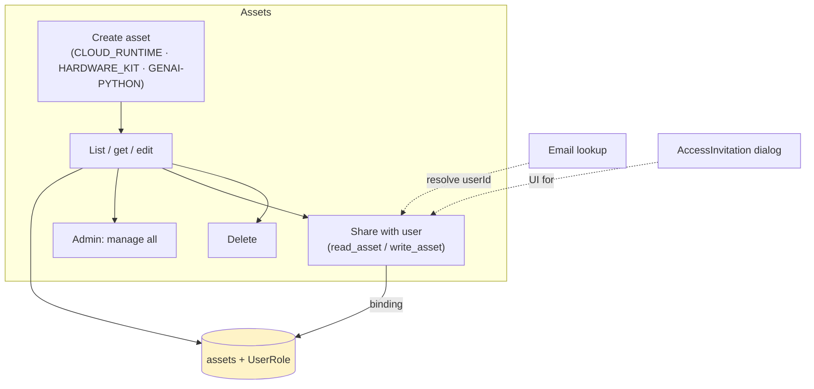
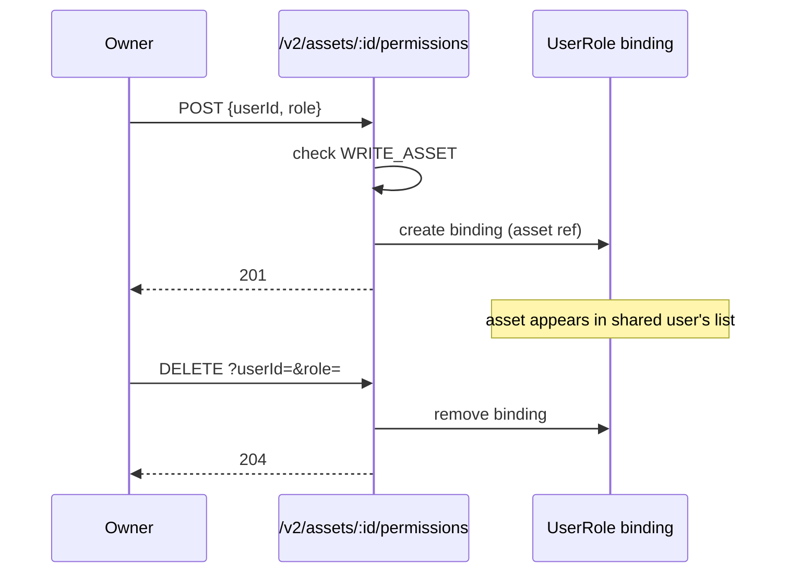
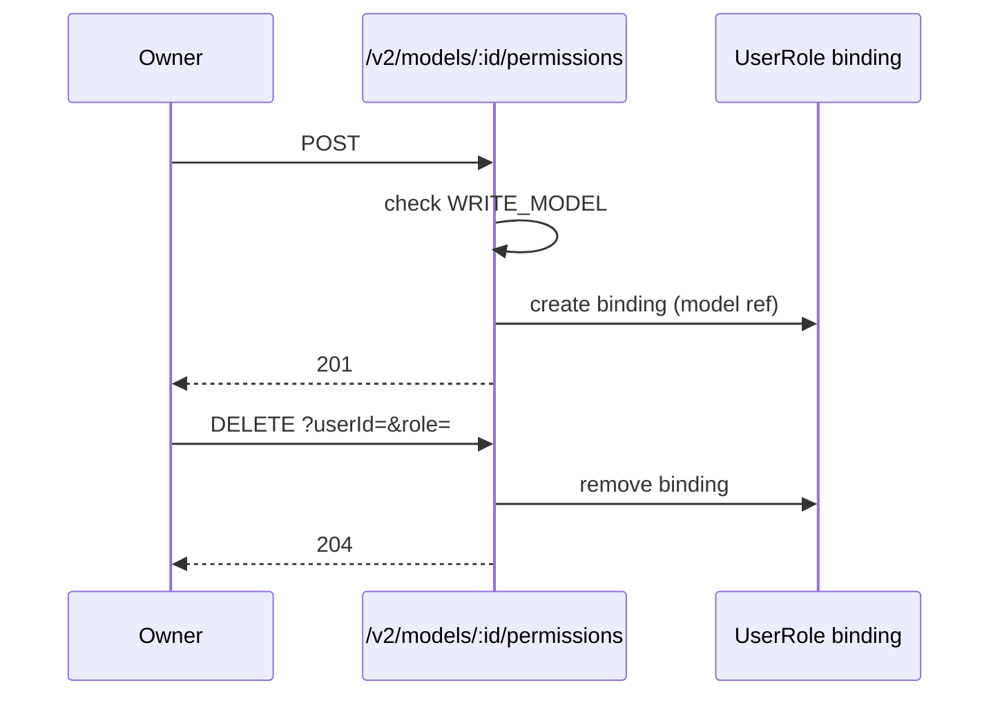
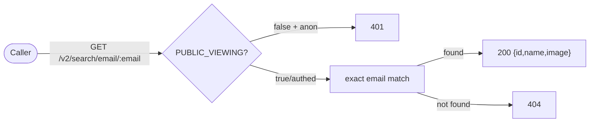

# Cluster: Assets & Sharing

User-owned resources (cloud runtimes, hardware kits, GenAI configs) and the sharing/collaboration layer. Backend: `routes/v2/user-management/asset.route.js`, `models/asset.model.js`. Frontend: `pages/PageMyAssets.tsx`, `components/organisms/RuntimeAssetManager.tsx`, `components/molecules/ShareAssetPanel.tsx`.

---

## Capabilities in this cluster

| ID | Capability |
|----|------------|
| [CAP-ASSET-01](#cap-asset-01--user-assets-crud) | User assets CRUD |
| [CAP-ASSET-02](#cap-asset-02--admin-all-assets-view) | Admin all-assets view |
| [CAP-ASSET-03](#cap-asset-03--my-assets) | My Assets |
| [CAP-ASSET-04](#cap-asset-04--asset-sharing) | Asset sharing |
| [CAP-ASSET-05](#cap-asset-05--model-contributors) | Model contributors |
| [CAP-ASSET-06](#cap-asset-06--access-invitation) | Access invitation |
| [CAP-ASSET-07](#cap-asset-07--user-lookup-by-email) | User lookup by email |

## CAP-ASSET-01 — User assets CRUD

### Description

Create/list/get/update/delete assets of types enabled by `USER_ASSET_TYPES` (default `CLOUD_RUNTIME`, `HARDWARE_KIT`, `GENAI-PYTHON`) with arbitrary `data`.

### Who uses it / value

End users (manage their runtimes/kits/GenAI configs); admins (oversight).

### Acceptance criteria

- `GET /v2/assets` (auth) → `200` the user's assets (+ shared with them); `POST` (auth) → `200` create; `GET /v2/assets/:id` (auth + `READ_ASSET`) → `200`; `PATCH` (auth + `WRITE_ASSET`) → `200` (empty body); `DELETE` (auth + `WRITE_ASSET`) → `200`.
- Asset types restricted to `USER_ASSET_TYPES`.

### Quality control

Create a `CLOUD_RUNTIME` asset → appears in My Assets; edit → persists; delete → gone; access another user's asset without sharing → `403`.

### Security

All routes auth; get/update/delete gated by `READ_ASSET`/`WRITE_ASSET` permission on the asset; types gated by `USER_ASSET_TYPES`.

**Coverage:**
- **Auth:** Required (`auth()` on all asset routes).
- **Authorization:** `READ_ASSET` for get, `WRITE_ASSET` for update/delete (owner bypass); create is auth-only; list returns own + shared assets.
- **Input validation:** Joi validation (`assetValidation.createAsset`/`getAssets`/`updateAsset`/`deleteAsset`); `data` is `Joi.any()` — no schema or size guard; `type` is not constrained to `USER_ASSET_TYPES` at the validation layer.
- **Rate limiting:** Not applied — `authLimiter` is defined but not wired to the asset routes.
- **Secrets:** Asset `data` may hold GenAI tokens or runtime credentials — stored at rest with no app-level encryption.

**Risks:**
- **Cross-user asset access:** a missing `READ_ASSET`/`WRITE_ASSET` check would let any authenticated user read or modify another user's assets, exposing runtime configs, hardware-kit identity and GenAI tokens.
- **Type bypass:** if the `USER_ASSET_TYPES` gate were skipped, users could create asset types outside the allowed set, introducing untrusted config shapes the frontend/backend aren't built to handle safely.
- **Arbitrary `data` abuse:** because `data` is arbitrary, a missing type/size guard could let a user store oversized payloads, exhausting per-user storage.

### Data protection

Asset `data` (arbitrary config — endpoint URLs, tokens, kit identity) stored in `assets` with `created_by`.

**Coverage:**
- **Stored data:** `name`, `type`, `data` (Mixed), `created_by`, timestamps in the MongoDB `assets` collection.
- **PII:** No direct PII; `created_by` is a userId reference.
- **Retention:** Indefinite until hard-deleted (no soft delete, no TTL).
- **Encryption:** No app-level at-rest encryption; in transit TLS deployment-dependent.
- **Logging:** Standard logger; no asset-data logging observed.

**Risks:**
- **Secrets in cleartext:** `data` may hold GenAI auth tokens or runtime credentials; stored unencrypted at rest, a DB leak or admin-view exposure hands plaintext secrets to the attacker.
- **Irreversible delete:** assets are hard-removed (no soft-delete), so accidental or malicious deletion permanently destroys the user's runtime/kit config.

### Test coverage
- **E2E (Playwright):** 1 test case in `my-assets.spec.ts` (create + delete runtime asset via UI) — SITEMAP: ✅
- **Unit (Jest):** none

## CAP-ASSET-02 — Admin all-assets view

### Description

Admin view of all assets across users.

### Who uses it / value

Admins (oversight/support).

### Acceptance criteria

- `GET /v2/assets/manage` (auth + `MANAGE_USERS`) → `200` all assets.

### Quality control

As admin → see all assets; as non-admin → `403`.

### Security

`MANAGE_USERS` required.

**Coverage:**
- **Auth:** Required (`auth()` on `GET /v2/assets/manage`).
- **Authorization:** `MANAGE_USERS` (admin) via `checkPermission(PERMISSIONS.ADMIN)` (owner bypass does not apply).
- **Input validation:** Joi `getAssets` query validation (name/type/sortBy/limit/page).
- **Rate limiting:** Not applied — `authLimiter` is not wired to the route.
- **Secrets:** Returns all asset `data` (may include GenAI tokens / runtime credentials) to admins — no per-record secret redaction.

**Risks:**
- **Privilege abuse:** an admin (or anyone who obtains `MANAGE_USERS`) can read every user's assets, including GenAI tokens and runtime credentials — a single compromised admin drains all users' secrets.
- **Missing gate:** if the `MANAGE_USERS` check regressed, the manage endpoint would become a full cross-user data exfiltration path for any authenticated user.

### Data protection

Exposes all asset records to admins (incl. `data` which may hold tokens — admin-only).

**Coverage:**
- **Stored data:** Returns all asset records (`name`/`type`/`data`/`created_by`) — admin-only read.
- **PII:** No direct PII; `created_by` references users.
- **Retention:** N/A — read-only view; retention is governed by CAP-ASSET-01.
- **Encryption:** No app-level at-rest encryption; data is exposed in the response body.
- **Logging:** Standard logger; no bulk-response logging observed.

**Risks:**
- **Bulk secret exposure:** one endpoint returns all users' `data` at once; a leak of an admin session token exposes every user's credentials simultaneously with no per-record gate.

### Test coverage
- **E2E (Playwright):** 0 — not covered — SITEMAP: ❌
- **Unit (Jest):** none

## CAP-ASSET-03 — My Assets

### Description

UI page to manage the current user's assets; the `GENAI-PYTHON` asset editor configures a GenAI endpoint (method/URL/token/request/response fields).

### Who uses it / value

End users (manage assets); GenAI integrators (configure endpoints).

### Acceptance criteria

- Route `/my-assets` (auth) lists the user's assets; create/edit/delete/share; `GENAI-PYTHON` editor captures endpoint config.

### Quality control

Open `/my-assets` → your assets listed; configure a GenAI asset → its endpoint used by GenAI flows.

### Security

Auth required.

**Coverage:**
- **Auth:** Required (the `/my-assets` route is auth-gated).
- **Authorization:** Backend list returns own + shared assets (`READ_ASSET`/`WRITE_ASSET`-scoped); the UI gates create/edit/delete/share on the asset permissions.
- **Input validation:** The GenAI editor captures method/URL/token/fields and submits them as asset `data` (`Joi.any()`, no schema or size guard); no client-side secret redaction.
- **Rate limiting:** Not applied — the underlying asset routes have no `authLimiter` wired.
- **Secrets:** The GenAI auth token is captured and stored in asset `data` (cleartext at rest); it is held in browser memory by the editor.

**Risks:**
- **Token in browser memory:** the GenAI editor loads and submits auth tokens through the client; a malicious browser extension or XSS on the page can read the token from the form state.

### Data protection

`GENAI-PYTHON` asset `data` may hold an auth token — stored in asset `data` (not encrypted at rest; access `READ_ASSET`/`WRITE_ASSET` gated).

**Coverage:**
- **Stored data:** GenAI endpoint config (method/URL/token/request/response fields) in `assets.data`.
- **PII:** No direct PII; the token is a third-party credential, not user PII.
- **Retention:** Indefinite until the asset is hard-deleted.
- **Encryption:** No app-level at-rest encryption; in transit TLS deployment-dependent.
- **Logging:** Standard logger; no token logging observed.

**Risks:**
- **Cleartext token at rest:** the GenAI token sits unencrypted in the asset `data`; any path that reads the asset (admin view, a leaked `READ_ASSET` grant, DB backup) exposes it.

### Test coverage
- **E2E (Playwright):** 3 test cases in `my-assets.spec.ts` (page loads, filter tabs, create/delete runtime asset) — SITEMAP: ✅
- **Unit (Jest):** none

## CAP-ASSET-04 — Asset sharing

### Description

Share an asset with users (by email lookup) with read/write roles; remove access.

### Who uses it / value

Asset owners (delegate runtime/kit access); collaborators (gain access).

### Acceptance criteria

- `POST /v2/assets/:id/permissions {userId, role}` (auth + `WRITE_ASSET`) → `201` (role enum `read_asset`/`write_asset`); `DELETE /v2/assets/:id/permissions?userId=&role=` (auth + `WRITE_ASSET`) → `204`.
- Shared users see the asset in their list.

### Quality control

Share with a user (by email) → they see the asset and can use it (read_asset) / modify (write_asset); remove → access revoked.

### Security

Both ops require `WRITE_ASSET` on the asset. Roles are `read_asset`/`write_asset`.

**Coverage:**
- **Auth:** Required (`auth()` on `POST`/`DELETE /v2/assets/:id/permissions`).
- **Authorization:** `WRITE_ASSET` on the asset (owner bypass) for both add and remove.
- **Input validation:** Joi `addAuthorizedUser`/`deleteAuthorizedUser` — `userId` (objectId/list), `role` enum (`read_asset`/`write_asset`).
- **Rate limiting:** Not applied — `authLimiter` is not wired to the route.
- **Secrets:** No secrets handled directly; the grant exposes asset `data` (which may hold secrets) via `read_asset`/`write_asset`.

**Risks:**
- **Privilege escalation:** a missing `WRITE_ASSET` check would let any user grant themselves or others `write_asset` on private assets — escalation to read/modify the owner's runtime configs and tokens.
- **Over-grant persistence:** a `write_asset` grant survives until manually revoked; a leaked or malicious grant keeps an attacker inside the asset with no auto-expiry.

### Data protection

Creates/removes authorized-user bindings on the asset; no secrets duplicated.

**Coverage:**
- **Stored data:** UserRole binding (role ref scoped to the asset id) — no asset `data` is duplicated.
- **PII:** No direct PII; the binding references userIds (relationship data).
- **Retention:** Binding persists until manually revoked (no auto-expiry).
- **Encryption:** No app-level at-rest encryption for bindings; standard Mongo storage.
- **Logging:** Standard logger; no binding-content logging observed.

**Risks:**
- **Relationship leak:** asset-sharing bindings reveal who collaborates on which runtime/kit (users ↔ business assets), exposing business relationships.

### Test coverage
- **E2E (Playwright):** 0 — not covered — SITEMAP: ❌
- **Unit (Jest):** none

## CAP-ASSET-05 — Model contributors

### Description

Add/remove contributors on a model; contributors see the model under "My Contributions" and gain edit access (with `writeModel`).

### Who uses it / value

Model owners (delegate); contributors (gain access).

### Acceptance criteria

- `POST /v2/models/:id/permissions` (requires `WRITE_MODEL`) → `201`; `DELETE /v2/models/:id/permissions?userId=&role=` (requires `WRITE_MODEL`) → `204`.

### Quality control

Add a contributor → model appears in their "My Contributions"; remove → gone.

### Security

Requires `WRITE_MODEL` on the model.

**Coverage:**
- **Auth:** Required (`auth()` on `POST`/`DELETE /v2/models/:id/permissions`).
- **Authorization:** `WRITE_MODEL` on the model (owner bypass).
- **Input validation:** Joi `modelValidation.addAuthorizedUser`/`deleteAuthorizedUser`.
- **Rate limiting:** Not applied — `authLimiter` is not wired to the route.
- **Secrets:** No secrets handled; the grant confers `writeModel` access (model data, prototype code).

**Risks:**
- **Privilege escalation:** a missing `WRITE_MODEL` check would let any user add themselves as a contributor to private models, gaining edit access to model data and prototype code.

### Data protection

UserRole bindings scoped to the model.

**Coverage:**
- **Stored data:** UserRole binding (role ref scoped to the model id) — no model data is duplicated.
- **PII:** No direct PII; the binding references userIds (relationship data).
- **Retention:** Binding persists until manually revoked (no auto-expiry, no audit trail).
- **Encryption:** No app-level at-rest encryption for bindings; standard Mongo storage.
- **Logging:** Standard logger; no binding-content logging observed.

**Risks:**
- **Relationship leak:** contributor bindings reveal who collaborates on which model (users ↔ business assets).
- **Mis-grant persistence:** a leaked grant persists until manually revoked; with no audit trail of permission changes, mis-grants are hard to detect after the fact.

### Test coverage
- **E2E (Playwright):** 0 — not covered — SITEMAP: ❌
- **Unit (Jest):** none

## CAP-ASSET-06 — Access invitation

### Description

Reusable dialog to invite users to an object with selectable access levels; remove user access.

### Who uses it / value

Object owners (invite collaborators).

### Acceptance criteria

- `AccessInvitation` dialog used by model/asset sharing flows; pick access level; remove a user's access.

### Quality control

Invite a user by email with an access level → they gain that access; remove → revoked.

### Security

Invoker must be the object owner / authorized.

**Coverage:**
- **Auth:** Inherited from the underlying permission endpoints (`auth()` required).
- **Authorization:** Inherited — `WRITE_ASSET`/`WRITE_MODEL` on the object (owner bypass); the dialog is UI-only.
- **Input validation:** Inherited — Joi validation on the underlying permission endpoints; dialog input is UI-only.
- **Rate limiting:** Not applied — the underlying routes have no `authLimiter` wired.
- **Secrets:** None — the dialog owns no state; secrets risk is inherited from the underlying endpoints.

**Risks:**
- **Client-side auth bypass:** the dialog is UI only; the real gate is the underlying permission endpoint. If a frontend-only check were trusted, a user could call the permission API directly to grant themselves access.

### Data protection

Driven by the underlying permission endpoints (no separate data store).

**Coverage:**
- **Stored data:** None — no separate store; data lives in the underlying permission bindings.
- **PII:** No — the dialog enters email/role; nothing is stored by the dialog itself.
- **Retention:** N/A — inherited from the underlying permission endpoints.
- **Encryption:** N/A — no separate storage.
- **Logging:** N/A — no separate logging beyond the underlying endpoints.

**Risks:**
- **No independent data store:** because the dialog owns no state, all data-protection risk is inherited from the asset/model permission endpoints — a regression there surfaces directly through this UI.

### Test coverage
- **E2E (Playwright):** 0 — not covered — SITEMAP: ❌
- **Unit (Jest):** none

## CAP-ASSET-07 — User lookup by email

### Description

Find a user by exact email (id/name/image) for sharing/collaborator flows.

### Who uses it / value

Anyone sharing (find recipients).

### Acceptance criteria

- `GET /v2/search/email/:email` (optional auth via `PUBLIC_VIEWING`) → `200` user or `404` if not found.

### Quality control

Search an existing email → returns the user; a non-existent email → `404`.

### Security

Optional auth via `PUBLIC_VIEWING`; returns minimal fields (id/name/image) — no email exposure beyond the queried one.

**Coverage:**
- **Auth:** Optional via `PUBLIC_VIEWING` (`auth({ optional: ... })`); unauthenticated callers are allowed when `PUBLIC_VIEWING=true`.
- **Authorization:** None — any caller (authed, or anon under `PUBLIC_VIEWING`) can query by email; no permission check.
- **Input validation:** Joi `searchUserByEmail` — `email` must be a valid email format.
- **Rate limiting:** Not applied — `authLimiter` is not wired; enumeration is unthrottled.
- **Secrets:** None — returns `id`/`name`/`image_file` only.

**Risks:**
- **Email enumeration:** exact-email lookup with `404` vs `200` lets an attacker confirm whether a given email is registered, enabling account enumeration for downstream phishing.
- **Recipient discovery:** with `PUBLIC_VIEWING=true`, an unauthenticated attacker can resolve any user's id/name/image from their email, seeding targeted abuse of sharing flows.

### Data protection

Returns minimal profile fields; not an enumeration endpoint (exact email required).

**Coverage:**
- **Stored data:** None — read-only lookup against the `User` collection.
- **PII:** Yes — the email is used as the query key; the response returns `name`/`image_file` (profile data) for the matched user.
- **Retention:** N/A — no storage; source `User` records are governed by the identity cluster.
- **Encryption:** No at-rest encryption concern (read-only); in transit TLS deployment-dependent.
- **Logging:** Standard logger; no query/response logging observed.

**Risks:**
- **Profile leakage:** returning id/name/image for arbitrary emails reveals user identities to anyone with `PUBLIC_VIEWING`, even though the endpoint avoids echoing the email itself.

### Test coverage
- **E2E (Playwright):** 0 — not covered — SITEMAP: ❌
- **Unit (Jest):** none