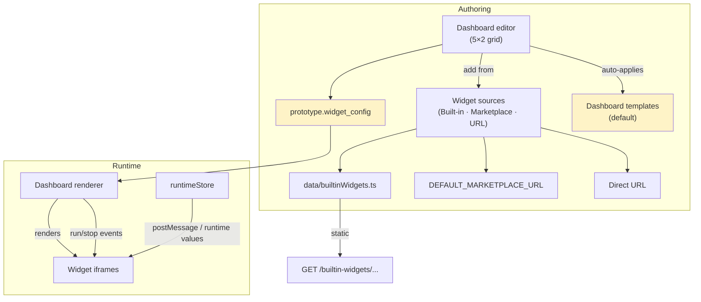
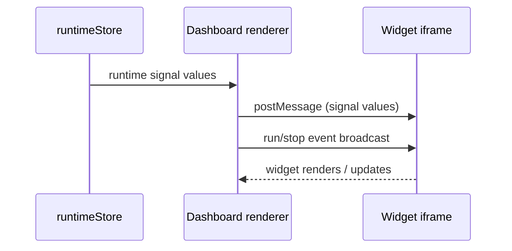
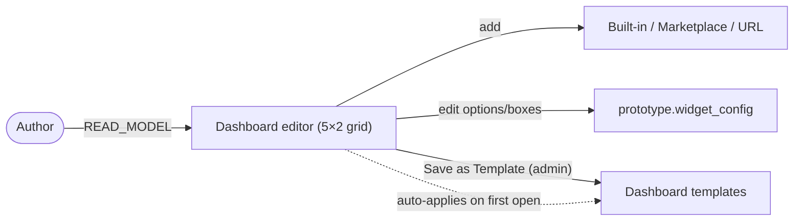
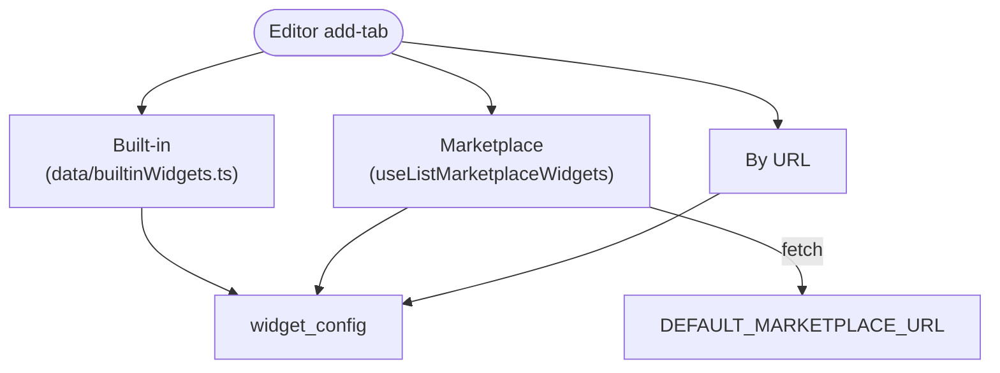
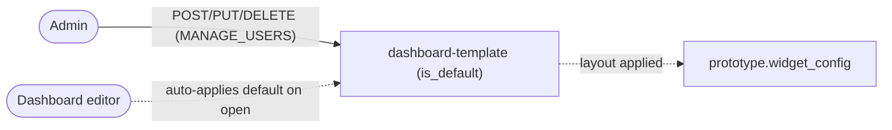

# Cluster: Dashboards & Widgets

Dashboards render a prototype's widgets as a live grid of widget panels fed by runtime signal values, so that end users and demo audiences can visualize prototype behavior. As an author, I can compose dashboards from built-in, marketplace, or URL widgets; as an admin, I can standardize layouts via dashboard templates.

**Implementation:** `components/molecules/dashboard/` (frontend), builtin-widget static hosting + dashboard template routes (backend).

---

## Capabilities in this cluster

| ID | Capability |
|----|------------|
| [CAP-DASHBOARD-01](#cap-dashboard-01--dashboard-renderer) | Dashboard renderer |
| [CAP-DASHBOARD-02](#cap-dashboard-02--dashboard-editor) | Dashboard editor |
| [CAP-DASHBOARD-03](#cap-dashboard-03--widget-sources-built-in--marketplace--url) | Widget sources (Built-in / Marketplace / URL) |
| [CAP-DASHBOARD-04](#cap-dashboard-04--builtin-widgets-hosting) | Builtin widgets hosting |
| [CAP-DASHBOARD-05](#cap-dashboard-05--dashboard-templates) | Dashboard templates |
| [CAP-DASHBOARD-06](#cap-dashboard-06--widget-protopilot-genai-widgets--roadmap) | Widget ProtoPilot (GenAI widgets) — roadmap |

## CAP-DASHBOARD-01 — Dashboard renderer

### Description

As an end user, I can view a prototype's dashboard and watch widgets update live with runtime signal values, so that I can visualize the prototype's behavior. The dashboard supports a fullscreen mode and notifies widgets of run/stop events.

### Who uses it / value

End users (visualize prototype behavior); demo audiences.

### Acceptance criteria

- When I open a prototype's dashboard, the widgets render and update live as runtime signal values change.
- When the prototype starts or stops, every widget reflects the run/stop state.
- When I toggle fullscreen, I get an immersive view with a toolbar showing the site logo and branding.
- When I don't have permission to view the prototype, I cannot open the dashboard.

### API contract

No HTTP surface — transparent runtime behavior. The renderer renders widgets from `widget_config`, streams runtime signal values to each widget, and broadcasts run/stop events to all widgets; the fullscreen toolbar shows logo + branding from site config. View access follows the prototype's read-access gating (`READ_MODEL`, optional via `PUBLIC_VIEWING`).

### Quality control

- When I run a prototype with a dashboard, the widgets render and update as signals change; when I toggle fullscreen, I get an immersive view; when I stop, the widgets reflect the stopped state.

### Security

Read `READ_MODEL`. Widgets are third-party iframes — same-origin policy depends on the widget URL.

**Coverage:**
- **Auth:** optional via `PUBLIC_VIEWING` — the dashboard is viewed under the prototype's read access (unauthenticated browsing when `PUBLIC_VIEWING` is on; otherwise auth required).
- **Authorization:** `READ_MODEL` to view the prototype/dashboard.
- **Input validation:** N/A — the renderer consumes `widget_config` from the prototype; widget URLs are not validated server-side at render time.
- **Rate limiting:** not applied — `authLimiter` defined but not used on prototype/dashboard read routes.
- **Secrets:** none — runtime signal values are delivered to widget iframes only; no secrets/tokens are sent to widgets.

**Risks:**
- **Untrusted iframe content:** widgets are third-party iframes rendered into the dashboard; a malicious or compromised widget URL can run arbitrary script in a victim's browser (XSS, token theft) whenever the dashboard is opened. *Mitigation:* none currently — sandbox widget iframes (`sandbox` attribute) and enforce an allowlist on widget URLs.
- **postMessage leakage:** runtime signal values are broadcast to all widget iframes on the dashboard; a hostile widget receives every signal the prototype emits, even values it was not meant to see. *Mitigation:* none currently — scope `postMessage` targets per-widget and validate widget origins.

### Personal data processing
No — this capability does not process personal data; `widget_config` holds widget definitions/options and runtime signal values are transient.
N/A.
**Risks:**
- none — no personal data processed.

### AutoWRX data
`widget_config` (widget definitions/options) stored in `prototype.widget_config`; signal values are runtime/transient.

**Coverage:**
- **Stored data:** `prototype.widget_config` (widget definitions/options) in MongoDB; signal values are runtime/transient (not persisted).
- **Retention:** indefinite — `widget_config` lives with the prototype; signal values are transient (runtime only).
- **Encryption:** TLS in transit; no at-rest encryption beyond MongoDB defaults; signals are in-memory/runtime.
- **Logging:** none — client-side `postMessage`; no server logging of signal values.

**Risks:**
- **Cross-widget signal exposure:** because signals are broadcast to every iframe, a single untrusted widget can exfiltrate the prototype's full runtime signal stream to a remote endpoint.
- **Config tampering:** `widget_config` is mutable via the editor; a tampered config can point every widget at an attacker-controlled URL, persisting the leak across dashboard opens.

### Test coverage
- **E2E (Playwright):** 0 — not covered — SITEMAP: ⚠️
- **Estimated coverage:** ≈0% (est.) — no E2E spec.
- **Unit (Jest):** none

## CAP-DASHBOARD-02 — Dashboard editor

### Description

As a prototype author, I can compose a dashboard on a 5×2 grid — place, move, edit, and delete widgets from Built-in / Marketplace / by URL, edit options and boxes, use a "used signals" helper, and open in Web Studio — so that my prototype has a tailored live view. The default dashboard template auto-applies on first open.

### Who uses it / value

Prototype authors (compose dashboards).

### Acceptance criteria

- When I open the dashboard editor, I can place, move, edit, and delete widgets on the 5×2 grid, add widgets from Built-in, Marketplace, or by URL, edit options and boxes, and use a "used signals" helper.
- When I open a dashboard for the first time, the default template auto-applies.
- When I save my layout, it persists to the prototype and shows on the next open.
- When I try to save the layout as a template, only the admin action succeeds; non-admins do not see the "Save as Template" option.
- When my widget placement is invalid (discrete cells or overlaps), I see a warning and cannot save that layout.

### API contract

- Edit requires `READ_MODEL` and auto-applies the default dashboard template on first open.
- Add a widget (Built-in / Marketplace / URL), edit options/boxes, or move/delete on the grid → persisted; "Save as Template" requires admin (`MANAGE_USERS`/`ADMIN`).

### Quality control

- When I add a builtin widget, it renders on the grid; when I edit options, the widget reflects them; when I save as template (admin), it appears in dashboard templates.

### Security

Edit `READ_MODEL`; save-as-template admin. Marketplace widgets from `DEFAULT_MARKETPLACE_URL` (third-party).

**Coverage:**
- **Auth:** required — edit is a write action on the prototype; "Save as Template" requires admin auth.
- **Authorization:** edit requires `READ_MODEL`; "Save as Template" requires admin (`MANAGE_USERS`/`ADMIN`).
- **Input validation:** widget config (URLs/options) is stored as Mixed on the prototype; editor JSON options are not strictly validated; `widget_config` is not validated (accepted as-is).
- **Rate limiting:** not applied — `authLimiter` defined but not used on prototype update routes.
- **Secrets:** none — widget URLs/options only; no secrets in widget config.

**Risks:**
- **Config injection via editor:** a `READ_MODEL`-only gate lets any authorized contributor embed arbitrary widget URLs/options into the dashboard; viewers who open that dashboard then run those widgets, turning a low-privilege contributor into an XSS vector. *Mitigation:* none currently — raise the editor gate to `WRITE_MODEL` or validate widget URLs against an allowlist.
- **Marketplace supply chain:** Marketplace widgets are pulled from `DEFAULT_MARKETPLACE_URL`; a compromised marketplace entry becomes an attack surface for every author who adds it. *Mitigation:* none currently — pin marketplace entries or vet `DEFAULT_MARKETPLACE_URL` listings.
- **Save-as-template escalation:** if the admin-only gate on "Save as Template" were bypassed, a non-admin could publish a malicious dashboard as a default applied to all new dashboards. *Mitigation:* admin gate enforced on "Save as Template"; audit for gate regressions.

### Personal data processing
No — this capability does not process personal data; widget config holds URLs/options and may reference runtime signals.
N/A.
**Risks:**
- none — no personal data processed.

### AutoWRX data
Widget config (URLs/options) stored in `prototype.widget_config`; options may reference runtime signals.

**Coverage:**
- **Stored data:** `prototype.widget_config` (widget URLs/options) in MongoDB.
- **Retention:** indefinite — lives with the prototype document.
- **Encryption:** TLS in transit; no at-rest encryption beyond MongoDB defaults.
- **Logging:** standard request logging on prototype save.

**Risks:**
- **Persistent widget-config tampering:** a malicious `widget_config` (URLs/options) is persisted on the prototype and re-rendered for every viewer until manually fixed, repeatedly steering users toward untrusted widgets.
- **Signal-reference leakage:** options that reference runtime signals encode which signals the prototype exposes; a tampered config can be crafted to surface and exfiltrate sensitive signals.

### Test coverage
- **E2E (Playwright):** 0 — not covered — SITEMAP: ✅
- **Estimated coverage:** ≈0% (est.) — no E2E spec.
- **Unit (Jest):** none

## CAP-DASHBOARD-03 — Widget sources (Built-in / Marketplace / URL)

### Description

As an author, I can add widgets from three sources — the Built-in library, the Marketplace, or a direct URL — so that I can pick the right visualization for my dashboard.

### Who uses it / value

Authors (pick widgets); marketplace providers (distribute widgets).

### Acceptance criteria

- When I open the widget library, I see tabs for Built-in and Marketplace widgets, plus a "by URL" option.
- When I pick a Built-in widget, it renders from the built-in library; when I pick a Marketplace widget, it is fetched from the configured marketplace; when I provide a direct URL, the widget loads from that URL.
- When the marketplace is not configured or unreachable, the Marketplace tab is hidden or empty.

### API contract

- Built-in widget → rendered from the built-in library; Marketplace widget → fetched from `DEFAULT_MARKETPLACE_URL`; URL widget → loaded from the given URL.

### Quality control

- When I add a builtin widget, it renders; when I browse the marketplace, the list loads (if the URL is configured); when I add by URL, it loads.

### Security

Marketplace/URL widgets are remote third-party content — render in iframes; verify URLs are trusted.

**Coverage:**
- **Auth:** N/A — source selection is an authoring action gated by the editor's `READ_MODEL`.
- **Authorization:** authoring requires `READ_MODEL` (via the editor); no per-source authorization.
- **Input validation:** no allowlist on widget URLs; marketplace is fetched from `DEFAULT_MARKETPLACE_URL`; the "by URL" source accepts any URL (no validation/scheme enforcement).
- **Rate limiting:** not applied — marketplace list fetch and URL widget load are client-side; `authLimiter` not used.
- **Secrets:** none — widget URLs/options only.

**Risks:**
- **Arbitrary remote widget URL:** the "by URL" source lets an author embed any remote page as a widget; there is no allowlist, so any signed-in author can pivot a dashboard into a launcher for attacker-hosted content. *Mitigation:* none currently — enforce a URL allowlist and scheme (HTTPS-only) validation on "by URL" widgets.
- **Marketplace trust boundary:** widgets listed by `DEFAULT_MARKETPLACE_URL` are not vetted by this platform; a malicious marketplace listing is presented to authors as if it were trusted. *Mitigation:* none currently — vet marketplace listings or display an explicit "untrusted" warning for marketplace widgets.
- **Mixed-content / origin bypass:** URL widgets loaded over plain HTTP or from untrusted origins bypass the same-origin protections assumed for builtin widgets. *Mitigation:* none currently — reject non-HTTPS widget URLs and sandbox iframes by origin.

### Personal data processing
No — this capability does not process personal data; widget URLs/options are stored in widget config.
N/A.
**Risks:**
- none — no personal data processed.

### AutoWRX data
Widget URLs/options stored in widget config.

**Coverage:**
- **Stored data:** widget URLs/options in `prototype.widget_config` (MongoDB).
- **Retention:** indefinite — lives with the prototype document.
- **Encryption:** TLS in transit (marketplace fetch over HTTPS if configured); URL widgets may be HTTP (mixed-content risk).
- **Logging:** none — client-side source fetch/listing.

**Risks:**
- **URL persistence as exfil channel:** widget URLs are persisted in `widget_config`; a URL pointing to an attacker endpoint can receive (via postMessage or query params) runtime data every time the dashboard renders.

### Test coverage
- **E2E (Playwright):** 0 — not covered — SITEMAP: ❌
- **Estimated coverage:** ≈0% (est.) — no E2E spec.
- **Unit (Jest):** none

## CAP-DASHBOARD-04 — Builtin widgets hosting

### Description

As an author, I can add ready-made widget bundles (3d-car, chart-signals, image-by-api-value, signal-list-settable, simple-fan, simple-wiper, single-api, terminal) to my dashboard from the Built-in library, so that I get instant visualizations without building my own. They are hosted and served for me automatically.

### Who uses it / value

Authors (ready-made widgets); end users (visualizations).

### Acceptance criteria

- When I browse the Built-in tab in the widget library, I see the ready-made widgets listed.
- When I add a builtin widget to my dashboard, it renders and works without any extra setup.

### API contract

No HTTP surface — static hosting. Builtin widget bundles and shared libs (chart.min.js, tailwind/font-awesome, syncer.js) are served from `GET /builtin-widgets/...` (public, no auth); `signal-list-settable` ships with `vss.json`.

### Quality control

- When I request a builtin widget asset, it is served with the correct MIME; when I add one to a dashboard, it renders.

### Security

Public static; no auth.

**Coverage:**
- **Auth:** N/A — public static serving at `/builtin-widgets`; no auth.
- **Authorization:** none — public unauthenticated access.
- **Input validation:** N/A — static file serving; relies on path normalization (no custom validation).
- **Rate limiting:** not applied — static serving has no rate limit; `authLimiter` not used.
- **Secrets:** none — static bundles; `vss.json` embeds signal metadata but no secrets.

**Risks:**
- **Path traversal on static root:** if `/builtin-widgets/...` is not strictly path-normalized, an attacker could request `../` sequences to read files outside the widget bundles (config, source) from the server. *Mitigation:* rely on static-serving path normalization; verify `..` sequences are rejected and serve files only from the widget root.
- **Unauthed asset enumeration:** public unauthenticated serving lets anyone enumerate and fingerprint the platform's widget versions and shared libraries for targeted exploits. *Mitigation:* none currently — public static serving is by design; keep bundles free of secrets and version-stamp assets to aid rotation.

### Personal data processing
No — this capability does not process personal data; static widget bundles and shared libs contain no user data.
N/A.
**Risks:**
- none — no personal data processed.

### AutoWRX data
Static assets only.

**Coverage:**
- **Stored data:** static files under `backend/static/builtin-widgets/` (widget bundles + shared libs: chart.min.js, tailwind/font-awesome, syncer.js).
- **Retention:** indefinite — static files; no TTL.
- **Encryption:** TLS in transit; no at-rest encryption for static files.
- **Logging:** standard static-serving access logs.

**Risks:**
- **Bundled data exposure:** some bundles embed data such as `vss.json`; if a bundle accidentally includes prototype or tenant data, public unauthed serving would leak it to anyone.

### Test coverage
- **E2E (Playwright):** 0 — not covered — SITEMAP: ❌
- **Estimated coverage:** ≈0% (est.) — no E2E spec.
- **Unit (Jest):** none

## CAP-DASHBOARD-05 — Dashboard templates

### Description

As an admin, I can create named dashboard layout presets (with one default template and public/private visibility) so that authors get a standard dashboard layout to start from.

### Who uses it / value

Admins (standardize dashboards); authors (quick-start).

### Acceptance criteria

- When I open the dashboard template manager, I see the list of templates; when I create a new template (name, description, layout), it appears in the manager.
- When I set a template as default, it auto-applies to new dashboards on first open.
- When I edit or delete a template, my changes take effect in the manager.
- When I am a non-admin, I cannot create, edit, or delete templates (the admin actions are unavailable).
- When I open a dashboard and a default template exists, the default layout auto-applies.

### API contract

- `GET /v2/dashboard-template[/:id]` (public) → list/get; `POST` (admin) → creates, returns `201`; `PUT /:id` (admin) → updates, returns `200`; `DELETE /:id` (admin) → deletes, returns `204`. Also available at `/v2/system/dashboard-template`.
- Default template auto-applies on dashboard open.

### Quality control

- As an admin, when I create a template, it appears in the manager and auto-applies on new dashboards.

### Security

Read public; write `MANAGE_USERS`.

**Coverage:**
- **Auth:** reads are public (`GET /v2/dashboard-template` and `/:id`); writes require auth.
- **Authorization:** writes gated by `MANAGE_USERS` (`manageUsers`).
- **Input validation:** validated on list/get/create/update/remove; `widget_config` is not validated (accepted as-is); `visibility` is enum-validated.
- **Rate limiting:** not applied — `authLimiter` defined but not wired into the dashboard-template route.
- **Secrets:** none — templates hold `widget_config` only; no secrets.

**Risks:**
- **Platform-wide payload:** templates auto-apply to dashboards on first open. A compromised admin could seed a `is_default` template embedding a malicious widget URL, pushing untrusted content to every new dashboard. *Mitigation:* `MANAGE_USERS` gate enforced on writes; audit-log `is_default` template changes and review auto-applied widget URLs.
- **Visibility misconfiguration:** a template's public/private visibility controls who can use it; a wrong default could expose a private template's widget layout to all authors. *Mitigation:* `visibility` is enum-validated; audit default visibility values on creation.

### Personal data processing
No — this capability does not process personal data; templates hold `widget_config` (Mixed) and `created_by`/`updated_by` ObjectIds only.
N/A.
**Risks:**
- none — no personal data processed.

### AutoWRX data
Template `widget_config` stored; no secrets.

**Coverage:**
- **Stored data:** `dashboardTemplates` collection — name, description, image, visibility, is_default, widget_config (Mixed), created_by, updated_by, timestamps.
- **Retention:** indefinite — hard delete via `DELETE /:id`; no soft delete/TTL.
- **Encryption:** TLS in transit; no at-rest encryption beyond MongoDB defaults; no hashing (no passwords).
- **Logging:** standard request logging.

**Risks:**
- **Persistent distribution channel:** a malicious template propagates its widget URLs/options to all dashboards derived from it until an admin notices and removes it, repeatedly exposing users to untrusted widget content.

### Test coverage
- **E2E (Playwright):** 0 — not covered — SITEMAP: ✅
- **Estimated coverage:** ≈0% (est.) — no E2E spec.
- **Unit (Jest):** none

## CAP-DASHBOARD-06 — Widget ProtoPilot (GenAI widgets) — roadmap

### Description

As an author, I will be able to generate a widget from a prompt (roadmap), so that I can add custom visualizations without writing widget code.

### Who uses it / value

Authors (generate widgets without coding).

### Acceptance criteria

- When I open the widget library, I see a "coming soon" placeholder — not implemented yet.

### API contract

No HTTP surface — not implemented (roadmap; placeholder "coming soon" in the widget library).

### Quality control

N/A (not functional).

### Security

N/A.

**Coverage:**
- **Auth:** N/A — not implemented (placeholder "coming soon").
- **Authorization:** N/A — not implemented.
- **Input validation:** N/A — not implemented.
- **Rate limiting:** N/A — not implemented.
- **Secrets:** N/A — not implemented.

**Risks:**
- **Future generated-code execution:** once implemented, GenAI-generated widgets would run as third-party iframes; without sandboxing/output validation, prompt-injection could yield widgets that exfiltrate runtime signals. *Mitigation:* none currently — not implemented; when built, sandbox generated widget iframes and validate GenAI output before persisting.

### Personal data processing
No — this capability does not process personal data (not implemented; placeholder "coming soon").
N/A.
**Risks:**
- none — no personal data processed.

### AutoWRX data
N/A — not implemented.

**Coverage:**
- **Stored data:** N/A — not implemented.
- **Retention:** N/A — not implemented.
- **Encryption:** N/A — not implemented.
- **Logging:** N/A — not implemented.

**Risks:**
- **Prompt-derived widget content:** when implemented, generated widget code persisted in `widget_config` could embed sensitive signal references the author did not intend to expose.

### Test coverage
- **E2E (Playwright):** 0 — not covered — SITEMAP: ❌
- **Estimated coverage:** ≈0% (est.) — no E2E spec.
- **Unit (Jest):** none