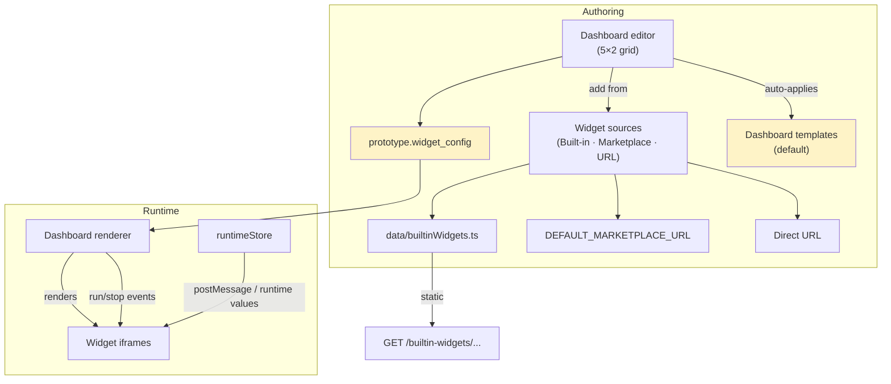
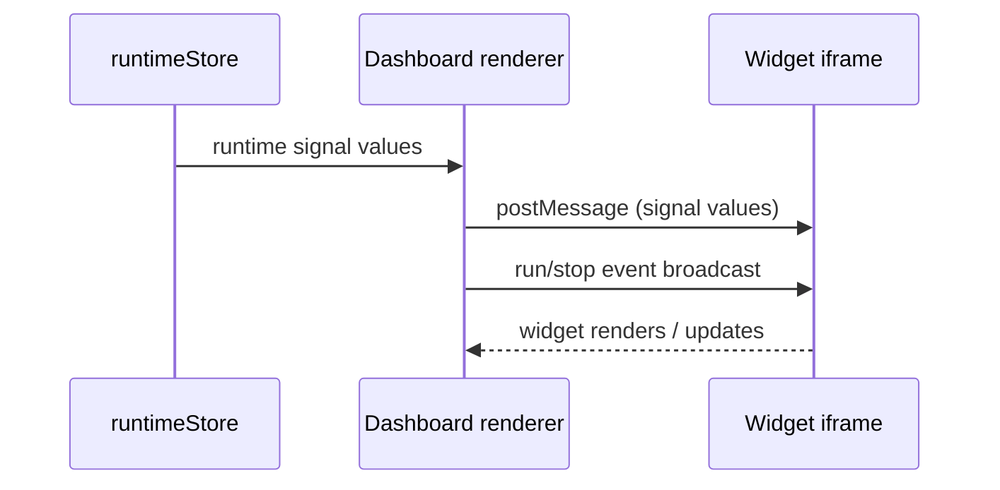

# Cluster: Dashboards & Widgets

Visual run-time dashboards of widget iframes fed runtime signal values. Frontend: `components/molecules/dashboard/`. Backend: builtin-widget static hosting + dashboard template routes.

---

## Dashboard renderer

### Description

Renders a prototype's widget dashboard: widget iframes fed runtime signal values from the connected runtime; supports fullscreen mode and notifies widget iframes of run/stop.

### Who uses it / value

End users (visualize prototype behavior); demo audiences.

### Acceptance criteria

- Renders `widget_config` widgets; signals flow from `runtimeStore` to widget iframes via postMessage/runtime values; run/stop events broadcast to widgets.
- Fullscreen toolbar (logo + branding from site config).

### Quality control

Run a prototype with a dashboard → widgets render and update as signals change; toggle fullscreen → immersive view; stop → widgets reflect stopped state.

### Security

Read `READ_MODEL`. Widgets are third-party iframes — same-origin policy depends on the widget URL.

**Risks:**
- **Untrusted iframe content:** widgets are third-party iframes rendered into the dashboard; a malicious or compromised widget URL can run arbitrary script in a victim's browser (XSS, token theft) whenever the dashboard is opened.
- **postMessage leakage:** runtime signal values are broadcast to all widget iframes on the dashboard; a hostile widget receives every signal the prototype emits, even values it was not meant to see.

### Data protection

`widget_config` (widget definitions/options) stored in `prototype.widget_config`; signal values are runtime/transient.

**Risks:**
- **Cross-widget signal exposure:** because signals are broadcast to every iframe, a single untrusted widget can exfiltrate the prototype's full runtime signal stream to a remote endpoint.
- **Config tampering:** `widget_config` is mutable via the editor; a tampered config can point every widget at an attacker-controlled URL, persisting the leak across dashboard opens.

## Dashboard editor

### Description

Visual 5×2 grid editor: place/move/edit/delete widgets; add from Built-in / Marketplace / by URL; edit options (JSON), boxes, URL/path; "used signals" helper; open in Web Studio; auto-applies the default dashboard template.

### Who uses it / value

Prototype authors (compose dashboards).

### Acceptance criteria

- Edit requires `READ_MODEL`; auto-applies the default dashboard template on first open.
- Add widget from Built-in / Marketplace / URL; edit options/boxes; move/delete on the grid; "Save as Template" requires admin.

### Quality control

Add a builtin widget → renders on the grid; edit options → widget reflects them; save-as-template (admin) → appears in dashboard templates.

### Security

Edit `READ_MODEL`; save-as-template admin. Marketplace widgets from `DEFAULT_MARKETPLACE_URL` (third-party).

**Risks:**
- **Config injection via editor:** a `READ_MODEL`-only gate lets any authorized contributor embed arbitrary widget URLs/options into the dashboard; viewers who open that dashboard then run those widgets, turning a low-privilege contributor into an XSS vector.
- **Marketplace supply chain:** Marketplace widgets are pulled from `DEFAULT_MARKETPLACE_URL`; a compromised marketplace entry becomes an attack surface for every author who adds it.
- **Save-as-template escalation:** if the admin-only gate on "Save as Template" were bypassed, a non-admin could publish a malicious dashboard as a default applied to all new dashboards.

### Data protection

Widget config (URLs/options) stored in `prototype.widget_config`; options may reference runtime signals.

**Risks:**
- **Persistent widget-config tampering:** a malicious `widget_config` (URLs/options) is persisted on the prototype and re-rendered for every viewer until manually fixed, repeatedly steering users toward untrusted widgets.
- **Signal-reference leakage:** options that reference runtime signals encode which signals the prototype exposes; a tampered config can be crafted to surface and exfiltrate sensitive signals.

## Widget sources (Built-in / Marketplace / URL)

### Description

Three sources to add widgets: Built-in library (`data/builtinWidgets.ts`), Marketplace (`useListMarketplaceWidgets` from `DEFAULT_MARKETPLACE_URL`), and by direct URL.

### Who uses it / value

Authors (pick widgets); marketplace providers (distribute widgets).

### Acceptance criteria

- Built-in widgets render from `data/builtinWidgets.ts`; marketplace widgets fetched from `DEFAULT_MARKETPLACE_URL`; URL widgets load from the given URL.

### Quality control

Add a builtin widget → renders; browse marketplace → list loads (if URL configured); add by URL → loads.

### Security

Marketplace/URL widgets are remote third-party content — render in iframes; verify URLs are trusted.

**Risks:**
- **Arbitrary remote widget URL:** the "by URL" source lets an author embed any remote page as a widget; there is no allowlist, so any signed-in author can pivot a dashboard into a launcher for attacker-hosted content.
- **Marketplace trust boundary:** widgets listed by `DEFAULT_MARKETPLACE_URL` are not vetted by this platform; a malicious marketplace listing is presented to authors as if it were trusted.
- **Mixed-content / origin bypass:** URL widgets loaded over plain HTTP or from untrusted origins bypass the same-origin protections assumed for builtin widgets.

### Data protection

No PII; widget URLs/options stored in widget config.

**Risks:**
- **URL persistence as exfil channel:** widget URLs are persisted in `widget_config`; a URL pointing to an attacker endpoint can receive (via postMessage or query params) runtime data every time the dashboard renders.

## Builtin widgets hosting

### Description

Prebuilt widget bundles (3d-car, chart-signals, image-by-api-value, signal-list-settable with vss.json, simple-fan, simple-wiper, single-api, terminal) plus shared libs (chart.min.js, tailwind/font-awesome, syncer.js), served from `/builtin-widgets`.

### Who uses it / value

Authors (ready-made widgets); end users (visualizations).

### Acceptance criteria

- Static `GET /builtin-widgets/...` serves the bundles; the editor's Built-in tab lists them.

### Quality control

Request a builtin widget asset → served with correct MIME; add one to a dashboard → renders.

### Security

Public static; no auth.

**Risks:**
- **Path traversal on static root:** if `/builtin-widgets/...` is not strictly path-normalized, an attacker could request `../` sequences to read files outside the widget bundles (config, source) from the server.
- **Unauthed asset enumeration:** public unauthenticated serving lets anyone enumerate and fingerprint the platform's widget versions and shared libraries for targeted exploits.

### Data protection

Static assets only.

**Risks:**
- **Bundled data exposure:** some bundles embed data such as `vss.json`; if a bundle accidentally includes prototype or tenant data, public unauthed serving would leak it to anyone.

## Dashboard templates

### Description

Named `widget_config` presets with a single `is_default` template and public/private visibility; admin CRUD.

### Who uses it / value

Admins (standardize dashboards); authors (quick-start).

### Acceptance criteria

- `GET /v2/dashboard-template[/:id]` (public) → list/get; `POST` → `201` (admin); `PUT/DELETE /:id` → `200`/`204` (admin). Also at `/v2/system/dashboard-template`.
- The default template auto-applies on dashboard open.

### Quality control

Admin creates a template → appears in the manager; it auto-applies on new dashboards.

### Security

Read public; write `MANAGE_USERS`.

**Risks:**
- **Platform-wide payload:** templates auto-apply to dashboards on first open. A compromised admin could seed a `is_default` template embedding a malicious widget URL, pushing untrusted content to every new dashboard.
- **Visibility misconfiguration:** a template's public/private visibility controls who can use it; a wrong default could expose a private template's widget layout to all authors.

### Data protection

Template `widget_config` stored; no secrets.

**Risks:**
- **Persistent distribution channel:** a malicious template propagates its widget URLs/options to all dashboards derived from it until an admin notices and removes it, repeatedly exposing users to untrusted widget content.

## Widget ProtoPilot (GenAI widgets) — roadmap

### Description

GenAI-based widget generation from a prompt.

### Who uses it / value

Authors (generate widgets without coding).

### Acceptance criteria

- Currently a placeholder ("coming soon") in the widget library UI — not implemented.

### Quality control

N/A (not functional).

### Security

N/A.

**Risks:**
- **Future generated-code execution:** once implemented, GenAI-generated widgets would run as third-party iframes; without sandboxing/output validation, prompt-injection could yield widgets that exfiltrate runtime signals.

### Data protection

N/A.

**Risks:**
- **Prompt-derived widget content:** when implemented, generated widget code persisted in `widget_config` could embed sensitive signal references the author did not intend to expose.