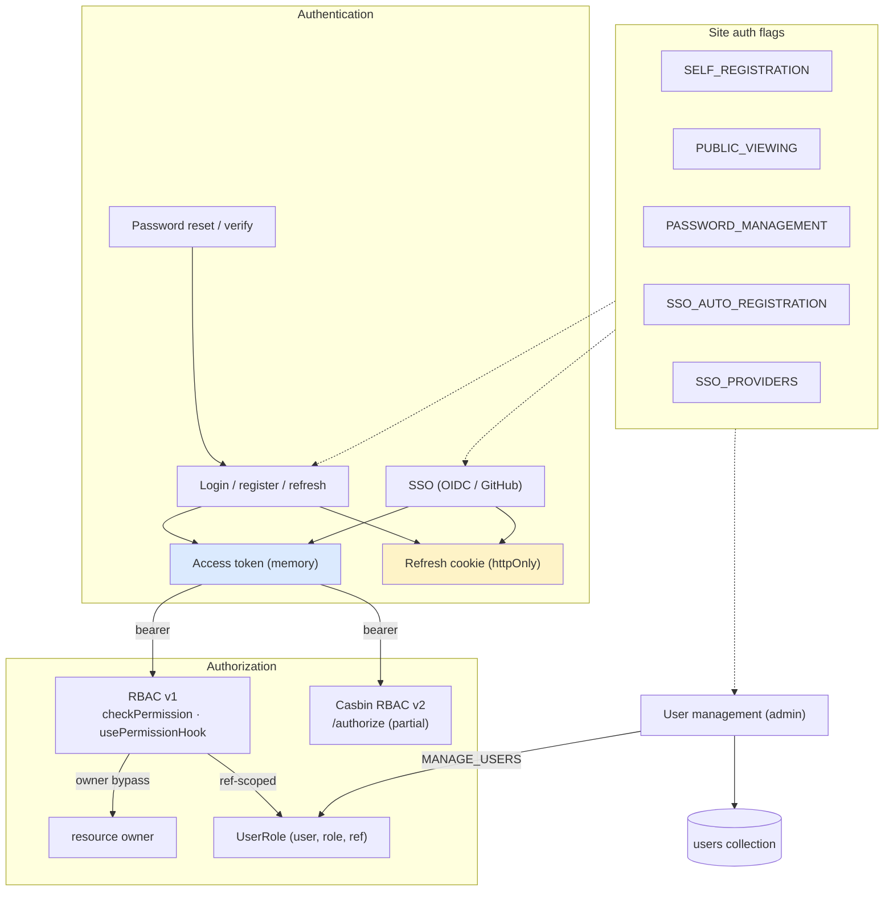
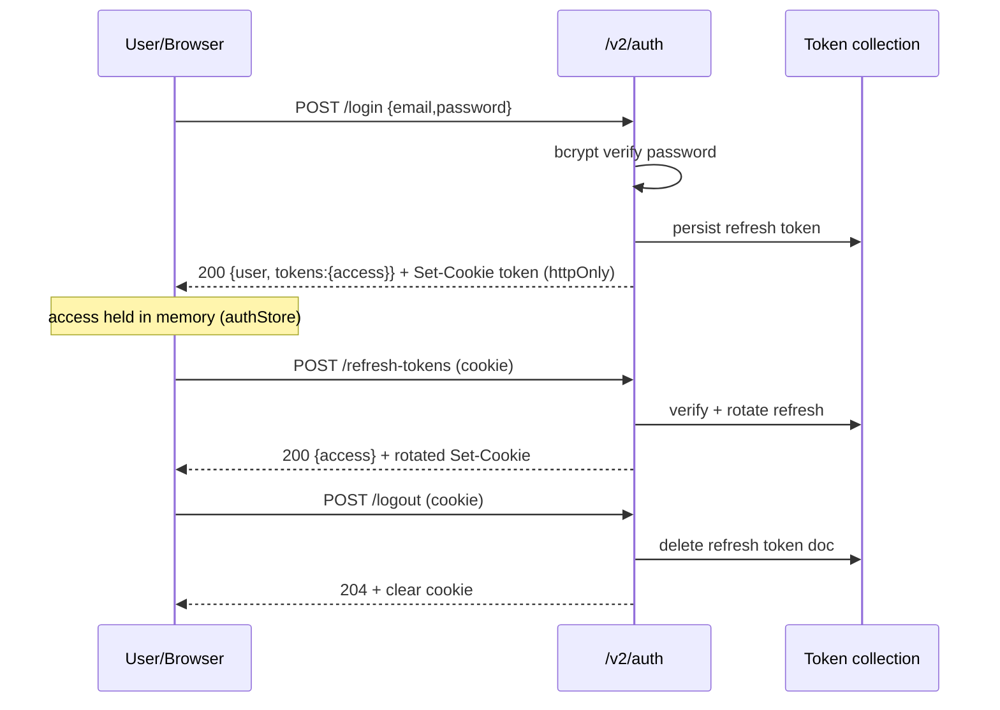
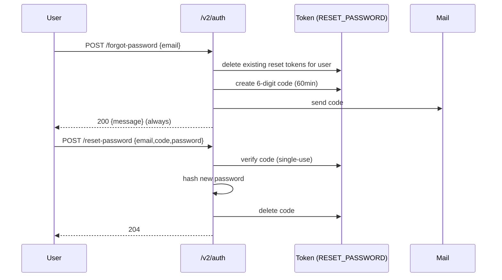
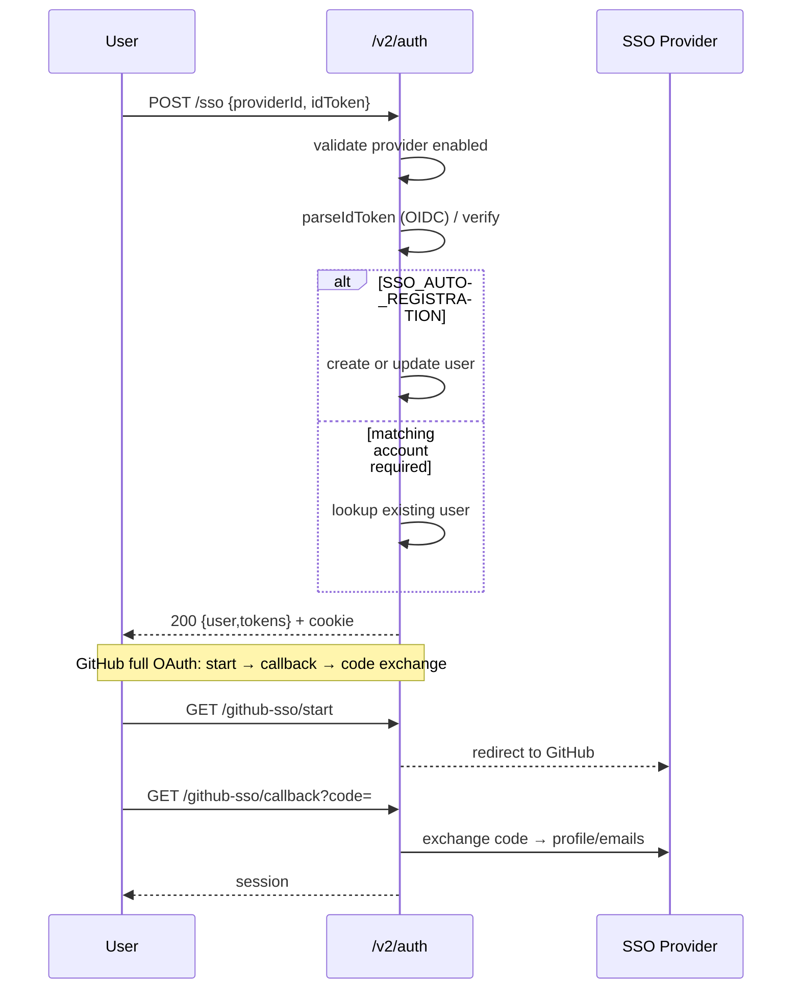
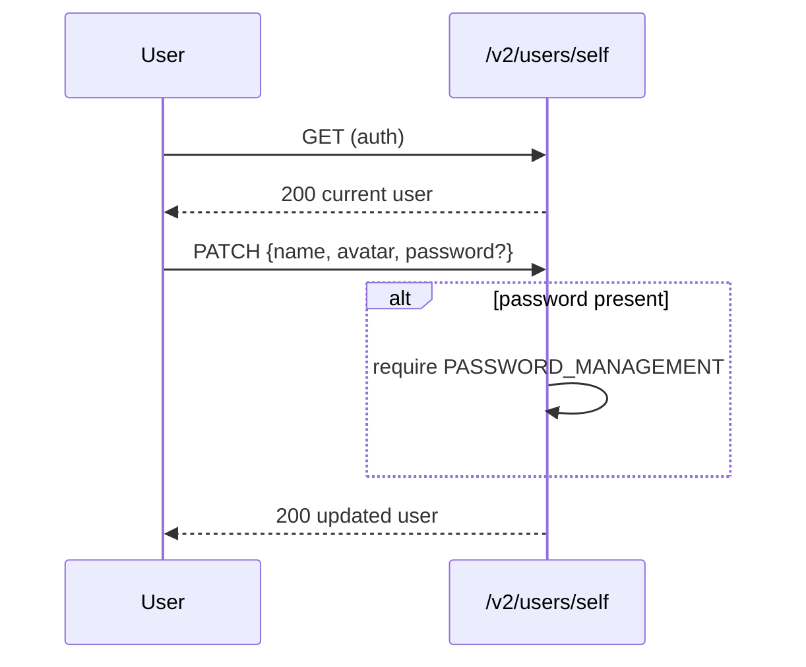
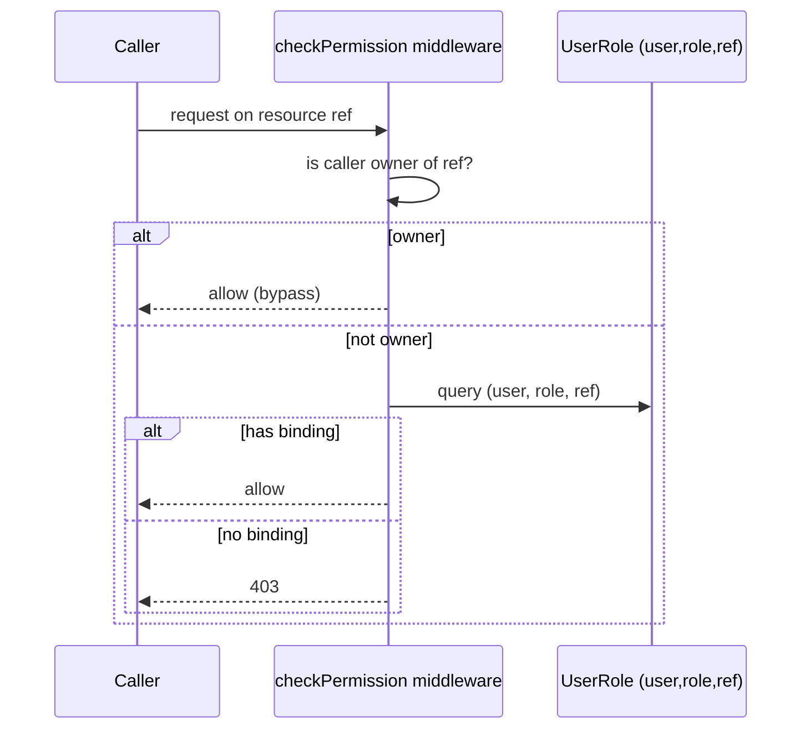
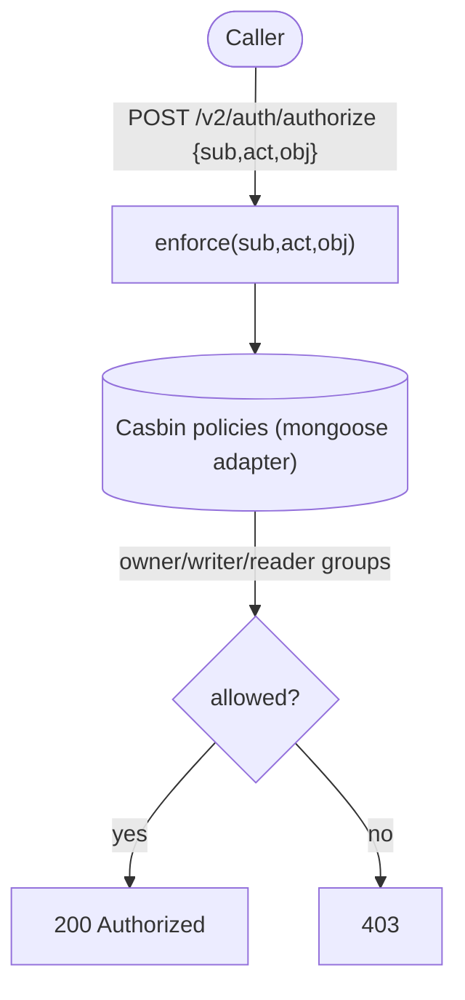
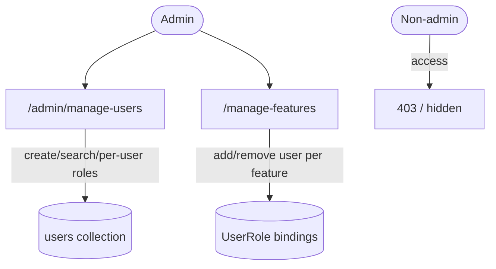

# Cluster: Identity & Access

Authentication, identity, and authorization. Backend: `routes/v2/user-management/`, `services/auth.service.js`, `services/token.service.js`, `config/passport.js`, `config/roles.js`. Frontend: `stores/authStore.ts`, `hooks/usePermissionHook.ts`.

---

## Capabilities in this cluster

| ID | Capability |
|----|------------|
| [CAP-IDENTITY-01](#cap-identity-01--login--logout--token-refresh) | Login / logout / token refresh |
| [CAP-IDENTITY-02](#cap-identity-02--registration) | Registration |
| [CAP-IDENTITY-03](#cap-identity-03--password-reset--email-verification) | Password reset & email verification |
| [CAP-IDENTITY-04](#cap-identity-04--sso-oidc-id-token--github-oauth) | SSO (OIDC ID-token + GitHub OAuth) |
| [CAP-IDENTITY-05](#cap-identity-05--user-profile) | User profile |
| [CAP-IDENTITY-06](#cap-identity-06--user-management-admin) | User management (admin) |
| [CAP-IDENTITY-07](#cap-identity-07--rbac-v1-primary) | RBAC v1 (primary) |
| [CAP-IDENTITY-08](#cap-identity-08--casbin-rbac-v2-partial) | Casbin RBAC v2 (partial) |
| [CAP-IDENTITY-09](#cap-identity-09--manage-users--manage-features-admin) | Manage Users & Manage Features (admin) |

## CAP-IDENTITY-01 — Login / logout / token refresh

### Description

Email+password login issuing a short-lived JWT access token (returned in the response body) and a long-lived refresh token set as an `httpOnly` cookie; refresh rotates the cookie and returns a new access token; logout revokes the refresh token and clears the cookie.

### Who uses it / value

All end users (sign in); every downstream capability depends on a valid session. DevOps rely on it for access control.

### Acceptance criteria

- `POST /v2/auth/login {email,password}` → `200` with `{ user, tokens }` where `tokens` contains only `access` (refresh is **not** in the body); sets the `token` cookie (httpOnly; `Secure`+`SameSite=None` in prod, `Lax` in dev; `domain` only in prod). Invalid credentials → `401`. SSO-only account (no password) → `401` (the password-mismatch path; an SSO-only user has no password to match).
- `POST /v2/auth/refresh-tokens` with the cookie → `200` `{ access }` + rotated cookie. Missing/expired/revoked cookie → `401`.
- `POST /v2/auth/logout` with the cookie → `204`, refresh token document deleted, cookie cleared.
- 401s on `/auth/refresh-tokens`, `/auth/login`, `/auth/logout` are **not** retried (no refresh loop); other 401s trigger a single-flight refresh + queued-request replay, then `logOut()` on refresh failure.

### Quality control

Sign in via UI → confirm `token` cookie present and `authStore.access` populated → reload keeps session; wrong password → error toast; let access token expire → silent refresh keeps session; logout → cookie gone, protected routes redirect to sign-in.

### Security

Access token short-lived (`JWT_ACCESS_EXPIRATION_MINUTES`, 30 min prod / 30 days in dev), never persisted. Refresh token persisted server-side (`Token` collection, no TTL index), revoked on logout. `trust proxy` enabled. ⚠️ `authLimiter` is defined (`rateLimiter.js`) but **not applied to any route** — login endpoints are effectively unrate-limited (known gap).

**Coverage:**
- **Auth:** Email+password login; JWT access token returned in the response body (`{ user, tokens: { access } }`), refresh token set as an httpOnly cookie. SSO-only account (no password) → 401. No auth barrier on `/login`, `/logout`, `/refresh-tokens` themselves.
- **Authorization:** N/A — login establishes identity; logout/refresh authorize via the refresh-token cookie (verified against the `Token` collection).
- **Input validation:** Joi `authValidation.login` (email, password required). `refreshTokens`/`logout` rely on the cookie-bound token (no Joi body validation on the route).
- **Rate limiting:** not applied — `authLimiter` is defined in `rateLimiter.js` but not wired to any route; `/login`, `/refresh-tokens`, `/logout` are unthrottled (known gap).
- **Secrets:** JWT secret (`config.jwt.secret`) signs access/refresh tokens; bcrypt-hashed passwords; refresh tokens persisted server-side in the `Token` collection.

**Risks:**
- **Credential brute-force / online guessing:** `authLimiter` is defined but not wired to any route, so `POST /v2/auth/login` can be hammered without throttling — weak passwords are exposed to online brute-force and credential-stuffing attacks.
- **Refresh-token theft:** the long-lived refresh cookie is the equivalent of a long-lived session; an XSS-less cookie steal (e.g. via a compromised subdomain or log injection capturing the cookie) yields persistent account takeover, since the cookie is `httpOnly` but not bound to the access token or device.
- **No expiry sweep:** the `Token` collection has no TTL index, so revoked/abandoned refresh tokens accumulate, and a stolen refresh token stays valid until explicit logout — extending the window of a token-theft attack.

### Data protection

Passwords hashed (`bcrypt`) and marked `private` (never returned in user objects). Refresh cookie is `httpOnly` (no JS access); `Secure`/`SameSite=None`/`domain` apply only in production. Access tokens live only in memory (`authStore`), not persisted client-side.

**Coverage:**
- **Stored data:** Refresh-token documents in the `Token` collection (`type=REFRESH`, `expires`, `blacklisted`); no TTL index. Access tokens are not persisted server-side.
- **PII:** yes — email, password (hashed). Email returned in the user object; password marked `private`.
- **Retention:** Refresh tokens indefinite until logout/revocation (no TTL index — revoked/abandoned tokens accumulate); access token short-lived (`JWT_ACCESS_EXPIRATION_MINUTES`, 30 min prod / 30 days dev).
- **Encryption:** bcrypt password hashing (8 rounds); JWT signed with `config.jwt.secret`; refresh cookie `Secure`+`SameSite=None` in prod, `Lax` in dev; no at-rest encryption for token docs.
- **Logging:** Auth failures logged via `logger` in the `auth` middleware; no credentials/tokens logged.

**Risks:**
- **Password exposure on transport:** in dev the cookie is `Lax`/non-`Secure`, so a refresh cookie captured on a non-HTTPS dev/demo network exposes a long-lived session.
- **Access-token leak via memory dump:** access tokens live in JS memory; a compromised browser extension or tab crash dump can exfiltrate the short-lived access token — bounded by expiry but enough to act within 30 min in prod.

### Test coverage
- **E2E (Playwright):** 7 test case(s) in `auth.spec.ts` (5: sign-in prompt, login modal, admin login, wrong password, logout) + `debug-login.spec.ts` (2: login via Enter, login via API) — SITEMAP: ✅
- **Unit (Jest):** 24 in `backend/tests/integration/auth.test.js` (login 3, logout 4, refresh-tokens 7, auth middleware 10) — v1 integration

## CAP-IDENTITY-02 — Registration

### Description

Self-service account creation that issues tokens and sets the refresh cookie.

### Who uses it / value

New end users (sign up); admins benefit from reduced account-provisioning load.

### Acceptance criteria

- `POST /v2/auth/register` → `201` `{ user, tokens }` (refresh in cookie only) when `SELF_REGISTRATION` is enabled.
- When `SELF_REGISTRATION` is disabled → `403`. Duplicate email → `400` (`email already taken`).
- A welcome email is sent (non-blocking — failure doesn't fail registration).

### Quality control

With `SELF_REGISTRATION=true` register a new email → `201` + session cookie; with it `false` → `403`; reuse an existing email → `400`.

### Security

Gated by the `SELF_REGISTRATION` site auth flag; no admin needed. Email uniqueness enforced.

**Coverage:**
- **Auth:** None on the route itself; gated by the `SELF_REGISTRATION` site auth flag (403 if disabled). Issues tokens + sets refresh cookie on success.
- **Authorization:** N/A — open self-service when the flag is enabled; no admin or role required.
- **Input validation:** Joi `authValidation.register` (email required + `.email()`, password required with custom `password` validator, name required; `image_file`/`provider` optional).
- **Rate limiting:** not applied — `authLimiter` gap; `/register` is unthrottled.
- **Secrets:** bcrypt-hashed password stored; JWT access/refresh tokens issued.

**Risks:**
- **Account-spam / namespace squatting:** with `SELF_REGISTRATION` enabled and no rate limit (the `authLimiter` gap), an attacker can bulk-create accounts to squat names/emails or enumerate which addresses are already registered via the `400` duplicate signal.
- **Welcome-email enumeration / abuse:** the welcome email is sent on every successful registration; a script can weaponize registration to spam arbitrary addresses from the platform's mail reputation.

### Data protection

Stores `email` (unique, lowercased), hashed `password`, `email_verified=false`. Email masked in public list responses.

**Coverage:**
- **Stored data:** `User` document (name, email unique+lowercased, hashed password, `email_verified=false`, provider, timestamps).
- **PII:** yes — email, name, password (hashed). Email masked in public list responses (`name,id,image_file` only).
- **Retention:** indefinite — no TTL/soft-delete; the user record persists until an admin deletes it.
- **Encryption:** bcrypt hashing (8 rounds) on save and on `findOneAndUpdate`/`updateOne`; no at-rest encryption beyond hashing.
- **Logging:** Welcome email sent non-blocking; errors logged via `logger`. No PII logged.

**Risks:**
- **Email enumeration via duplicate signal:** the `400 email already taken` response lets an attacker probe which addresses are registered, enabling account-enumeration and targeted phishing.
- **Unverified-identity persistence:** accounts are created with `email_verified=false` and no proof of email ownership at creation time, so an attacker can register using someone else's email and impersonate them until verification is enforced.

### Test coverage
- **E2E (Playwright):** 0 — not covered (no register spec; `auth.spec.ts` covers login/logout only) — SITEMAP: ❌
- **Unit (Jest):** 5 in `backend/tests/integration/auth.test.js` (`POST /v1/auth/register`) — v1 integration

## CAP-IDENTITY-03 — Password reset & email verification

### Description

Code-based password reset (primary): a 6-digit code is emailed, valid 60 minutes, verified with `{email, code, password}`. Legacy token-based reset (`?token`) retained. Email verification issues a verify token.

### Who uses it / value

End users who lost a password or need to verify email; admins (fewer password reset requests).

### Acceptance criteria

- `POST /v2/auth/forgot-password {email}` → `200 { message }` (always, to avoid user enumeration) and emails a 6-digit code (60 min). Reset events are logged.
- `POST /v2/auth/reset-password` with `{email, code, password}` (primary) → `204`; or `?token` + `{password}` (legacy) → `204`. Missing both → `400`. Wrong/expired code → `400`.
- `POST /v2/auth/send-verification-email` (auth) → `204` and emails a verify token; `POST /v2/auth/verify-email?token=…` → `204`, sets `email_verified=true`.
- Password changes require the `PASSWORD_MANAGEMENT` flag.

### Quality control

Trigger forgot-password → receive code → reset → log in with new password; try an expired/wrong code → `400`; verify-email → `email_verified` flips true.

### Security

Reset codes persisted in `Token` (`type=RESET_PASSWORD`); existing reset tokens for the user are deleted on each `forgot-password` (single-use). Password change gated by `PASSWORD_MANAGEMENT`. Forgot-password logs the event (to the log service).

**Coverage:**
- **Auth:** `forgot-password`/`reset-password`/`verify-email` anonymous (the code/token is the bearer); `send-verification-email` requires auth. Password change gated by the `PASSWORD_MANAGEMENT` site flag.
- **Authorization:** N/A for reset/forgot/verify (the emailed code/token authorizes the action); `send-verification-email` is self-scoped to the authenticated user.
- **Input validation:** Joi `forgotPassword` (email), `resetPassword` (query `token` optional; body `email`/`code` optional + `password` required with custom validator), `verifyEmail` (query `token` required).
- **Rate limiting:** not applied — `authLimiter` gap; `/reset-password` can be brute-forced within the 60-min code window.
- **Secrets:** 6-digit reset code (`crypto.randomInt`), JWT legacy reset token, JWT verify-email token; new password bcrypt-hashed.

**Risks:**
- **6-digit code brute-force:** the primary reset is a 6-digit code with no documented rate limit on `POST /v2/auth/reset-password`; an attacker holding an email can attempt codes until success within the 60-minute window (only ~1M space, and the always-`200` forgot-password response prevents enumeration but not guessing).
- **Account takeover via legacy token path:** the `?token` legacy reset path is retained; if those tokens are predictable, long-lived, or not single-use, an attacker can forge or reuse them to reset passwords without controlling the email.
- **Audit gap on reset:** reset events are logged but only `forgot-password` is noted as logged — a successful `reset-password` from a stolen code leaves a thin trail, complicating takeover forensics.

### Data protection

Codes/tokens are one-time, short-lived, and deleted on use. Passwords hashed; never logged. Email is the recovery handle.

**Coverage:**
- **Stored data:** `Token` docs (`type=RESET_PASSWORD` 60-min expiry, `type=VERIFY_EMAIL`); deleted on success. Password updated (hashed) on the `User` doc.
- **PII:** yes — email (recovery handle), new password (hashed).
- **Retention:** Reset/verify tokens single-use, deleted on success; 60-min code expiry; no TTL index so abandoned codes persist until expiry check. Password retained indefinitely.
- **Encryption:** bcrypt hashing for the new password; JWT-signed reset/verify tokens; 6-digit codes stored as plaintext in the `Token` collection.
- **Logging:** `forgot_password` and `password_reset` events logged via `logService` (origin/referer captured); no code/token logged.

**Risks:**
- **Recovery-handle hijack:** email is the sole recovery handle; anyone controlling the mailbox receives the 6-digit code and can take over the account, regardless of password strength.
- **Code-in-log exposure:** if the mailed 6-digit code or legacy token is captured by mailbox middleware or logged by an upstream mail relay, the one-time secret leaks before use.

### Test coverage
- **E2E (Playwright):** 0 — not covered (no forgot-password/reset/verify-email spec) — SITEMAP: ❌
- **Unit (Jest):** 16 in `backend/tests/integration/auth.test.js` (forgot-password 3, reset-password 6, send-verification-email 2, verify-email 5) — v1 integration

## CAP-IDENTITY-04 — SSO (OIDC ID-token + GitHub OAuth)

### Description

Single sign-on via configurable providers in `SSO_PROVIDERS`. Microsoft-style providers use an OIDC ID-token flow (`parseIdToken`); GitHub uses a full OAuth code-exchange. Auto-registers on first login when `SSO_AUTO_REGISTRATION` is enabled. A legacy GitHub callback links an existing account.

### Who uses it / value

End users (passwordless login); enterprises (SSO integration); DevOps/integrators (configure providers).

### Acceptance criteria

- `POST /v2/auth/sso {providerId, idToken}` → validates the provider is enabled, decodes the ID token, creates/updates the user, issues tokens + cookie → `200 { user, tokens }`. Disabled/invalid provider → `400`.
- `GET /v2/auth/github-sso/start` → redirects to GitHub; `GET /v2/auth/github-sso/callback` → exchanges code, fetches profile/emails, logs in.
- First SSO login creates an account only if `SSO_AUTO_REGISTRATION` is true; otherwise a matching existing account is required.
- `GET /v2/auth/github/callback` (legacy) → exchanges code and emits the token over the user's socket for account linking.

### Quality control

Configure a provider in Admin → Site Config → SSO; sign in via the provider button → account created/linked and session established; disable the provider → button hidden / `400`.

### Security

Provider `clientSecret`s are **encrypted at rest** (`utils/encryption.js`), decrypted only for admin display. `callMsGraph` is deprecated (ID-token flow uses only OpenID scopes). Auto-registration gated by `SSO_AUTO_REGISTRATION`.

**Coverage:**
- **Auth:** SSO endpoints are anonymous — `/sso` validates the provider is enabled + decodes the ID token; `/github-sso/start`/`/callback` run the OAuth code exchange; `/github/callback` (legacy) emits a token over the user's socket. Auto-registration gated by `SSO_AUTO_REGISTRATION`.
- **Authorization:** N/A — the provider-issued ID token / OAuth code governs access; admins configure providers in `SSO_PROVIDERS`.
- **Input validation:** Joi `authValidation.sso` (`providerId`, `idToken` required); GitHub start/callback query params (`providerId`, `code`, `state`) validated manually in the controller.
- **Rate limiting:** not applied — `authLimiter` gap; SSO routes are unthrottled.
- **Secrets:** Provider `clientSecret`s encrypted at rest (`utils/encryption.js`); GitHub `client_secret` used for code exchange; JWT access/refresh tokens issued on success.

**Risks:**
- **ID-token replay / acceptance of forged tokens:** `POST /v2/auth/sso` trusts a client-supplied `idToken`; if the provider's signature/issuer/audience is not strictly validated (or a stolen ID token is replayed within its lifetime), an attacker can impersonate any user by submitting a captured or crafted token.
- **Auto-registration identity squatting:** with `SSO_AUTO_REGISTRATION=true`, an attacker controlling a provider tenant or a permissive email claim can mint accounts matching arbitrary emails, then later collide with a real user's email when that user first signs in.
- **Supply-chain / misconfigured provider:** a malicious or misconfigured provider in `SSO_PROVIDERS` (over-broad scopes, leaked `clientSecret` despite encryption-at-rest) becomes a silent backdoor to account creation and login.

### Data protection

SSO provider secrets never exposed to non-admins (public list returns only enabled providers without secrets). SSO-linked users store `provider`/`provider_user_id`/`provider_data`; password optional for SSO accounts.

**Coverage:**
- **Stored data:** `User` doc (`provider`, `provider_user_id`, `provider_data[]`, `email_verified=true` for SSO-created users, avatar `image_file`); updated on each SSO login.
- **PII:** yes — email, display name, avatar URL, provider profile data (`provider_data`).
- **Retention:** `provider_data` retained indefinitely; SSO user persists until admin delete.
- **Encryption:** Provider `clientSecret`s encrypted at rest; JWT signed with `config.jwt.secret`; HTTPS to provider endpoints.
- **Logging:** Parse/exchange errors logged via `logger`; ID-token claim JSON may be included in error messages (`logger.error`).

**Risks:**
- **Provider-data persistence:** `provider_data` (profile/emails from the IdP) is stored indefinitely; if the provider later revokes or changes the user's identity, stale `provider_user_id` bindings keep pointing at the local account, enabling identity confusion or takeovers after an email change at the IdP.
- **Secret-at-rest dependence:** encryption-at-rest protects `clientSecret`s only as long as the encryption key is separate from the database; a key leak makes all provider secrets decryptable at once.

### Test coverage
- **E2E (Playwright):** 0 — not covered (no SSO/GitHub-OAuth spec) — SITEMAP: ❌
- **Unit (Jest):** none

## CAP-IDENTITY-05 — User profile

### Description

Self-service read/update of display name and avatar; change password (when `PASSWORD_MANAGEMENT` is enabled).

### Who uses it / value

End users (manage their identity/avatar).

### Acceptance criteria

- `GET /v2/users/self` (auth) → `200` current user. `PATCH /v2/users/self` → `200` updated user (name/avatar; password only when `PASSWORD_MANAGEMENT=true`).

### Quality control

Open `/profile` → edit name → save → name updates across the UI; change password → log in with new password.

### Security

Auth required; self only (no cross-user self-edit).

**Coverage:**
- **Auth:** required — `auth()` on `GET`/`PATCH /v2/users/self`.
- **Authorization:** self only — the route operates on `req.user`; no cross-user self-edit. Password change additionally gated server-side by the `PASSWORD_MANAGEMENT` site flag (route-level check).
- **Input validation:** Joi `userValidation.updateSelfUser` (name/avatar; password only accepted when `PASSWORD_MANAGEMENT` is on).
- **Rate limiting:** not applied — no rate limiter on user routes.
- **Secrets:** bcrypt-hashed password (marked `private`, never returned); `PASSWORD_MANAGEMENT` gate enforced server-side.

**Risks:**
- **Password-change bypass:** if the `PASSWORD_MANAGEMENT` gate is checked client-side only, a direct `PATCH /v2/users/self` with a `password` field could change a password without the flag, defeating the policy.
- **Self-edit of identifier:** if validation is loose, a user could change their `email` or other identifying field via `PATCH /v2/users/self` to collide with another account, enabling impersonation.

### Data protection

Avatar stored as a file path; password hashed and `private` (never returned).

**Coverage:**
- **Stored data:** `User` doc (name, `image_file` path, password hashed if changed).
- **PII:** yes — name, email, avatar (file path). Password never returned (`private`).
- **Retention:** indefinite — user-controlled name/avatar; no TTL.
- **Encryption:** bcrypt hashing for password; avatar stored as a file path (no encryption).
- **Logging:** errors logged via `logger`; no PII logged.

**Risks:**
- **Avatar path injection:** storing an avatar as a file path (rather than an opaque asset id) opens the door to path traversal or SSRF if the path is rendered/loaded without normalization.
- **Password-in-history loss:** changing a password has no documented "current password" requirement, so a hijacked session can rotate the password and lock the legitimate user out irreversibly.

### Test coverage
- **E2E (Playwright):** 2 test case(s) in `profile.spec.ts` (profile layout, edit display name) — SITEMAP: ⚠️ (avatar ❌, change-password not covered; ~50%)
- **Unit (Jest):** 7 in `backend/tests/unit/models/user.model.test.js` (User validation + toJSON)

## CAP-IDENTITY-06 — User management (admin)

### Description

Admin CRUD over users; public listing gated by `PUBLIC_VIEWING`; emails masked in responses.

### Who uses it / value

Admins (provision/manage users); end users (discoverable profiles when `PUBLIC_VIEWING`).

### Acceptance criteria

- `GET /v2/users` (optional auth via `PUBLIC_VIEWING`) → `200` paginated list (emails masked). `POST /v2/users` → `201` (admin). `GET /v2/users/:userId` (optional auth via `PUBLIC_VIEWING`) → `200`; `PATCH/DELETE /v2/users/:userId` (admin) → `200`/`204`.
- Non-admin write → `403`. `includeFullDetails` query requires admin.

### Quality control

As admin, create/list/update/delete a user → works; as non-admin, writes → `403`; with `PUBLIC_VIEWING=false` and signed-out, list → `401`.

### Security

Writes require `MANAGE_USERS`. Read of `includeFullDetails` admin-gated.

**Coverage:**
- **Auth:** required for writes (`auth()` on POST/PATCH/DELETE); reads optional via `PUBLIC_VIEWING` (`auth({ optional: (req) => req.authConfig.PUBLIC_VIEWING })`).
- **Authorization:** `checkPermission(PERMISSIONS.ADMIN)` (`manageUsers`) on POST/PATCH/DELETE; `includeFullDetails` admin-gated (non-admin list returns `name,id,image_file` only).
- **Input validation:** Joi `userValidation.createUser`/`getUsers`/`getUser`/`updateUser`/`deleteUser`.
- **Rate limiting:** not applied.
- **Secrets:** bcrypt-hashed passwords (marked `private`); emails masked in public list responses.

**Risks:**
- **Privilege escalation via user edit:** a missing or weak `MANAGE_USERS` check on `PATCH /v2/users/:userId` could let an attacker elevate a victim to admin (or elevate their own account), granting platform-wide control.
- **Unmasked-email enumeration:** if email masking is applied at the response layer but `includeFullDetails` (admin-only) is not enforced server-side, a non-admin could recover full emails of every user.
- **Irreversible user delete:** `DELETE /v2/users/:userId` is a hard operation; a compromised or rogue admin permanently destroys a user record and its audit trail with no soft-delete recovery.

### Data protection

Email masking in list responses; `password` field `private`; `includeFullDetails` admin-only.

**Coverage:**
- **Stored data:** `users` collection (full `User` docs); deleted hard via `user.deleteOne()`.
- **PII:** yes — name, email (masked in public list), password (hashed, `private`).
- **Retention:** indefinite; hard delete (no soft-delete / no audit trail of deletes).
- **Encryption:** bcrypt hashing for passwords; no at-rest encryption for user docs.
- **Logging:** errors logged via `logger`; no audit trail of admin user edits.

**Risks:**
- **PII leakage via masked-but-recoverable emails:** masked emails still leak structure (domain, length, prefix length); combined with the public list when `PUBLIC_VIEWING=true`, this enables user-enumeration and targeted phishing.
- **Hard-delete audit gap:** deleting a user removes the identity anchored to all their prior actions, breaking attribution of historical activity and leaving an audit gap.

### Test coverage
- **E2E (Playwright):** 4 test case(s) in `admin.spec.ts` (3: user management page, `/manage-users` route, non-admin blocked) + `admin-extended.spec.ts` (1: create-user form fill + cancel) — SITEMAP: ✅
- **Unit (Jest):** 42 in `backend/tests/integration/user.test.js` (POST/GET/GET-id/DELETE/PATCH `/v1/users`) — v1 integration

## CAP-IDENTITY-07 — RBAC v1 (primary)

### Description

Resource-scoped roles granting permissions bound to a `ref` (model/asset id or `*`); owners bypass checks. Used by `checkPermission` middleware and `usePermissionHook`.

### Who uses it / value

Model/asset owners (grant access); admins (assign global roles); end users (only see what they're permitted).

### Acceptance criteria

- `GET /v2/permissions/self` (auth) → own roles. `GET /v2/permissions` → all permissions. `GET /v2/permissions/has-permission?permissions=readModel,writeModel:modelId` → `boolean[]` in order (defaults denied).
- `POST /v2/permissions {user,role,ref}` (admin) → `201` assigns role. `DELETE /v2/permissions?user=&role=` (admin) → `204` removes.
- `GET /v2/permissions/users-by-roles` (admin) → users grouped by role (no `role` filter).
- Owner of a resource bypasses the permission check for that resource.

### Quality control

Assign a user `writeModel:<modelId>` → they can edit that model; remove it → edits `403`; `has-permission` with a missing/unknown permission → `false`.

### Security

Assign/remove require `MANAGE_USERS`; `has-permission` requires auth. Owners bypass — ensure ownership transfers are intentional.

**Coverage:**
- **Auth:** required on all permission routes (`auth()` on `/self`, `/`, `/has-permission`, `/roles`, `/users-by-roles`, POST/DELETE `/`).
- **Authorization:** assign/remove + `users-by-roles` require `checkPermission(PERMISSIONS.ADMIN)` (`manageUsers`); `has-permission`/`get`/`self` require auth; owner of a resource bypasses the check for that `ref`.
- **Input validation:** Joi `permissionValidation` (`getSelfUsers`, `getPermissions`, `hasPermission`, `assignRoleToUser`, `removeRoleFromUser`).
- **Rate limiting:** not applied.
- **Secrets:** none — UserRole bindings carry no credentials.

**Risks:**
- **Privilege escalation via grant:** a missing `MANAGE_USERS` check on `POST /v2/permissions` lets any authenticated user grant themselves or others arbitrary roles (e.g. `writeModel:*`), escalating to global write access.
- **Owner-bypass abuse:** ownership bypass means whoever owns a `ref` gains full rights to it; an unintended ownership transfer (or a model created with a hijacked `created_by`) silently grants full control to the wrong party.
- **Wildcard ref explosion:** `ref=*` grants apply globally; an over-broad `*` grant is a one-shot privilege escalation that no per-resource check can ever deny.

### Data protection

UserRole records bind `(user, role, ref)` (unique); no secrets stored.

**Coverage:**
- **Stored data:** `UserRole` documents (`user`, `role`, `ref`; unique compound); no secrets.
- **PII:** yes — user IDs and their capability mappings (relationship/capability data).
- **Retention:** indefinite — bindings persist until manually revoked; no audit trail of changes.
- **Encryption:** none (no secrets stored).
- **Logging:** none / N/A — no permission-change audit log.

**Risks:**
- **Relationship/capability leak:** `GET /v2/permissions` and `users-by-roles` expose who can do what on which resource — a capability map an attacker can use to target high-privilege users or sensitive `ref`s.
- **Persistence of mis-grants:** without an audit trail of permission changes, a mis-granted role persists silently until someone notices and manually revokes it.

### Test coverage
- **E2E (Playwright):** 0 — not covered (permission endpoints `/v2/permissions*` and `has-permission` not directly tested; access denial exercised indirectly via `admin.spec.ts`) — SITEMAP: ❌
- **Unit (Jest):** none (no Jest tests for `permission.service` / `checkPermission`)

## CAP-IDENTITY-08 — Casbin RBAC v2 (partial)

### Description

Second-generation authorization using Casbin + mongoose adapter with `owner/writer/reader` grouping policies and `enforce(sub, act, obj)` via the internal authorize endpoint.

### Who uses it / value

Integrators building programmatic auth checks; future migration target.

### Acceptance criteria

- `POST /v2/auth/authorize` (internal; no auth barrier on the route) → `200 { message: 'Authorized' }` on success, `403` on denial.
- `hasPermissionV2` / `assignRoleToUserV2` available in `permission.service`.

### Quality control

Call `/authorize` with a permitted subject/action/object → `true`; with a denied one → `false`.

### Security

Auth required; policy assignment is admin. **Partial** — v1 remains the primary path for most resource checks.

**Coverage:**
- **Auth:** `POST /v2/auth/authorize` has **no auth barrier** on the route (marked INTERNAL ONLY by comment); only `validate(authValidation.authorize)`. `hasPermissionV2`/`assignRoleToUserV2` are internal service calls.
- **Authorization:** Casbin `enforce(sub, act, obj)` decides; policy assignment (`assignRoleToUserV2`) is admin-controlled. v1 remains the primary path for most resource checks.
- **Input validation:** Joi `authValidation.authorize` (`permissions`/`permissionQuery`/`userId`, min 1 key).
- **Rate limiting:** not applied.
- **Secrets:** none — Casbin policies carry no credentials.

**Risks:**
- **Unauthenticated authorize endpoint:** `POST /v2/auth/authorize` has no auth barrier on the route, so an internal caller that reaches it can probe authorization decisions for arbitrary `(sub, act, obj)` — an oracle to enumerate who can do what.
- **Dual-RBAC drift:** v1 and v2 coexist; a resource check routed through v1 may diverge from v2's policy, leaving gaps where one says allow and the other deny — easy to mis-configure during partial migration.
- **Policy-tamper via admin grant:** `assignRoleToUserV2` is admin-controlled; a compromised admin can rewrite Casbin policies to grant themselves `owner` on every object.

### Data protection

Casbin policies stored via mongoose adapter; no secrets.

**Coverage:**
- **Stored data:** Casbin policies via the mongoose adapter (owner/writer/reader grouping policies); no secrets.
- **PII:** yes — subject/user identifiers embedded in policies.
- **Retention:** indefinite — the policy store persists until rewritten.
- **Encryption:** none (no secrets stored).
- **Logging:** none / N/A — no policy-change audit signal.

**Risks:**
- **Policy-set exposure:** the policy store encodes the full capability graph; a read of the mongoose-backed policies (via a backup leak or admin API) reveals the entire authorization model.
- **Silent policy drift:** partial adoption means v2 policies may be stale or inconsistent with v1, so a "denied" decision can flip to "allowed" (or vice versa) on a policy reload with no audit signal.

### Test coverage
- **E2E (Playwright):** 0 — not covered (no `/v2/auth/authorize` spec) — SITEMAP: ❌
- **Unit (Jest):** none

## CAP-IDENTITY-09 — Manage Users & Manage Features (admin)

### Description

Admin UIs to manage users (`/admin/manage-users`) and feature/role assignments (`/manage-features`).

### Who uses it / value

Admins (provision users, grant capabilities).

### Acceptance criteria

- `/admin/manage-users`: paginated list with search, create user, per-user role/permission actions.
- `/manage-features`: feature categories sidebar (permission roles) + add/remove users per feature.
- Non-admin → `403`.

### Quality control

As admin, create a user and grant a feature role → the user gains that capability; revoke → loses it; as non-admin, page → `403`/hidden.

### Security

Both require `MANAGE_USERS`.

**Coverage:**
- **Auth:** required — page-level admin guard (logged-in session).
- **Authorization:** both `/admin/manage-users` and `/manage-features` require `MANAGE_USERS` (`manageUsers`); non-admin → `403`/hidden.
- **Input validation:** underlying `/v2/users` and `/v2/permissions` Joi validation; UI inputs validated client-side.
- **Rate limiting:** not applied.
- **Secrets:** none surfaced — passwords are `private`; emails visible to admins via the directory.

**Risks:**
- **Bulk privilege grant:** the manage-features UI grants feature roles to users in bulk; a compromised admin can sweep-grant admin-tier capabilities across many accounts in one action.
- **UI-bypass via direct API:** if the page-level `MANAGE_USERS` guard is enforced in the UI but the underlying `/v2/users` and `/v2/permissions` endpoints are not independently re-checked, an admin UI bypass (or direct API call) could perform the same grants.
- **Feature-role naming confusion:** feature categories map to permission roles; a mislabeled category can trick an admin into granting a more powerful role than the label suggests.

### Data protection

Operates on user/role records; no secrets surfaced beyond what user management already exposes.

**Coverage:**
- **Stored data:** `User` and `UserRole` records (via the underlying `/v2/users` and `/v2/permissions` endpoints).
- **PII:** yes — full user directory (name, email) surfaced and editable by admin.
- **Retention:** indefinite — matches user management (no TTL/soft-delete).
- **Encryption:** bcrypt for passwords; none for directory/role data.
- **Logging:** none beyond the underlying endpoints — feature-role grants leave a thin forensic trail.

**Risks:**
- **Mass PII access:** manage-users surfaces a searchable, paginated list of all users with editable PII — a single compromised admin session exposes and can mutate the entire user directory.
- **Grant-trail gap:** feature-role grants made through the UI may not be audited beyond the underlying permission endpoint, so bulk grants can leave a thin forensic trail.

### Test coverage
- **E2E (Playwright):** 3 test case(s) in `admin-extended.spec.ts` (2: `/manage-features` page, create-user form) + `admin-features.spec.ts` (1: assign user to feature via UI) — SITEMAP: ✅
- **Unit (Jest):** none (admin UI only)