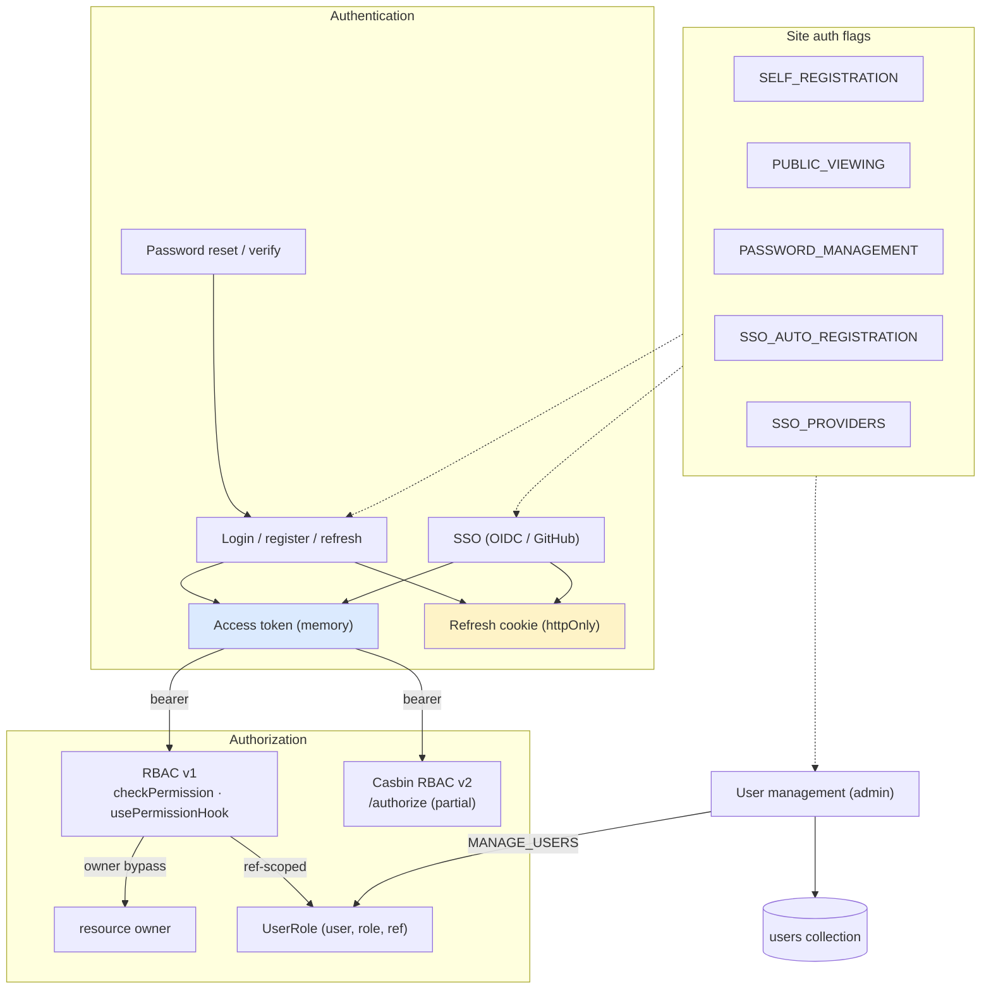
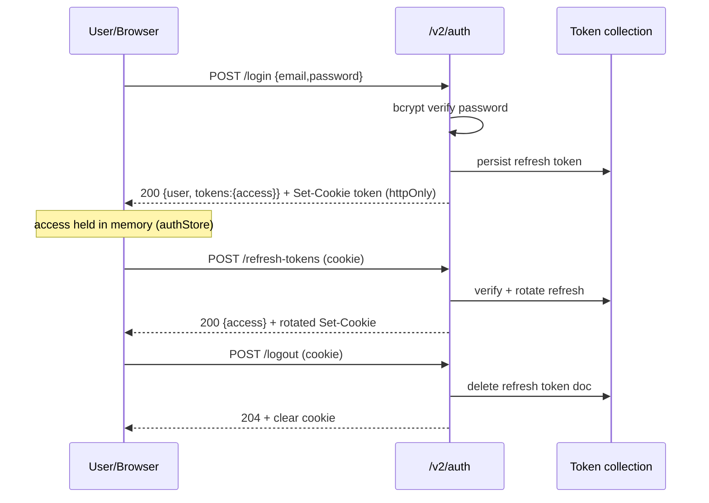
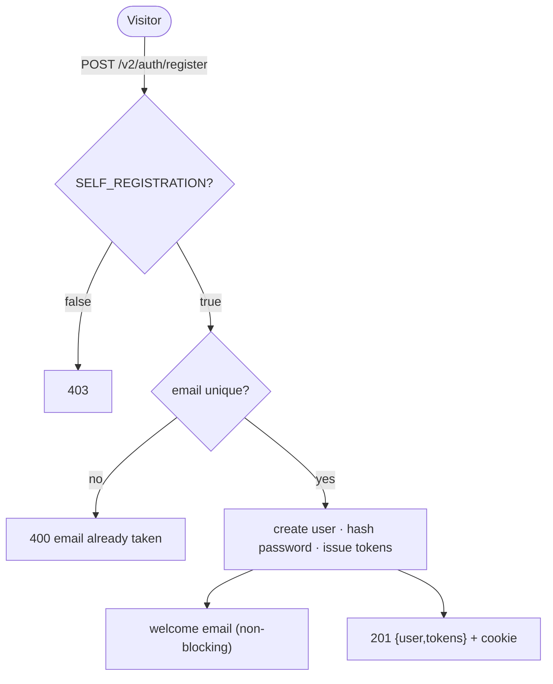
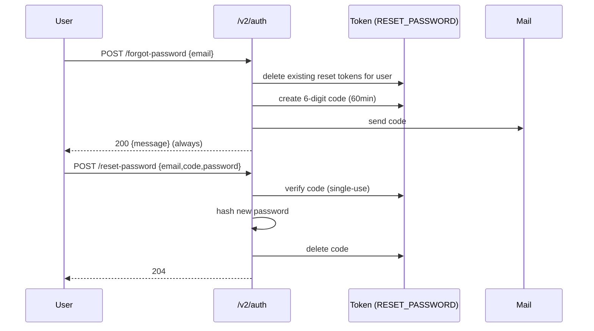
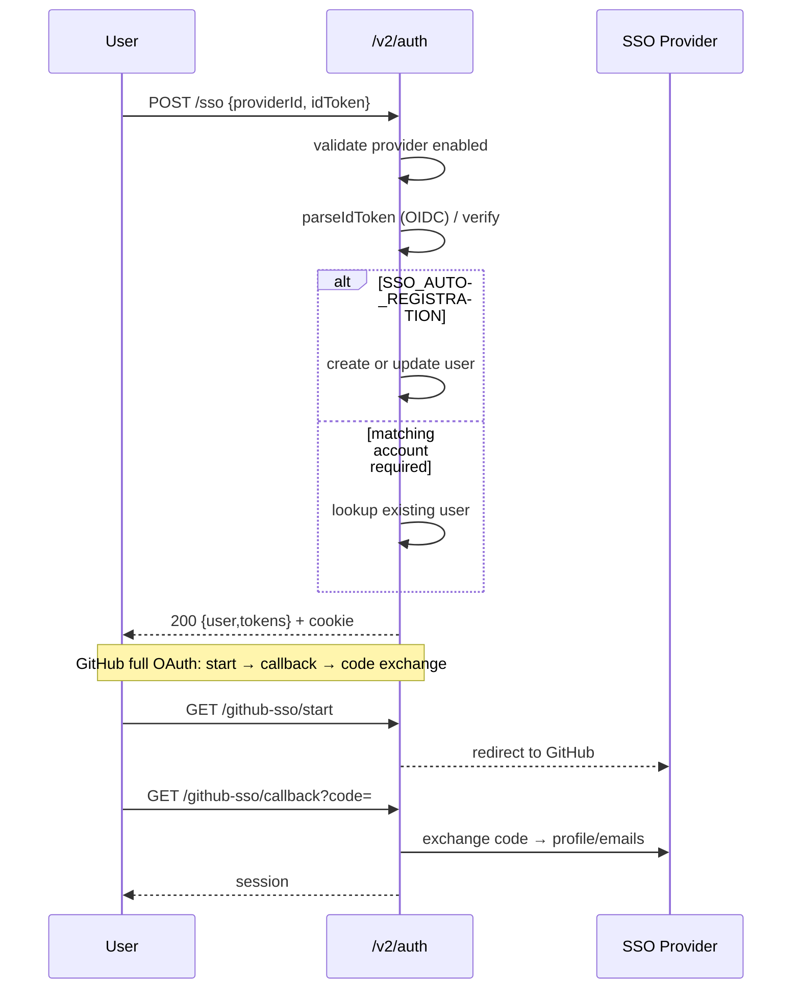
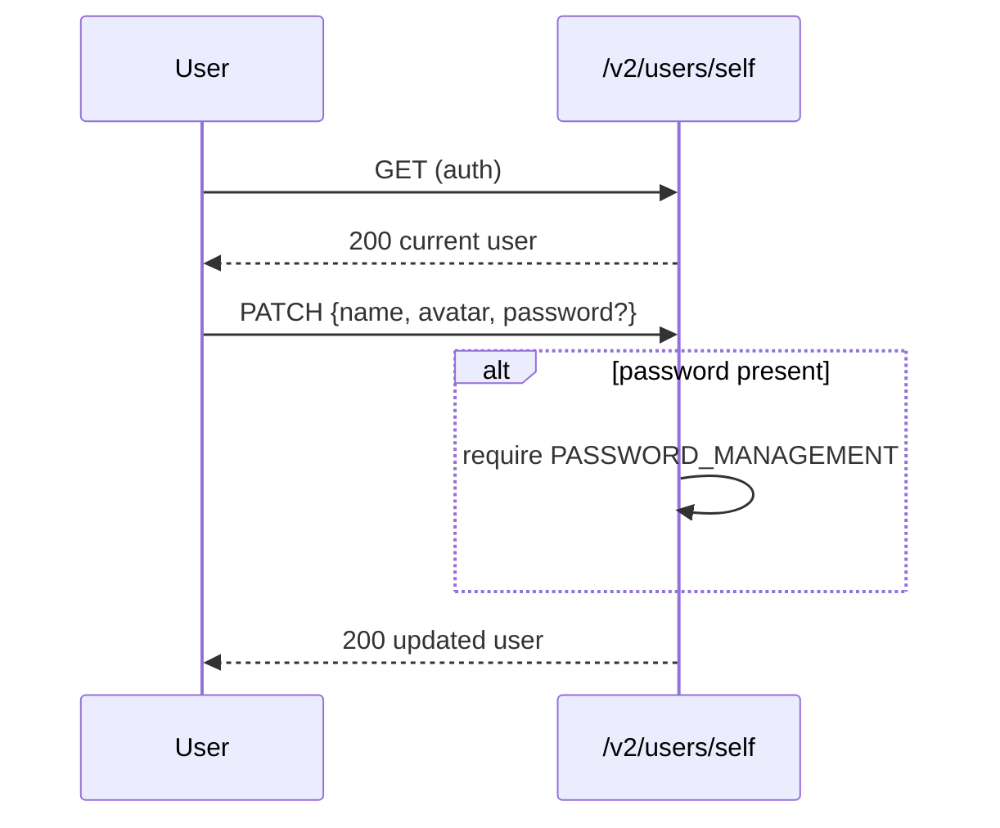
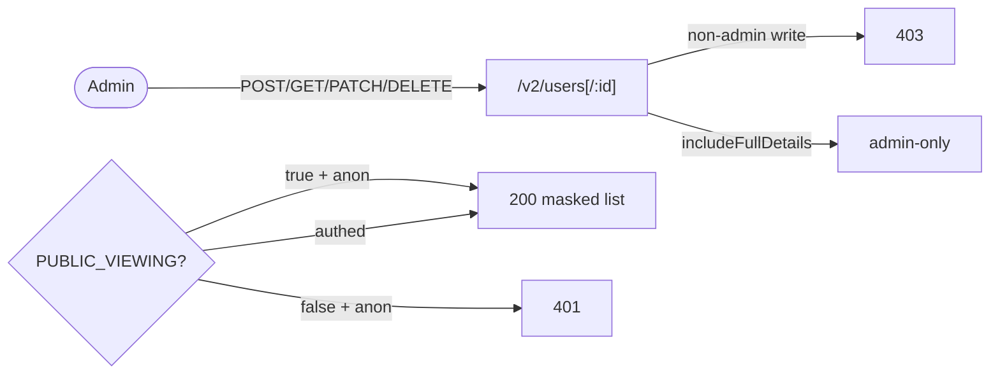
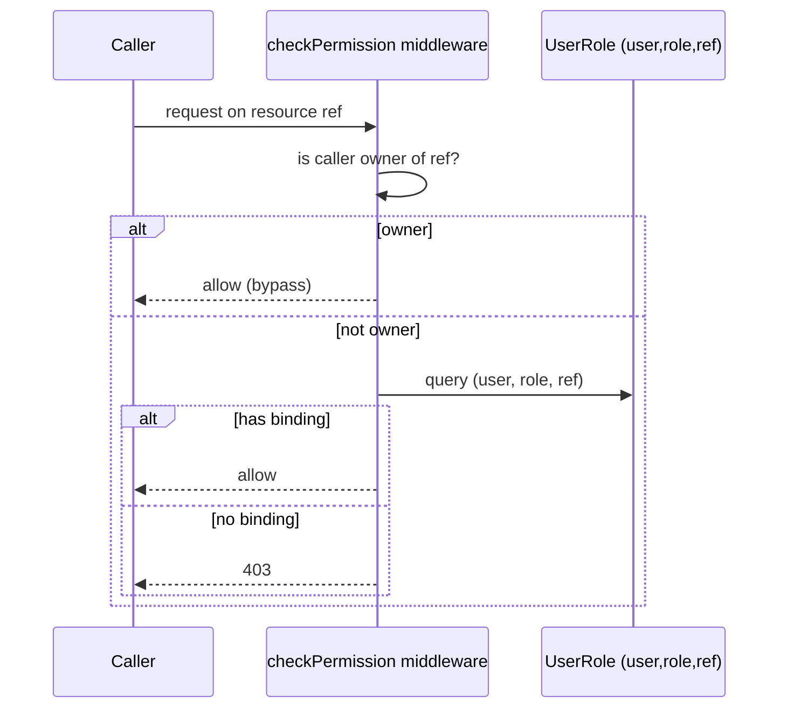

# Cluster: Identity & Access

As a user or admin, I can establish an identity, sign in, recover access, and have my permissions enforced across every downstream capability.

**Implementation:** `routes/v2/user-management/`, `services/auth.service.js`, `services/token.service.js`, `config/passport.js`, `config/roles.js`, `stores/authStore.ts`, `hooks/usePermissionHook.ts`

---

## Capabilities in this cluster

| ID | Capability |
|----|------------|
| [CAP-IDENTITY-01](#cap-identity-01--login--logout--token-refresh) | Login / logout / token refresh |
| [CAP-IDENTITY-02](#cap-identity-02--registration) | Registration |
| [CAP-IDENTITY-03](#cap-identity-03--password-reset--email-verification) | Password reset & email verification |
| [CAP-IDENTITY-04](#cap-identity-04--sso-oidc-id-token--github-oauth) | SSO (OIDC ID-token + GitHub OAuth) |
| [CAP-IDENTITY-05](#cap-identity-05--user-profile) | User profile |
| [CAP-IDENTITY-06](#cap-identity-06--user-management-admin) | User management (admin) |
| [CAP-IDENTITY-07](#cap-identity-07--rbac-v1-primary) | RBAC v1 (primary) |
| [CAP-IDENTITY-08](#cap-identity-08--casbin-rbac-v2-partial) | Casbin RBAC v2 (partial) |
| [CAP-IDENTITY-09](#cap-identity-09--manage-users--manage-features-admin) | Manage Users & Manage Features (admin) |

## CAP-IDENTITY-01 — Login / logout / token refresh

| Actor | Where | Personal data | E2E coverage |
|---|---|---|---|
| guest / user | Sign-in dialog; User menu | ✅ Yes — email, password (hashed) | ✅ 7 cases, ≈50% (est.) |

### Description

As a user, I can sign in with my email and password from the sign-in dialog, stay signed in across page reloads via a silent background refresh, and sign out from the user menu so that my session is convenient yet remains under my control.

### Who uses it / value

All end users (sign in); every downstream capability depends on a valid session. DevOps rely on it for access control.

### Acceptance criteria

- When a **guest** submits a valid email + password at the **Sign-in dialog**, they are signed in, the dialog closes, and their avatar appears in the navbar.
- When a **guest** submits a wrong password, or an email belonging to an SSO-only account that has no password, at the **Sign-in dialog**, they see an error message in the dialog and remain signed out.
- When a **user** reloads any page while their session is still valid, they stay signed in without being prompted again.
- When a **user**'s session expires while they are using the platform, the system silently refreshes it once and continues their pending action without prompting them; if the refresh fails, they are signed out and the next protected action sends them back to the **Sign-in dialog**.
- When a **user** chooses Logout from the **User menu**, they are signed out and sent to the home page; the next time they try a protected action, they are prompted to sign in again.

### API contract

- `POST /v2/auth/login {email,password}` → `200` `{ user, tokens }` where `tokens` contains only `access` (refresh is **not** in the body); sets the `token` cookie (httpOnly; `Secure`+`SameSite=None` in prod, `Lax` in dev; `domain` only in prod). Invalid credentials → `401`. SSO-only account (no password) → `401` (the password-mismatch path; an SSO-only user has no password to match).
- `POST /v2/auth/refresh-tokens` (cookie) → `200` `{ access }` + a rotated cookie. Missing/expired/revoked cookie → `401`.
- `POST /v2/auth/logout` (cookie) → `204`, deletes the refresh token, and clears the cookie.
- On a `401` from `/auth/refresh-tokens`, `/auth/login`, or `/auth/logout`, the system does **not** retry (no refresh loop); on other `401`s it silently refreshes once and replays queued requests, then signs the user out if refresh fails.

### Quality control

As a user, I sign in via the UI → confirm the `token` cookie is present and my session is established → reload keeps me signed in; wrong password → error toast; let my access token expire → silent refresh keeps me signed in; sign out → cookie gone, protected routes send me to sign-in.

### Security

Access token short-lived (`JWT_ACCESS_EXPIRATION_MINUTES`, 30 min prod / 30 days in dev), never persisted. Refresh token persisted server-side (`Token` collection, no TTL index), revoked on logout. `trust proxy` enabled. ⚠️ `authLimiter` is defined but **not applied to any route** — login endpoints are effectively unrate-limited (known gap).

**Coverage:**
- **Auth:** I sign in with email + password; the system returns an access token in the response body (`{ user, tokens: { access } }`) and sets the refresh token as an httpOnly cookie. An SSO-only account (no password) → `401`. The `/login`, `/logout`, `/refresh-tokens` endpoints themselves require no prior session.
- **Authorization:** N/A — sign-in establishes my identity; sign-out/refresh authorize me via the refresh-token cookie (verified against the `Token` collection).
- **Input validation:** I must send a valid email and password (validated). `refreshTokens`/`logout` rely on the cookie-bound token (no body validation on the route).
- **Rate limiting:** not applied — no rate limit protects me from credential brute-force on `/login`, `/refresh-tokens`, `/logout` (`authLimiter` is defined but not wired to any route; known gap).
- **Secrets:** My access/refresh tokens are signed with the JWT secret (`config.jwt.secret`); my password is bcrypt-hashed; my refresh token is stored server-side in the `Token` collection.

**Risks:**
- **Credential brute-force / online guessing:** `authLimiter` is defined but not wired to any route, so `POST /v2/auth/login` can be hammered without throttling — weak passwords are exposed to online brute-force and credential-stuffing attacks. *Mitigation:* none currently — wire `authLimiter` to login/register/reset.
- **Refresh-token theft:** the long-lived refresh cookie is the equivalent of a long-lived session; an XSS-less cookie steal (e.g. via a compromised subdomain or log injection capturing the cookie) yields persistent account takeover, since the cookie is `httpOnly` but not bound to the access token or device. *Mitigation:* none currently — bind the refresh token to the access token/device fingerprint and rotate on reuse.
- **No expiry sweep:** the `Token` collection has no TTL index, so revoked/abandoned refresh tokens accumulate, and a stolen refresh token stays valid until explicit logout — extending the window of a token-theft attack. *Mitigation:* none currently — add a TTL index on the `Token` collection.

### Personal data processing

✅ Yes — my email and password (hashed). Collected from me at `POST /v2/auth/login` (email + password); stored in the `User` collection (email, bcrypt password hash) and the `Token` collection (refresh tokens owned by my user id); retained indefinitely on my user record, refresh tokens until logout/revoked; encrypted — password bcrypt-hashed (8 rounds), tokens JWT-signed with `config.jwt.secret`; accessible to me (my own user object) and to admins via user management (`MANAGE_USERS`). My password is never returned (`private`); my refresh cookie is `httpOnly` (no JS access), `Secure`/`SameSite=None`/`domain` only in production; my access token lives only in memory (`authStore`), not persisted client-side.

**Risks:**
- **Low bcrypt cost factor:** my password is hashed at 8 rounds, below the modern ≥12 recommendation — an offline brute-force against a leaked user DB cracks 8-round hashes faster.
- **Email as sole login handle:** my email is the only login identifier and is returned in my user object, so a leaked email is sufficient to attempt login or password reset.

### AutoWRX data

My refresh-token document is operational session state; access tokens are ephemeral and not stored server-side.

**Coverage:**
- **Stored data:** My refresh-token document in the `Token` collection (`type=REFRESH`, `expires`, `blacklisted`); no TTL index. Access tokens are not stored server-side.
- **Retention:** My refresh token stays valid until I sign out or it's revoked (no TTL index — revoked/abandoned tokens accumulate); my access token is short-lived (`JWT_ACCESS_EXPIRATION_MINUTES`, 30 min prod / 30 days dev).
- **Encryption:** Tokens are JWT-signed with `config.jwt.secret`; my refresh cookie is `Secure`+`SameSite=None` in prod, `Lax` in dev; token documents have no at-rest encryption.
- **Logging:** Auth failures are logged via `logger` in the `auth` middleware; no credentials or tokens are logged.

**Risks:**
- **Refresh-cookie theft:** the long-lived refresh cookie is the equivalent of a long-lived session; an XSS-less cookie steal (e.g. via a compromised subdomain or log injection capturing the cookie) yields persistent account takeover, since the cookie is `httpOnly` but not bound to the access token or device.
- **Dev/demo transport exposure:** in dev the cookie is `Lax`/non-`Secure`, so a refresh cookie captured on a non-HTTPS dev/demo network exposes a long-lived session.
- **Access-token leak via memory dump:** access tokens live in JS memory; a compromised browser extension or tab crash dump can exfiltrate the short-lived access token — bounded by expiry but enough to act within 30 min in prod.

### Test coverage
- **E2E (Playwright):** 7 test case(s) in `auth.spec.ts` (5: sign-in prompt, login modal, admin login, wrong password, logout) + `debug-login.spec.ts` (2: login via Enter, login via API) — SITEMAP: ✅
- **Estimated coverage:** ≈50% (est.) — of 4 acceptance-criteria bullets, E2E covers login + logout directly; refresh-tokens and 401-no-retry are Jest-only
- **Unit (Jest):** 24 in `backend/tests/integration/auth.test.js` (login 3, logout 4, refresh-tokens 7, auth middleware 10) — v1 integration

## CAP-IDENTITY-02 — Registration

| Actor | Where | Personal data | E2E coverage |
|---|---|---|---|
| guest | Register dialog (Sign-in dialog → Register) | ✅ Yes — email, name, password (hashed) | ❌ 0 cases, ≈0% (est.) |

### Description

As a new visitor, I can create my own account from the sign-in dialog's "Register" link so that I can start using the platform without an admin having to provision me, when self-registration is enabled by the site.

### Who uses it / value

New end users (sign up); admins benefit from reduced account-provisioning load.

### Acceptance criteria

- When a **guest** opens the **Sign-in dialog** and self-registration is enabled, they see a "Register" link; switching to the register form at **Register dialog**, they fill in name, email, password, and password confirmation, and on submit they are signed in immediately.
- When a **guest** submits mismatched passwords or leaves required fields blank at the **Register dialog**, they see a validation error in the form and are not registered.
- When a **guest** registers with an email that is already taken at the **Register dialog**, they see an "email already taken" error and are not registered.
- When self-registration is disabled by the site, the "Register" link is hidden in the **Sign-in dialog**, and a **guest** cannot self-create an account.
- When a **guest** successfully registers at the **Register dialog**, the site sends them a welcome email (non-blocking — a mail failure does not block registration).

### API contract

- `POST /v2/auth/register` → `201` `{ user, tokens }` (refresh in cookie only) when `SELF_REGISTRATION` is enabled.
- `SELF_REGISTRATION` disabled → `403`. Duplicate email → `400` (`email already taken`).
- On success the system sends a welcome email (non-blocking — failure doesn't fail registration).

### Quality control

As a new user, with `SELF_REGISTRATION=true` I register a new email → `201` + session cookie; with it `false` → `403`; reusing an existing email → `400`.

### Security

Registration is gated by the `SELF_REGISTRATION` site auth flag; no admin needed. Email uniqueness enforced.

**Coverage:**
- **Auth:** None on the route itself; I'm gated by the `SELF_REGISTRATION` site auth flag (`403` if disabled). On success the system issues me tokens + sets the refresh cookie.
- **Authorization:** N/A — open self-service when the flag is enabled; no admin or role required.
- **Input validation:** I must send a valid email, a password, and a name; `image_file`/`provider` are optional (validated).
- **Rate limiting:** not applied — no rate limit protects me from account-spam on `/register` (`authLimiter` gap).
- **Secrets:** My password is bcrypt-hashed and stored; the system issues me JWT access/refresh tokens.

**Risks:**
- **Account-spam / namespace squatting:** with `SELF_REGISTRATION` enabled and no rate limit (the `authLimiter` gap), an attacker can bulk-create accounts to squat names/emails or enumerate which addresses are already registered via the `400` duplicate signal. *Mitigation:* none currently — wire `authLimiter` to login/register/reset.
- **Welcome-email enumeration / abuse:** the welcome email is sent on every successful registration; a script can weaponize registration to spam arbitrary addresses from the platform's mail reputation. *Mitigation:* none currently — throttle welcome-email sends and add a per-IP registration cap.

### Personal data processing

✅ Yes — my email, name, and password (hashed). Collected from me at `POST /v2/auth/register` (email, password, name; optional `image_file`/`provider`); stored in my `User` document (name, email unique+lowercased, bcrypt password hash, `email_verified=false`, provider, timestamps); retained indefinitely until an admin deletes it (no TTL/soft-delete); encrypted — password bcrypt-hashed (8 rounds), no at-rest encryption beyond hashing; accessible to me (my own user object) and to admins via user management (`MANAGE_USERS`), masked in public list responses (`name,id,image_file` only).

**Risks:**
- **Email enumeration via duplicate signal:** the `400 email already taken` response lets an attacker probe which addresses are registered, enabling account-enumeration and targeted phishing.
- **Unverified-identity persistence:** accounts are created with `email_verified=false` and no proof of email ownership at creation time, so an attacker can register using someone else's email and impersonate them until verification is enforced.

### AutoWRX data

The welcome email is an operational side-effect of account creation; my `User` document holds the operational identity record.

**Coverage:**
- **Stored data:** My `User` document (name, email unique+lowercased, hashed password, `email_verified=false`, provider, timestamps).
- **Retention:** indefinite — my user record persists until an admin deletes it (no TTL/soft-delete).
- **Encryption:** My password is bcrypt-hashed (8 rounds); no at-rest encryption beyond hashing.
- **Logging:** The welcome email is sent non-blocking; errors are logged via `logger`. No PII logged.

**Risks:**
- **Indefinite retention without soft-delete:** user records persist until a hard admin delete with no TTL/soft-delete, so stale or erroneously created accounts accumulate with no recovery path.

### Test coverage
- **E2E (Playwright):** 0 — not covered (no register spec; `auth.spec.ts` covers login/logout only) — SITEMAP: ❌
- **Estimated coverage:** ≈0% (est.) — no E2E spec
- **Unit (Jest):** 5 in `backend/tests/integration/auth.test.js` (`POST /v1/auth/register`) — v1 integration

## CAP-IDENTITY-03 — Password reset & email verification

| Actor | Where | Personal data | E2E coverage |
|---|---|---|---|
| guest / user | Forgot-password page (`/forgot-password`) | ✅ Yes — email, new password (hashed) | ❌ 0 cases, ≈0% (est.) |

### Description

As a user, I can recover a forgotten password from the sign-in dialog by entering my email, receiving a 6-digit code, and choosing a new password — without an admin's help — so that I can regain access to my account; I can also verify my email so the site marks it as trusted.

### Who uses it / value

End users who lost a password or need to verify email; admins (fewer password reset requests).

### Acceptance criteria

- When a **guest** clicks "Forget Password" in the **Sign-in dialog** and enters their email at the **Forgot-password page (`/forgot-password`)**, they see the next step asking for the 6-digit code that was emailed to them, regardless of whether that email exists (the site does not reveal which addresses are registered).
- When a **guest** enters the 6-digit code and a new password (twice, matching, at least 8 characters) at the **Forgot-password page (`/forgot-password`)**, their password is reset and they see a success screen that lets them return to sign in with the new password.
- When a **guest** enters a wrong or expired code, or mismatched/too-short passwords, at the **Forgot-password page (`/forgot-password`)**, they see an error and their password is not changed.
- When a **guest** didn't receive the code, they can resend it from the **Forgot-password page (`/forgot-password`)**; they can also go back to use a different email.
- When a **user** clicks the verify-email link in the email the site sends them, their email is marked as verified. (There is no dedicated verify-email screen in the UI — the link confirms their address and lands them on the site.)
- Password reset/verify actions are only available at the **Forgot-password page (`/forgot-password`)** when password management is enabled by the site.

### API contract

- `POST /v2/auth/forgot-password {email}` → `200 { message }` (always, to avoid user enumeration) and emails a 6-digit code (60 min). Reset events are logged.
- `POST /v2/auth/reset-password` with `{email, code, password}` (primary) → `204`; or with `?token` + `{password}` (legacy) → `204`. Both missing → `400`. Wrong/expired code → `400`.
- `POST /v2/auth/send-verification-email` (auth) → `204` and emails a verify token; `POST /v2/auth/verify-email?token=…` → `204` and sets `email_verified=true`.
- Password changes require the `PASSWORD_MANAGEMENT` flag.

### Quality control

As a user, I trigger forgot-password → receive a code → reset → log in with my new password; an expired/wrong code → `400`; verify-email → `email_verified` flips true.

### Security

My reset code is persisted in `Token` (`type=RESET_PASSWORD`); existing reset tokens for me are deleted on each `forgot-password` (single-use). Password change is gated by `PASSWORD_MANAGEMENT`. Forgot-password logs the event (to the log service).

**Coverage:**
- **Auth:** `forgot-password`/`reset-password`/`verify-email` are anonymous for me (the code/token is the bearer); `send-verification-email` requires me to be signed in. Password change is gated by the `PASSWORD_MANAGEMENT` site flag.
- **Authorization:** N/A for reset/forgot/verify (the emailed code/token authorizes my action); `send-verification-email` is self-scoped to me as the authenticated user.
- **Input validation:** I must send a valid email (validated); for reset, the query `token` is optional and body `email`/`code` are optional with `password` required (validated); for verify, the query `token` is required (validated).
- **Rate limiting:** not applied — no rate limit protects me from brute-force on `/reset-password` within the 60-min code window (`authLimiter` gap).
- **Secrets:** I receive a 6-digit reset code (`crypto.randomInt`), a JWT legacy reset token, and a JWT verify-email token; my new password is bcrypt-hashed.

**Risks:**
- **6-digit code brute-force:** the primary reset is a 6-digit code with no documented rate limit on `POST /v2/auth/reset-password`; an attacker holding an email can attempt codes until success within the 60-minute window (only ~1M space, and the always-`200` forgot-password response prevents enumeration but not guessing). *Mitigation:* none currently — wire `authLimiter` to login/register/reset and add per-email code-attempt throttling.
- **Account takeover via legacy token path:** the `?token` legacy reset path is retained; if those tokens are predictable, long-lived, or not single-use, an attacker can forge or reuse them to reset passwords without controlling the email. *Mitigation:* none currently — retire the legacy token path or enforce single-use + short TTL on legacy tokens.
- **Audit gap on reset:** reset events are logged but only `forgot-password` is noted as logged — a successful `reset-password` from a stolen code leaves a thin trail, complicating takeover forensics. *Mitigation:* none currently — log successful `reset-password` events with origin/referer to match `forgot-password`.

### Personal data processing

✅ Yes — my email (recovery handle) and my new password (hashed). Collected from me at `POST /v2/auth/forgot-password {email}`, `POST /v2/auth/reset-password {email,code,password}`, and `POST /v2/auth/verify-email?token=…`; stored in my `User` document (new password bcrypt-hashed on reset) and `Token` docs (`type=RESET_PASSWORD` 60-min code, `type=VERIFY_EMAIL` token) tied to my email/user id; retained — password indefinite, reset/verify tokens single-use deleted on success (no TTL index so abandoned codes persist until the expiry check); encrypted — new password bcrypt-hashed, reset/verify tokens JWT-signed, 6-digit code stored as plaintext in the `Token` collection; accessible to me (the code/token is emailed to me) and to the system — never logged.

**Risks:**
- **Recovery-handle hijack:** email is the sole recovery handle; anyone controlling the mailbox receives the 6-digit code and can take over the account, regardless of password strength.
- **Reset does not re-verify ownership:** a successful reset does not re-verify email ownership, so a mailbox compromise at any point lets the attacker rotate the password and persist access.

### AutoWRX data

My reset/verify tokens are one-time, short-lived operational secrets, deleted on use.

**Coverage:**
- **Stored data:** My `Token` docs (`type=RESET_PASSWORD` 60-min expiry, `type=VERIFY_EMAIL`); deleted on success. My password is updated (hashed) on my `User` doc.
- **Retention:** My reset/verify tokens are single-use, deleted on success; 60-min code expiry; no TTL index so abandoned codes persist until the expiry check.
- **Encryption:** reset/verify tokens are JWT-signed; my 6-digit code is stored as plaintext in the `Token` collection; token documents have no at-rest encryption.
- **Logging:** `forgot_password` and `password_reset` events are logged via `logService` (origin/referer captured); no code/token is logged.

**Risks:**
- **Code-in-log exposure:** if the mailed 6-digit code or legacy token is captured by mailbox middleware or logged by an upstream mail relay, the one-time secret leaks before use.
- **Plaintext code at rest:** the 6-digit code is stored as plaintext in the `Token` collection, so a DB read leaks a live reset code directly.

### Test coverage
- **E2E (Playwright):** 0 — not covered (no forgot-password/reset/verify-email spec) — SITEMAP: ❌
- **Estimated coverage:** ≈0% (est.) — no E2E spec
- **Unit (Jest):** 16 in `backend/tests/integration/auth.test.js` (forgot-password 3, reset-password 6, send-verification-email 2, verify-email 5) — v1 integration

## CAP-IDENTITY-04 — SSO (OIDC ID-token + GitHub OAuth)

| Actor | Where | Personal data | E2E coverage |
|---|---|---|---|
| guest / user | Sign-in dialog (SSO buttons) | ✅ Yes — email, display name, avatar, provider profile | ❌ 0 cases, ≈0% (est.) |

### Description

As a user, I can sign in through a configured SSO provider (Microsoft-style OIDC or GitHub) from a "Sign in with …" button under the sign-in form so that I do not need a platform password; my account is created automatically on my first SSO sign-in when auto-registration is enabled.

### Who uses it / value

End users (passwordless login); enterprises (SSO integration); DevOps/integrators (configure providers).

### Acceptance criteria

- When a **guest** opens the **Sign-in dialog** and at least one SSO provider is configured and enabled, they see an "Or continue with" section with a "Sign in with <provider>" button under the sign-in form.
- When a **guest** clicks the SSO button (Microsoft) at the **Sign-in dialog**, a popup opens to authenticate them with the provider; on success they are signed in, the popup closes, and they see a welcome toast. If they cancel the popup, they see a "Login Cancelled" toast and remain signed out. If the popup is blocked, they see a "Popup Blocked" toast.
- When a **guest** clicks the GitHub SSO button at the **Sign-in dialog**, they are redirected to GitHub to authorize, then redirected back to the site signed in.
- When a **guest** finds the provider disabled or its configuration invalid at the **Sign-in dialog**, the SSO button is hidden (or they see an SSO configuration error toast), and they are not signed in.
- When auto-registration is enabled, a **guest**'s account is created on their first SSO sign-in at the **Sign-in dialog**; when it is disabled, a matching existing account is required for them to sign in.
- When email login is disabled by the site, the **Sign-in dialog** shows a **guest** only the SSO provider button(s).

### API contract

- `POST /v2/auth/sso {providerId, idToken}` → validates provider is enabled, decodes the ID token, creates/updates user, issues tokens + cookie → `200 { user, tokens }`. Disabled/invalid provider → `400`.
- `GET /v2/auth/github-sso/start` → redirects to GitHub; `GET /v2/auth/github-sso/callback` → exchanges the code, fetches profile/emails, logs me in.
- First SSO login creates the account only if `SSO_AUTO_REGISTRATION` is true; otherwise a matching existing account is required.
- `GET /v2/auth/github/callback` (legacy) → exchanges the code and emits the token over my socket for account linking.

### Quality control

As an admin, I configure a provider in Admin → Site Config → SSO; as a user, I sign in via the provider button → my account is created/linked and a session is established; when the provider is disabled → the button is hidden / I get `400`.

### Security

Provider `clientSecret`s are **encrypted at rest**, decrypted only for admin display. Auto-registration is gated by `SSO_AUTO_REGISTRATION`.

**Coverage:**
- **Auth:** SSO endpoints are anonymous for me — `/sso` validates the provider is enabled + decodes my ID token; `/github-sso/start`/`/callback` run the OAuth code exchange; `/github/callback` (legacy) emits a token over my socket. Auto-registration is gated by `SSO_AUTO_REGISTRATION`.
- **Authorization:** N/A — the provider-issued ID token / OAuth code governs my access; admins configure providers in `SSO_PROVIDERS`.
- **Input validation:** I must send `providerId` and `idToken` (validated); on GitHub start/callback my query params (`providerId`, `code`, `state`) are validated manually in the controller.
- **Rate limiting:** not applied — no rate limit protects me from abuse on SSO routes (`authLimiter` gap).
- **Secrets:** Provider `clientSecret`s are encrypted at rest; the GitHub `client_secret` is used for code exchange; JWT access/refresh tokens are issued to me on success.

**Risks:**
- **ID-token replay / acceptance of forged tokens:** `POST /v2/auth/sso` trusts a client-supplied `idToken`; if the provider's signature/issuer/audience is not strictly validated (or a stolen ID token is replayed within its lifetime), an attacker can impersonate any user by submitting a captured or crafted token. *Mitigation:* none currently — strictly validate the ID-token signature, issuer, and audience server-side; enforce `nonce` and single-use replay.
- **Auto-registration identity squatting:** with `SSO_AUTO_REGISTRATION=true`, an attacker controlling a provider tenant or a permissive email claim can mint accounts matching arbitrary emails, then later collide with a real user's email when that user first signs in. *Mitigation:* none currently — pin auto-registration to a trusted provider tenant list and reconcile on email collision.
- **Supply-chain / misconfigured provider:** a malicious or misconfigured provider in `SSO_PROVIDERS` (over-broad scopes, leaked `clientSecret` despite encryption-at-rest) becomes a silent backdoor to account creation and login. *Mitigation:* none currently — audit `SSO_PROVIDERS` scopes and rotate `clientSecret`s; enforce least-privilege scopes.

### Personal data processing

✅ Yes — my email, display name, avatar URL, and provider profile data (`provider_data`). Collected from my SSO provider at `POST /v2/auth/sso {providerId,idToken}` and the GitHub OAuth callback (`GET /v2/auth/github-sso/callback?code=`); stored in my `User` doc (`provider`, `provider_user_id`, `provider_data[]`, `email_verified=true` for SSO-created users, avatar `image_file`), updated on each SSO login; retained indefinitely until an admin deletes it; encrypted — provider `clientSecret`s are encrypted at rest (never exposed to me as a non-admin; the public list returns only enabled providers without secrets), my JWT is signed with `config.jwt.secret`, HTTPS to provider endpoints; accessible to me (my own user object) and to admins via user management. A password is optional for SSO accounts.

**Risks:**
- **Provider-data persistence:** `provider_data` (profile/emails from the IdP) is stored indefinitely; if the provider later revokes or changes the user's identity, stale `provider_user_id` bindings keep pointing at the local account, enabling identity confusion or takeovers after an email change at the IdP.
- **ID-token claim leakage in logs:** parse/exchange errors are logged via `logger` and my ID-token claim JSON may be included in error messages, exposing personal claims to anyone with log access.

### AutoWRX data

SSO provider configuration (secrets, enabled flags) is operational config; my SSO user record links to it.

**Coverage:**
- **Stored data:** Provider config in `SSO_PROVIDERS` (`clientSecret` encrypted at rest); my `User` doc links (`provider`, `provider_user_id`, `provider_data[]`).
- **Retention:** My `provider_data` is retained indefinitely; my SSO user persists until an admin deletes it; provider config persists until rewritten.
- **Encryption:** Provider `clientSecret`s are encrypted at rest; my JWT is signed with `config.jwt.secret`; HTTPS is used to provider endpoints; no at-rest encryption for user/`provider_data` docs.
- **Logging:** Parse/exchange errors are logged via `logger`; my ID-token claim JSON may be included in error messages (`logger.error`).

**Risks:**
- **Secret-at-rest dependence:** encryption-at-rest protects `clientSecret`s only as long as the encryption key is separate from the database; a key leak makes all provider secrets decryptable at once.
- **Provider config has no audit trail:** changes to `SSO_PROVIDERS` (add/remove/rotate) are not audited, so a backdoor provider can be added and removed without a trace.

### Test coverage
- **E2E (Playwright):** 0 — not covered (no SSO/GitHub-OAuth spec) — SITEMAP: ❌
- **Estimated coverage:** ≈0% (est.) — no E2E spec
- **Unit (Jest):** none

## CAP-IDENTITY-05 — User profile

| Actor | Where | Personal data | E2E coverage |
|---|---|---|---|
| user | Profile page (`/profile`) | ✅ Yes — name, email, avatar, password | ⚠️ 2 cases, ≈50% (est.) |

### Description

As a signed-in user, I can open the Profile page to view my identity and update my display name, avatar, and (when password management is enabled) my password so that I keep my identity current.

### Who uses it / value

End users (manage their identity/avatar).

### Acceptance criteria

- When a **user** opens the **Profile page (`/profile`)**, they see their avatar, their display name, and their email (read-only).
- When a **user** clicks "Change name", edits their name, and saves at the **Profile page (`/profile`)**, their updated name appears immediately on the page and across the UI (navbar, etc.); clicking Cancel reverts without saving.
- When a **user** clicks the avatar edit button and chooses an image file at the **Profile page (`/profile`)**, their avatar updates immediately on the page.
- When password management is enabled, a **user** sees a "Change password" button at the **Profile page (`/profile`)** that opens a dialog where they enter a new password twice; on submit they see a success message and are redirected to sign in again with the new password. When the two passwords don't match, they see an error and the password is not changed.
- When password management is disabled, the password section is not shown at the **Profile page (`/profile`)**.
- When a **guest** (not signed in) opens the **Profile page (`/profile`)**, their identity is not shown and they are prompted to sign in for protected access.

### API contract

- `GET /v2/users/self` (auth) → `200` with my current user.
- `PATCH /v2/users/self` (auth) → `200` with my updated user (name/avatar; password only when `PASSWORD_MANAGEMENT=true`).

### Quality control

As a user, I open `/profile` → edit my name → save → my name updates across the UI; change my password → log in with the new password.

### Security

I must be signed in; I can edit only myself (no cross-user self-edit).

**Coverage:**
- **Auth:** required — I must be signed in (`auth()`) for `GET`/`PATCH /v2/users/self`.
- **Authorization:** self only — the route operates on me; I cannot edit another user. Password change is additionally gated server-side by the `PASSWORD_MANAGEMENT` site flag (route-level check).
- **Input validation:** I can send name/avatar (validated); a password is only accepted when `PASSWORD_MANAGEMENT` is on.
- **Rate limiting:** not applied — no rate limiter protects me on user routes.
- **Secrets:** My password is bcrypt-hashed (marked `private`, never returned); the `PASSWORD_MANAGEMENT` gate is enforced server-side.

**Risks:**
- **Password-change bypass:** if the `PASSWORD_MANAGEMENT` gate is checked client-side only, a direct `PATCH /v2/users/self` with a `password` field could change a password without the flag, defeating the policy. *Mitigation:* the `PASSWORD_MANAGEMENT` gate is enforced server-side (route-level check) — keep it there; do not move to client-only.
- **Self-edit of identifier:** if validation is loose, a user could change their `email` or other identifying field via `PATCH /v2/users/self` to collide with another account, enabling impersonation. *Mitigation:* none currently — reject `email`/identifier changes on the self-edit route.
- **Password change without current password:** `PATCH /v2/users/self` with a `password` field rotates the password with no "current password" proof, so a hijacked session can rotate the password and lock the legitimate user out irreversibly. *Mitigation:* none currently — require current password on self-change.

### Personal data processing

✅ Yes — my name, email, avatar (file path), and password (when changed). Collected from me at `GET`/`PATCH /v2/users/self` (name, avatar; password only when `PASSWORD_MANAGEMENT=true`); stored in my `User` doc (name, `image_file` path, password hashed if changed); retained indefinitely (user-controlled, no TTL); encrypted — password bcrypt-hashed (marked `private`, never returned), avatar stored as a file path (no encryption); accessible to me (my own user object) and to admins via user management.

**Risks:**
- **Self-edit of personal identifier:** if validation is loose, a user could change their `email` via `PATCH /v2/users/self` to collide with another account, enabling impersonation (see also Security).
- **Avatar leaks identity:** my avatar file path is tied to my identity and may be publicly fetchable when `PUBLIC_VIEWING=true`, exposing my presence without consent.

### AutoWRX data

My avatar is stored as a file path; my password is hashed and `private` (never returned).

**Coverage:**
- **Stored data:** My `User` doc (name, `image_file` path, password hashed if changed).
- **Retention:** indefinite — my name/avatar are user-controlled; no TTL.
- **Encryption:** My password is bcrypt-hashed; my avatar is stored as a file path (no encryption).
- **Logging:** Errors are logged via `logger`; no PII logged.

**Risks:**
- **Avatar path injection:** storing an avatar as a file path (rather than an opaque asset id) opens the door to path traversal or SSRF if the path is rendered/loaded without normalization.

### Test coverage
- **E2E (Playwright):** 2 test case(s) in `profile.spec.ts` (profile layout, edit display name) — SITEMAP: ⚠️ (avatar ❌, change-password not covered; ~50%)
- **Estimated coverage:** ≈50% (est.) — E2E covers name edit only; avatar and change-password paths are not exercised
- **Unit (Jest):** 7 in `backend/tests/unit/models/user.model.test.js` (User validation + toJSON)

## CAP-IDENTITY-06 — User management (admin)

| Actor | Where | Personal data | E2E coverage |
|---|---|---|---|
| admin / guest | Admin → Manage Users (`/manage-users`) | ✅ Yes — name, email, password (hashed) | ✅ 4 cases, ≈80% (est.) |

### Description

As an admin, I can open the Manage Users page to browse, search, create, update, and delete user accounts so that I can provision and manage the platform's directory; as a visitor I can browse discoverable profiles when public viewing is enabled, with emails masked.

### Who uses it / value

Admins (provision/manage users); end users (discoverable profiles when `PUBLIC_VIEWING`).

### Acceptance criteria

- When an **admin** opens the **Manage Users page (`/manage-users`)**, they see a paginated list of users with their name, avatar, and created-at timestamp, a total count, a "Create new user" button, and a search box that filters by name or email.
- When an **admin** clicks "Create new user" and fills in name/email/password at the **Manage Users page (`/manage-users`)**, the new user appears in the list with a success toast; if the email is already taken or input is invalid, they see an error toast and no user is created.
- When an **admin** clicks a user's edit button at the **Manage Users page (`/manage-users`)**, a dialog opens pre-filled with their name/email; saving updates the list with a success toast.
- When an **admin** clicks a user's delete button at the **Manage Users page (`/manage-users`)**, they are asked to confirm; confirming removes the user from the list with a success toast. Cancelling keeps the user.
- When there are more users than fit on one page at the **Manage Users page (`/manage-users`)**, a "Load more" button loads the next page; when there are no more, an **admin** sees "No more users to load." (or "No matches." if the search returned nothing).
- When a **user** (non-admin) visits the **Manage Users page (`/manage-users`)**, the "Manage Users" nav entry is hidden and writes are refused; when public viewing is off and they are signed out, they cannot read the directory and are prompted to sign in.
- When a **guest** (signed-out visitor) browses the **Manage Users page (`/manage-users`)** with public viewing on, they can browse the public user list but emails are masked and full details are admin-only.

### API contract

- `GET /v2/users` (optional auth via `PUBLIC_VIEWING`) → `200` paginated list (emails masked). `POST /v2/users` (admin) → `201`. `GET /v2/users/:userId` (optional auth via `PUBLIC_VIEWING`) → `200`; `PATCH/DELETE /v2/users/:userId` (admin) → `200`/`204`.
- Non-admin write → `403`. `includeFullDetails` query requires admin.

### Quality control

As an admin, I create/list/update/delete a user → it works; as a non-admin, writes → `403`; with `PUBLIC_VIEWING=false` and signed-out, the list → `401`.

### Security

Writes require `MANAGE_USERS`. The `includeFullDetails` read is admin-gated.

**Coverage:**
- **Auth:** I must be signed in for writes (`auth()` on POST/PATCH/DELETE); reads are optional via `PUBLIC_VIEWING` (signed-out can read public content when the flag is on).
- **Authorization:** I need `MANAGE_USERS` (`manageUsers`) for POST/PATCH/DELETE; `includeFullDetails` is admin-gated (a non-admin list returns `name,id,image_file` only).
- **Input validation:** My input is validated.
- **Rate limiting:** not applied.
- **Secrets:** Passwords are bcrypt-hashed (marked `private`); emails are masked in public list responses.

**Risks:**
- **Privilege escalation via user edit:** a missing or weak `MANAGE_USERS` check on `PATCH /v2/users/:userId` could let an attacker elevate a victim to admin (or elevate their own account), granting platform-wide control. *Mitigation:* `MANAGE_USERS` is enforced server-side on POST/PATCH/DELETE — keep it route-level; add a separate guard against self-elevation/role escalation.
- **Unmasked-email enumeration:** if email masking is applied at the response layer but `includeFullDetails` (admin-only) is not enforced server-side, a non-admin could recover full emails of every user. *Mitigation:* none currently — enforce `includeFullDetails` server-side, not only in the response serializer.
- **Irreversible user delete:** `DELETE /v2/users/:userId` is a hard operation; a compromised or rogue admin permanently destroys a user record and its audit trail with no soft-delete recovery. *Mitigation:* none currently — add soft-delete + an admin audit trail for deletes.

### Personal data processing

✅ Yes — the full user directory: name, email, password (hashed). Collected from admins at `POST /v2/users` and from each user at registration; stored in the `users` collection (full `User` docs); retained indefinitely (hard delete, no soft-delete); encrypted — passwords bcrypt-hashed (marked `private`, never returned), emails masked in public list responses (`name,id,image_file` only), `includeFullDetails` admin-only; accessible to admins (`MANAGE_USERS`) and to each user for their own record.

**Risks:**
- **PII leakage via masked-but-recoverable emails:** masked emails still leak structure (domain, length, prefix length); combined with the public list when `PUBLIC_VIEWING=true`, this enables user-enumeration and targeted phishing.
- **Admin mass-PII access:** any admin with `MANAGE_USERS` can read and mutate the full PII of every user, so a single compromised admin session exposes the entire directory.

### AutoWRX data

The `users` collection is the operational identity directory; admin writes are operational provisioning actions.

**Coverage:**
- **Stored data:** `users` collection (full `User` docs); deleted hard (no soft-delete).
- **Retention:** indefinite; hard delete (no soft-delete / no audit trail of deletes).
- **Encryption:** Passwords are bcrypt-hashed; no at-rest encryption for user docs.
- **Logging:** Errors are logged via `logger`; no audit trail of admin user edits.

**Risks:**
- **Hard-delete audit gap:** deleting a user removes the identity anchored to all their prior actions, breaking attribution of historical activity and leaving an audit gap.
- **No admin-edit audit trail:** admin user edits (create/update/delete) are not audited, so privileged changes leave no forensic trail.

### Test coverage
- **E2E (Playwright):** 4 test case(s) in `admin.spec.ts` (3: user management page, `/manage-users` route, non-admin blocked) + `admin-extended.spec.ts` (1: create-user form fill + cancel) — SITEMAP: ✅
- **Estimated coverage:** ≈80% (est.) — E2E covers list, create, and non-admin block; PATCH/DELETE and `includeFullDetails` not directly asserted
- **Unit (Jest):** 42 in `backend/tests/integration/user.test.js` (POST/GET/GET-id/DELETE/PATCH `/v1/users`) — v1 integration

## CAP-IDENTITY-07 — RBAC v1 (primary)

| Actor | Where | Personal data | E2E coverage |
|---|---|---|---|
| admin / owner / user | Admin → Manage Users (`/manage-users`); resource pages | ✅ Yes — user IDs, capability mappings | ❌ 0 cases, ≈0% (est.) |

### Description

As a model/asset owner or admin, I can grant resource-scoped permissions to other users so that they can act on specific models or assets; as a user I only see what I've been granted, and as the owner of a resource I am not blocked from acting on my own resource.

### Who uses it / value

Model/asset owners (grant access); admins (assign global roles); end users (only see what they're permitted).

### Acceptance criteria

- When an **admin** assigns a user a permission on a resource (e.g. the right to edit a given model) at the **Manage Users page (`/manage-users`)**, that user can now perform the matching action on that resource in the UI; when the **admin** removes the permission, that user's attempts to perform that action are blocked (they see a denial / the action is unavailable).
- When a **user** browses resource pages, they only see and act on resources for which they hold the relevant permission; actions they lack permission for are hidden or refused.
- When an **owner** acts on their own resource (edits, manages it) at the resource page, they can do so even when they have not explicitly granted themselves a permission — ownership bypasses the check.
- When an **admin** views which users hold which permissions and which users are grouped by role at the **Manage Users page (`/manage-users`)**, they can audit access.
- When a **user** queries a permission that does not exist or they lack it, the system treats it as denied (they do not get access).

### API contract

- `GET /v2/permissions/self` (auth) → my own roles. `GET /v2/permissions` → all permissions. `GET /v2/permissions/has-permission?permissions=readModel,writeModel:modelId` → a `boolean[]` in order (defaults denied).
- `POST /v2/permissions {user,role,ref}` (admin) → `201` and assigns the role. `DELETE /v2/permissions?user=&role=` (admin) → `204` and removes it.
- `GET /v2/permissions/users-by-roles` (admin) → users grouped by role (no `role` filter).
- As the owner of a resource, I bypass the permission check for that resource.

### Quality control

As an admin, I assign a user `writeModel:<modelId>` → they can edit that model; remove it → their edits get `403`; `has-permission` with a missing/unknown permission → `false`.

### Security

Assign/remove require `MANAGE_USERS`; `has-permission` requires me to be signed in. Owners bypass — ownership transfers should be intentional.

**Coverage:**
- **Auth:** I must be signed in on all permission routes (`auth()` on `/self`, `/`, `/has-permission`, `/roles`, `/users-by-roles`, POST/DELETE `/`).
- **Authorization:** I need `MANAGE_USERS` (`manageUsers`) to assign/remove + `users-by-roles`; `has-permission`/`get`/`self` require me to be signed in; as the owner of a resource I bypass the check for that `ref`.
- **Input validation:** My input is validated.
- **Rate limiting:** not applied.
- **Secrets:** none — UserRole bindings carry no credentials.

**Risks:**
- **Privilege escalation via grant:** a missing `MANAGE_USERS` check on `POST /v2/permissions` lets any authenticated user grant themselves or others arbitrary roles (e.g. `writeModel:*`), escalating to global write access. *Mitigation:* `MANAGE_USERS` is enforced server-side on POST/DELETE — keep it route-level; reject self-grants.
- **Owner-bypass abuse:** ownership bypass means whoever owns a `ref` gains full rights to it; an unintended ownership transfer (or a model created with a hijacked `created_by`) silently grants full control to the wrong party. *Mitigation:* none currently — make ownership transfers explicit and verify `created_by` on creation.
- **Wildcard ref explosion:** `ref=*` grants apply globally; an over-broad `*` grant is a one-shot privilege escalation that no per-resource check can ever deny. *Mitigation:* none currently — disallow `*` refs or scope them to admins only.

### Personal data processing

✅ Yes — user IDs and their capability mappings (relationship/capability data linking a person to what they can do). Collected from admins at `POST /v2/permissions {user,role,ref}`; stored in `UserRole` documents (`user`, `role`, `ref`; unique compound); retained indefinitely until manually revoked; encrypted — none (no secrets stored); accessible to admins (`MANAGE_USERS`) and to each user for their own roles (`GET /v2/permissions/self`).

**Risks:**
- **Relationship/capability leak:** `GET /v2/permissions` and `users-by-roles` expose who can do what on which resource — a capability map an attacker can use to target high-privilege users or sensitive `ref`s.
- **No notice for grants:** a user is granted capabilities without notification, so unexpected access changes go unnoticed by the subject.

### AutoWRX data

`UserRole` records are the operational capability graph; no secrets are stored.

**Coverage:**
- **Stored data:** `UserRole` documents (`user`, `role`, `ref`; unique compound); no secrets.
- **Retention:** Bindings persist indefinitely until manually revoked; no audit trail of changes.
- **Encryption:** none (no secrets stored).
- **Logging:** none / N/A — no permission-change audit log.

**Risks:**
- **Persistence of mis-grants:** without an audit trail of permission changes, a mis-granted role persists silently until someone notices and manually revokes it.
- **No permission-change audit log:** grant/revoke events are not recorded, so privilege changes leave no forensic trail.

### Test coverage
- **E2E (Playwright):** 0 — not covered (permission endpoints `/v2/permissions*` and `has-permission` not directly tested; access denial exercised indirectly via `admin.spec.ts`) — SITEMAP: ❌
- **Estimated coverage:** ≈0% (est.) — no E2E spec
- **Unit (Jest):** none (no Jest tests for `permission.service` / `checkPermission`)

## CAP-IDENTITY-08 — Casbin RBAC v2 (partial)

| Actor | Where | Personal data | E2E coverage |
|---|---|---|---|
| user / admin | Global middleware (no page) | ✅ Yes — subject/user identifiers | ❌ 0 cases, ≈0% (est.) |

### Description

As a user/admin, my permissions are additionally checked against a second-generation (Casbin) policy so that the system can decide whether a subject may perform an action on an object; this is a partial, internal path that coexists with the primary RBAC and is not directly surfaced as a dedicated screen in the UI — I observe it only through whether my actions are allowed or denied.

### Who uses it / value

Integrators building programmatic auth checks; future migration target.

### Acceptance criteria

- When a **user** performs an action routed through the v2 policy via **Global middleware (no page)**, they experience the same allow/deny outcome as a permission check: permitted actions succeed, denied actions are blocked.
- When an **admin** makes policy assignments via the v2 path at **Global middleware (no page)**, they take effect for the subject on subsequent actions.
- Because v1 remains the primary path for most resource checks, a **user** may see allow/deny outcomes driven by v1 for some resources and v2 for others during the partial migration at **Global middleware (no page)** — the system does not expose which path was used.
- No dedicated user/admin UI screen is provided for the v2 authorize decision at **Global middleware (no page)**; a **user** observes it only via the allow/deny outcome of their actions.

### API contract

- `POST /v2/auth/authorize` (internal; no auth barrier on the route) → `200 { message: 'Authorized' }` on success, `403` on denial.
- `hasPermissionV2` / `assignRoleToUserV2` are available in `permission.service`.

### Quality control

As an integrator, I call `/authorize` with a permitted subject/action/object → `true`; with a denied one → `false`.

### Security

Auth is required; policy assignment is admin-only. **Partial** — v1 remains the primary path for most resource checks.

**Coverage:**
- **Auth:** `POST /v2/auth/authorize` has **no auth barrier** on the route (marked INTERNAL ONLY by comment); only input validation is applied. `hasPermissionV2`/`assignRoleToUserV2` are internal service calls.
- **Authorization:** The system decides via Casbin `enforce(sub, act, obj)`; policy assignment (`assignRoleToUserV2`) is admin-controlled. v1 remains the primary path for most resource checks.
- **Input validation:** My input is validated (`permissions`/`permissionQuery`/`userId`, min 1 key).
- **Rate limiting:** not applied.
- **Secrets:** none — Casbin policies carry no credentials.

**Risks:**
- **Unauthenticated authorize endpoint:** `POST /v2/auth/authorize` has no auth barrier on the route, so an internal caller that reaches it can probe authorization decisions for arbitrary `(sub, act, obj)` — an oracle to enumerate who can do what. *Mitigation:* none currently — restrict the route to internal callers (loopback/service mesh) or require a service token.
- **Dual-RBAC drift:** v1 and v2 coexist; a resource check routed through v1 may diverge from v2's policy, leaving gaps where one says allow and the other deny — easy to mis-configure during partial migration. *Mitigation:* none currently — pick one path per resource and add a drift test asserting v1/v2 agreement.
- **Policy-tamper via admin grant:** `assignRoleToUserV2` is admin-controlled; a compromised admin can rewrite Casbin policies to grant themselves `owner` on every object. *Mitigation:* none currently — audit policy mutations and require a second admin to confirm bulk grants.

### Personal data processing

✅ Yes — subject/user identifiers embedded in Casbin policies. Collected from admins via `assignRoleToUserV2`; stored in the policy store (owner/writer/reader grouping policies binding subjects to objects); retained indefinitely until rewritten; encrypted — none (no secrets stored); accessible to admins and to the internal `/authorize` caller.

**Risks:**
- **Subject enumeration via policy read:** the policy store encodes which user can do what on which object; a read (via a backup leak or admin API) reveals the full capability graph keyed by user id.
- **No notice for v2 grants:** like v1, v2 grants are made without notifying the subject, so unexpected capability changes go unnoticed.

### AutoWRX data

Casbin policies are the operational v2 capability graph; no secrets are stored.

**Coverage:**
- **Stored data:** Casbin policies in the policy store (owner/writer/reader grouping policies); no secrets.
- **Retention:** indefinite — the policy store persists until rewritten.
- **Encryption:** none (no secrets stored).
- **Logging:** none / N/A — no policy-change audit signal.

**Risks:**
- **Policy-set exposure:** the policy store encodes the full capability graph; a read of the mongoose-backed policies (via a backup leak or admin API) reveals the entire authorization model.
- **Silent policy drift:** partial adoption means v2 policies may be stale or inconsistent with v1, so a "denied" decision can flip to "allowed" (or vice versa) on a policy reload with no audit signal.

### Test coverage
- **E2E (Playwright):** 0 — not covered (no `/v2/auth/authorize` spec) — SITEMAP: ❌
- **Estimated coverage:** ≈0% (est.) — no E2E spec
- **Unit (Jest):** none

## CAP-IDENTITY-09 — Manage Users & Manage Features (admin)

| Actor | Where | Personal data | E2E coverage |
|---|---|---|---|
| admin | Admin → Manage Users (`/admin/manage-users`); Admin → Manage Features (`/manage-features`) | ✅ Yes — name, email | ✅ 3 cases, ≈70% (est.) |

### Description

As an admin, I can use the dedicated Manage Users and Manage Features pages to provision accounts and grant or revoke feature/role capabilities per user so that I can control who can do what across the platform.

### Who uses it / value

Admins (provision users, grant capabilities).

### Acceptance criteria

- When an **admin** opens the **Manage Users page (`/admin/manage-users`)**, they get a paginated, searchable list of users with a "Create new user" action and per-user edit/delete actions (same UI as CAP-IDENTITY-06).
- When an **admin** opens the **Manage Features page (`/manage-features`)**, they see a "Feature Categories" sidebar listing the available feature/permission roles; selecting a category shows the users currently granted that feature, with a count and an "Add User" button.
- When an **admin** clicks "Add User" on a feature and picks a user at the **Manage Features page (`/manage-features`)**, that user is added to the feature with a success toast; when the **admin** clicks a user's remove button, they are removed from the feature with a success toast. Errors show a destructive toast.
- When a feature has no users at the **Manage Features page (`/manage-features`)**, an **admin** sees "No users found for this feature."; when no categories exist, they see "No features available"; when none is selected, they see "Please select a feature category".
- When a **user** (non-admin) tries to access the **Manage Users page (`/admin/manage-users`)** or **Manage Features page (`/manage-features`)**, the nav entries are hidden and the pages do not grant them access; they cannot perform grants or edits.

### API contract

- On `/admin/manage-users`: paginated list with search, create-user, and per-user role/permission actions.
- On `/manage-features`: feature categories sidebar (permission roles) + add/remove users per feature.
- As a non-admin → `403`.

### Quality control

As an admin, I create a user and grant a feature role → the user gains that capability; revoke → loses it; as a non-admin, the page → `403`/hidden.

### Security

Both pages require `MANAGE_USERS`.

**Coverage:**
- **Auth:** required — I need a logged-in admin session (page-level admin guard).
- **Authorization:** Both `/admin/manage-users` and `/manage-features` require me to have `MANAGE_USERS` (`manageUsers`); as a non-admin → `403`/hidden.
- **Input validation:** My input is validated by the underlying `/v2/users` and `/v2/permissions` validation; UI inputs are validated client-side.
- **Rate limiting:** not applied.
- **Secrets:** none surfaced to me — passwords are `private`; emails are visible to me as an admin via the directory.

**Risks:**
- **Bulk privilege grant:** the manage-features UI grants feature roles to users in bulk; a compromised admin can sweep-grant admin-tier capabilities across many accounts in one action. *Mitigation:* none currently — require a second admin to confirm bulk grants and audit sweep-grant actions.
- **UI-bypass via direct API:** if the page-level `MANAGE_USERS` guard is enforced in the UI but the underlying `/v2/users` and `/v2/permissions` endpoints are not independently re-checked, an admin UI bypass (or direct API call) could perform the same grants. *Mitigation:* the underlying endpoints re-check `MANAGE_USERS` server-side — keep the guard at the API layer, not only in the UI.
- **Feature-role naming confusion:** feature categories map to permission roles; a mislabeled category can trick an admin into granting a more powerful role than the label suggests. *Mitigation:* none currently — display the backing permission role next to each feature category label.

### Personal data processing

✅ Yes — the full user directory (name, email) is surfaced and editable by admins. Collected from admins via the `/admin/manage-users` and `/manage-features` pages; stored in `User` and `UserRole` records (via the underlying `/v2/users` and `/v2/permissions` endpoints); retained indefinitely (matches user management — no TTL/soft-delete); encrypted — bcrypt for passwords, none for directory/role data; accessible to admins (`MANAGE_USERS`).

**Risks:**
- **Mass PII access:** manage-users surfaces a searchable, paginated list of all users with editable PII — a single compromised admin session exposes and can mutate the entire user directory.
- **PII in feature-grant UI:** the manage-features page lists users by name/email alongside grantable capabilities, exposing PII in a privilege-grant context.

### AutoWRX data

These pages operate on user/role records; no secrets are surfaced beyond what user management already exposes.

**Coverage:**
- **Stored data:** `User` and `UserRole` records (via the underlying `/v2/users` and `/v2/permissions` endpoints).
- **Retention:** indefinite — matches user management (no TTL/soft-delete).
- **Encryption:** bcrypt for passwords; none for directory/role data.
- **Logging:** none beyond the underlying endpoints — feature-role grants leave a thin forensic trail.

**Risks:**
- **Grant-trail gap:** feature-role grants made through the UI may not be audited beyond the underlying permission endpoint, so bulk grants can leave a thin forensic trail.
- **No soft-delete for managed users:** deletes from manage-users are hard, so an erroneous admin delete loses the operational user record with no recovery.

### Test coverage
- **E2E (Playwright):** 3 test case(s) in `admin-extended.spec.ts` (2: `/manage-features` page, create-user form) + `admin-features.spec.ts` (1: assign user to feature via UI) — SITEMAP: ✅
- **Estimated coverage:** ≈70% (est.) — E2E covers manage-features + create-user + assign-feature; non-admin `403` and revoke paths not directly asserted
- **Unit (Jest):** none (admin UI only)