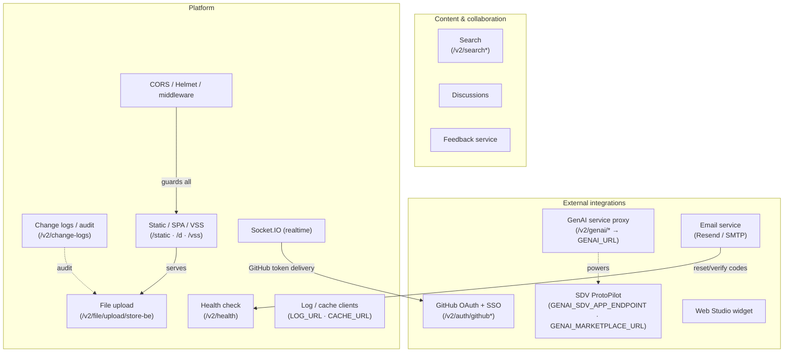
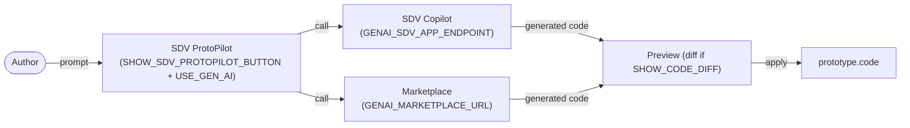
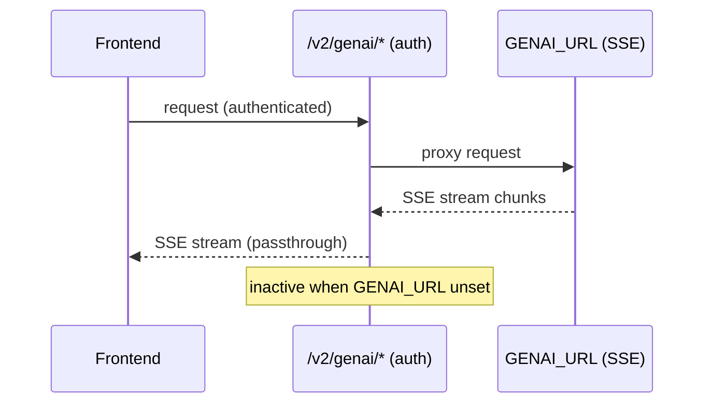
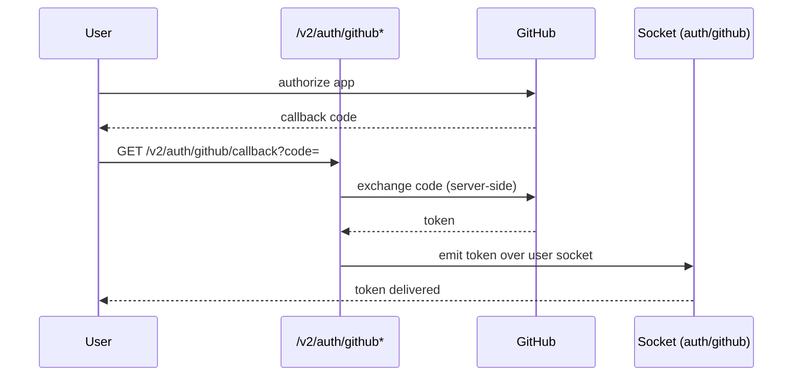
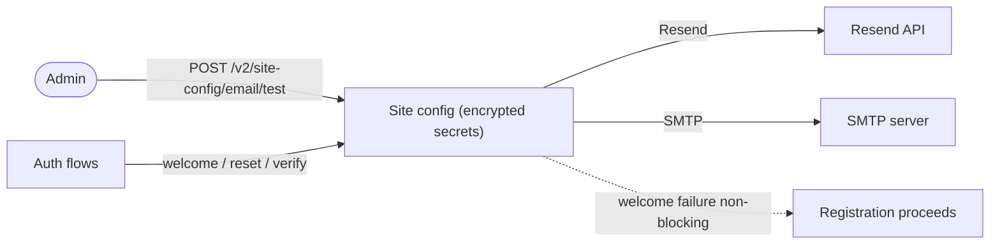
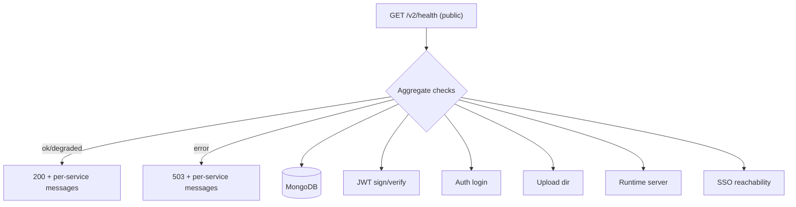
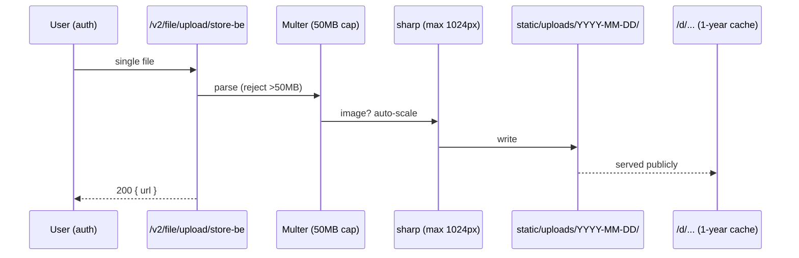
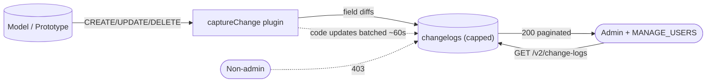
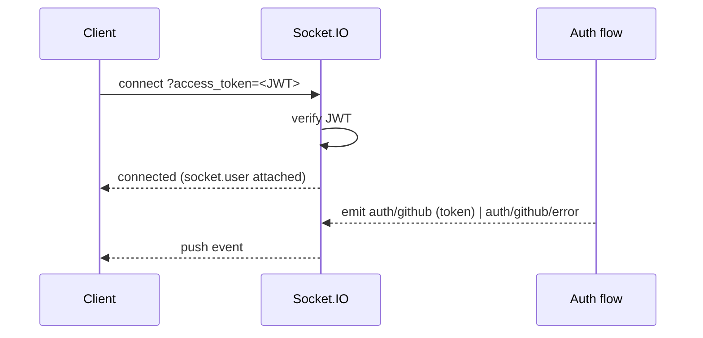
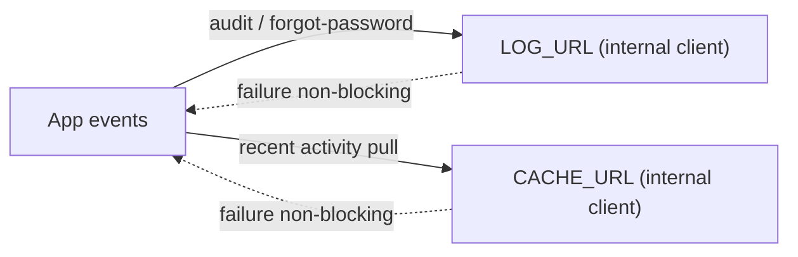

# Cluster: Integrations & Platform

External integrations (GenAI, GitHub, email, Web Studio), search/content, and platform/system capabilities (health, upload, audit, static serving, security middleware, realtime, log/cache).



---

## Capabilities in this cluster

| ID | Capability |
|----|------------|
| [CAP-INTEG-01](#cap-integ-01--sdv-protopilot-genai-code-generation) | SDV ProtoPilot (GenAI code generation) |
| [CAP-INTEG-02](#cap-integ-02--genai-service-proxy) | GenAI service proxy |
| [CAP-INTEG-03](#cap-integ-03--github-oauth-linking--sso) | GitHub OAuth (linking + SSO) |
| [CAP-INTEG-04](#cap-integ-04--email-service) | Email service |
| [CAP-INTEG-05](#cap-integ-05--web-studio-widget-creation) | Web Studio widget creation |
| [CAP-INTEG-06](#cap-integ-06--search) | Search |
| [CAP-INTEG-07](#cap-integ-07--discussions) | Discussions |
| [CAP-INTEG-08](#cap-integ-08--feedback-service) | Feedback service |
| [CAP-INTEG-09](#cap-integ-09--health-check) | Health check |
| [CAP-INTEG-10](#cap-integ-10--file-upload) | File upload |
| [CAP-INTEG-11](#cap-integ-11--change-logs--audit) | Change logs / audit |
| [CAP-INTEG-12](#cap-integ-12--static-serving-spa-vss-static) | Static serving, SPA, VSS static |
| [CAP-INTEG-13](#cap-integ-13--cors--helmet-csp--security-middleware) | CORS / Helmet CSP / security middleware |
| [CAP-INTEG-14](#cap-integ-14--socketio-realtime) | Socket.IO (realtime) |
| [CAP-INTEG-15](#cap-integ-15--log--cache-service-clients) | Log / cache service clients |


## CAP-INTEG-01 — SDV ProtoPilot (GenAI code generation)

### Description

Generate an SDV Python app from a prompt; built-in "SDV Copilot" (`GENAI_SDV_APP_ENDPOINT`) + marketplace generators (`GENAI_MARKETPLACE_URL`); preview then apply to the prototype.

### Who uses it / value

Prototype authors (bootstrap code); GenAI-capable users.

### Acceptance criteria

- Button shown when `SHOW_SDV_PROTOPILOT_BUTTON=true` and the user has `USE_GEN_AI`; generates code → preview → apply writes to `prototype.code`.
- Code diff shown when `SHOW_CODE_DIFF=true`.

### Quality control

With the flag + permission, open ProtoPilot on Code tab → prompt → generated code preview → apply → code updated.



### Security

Gated by `USE_GEN_AI` permission + `SHOW_SDV_PROTOPILOT_BUTTON`. Backend proxy requires auth.

**Risks:**
- **Permission gate bypass:** if `USE_GEN_AI` were not enforced server-side, any user could consume GenAI compute (cost abuse) and inject generated code into prototypes they don't own.
- **Untrusted generated code:** generated code is applied directly to `prototype.code`; a malicious or compromised generator could plant backdoors/exploits that later run in the prototype runtime.

### Data protection

Prompt + generated code transit the GenAI service; generated code stored in the prototype.

**Risks:**
- **Prompt leakage of private data:** prompts may include model/prototype context, sent to an external GenAI endpoint; sensitive vehicle data could leave the platform and be logged by the provider.
- **Persistent generated artifacts:** generated code persisted in `prototype.code` may embed provider-influenced content with no redaction trail.

## CAP-INTEG-02 — GenAI service proxy

### Description

Reverse-proxies `/v2/genai/*` to the GenAI microservice (`GENAI_URL`) with SSE streaming.

### Who uses it / value

The frontend (GenAI calls); integrators (GenAI backend).

### Acceptance criteria

- `ALL /v2/genai/*` proxied to `GENAI_URL` (SSE streamed); auth required; inactive if `GENAI_URL` unset.

### Quality control

With `GENAI_URL` set, ProtoPilot calls succeed; without it, the route is inactive.



### Security

Auth required; SSE streaming passthrough.

**Risks:**
- **SSRF via proxy path:** if the path/host were not validated, an attacker could steer `/v2/genai/*` requests at internal endpoints through a controllable `GENAI_URL`.
- **Auth bypass on proxy:** a missing auth check would expose the GenAI backend (and its compute cost) to anonymous callers.

### Data protection

Proxies prompts/responses; no backend storage.

**Risks:**
- **Prompt/response interception:** prompts and responses stream through the proxy unmodified; a misconfigured or compromised GenAI backend could log or leak user prompt content.

## CAP-INTEG-03 — GitHub OAuth (linking + SSO)

### Description

Connect a GitHub account (socket-based callback emits the token) for project-editor git sync; GitHub SSO for login.

### Who uses it / value

Authors (git sync intent); end users (GitHub login).

### Acceptance criteria

- `GET /v2/auth/github/callback` → exchanges code, emits token over the user's socket; `GET /v2/auth/github-sso/{start,callback}` → SSO login.
- Requires `GITHUB_CLIENT_ID/SECRET` (env or per-provider config).

### Quality control

Connect GitHub → account linked; deeper git-sync UI is partial.



### Security

OAuth code exchange server-side; token delivered via authenticated socket.

**Risks:**
- **Token delivery to wrong socket:** the token is emitted over the user's socket; a mismatched socket-to-session binding could deliver a GitHub token to the wrong user, granting account linking to an attacker.
- **Client secret exposure:** a leaked `GITHUB_CLIENT_SECRET` would let an attacker impersonate the app and intercept OAuth codes via a rogue redirect.

### Data protection

GitHub tokens stored in `githubAuthStore` (persisted); treat as credentials.

**Risks:**
- **Credential-at-rest exposure:** GitHub tokens persisted in `githubAuthStore` are long-lived credentials; a store leak grants repository access under the user's identity.
- **Token-in-query logging:** OAuth callback codes flow as query params and may be logged by proxies/CDNs before server-side exchange.

## CAP-INTEG-04 — Email service

### Description

Transactional email (welcome, reset code, verification, test) via Resend or SMTP (site-configured, encrypted secrets), with legacy env fallback; welcome email non-blocking.

### Who uses it / value

End users (account flows); admins (test config).

### Acceptance criteria

- `POST /v2/site-config/email/test` (admin) sends a test email; auth flows send welcome/reset/verify emails; failure of welcome doesn't block registration.

### Quality control

Configure Resend/SMTP → test send succeeds; trigger forgot-password → reset code emailed.



### Security

Secrets encrypted at rest; admin-only config.

**Risks:**
- **Secret decryption failure:** encrypted Resend/SMTP secrets decrypted at send time; a key rotation mishap could brick all transactional email (reset/verify) silently.
- **Admin config abuse:** a compromised admin could repoint SMTP/Resend to an attacker-controlled server and capture every reset code/verification email.

### Data protection

Recipient email + content sent to the provider; reset codes are one-time.

**Risks:**
- **Reset code interception:** reset codes sent in cleartext email; a misconfigured provider or compromised mailbox lets an attacker complete password resets.
- **Provider-side retention:** recipient emails and content are processed by the external provider and may be retained per that provider's policy.

## CAP-INTEG-05 — Web Studio widget creation

### Description

Create/embed a widget via the external bewebstudio service.

### Who uses it / value

Widget authors.

### Acceptance criteria

- `webStudio.service` creates/opens a widget; the create-from-scratch button is commented out in the current UI but the service exists.

### Quality control

Service callable; UI entry currently disabled.

### Security

External service; same caveats as remote widgets.

**Risks:**
- **Unvetted remote widget:** widgets created via the external bewebstudio service execute remotely and load into the platform; a compromised service could inject hostile scripts into authorized sessions.

### Data protection

Widget URL only.

**Risks:**
- **URL-parameter leakage:** widget URLs may carry identifiers that reveal which widgets a user authored/accessed, observable to the external service.

## CAP-INTEG-06 — Search

### Description

Regex search across accessible models & prototypes by name/description; user-by-email; prototypes-by-signal; plus a Global search UI in the nav bar.

### Who uses it / value

End users (discover); sharing flows (find users).

### Acceptance criteria

- `GET /v2/search?q=&sortBy=&limit=&page=` (optional auth via `PUBLIC_VIEWING`) → `200` models + prototypes accessible to the caller.
- `GET /v2/search/email/:email` → `200` user or `404`; `GET /v2/search/prototypes/by-signal/:signal` → matching prototypes.
- Global search UI (`DaGlobalSearch`) with type filters.

### Quality control

Search a term → accessible results only; search an inaccessible model → not returned; by-signal → prototypes whose code contains the signal.


### Security

Optional auth via `PUBLIC_VIEWING`; scoped to accessible resources (no leakage).

**Risks:**
- **Access-scope bypass:** if scoping weren't enforced server-side, a `q` regex could enumerate private models/prototypes by name/description across tenants.
- **User enumeration by email:** `/v2/search/email/:email` returns `200`/`404`, enabling account-existence enumeration for phishing targeting known users.

### Data protection

`q` regex over name/description; by-signal scans prototype `code` in memory.

**Risks:**
- **Code-content disclosure via by-signal:** `/v2/search/prototypes/by-signal/:signal` scans prototype `code`; a crafted signal pattern could excerpt proprietary code fragments to a caller who lacks direct access to the prototype.

## CAP-INTEG-07 — Discussions

### Description

Threaded comments on any resource (`ref`+`ref_type`) with optional `parent` for replies; top-level-only list.

### Who uses it / value

Collaborators/reviewers (comment on resources).

### Acceptance criteria

- `GET /v2/discussions?ref=<id>` (optional auth) → `200` top-level threads; `POST` (auth) → `201`; `PATCH/DELETE /:id` → `200`/`204`. `ref` query required for list.

### Quality control

Create a discussion on a resource → appears in list; reply via `parent`; list returns top-level only.

### Security

List optional; write auth. **Partial** — no dedicated routed page; wired contextually.

**Risks:**
- **Cross-resource spam:** `ref`+`ref_type` accept any value; without an access check on the referenced resource, a user could attach hostile comments to private resources they can't read, polluting them.
- **Unauthorized edit/delete:** if ownership weren't enforced on `PATCH/DELETE`, any authenticated user could alter or remove others' comments.

### Data protection

`ref`/`ref_type`/`content`/`created_by` stored.

**Risks:**
- **Comment content retention:** `content` is free text and persists until deleted; users may inadvertently embed secrets or PII in comments that are hard to purge.

## CAP-INTEG-08 — Feedback service

### Description

Structured feedback with scores (1–5) + interview metadata (see [prototypes-code.md](./prototypes-code.md) for the UI).

### Who uses it / value

Reviewers; prototype owners.

### Acceptance criteria

- `GET/POST /v2/feedbacks` (list optional, write auth); `PATCH/DELETE /:id` → `200`/`204` (own).

### Quality control

Add feedback → persisted; delete own → `204`; delete others' → `403`.

### Security

Add auth; delete own only.

**Risks:**
- **Ownership bypass on delete:** if the own-only check failed, a user could delete others' feedback, destroying review records.
- **Feedback spam:** write auth alone (no rate limit) could let a user flood a prototype with feedback entries.

### Data protection

Scores + interviewee metadata stored.

**Risks:**
- **Interviewee PII retention:** interview metadata may contain personal identifiers of interviewees; stored without a defined retention/pruning policy.

## CAP-INTEG-09 — Health check

### Description

Consolidated status of MongoDB, JWT sign/verify, auth login, upload dir, runtime server, SSO reachability.

### Who uses it / value

DevOps/monitoring.

### Acceptance criteria

- `GET /v2/health` (public) → `200` for `ok`/`degraded`, `503` for `error`, with per-service messages; page `/health` shows badges.

### Quality control

Hit `/v2/health` → status + per-service messages; stop Mongo → degraded.



### Security

Public.

**Risks:**
- **Information disclosure:** `503`/`200` responses include per-service messages; a public endpoint leaking which service is down (e.g. Mongo unreachable) aids attackers in timing attacks and targeting the weak link.
- **Unauthenticated probing:** SSO reachability checks from a public endpoint can be abused to enumerate/confirm external identity-provider endpoints.

### Data protection

Status info only (no secrets).

**Risks:**
- **Service fingerprinting:** per-service status messages may disclose internal hostnames, error text, or dependency versions, giving an attacker a footprint map of internal infrastructure.

## CAP-INTEG-10 — File upload

### Description

Multer single-file upload to `static/uploads/YYYY-MM-DD/`; auto-scales images (sharp, max 1024 px); served at `/d/...` (1-year cache). 50 MB file / 10 MB field limits.

### Who uses it / value

End users (avatars, model/prototype images); the app (asset hosting).

### Acceptance criteria

- `POST /v2/file/upload/store-be` (auth) → `200 { url }`; images auto-scaled; served at `/d/...` with long cache.

### Quality control

Upload an image → returned URL serves a scaled image; upload >50 MB → rejected.



### Security

Auth required; any file type allowed (50 MB cap) — validate on use.

**Risks:**
- **Malicious file storage:** any file type is accepted (50 MB cap); an attacker can upload HTML/SVG/executable payloads served from `/d/...`, enabling stored XSS via SVG/HTML or malware hosting.
- **Storage exhaustion:** with auth but no per-user quota, a user could fill disk with 50 MB uploads, degrading the platform.

### Data protection

Files served publicly under `/d/`; retention = files persist until deleted (no auto-prune).

**Risks:**
- **Permanent public exposure:** uploads under `/d/` are public and unauthenticated; a private image uploaded for a draft is world-readable by URL, and persists indefinitely with no auto-prune.
- **Metadata in uploads:** image EXIF or document metadata is not stripped before public serving, potentially leaking author/device/location data.

## CAP-INTEG-11 — Change logs / audit

### Description

`captureChange` Mongoose plugin on Model & Prototype records CREATE/UPDATE/DELETE with field diffs (throttled/batched for frequent updates like `code`); admin paginated list.

### Who uses it / value

Admins/auditors (trace changes).

### Acceptance criteria

- `GET /v2/change-logs` (auth + `MANAGE_USERS`) → `200` paginated audit entries (`action`, `changes`, `ref`).
- Frequent `code` updates batched into throttled entries (~60 s).

### Quality control

Update a model → a `changelogs` entry appears; admin can list/filter; non-admin → `403`.



### Security

`MANAGE_USERS` (read optional via `PUBLIC_VIEWING` but `checkPermission(ADMIN)` enforced).

**Risks:**
- **Admin-only bypass via PUBLIC_VIEWING ambiguity:** the "optional auth via `PUBLIC_VIEWING`" wording could be misimplemented to expose audit diffs publicly if the `checkPermission(ADMIN)` gate were ever dropped, leaking full change history.
- **Audit tampering:** the plugin writes to a capped collection; a compromised admin with write access could rotate/clear entries to cover tracks.

### Data protection

`changelogs` is a **capped** collection (bounded size); stores field diffs (may include code/content).

**Risks:**
- **Sensitive code in diffs:** field diffs may include `code` content; storing proprietary prototype code in a (capped, overwritten) collection means old audit entries silently age out, losing the audit trail for long-lived disputes.
- **Capped-collection data loss:** because the collection is capped, high-frequency change volume evicts the oldest audit entries — evidence of early incidents can be permanently lost without warning.

## CAP-INTEG-12 — Static serving, SPA, VSS static

### Description

Serves `/static`, `/images`, `/plugin`, `/builtin-widgets`, `/d`; production serves the built SPA with index.html fallback; dev proxies to Vite `:3210`; VSS JSONs at `/vss/:version/:filename` (1-hour cache).

### Who uses it / value

All users (the app + assets); integrators (VSS data).

### Acceptance criteria

- Static assets served with correct MIME; SPA fallback serves `index.html` for unknown routes (production); `/vss/:version/:filename` returns JSON.

### Quality control

Hit the app root → SPA loads; an asset URL → served; `/vss/4.0/vss.json` → JSON.

```mermaid
flowchart TD
    R[Request] --> S{Path?}
    S -->|/static /images /plugin /builtin-widgets /d| A["Static asset (correct MIME)"]
    S -->|/vss/:version/:filename| V["VSS JSON (1-hour cache)"]
    S -->|unknown route (prod)| SPA["index.html fallback"]
    S -->|unknown route (dev)| VP["Vite proxy :3210"]
```

### Security

Public; Helmet CSP applies (wildcard in both envs — known permissive).

**Risks:**
- **Permissive CSP:** wildcard-open CSP in both dev and prod allows broad script sources; combined with `/plugin` and `/builtin-widgets` static serving, it widens the XSS/plugin-injection attack surface.
- **Path traversal in static serving:** a misconfigured static root or lax path handling could let `/static`/`/d` resolve to files outside the asset directory.

### Data protection

Static assets only.

**Risks:**
- **Public asset enumeration:** `/static`, `/d`, and `/vss/:version/:filename` are publicly listable/guessable; an attacker can enumerate uploaded assets and VSS files by date/version without authentication.

## CAP-INTEG-13 — CORS / Helmet CSP / security middleware

### Description

Regex CORS allowlist (`CORS_ORIGINS`), cookie-parser, mongo-sanitize, gzip, Helmet CSP (wildcard-open in both dev and prod — only `objectSrc` is `'none'`), `trust proxy`.

### Who uses it / value

DevOps (deploy securely); the app (browser loading).

### Acceptance criteria

- CORS allows configured origins (http/https auto-prefixed); CSP headers set; sanitize inputs; `trust proxy` enabled.

### Quality control

Check response headers → CORS + CSP present; cross-origin script loads with `crossOrigin=anonymous`.

```mermaid
flowchart LR
    R[Incoming request] --> CP[cookie-parser]
    CP --> MS[mongo-sanitize strips $/.]
    MS --> GZ[gzip]
    GZ --> H[Helmet CSP wildcard-open]
    H --> TP[trust proxy]
    TP --> A[App]
    A -->|response| CO[CORS allowlist (CORS_ORIGINS)]
```

### Security

⚠️ CSP is wildcard-open (not restrictive) — a known gap. `authLimiter` defined but unused. CORS is the real origin gate.

**Risks:**
- **Permissive CSP allows injection:** wildcard-open CSP (only `objectSrc` restricted) lets injected or compromised scripts execute freely, weakening the only header-based XSS mitigation.
- **Unused rate limiter:** `authLimiter` defined but not applied; auth endpoints have no rate limiting, enabling credential-stuffing brute force.
- **CORS origin regex bypass:** a regex CORS allowlist can be subverted (e.g. attacker origin matching a substring), allowing cross-origin credentialed requests from rogue sites.

### Data protection

mongo-sanitize strips `$`/`.` keys from inputs; cookies httpOnly.

**Risks:**
- **NoSQL injection despite sanitize:** mongo-sanitize targets keys; operator injection via values or array payloads may still bypass it, risking data exfiltration or modification.
- **Cookie leakage on non-TLS:** httpOnly cookies without `secure` enforcement over non-TLS connections can be sniffed; `trust proxy` must be correctly configured or the trust can be spoofed.

## CAP-INTEG-14 — Socket.IO (realtime)

### Description

JWT-authenticated Socket.IO (token via `access_token` query); pushes auth events (GitHub OAuth token/errors).

### Who uses it / value

Auth flows (GitHub token delivery); future realtime features.

### Acceptance criteria

- Handshake verifies JWT, attaches `socket.user`; `auth/github`/`auth/github/error` events emitted.

### Quality control

Connect with a valid access token → connected; invalid → rejected.



### Security

JWT verified on handshake.

**Risks:**
- **Token-in-query logging:** the JWT travels as a `access_token` query param; query strings are commonly logged by proxies, CDNs, and access logs, exposing valid tokens.
- **Event spoofing to wrong socket:** GitHub OAuth tokens are pushed over `auth/github`; a session-binding flaw could emit a token to a socket that isn't the originating user.

### Data protection

Token in query string (use TLS in prod); event payloads may include GitHub tokens.

**Risks:**
- **Credential leakage via logs:** tokens in the query string persist in proxy/load-balancer logs; without TLS termination controls and log redaction, credentials are recoverable from logs.
- **Payload retention on client:** event payloads carrying GitHub tokens are held in client memory/logic; a misrouted event could surface another user's token to the wrong client.

## CAP-INTEG-15 — Log / cache service clients

### Description

Forward audit/forgot-password events to `LOG_URL`; pull recent-prototype activity from `CACHE_URL`.

### Who uses it / value

DevOps (centralized logs/activity).

### Acceptance criteria

- Internal clients; active when `LOG_URL`/`CACHE_URL` configured; failures non-blocking for the main flows.

### Quality control

Configure the URLs → events forwarded / recent activity served.



### Security

Internal clients; configure with appropriate auth on the target services.

**Risks:**
- **Unauthenticated outbound forwarding:** `LOG_URL`/`CACHE_URL` are internal clients; if the target services aren't auth-protected, anyone who can reach them can read forwarded audit events or poison the activity cache.
- **SSRF via misconfigured URL:** an attacker able to influence `LOG_URL`/`CACHE_URL` could redirect audit events (including password-reset metadata) to an attacker endpoint.

### Data protection

Forwards event metadata (incl. email for forgot-password); respect target service retention.

**Risks:**
- **Email leakage to logs:** forgot-password events include the user's email and are forwarded to `LOG_URL`; a permissive logging target retains user emails indefinitely.
- **Divergent retention:** retention is delegated to the target services; with no platform control, user data may be retained far longer than the source system's policy allows.