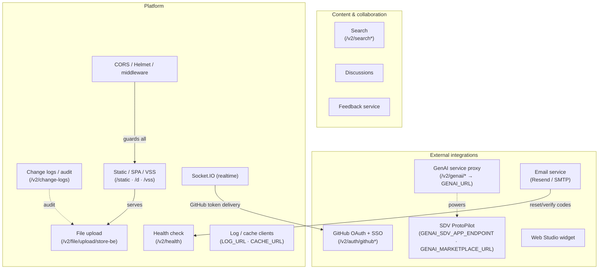
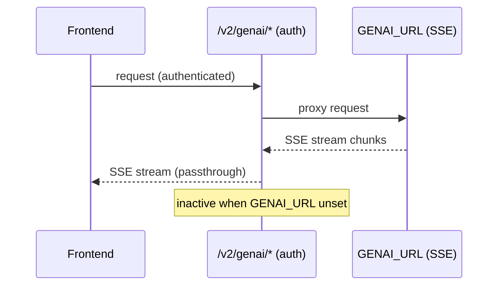
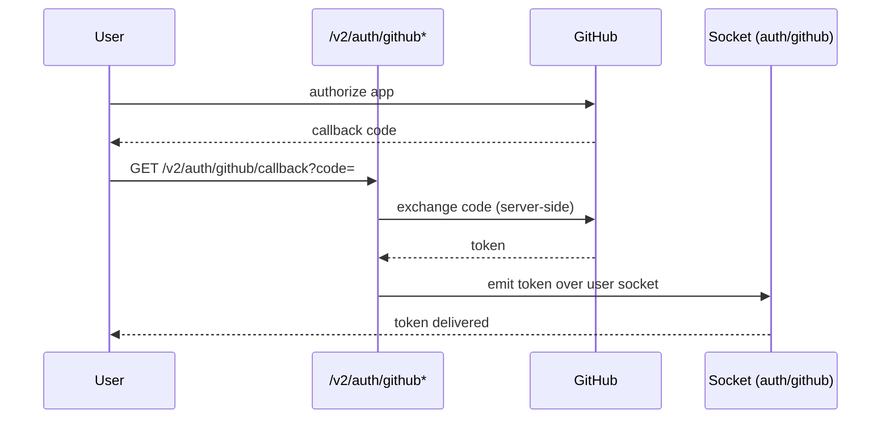
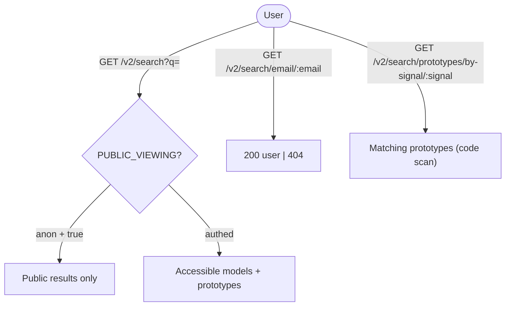
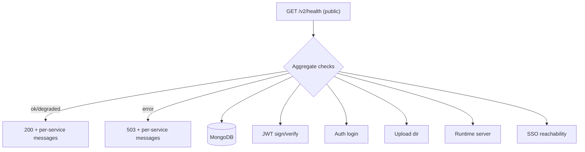
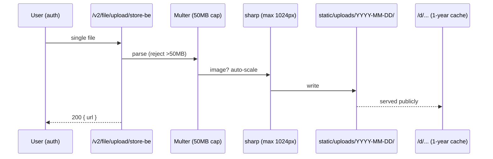
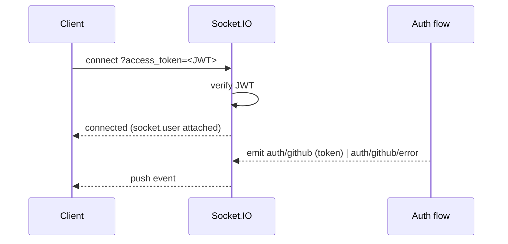
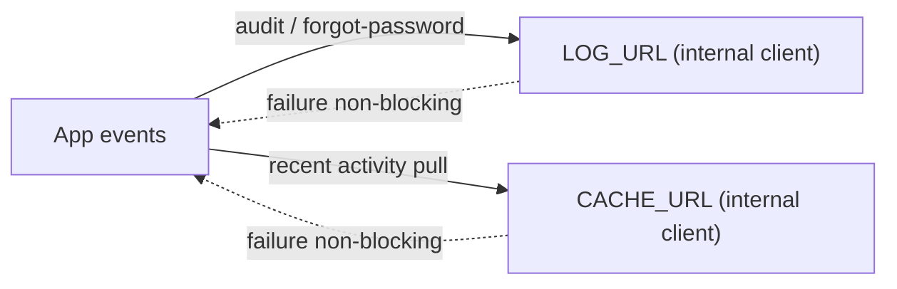

# Cluster: Integrations & Platform

As a user, admin, or operator of AutoWRX, I can connect external services (GenAI code generation, GitHub login/sync, email, Web Studio widgets), discover content through search and discussions, send feedback, and rely on platform-wide health, file upload, audit, static/SPA/VSS serving, security headers, realtime updates, and log/cache forwarding.

**Implementation:** `backend/src/routes/v2/system/` (genai, github, email, search, discussion, feedback, health, file, changeLog, static/vss routes), `backend/src/config/socket.js`, `backend/src/config/axios.js` (LOG_URL/CACHE_URL clients), `backend/src/app.js` (CORS/Helmet/static), `frontend/src/stores/githubAuthStore.ts`, `frontend/src/services/webStudio.service.ts`.



---

## Capabilities in this cluster

| ID | Capability |
|----|------------|
| [CAP-INTEG-01](#cap-integ-01--sdv-protopilot-genai-code-generation) | SDV ProtoPilot (GenAI code generation) |
| [CAP-INTEG-02](#cap-integ-02--genai-service-proxy) | GenAI service proxy |
| [CAP-INTEG-03](#cap-integ-03--github-oauth-linking--sso) | GitHub OAuth (linking + SSO) |
| [CAP-INTEG-04](#cap-integ-04--email-service) | Email service |
| [CAP-INTEG-05](#cap-integ-05--web-studio-widget-creation) | Web Studio widget creation |
| [CAP-INTEG-06](#cap-integ-06--search) | Search |
| [CAP-INTEG-07](#cap-integ-07--discussions) | Discussions |
| [CAP-INTEG-08](#cap-integ-08--feedback-service) | Feedback service |
| [CAP-INTEG-09](#cap-integ-09--health-check) | Health check |
| [CAP-INTEG-10](#cap-integ-10--file-upload) | File upload |
| [CAP-INTEG-11](#cap-integ-11--change-logs--audit) | Change logs / audit |
| [CAP-INTEG-12](#cap-integ-12--static-serving-spa-vss-static) | Static serving, SPA, VSS static |
| [CAP-INTEG-13](#cap-integ-13--cors--helmet-csp--security-middleware) | CORS / Helmet CSP / security middleware |
| [CAP-INTEG-14](#cap-integ-14--socketio-realtime) | Socket.IO (realtime) |
| [CAP-INTEG-15](#cap-integ-15--log--cache-service-clients) | Log / cache service clients |


## CAP-INTEG-01 — SDV ProtoPilot (GenAI code generation)

### Description

As a prototype author with GenAI access, I can generate an SDV Python app from a prompt, preview it, and apply it to my prototype so I can bootstrap code quickly.

### Who uses it / value

Prototype authors (bootstrap code); GenAI-capable users.

### Acceptance criteria

- When I open the Code tab with `SHOW_SDV_PROTOPILOT_BUTTON=true` and the `USE_GEN_AI` permission, the system shows the SDV ProtoPilot button; when I submit a prompt, the system generates code, shows a preview, and on apply writes it to `prototype.code`.
- When `SHOW_CODE_DIFF=true`, the system shows a code diff in the preview.

### Quality control

With `SHOW_SDV_PROTOPILOT_BUTTON=true` and `USE_GEN_AI`, I open ProtoPilot on the Code tab, enter a prompt, preview the generated code, and apply it — my prototype's code is updated.


### Security

Gated by `USE_GEN_AI` permission + `SHOW_SDV_PROTOPILOT_BUTTON`. Backend proxy requires auth.

**Coverage:**
- **Auth:** Required — the `/v2/genai/*` proxy requires a JWT; the ProtoPilot UI is additionally gated by `USE_GEN_AI` permission + `SHOW_SDV_PROTOPILOT_BUTTON` flag.
- **Authorization:** Only callers with `USE_GEN_AI` (`generativeAI`) can open the ProtoPilot UI; the `/v2/genai/*` proxy enforces JWT only — no server-side `USE_GEN_AI` check (risk noted).
- **Input validation:** Not validated — prompts are forwarded to the GenAI endpoint without validation; generated code is applied to `prototype.code` without schema validation.
- **Rate limiting:** Not applied (`authLimiter` defined but unused).
- **Secrets:** `GENAI_SDV_APP_ENDPOINT`/`GENAI_MARKETPLACE_URL` are env-driven; the caller handles no secrets here.

**Risks:**
- **Permission gate bypass:** if `USE_GEN_AI` were not enforced server-side, any user could consume GenAI compute (cost abuse) and inject generated code into prototypes they don't own.
- **Untrusted generated code:** generated code is applied directly to `prototype.code`; a malicious or compromised generator could plant backdoors/exploits that later run in the prototype runtime.

### Data protection

Prompt + generated code transit the GenAI service; generated code stored in the prototype.

**Coverage:**
- **Stored data:** Generated code persisted into `prototype.code` (Prototype document in MongoDB); prompts are not stored backend-side.
- **PII:** Potentially — prompts may carry user/prototype context that includes PII; generated code may embed provider-influenced content.
- **Retention:** Indefinite — lives in `prototype.code` until the prototype is deleted; no redaction trail.
- **Encryption:** In transit (TLS to the GenAI endpoint); at rest via the MongoDB platform default; no app-level encryption.
- **Logging:** The SSE stream is passthrough (the proxy does not log content); the GenAI provider may log prompts per its own policy.

**Risks:**
- **Prompt leakage of private data:** prompts may include model/prototype context, sent to an external GenAI endpoint; sensitive vehicle data could leave the platform and be logged by the provider.
- **Persistent generated artifacts:** generated code persisted in `prototype.code` may embed provider-influenced content with no redaction trail.

### Test coverage
- **E2E (Playwright):** 0 — not covered in `global-search.spec.ts`/`home-sections.spec.ts`/`home-prototypes.spec.ts`/`layout.spec.ts`/`nav-bar-actions.spec.ts` — SITEMAP: ❌
- **Unit (Jest):** none

## CAP-INTEG-02 — GenAI service proxy

### Description

As an API caller, I can send authenticated requests to `/v2/genai/*` and receive SSE-streamed responses from the configured GenAI service so that my frontend can stream generated content.

### Who uses it / value

The frontend (GenAI calls); integrators (GenAI backend).

### Acceptance criteria

- When I send an authenticated request to `ALL /v2/genai/*`, the system proxies it to `GENAI_URL` and streams the SSE response back to me.
- When `GENAI_URL` is unset, the route is inactive.

### Quality control

With `GENAI_URL` set, my ProtoPilot calls succeed; without it, the route is inactive.



### Security

Auth required; SSE streaming passthrough.

**Coverage:**
- **Auth:** Required — all `/v2/genai/*` requests require a JWT; the route returns `500 "not implemented"` when `GENAI_URL` is unset.
- **Authorization:** None beyond auth — any authenticated user can call `/v2/genai/*`; no permission check.
- **Input validation:** Not validated — the path and body are forwarded as-is.
- **Rate limiting:** Not applied.
- **Secrets:** `GENAI_URL` is env-driven (SSRF watch if attacker-controllable); the proxy handles no secrets.

**Risks:**
- **SSRF via proxy path:** if the path/host were not validated, an attacker could steer `/v2/genai/*` requests at internal endpoints through a controllable `GENAI_URL`.
- **Auth bypass on proxy:** a missing auth check would expose the GenAI backend (and its compute cost) to anonymous callers.

### Data protection

Proxies prompts/responses; no backend storage.

**Coverage:**
- **Stored data:** None — proxy only, no backend persistence.
- **PII:** Depends on caller — prompts/responses may carry user content (PII risk via prompt content).
- **Retention:** N/A on backend (nothing stored); provider-side retention per the GenAI service policy.
- **Encryption:** In transit (TLS to `GENAI_URL`); no at-rest (nothing stored).
- **Logging:** The proxy does not log stream content; SSE chunks are passed through unmodified.

**Risks:**
- **Prompt/response interception:** prompts and responses stream through the proxy unmodified; a misconfigured or compromised GenAI backend could log or leak user prompt content.

### Test coverage
- **E2E (Playwright):** 0 — not covered — SITEMAP: ❌
- **Unit (Jest):** none

## CAP-INTEG-03 — GitHub OAuth (linking + SSO)

### Description

As a user, I can link my GitHub account to AutoWRX for git sync in the project editor, and sign in via GitHub SSO, so I can reuse my GitHub identity without a separate password.

### Who uses it / value

Authors (git sync intent); end users (GitHub login).

### Acceptance criteria

- When I complete GitHub authorization, the system exchanges the code via `GET /v2/auth/github/callback` and delivers the token to my authenticated socket.
- When I start SSO via `GET /v2/auth/github-sso/{start,callback}`, the system logs me in via GitHub.
- Requires `GITHUB_CLIENT_ID/SECRET` (env or per-provider config).

### Quality control

I connect GitHub and my account is linked; the deeper git-sync UI is partial.



### Security

OAuth code exchange server-side; token delivered via authenticated socket.

**Coverage:**
- **Auth:** OAuth code exchange happens server-side (`POST github.com/login/oauth/access_token`); SSO start/callback exchange tokens server-side; the token is delivered over my authenticated socket.
- **Authorization:** Account linking is bound to my logged-in `userId`; SSO creates/links the account; no extra RBAC.
- **Input validation:** The `code` query param is forwarded to GitHub without validation; the SSO body is validated.
- **Rate limiting:** Not applied (`authLimiter` defined but unused on `/v2/auth/github*`).
- **Secrets:** `GITHUB_CLIENT_ID`/`GITHUB_CLIENT_SECRET` are env-driven, used server-side only in the token exchange.

**Risks:**
- **Token delivery to wrong socket:** the token is emitted over the user's socket; a mismatched socket-to-session binding could deliver a GitHub token to the wrong user, granting account linking to an attacker.
- **Client secret exposure:** a leaked `GITHUB_CLIENT_SECRET` would let an attacker impersonate the app and intercept OAuth codes via a rogue redirect.

### Data protection

GitHub tokens stored in `githubAuthStore` (persisted); treat as credentials.

**Coverage:**
- **Stored data:** GitHub access token stored client-side in `githubAuthStore` (Zustand `persist` → browser localStorage); not stored backend-side.
- **PII:** Yes — GitHub account identity (login/email scope) via OAuth; `userId` binds the session.
- **Retention:** Token retained in browser localStorage indefinitely until `clear()` is called; no server-side retention.
- **Encryption:** TLS in transit to GitHub; the token at rest in browser localStorage is NOT encrypted (credential exposure).
- **Logging:** The OAuth callback `code` flows as a query param (may be logged by proxies/CDNs); errors logged via `logger.error`.

**Risks:**
- **Credential-at-rest exposure:** GitHub tokens persisted in `githubAuthStore` are long-lived credentials; a store leak grants repository access under the user's identity.
- **Token-in-query logging:** OAuth callback codes flow as query params and may be logged by proxies/CDNs before server-side exchange.

### Test coverage
- **E2E (Playwright):** 0 — not covered — SITEMAP: ❌
- **Unit (Jest):** none

## CAP-INTEG-04 — Email service

### Description

As a user, I receive transactional emails (welcome, password reset code, verification) so I can complete account flows; as an admin, I can send a test email to verify the configured Resend/SMTP provider.

### Who uses it / value

End users (account flows); admins (test config).

### Acceptance criteria

- When an admin calls `POST /v2/site-config/email/test`, the system sends a test email via the configured provider.
- When I register, request a password reset, or verify my account, the system emails the welcome/reset/verify message.
- When the welcome email fails, the system still completes registration (non-blocking).

### Quality control

As an admin I configure Resend/SMTP and the test send succeeds; as a user I trigger forgot-password and the reset code is emailed.


### Security

Secrets encrypted at rest; admin-only config.

**Coverage:**
- **Auth:** Auth-flow emails (welcome/reset/verify) are triggered internally by authenticated flows; `POST /v2/site-config/email/test` is admin-only (requires auth + `ADMIN` permission).
- **Authorization:** `ADMIN` (`manageUsers`) is required for the test-email endpoint; auth-flow triggers run server-side only.
- **Input validation:** Trigger endpoints are validated (`forgotPassword`/`register`/`resetPassword`); the recipient `to` in `sendEmail` is not validated.
- **Rate limiting:** Not applied (`authLimiter` defined but unused on forgot-password/reset).
- **Secrets:** Resend `apiKey` / SMTP `pass` are encrypted at rest in `SiteConfig`, decrypted at send time.

**Risks:**
- **Secret decryption failure:** encrypted Resend/SMTP secrets decrypted at send time; a key rotation mishap could brick all transactional email (reset/verify) silently.
- **Admin config abuse:** a compromised admin could repoint SMTP/Resend to an attacker-controlled server and capture every reset code/verification email.

### Data protection

Recipient email + content sent to the provider; reset codes are one-time.

**Coverage:**
- **Stored data:** Email config (provider, from, encrypted apiKey/smtp pass) in `SiteConfig`; reset/verify codes are one-time entries in the `Token` collection.
- **PII:** Yes — recipient email address; the reset code is a sensitive one-time credential.
- **Retention:** Reset/verify codes are one-time with token expiry (TTL); email config persists until admin-changed.
- **Encryption:** Secrets encrypted at rest (decrypted only at send); in transit TLS to Resend/SMTP.
- **Logging:** Welcome-email failures are logged (`error.message`); reset codes are not logged.

**Risks:**
- **Reset code interception:** reset codes sent in cleartext email; a misconfigured provider or compromised mailbox lets an attacker complete password resets.
- **Provider-side retention:** recipient emails and content are processed by the external provider and may be retained per that provider's policy.

### Test coverage
- **E2E (Playwright):** 0 — not covered — SITEMAP: ❌
- **Unit (Jest):** none

## CAP-INTEG-05 — Web Studio widget creation

### Description

As a widget author, I can create and embed a widget through the external bewebstudio service so I can add custom widgets to my dashboards.

### Who uses it / value

Widget authors.

### Acceptance criteria

- When I use the Web Studio entry, the system creates/opens a widget via the external bewebstudio service.
- The create-from-scratch button is currently disabled in the UI; the underlying service remains available.

### Quality control

The service is callable from the frontend; the UI entry is currently disabled.

### Security

External service; same caveats as remote widgets.

**Coverage:**
- **Auth:** Frontend-only — calls go to the external bewebstudio service (`studioBeUrl`); no backend route — the external service handles auth.
- **Authorization:** None on the backend (no backend route); the external service handles access.
- **Input validation:** Not validated on the backend (widget name/uid posted directly to the external service).
- **Rate limiting:** Not applied.
- **Secrets:** `studioBeUrl` config (external endpoint); no secrets on the backend.

**Risks:**
- **Unvetted remote widget:** widgets created via the external bewebstudio service execute remotely and load into the platform; a compromised service could inject hostile scripts into authorized sessions.

### Data protection

Widget URL only.

**Coverage:**
- **Stored data:** Widget created on the external bewebstudio service; widget URL referenced in the dashboard config.
- **PII:** No — widget name/uid only (no PII passed).
- **Retention:** Delegated to the external bewebstudio service (no platform control).
- **Encryption:** In transit (TLS if `studioBeUrl` is https); no at-rest on backend.
- **Logging:** None on backend (frontend-only call).

**Risks:**
- **URL-parameter leakage:** widget URLs may carry identifiers that reveal which widgets a user authored/accessed, observable to the external service.

### Test coverage
- **E2E (Playwright):** 0 — not covered — SITEMAP: ❌
- **Unit (Jest):** none

## CAP-INTEG-06 — Search

### Description

As a user, I can search accessible models and prototypes by name/description, find a user by email, and find prototypes containing a given signal, so I can discover content and collaborators; a Global search UI is available in the nav bar.

### Who uses it / value

End users (discover); sharing flows (find users).

### Acceptance criteria

- When I call `GET /v2/search?q=&sortBy=&limit=&page=` (optional auth via `PUBLIC_VIEWING`), the system returns `200` with models + prototypes accessible to me.
- When I call `GET /v2/search/email/:email`, the system returns `200` (user found) or `404`.
- When I call `GET /v2/search/prototypes/by-signal/:signal`, the system returns matching prototypes.
- A Global search UI with type filters is available in the nav bar.

### Quality control

I search a term and see only accessible results; I search an inaccessible model and it is not returned; by-signal returns prototypes whose code contains the signal.



### Security

Optional auth via `PUBLIC_VIEWING`; scoped to accessible resources (no leakage).

**Coverage:**
- **Auth:** Optional via `PUBLIC_VIEWING` on all three endpoints (`/v2/search`, `/v2/search/email/:email`, `/v2/search/prototypes/by-signal/:signal`); private results require auth + access scoping.
- **Authorization:** Scoped to accessible models/prototypes server-side (access-scope filter); no resource-level permission check on `/email/:email` or `/by-signal/:signal` (enumeration risk).
- **Input validation:** Validated — inputs for `/search`, `/email/:email`, and `/by-signal/:signal` are validated.
- **Rate limiting:** Not applied.
- **Secrets:** None.

**Risks:**
- **Access-scope bypass:** if scoping weren't enforced server-side, a `q` regex could enumerate private models/prototypes by name/description across tenants.
- **User enumeration by email:** `/v2/search/email/:email` returns `200`/`404`, enabling account-existence enumeration for phishing targeting known users.

### Data protection

`q` regex over name/description; by-signal scans prototype `code` in memory.

**Coverage:**
- **Stored data:** None — read-only search over existing models/prototypes/users.
- **PII:** Yes — `/search/email/:email` returns user existence (email PII, enumeration); by-signal scans prototype `code`.
- **Retention:** N/A (no storage); source data retained per its own lifecycle.
- **Encryption:** In transit (TLS); no at-rest (nothing stored).
- **Logging:** Query params not specifically logged beyond standard morgan access logs.

**Risks:**
- **Code-content disclosure via by-signal:** `/v2/search/prototypes/by-signal/:signal` scans prototype `code`; a crafted signal pattern could excerpt proprietary code fragments to a caller who lacks direct access to the prototype.

### Test coverage
- **E2E (Playwright):** 2 test case(s) in `global-search.spec.ts` (1) + `nav-bar-actions.spec.ts` (1 — "search action opens global search dialog") — SITEMAP: ✅
- **Unit (Jest):** none

## CAP-INTEG-07 — Discussions

### Description

As a collaborator, I can post threaded comments on any resource (identified by `ref`+`ref_type`) and reply with an optional `parent`, so I can discuss resources with my team; the list returns top-level threads only.

### Who uses it / value

Collaborators/reviewers (comment on resources).

### Acceptance criteria

- When I call `GET /v2/discussions?ref=<id>` (optional auth), the system returns `200` top-level threads (`ref` query required for list).
- When I call `POST /v2/discussions` (auth), the system creates a thread and returns `201`.
- When I call `PATCH/DELETE /:id` (auth), the system returns `200`/`204`.

### Quality control

I create a discussion on a resource and it appears in the list; I reply via `parent`; the list returns top-level only.

### Security

List optional; write auth. **Partial** — no dedicated routed page; wired contextually.

**Coverage:**
- **Auth:** List optional via `PUBLIC_VIEWING`; create/patch/delete require auth.
- **Authorization:** Ownership enforced on PATCH/DELETE (own only); no access check on the referenced `ref` resource (cross-resource spam risk).
- **Input validation:** Validated — create/list/update/delete inputs are validated.
- **Rate limiting:** Not applied.
- **Secrets:** None.

**Risks:**
- **Cross-resource spam:** `ref`+`ref_type` accept any value; without an access check on the referenced resource, a user could attach hostile comments to private resources they can't read, polluting them.
- **Unauthorized edit/delete:** if ownership weren't enforced on `PATCH/DELETE`, any authenticated user could alter or remove others' comments.

### Data protection

`ref`/`ref_type`/`content`/`created_by` stored.

**Coverage:**
- **Stored data:** `ref`/`ref_type`/`content`/`created_by`/`parent` in the `Discussion` collection (MongoDB).
- **PII:** Potentially — `content` is free text and may include PII or secrets.
- **Retention:** Indefinite until deleted; no auto-prune.
- **Encryption:** At rest via the MongoDB platform default; in transit TLS.
- **Logging:** Standard request logging; comment `content` is not specifically logged.

**Risks:**
- **Comment content retention:** `content` is free text and persists until deleted; users may inadvertently embed secrets or PII in comments that are hard to purge.

### Test coverage
- **E2E (Playwright):** 0 — not covered — SITEMAP: ❌
- **Unit (Jest):** none

## CAP-INTEG-08 — Feedback service

### Description

As a reviewer, I can submit structured feedback with scores (1–5) and interview metadata on a prototype so the owner can act on review insights (UI covered in [prototypes-code.md](./prototypes-code.md)).

### Who uses it / value

Reviewers; prototype owners.

### Acceptance criteria

- When I call `GET /v2/feedbacks` (optional auth), the system returns the list; when I call `POST /v2/feedbacks` (auth), the system creates an entry.
- When I call `PATCH/DELETE /:id` (auth, own), the system returns `200`/`204`.

### Quality control

I add feedback and it is persisted; I delete my own and get `204`; I delete others' and get `403`.

### Security

Add auth; delete own only.

**Coverage:**
- **Auth:** List optional via `PUBLIC_VIEWING`; create/patch/delete require auth.
- **Authorization:** Ownership enforced on PATCH/DELETE (own only).
- **Input validation:** Validated — create/list/update/delete inputs are validated.
- **Rate limiting:** Not applied.
- **Secrets:** None.

**Risks:**
- **Ownership bypass on delete:** if the own-only check failed, a user could delete others' feedback, destroying review records.
- **Feedback spam:** write auth alone (no rate limit) could let a user flood a prototype with feedback entries.

### Data protection

Scores + interviewee metadata stored.

**Coverage:**
- **Stored data:** Scores (1–5), interviewee metadata, `ref`/`ref_type`/`created_by` in the `Feedback` collection.
- **PII:** Yes — interviewee metadata may contain personal identifiers of interviewees.
- **Retention:** Indefinite until deleted; no defined retention/pruning policy.
- **Encryption:** At rest via the MongoDB platform default; in transit TLS.
- **Logging:** Standard request logging.

**Risks:**
- **Interviewee PII retention:** interview metadata may contain personal identifiers of interviewees; stored without a defined retention/pruning policy.

### Test coverage
- **E2E (Playwright):** 0 — not covered (the prototype-extended feedback-tab test belongs to the prototypes cluster, not this feedback-service integration) — SITEMAP: ❌
- **Unit (Jest):** none

## CAP-INTEG-09 — Health check

### Description

As an operator, I can call a single health endpoint to see the consolidated status of MongoDB, JWT, auth login, upload dir, runtime server, and SSO reachability, so I can monitor platform health.

### Who uses it / value

DevOps/monitoring.

### Acceptance criteria

- When I call `GET /v2/health` (public), the system returns `200` with per-service messages for `ok`/`degraded`, or `503` for `error`.
- When I open `/health`, the system shows status badges.

### Quality control

I hit `/v2/health` and see the status plus per-service messages; if I stop Mongo, the status degrades.



### Security

Public.

**Coverage:**
- **Auth:** Public — `GET /v2/health` requires no auth.
- **Authorization:** None (public endpoint).
- **Input validation:** N/A — no request inputs.
- **Rate limiting:** Not applied.
- **Secrets:** None exposed (per-service messages only; no secrets in responses).

**Risks:**
- **Information disclosure:** `503`/`200` responses include per-service messages; a public endpoint leaking which service is down (e.g. Mongo unreachable) aids attackers in timing attacks and targeting the weak link.
- **Unauthenticated probing:** SSO reachability checks from a public endpoint can be abused to enumerate/confirm external identity-provider endpoints.

### Data protection

Status info only (no secrets).

**Coverage:**
- **Stored data:** None — status is computed on demand from live checks.
- **PII:** No.
- **Retention:** N/A (no storage).
- **Encryption:** In transit TLS; no at-rest (nothing stored).
- **Logging:** The crash case logs `err.message` (may include internal details); normal responses are not logged beyond morgan.

**Risks:**
- **Service fingerprinting:** per-service status messages may disclose internal hostnames, error text, or dependency versions, giving an attacker a footprint map of internal infrastructure.

### Test coverage
- **E2E (Playwright):** 0 — not covered — SITEMAP: ❌
- **Unit (Jest):** none

## CAP-INTEG-10 — File upload

### Description

As a user, I can upload a single file (up to 50 MB) and receive a URL where it is served, so I can attach images to models/prototypes; images are auto-scaled (max 1024 px) and served at `/d/...` with a 1-year cache.

### Who uses it / value

End users (avatars, model/prototype images); the app (asset hosting).

### Acceptance criteria

- When I call `POST /v2/file/upload/store-be` (auth) with a single file, the system returns `200 { url }`.
- When the file is an image, the system auto-scales it and serves it at `/d/...` with a 1-year cache.

### Quality control

I upload an image and the returned URL serves a scaled image; I upload >50 MB and the request is rejected.



### Security

Auth required; any file type allowed (50 MB cap) — validate on use.

**Coverage:**
- **Auth:** Required — `POST /v2/file/upload/store-be` requires auth.
- **Authorization:** Any authenticated user — no per-user quota or permission check.
- **Input validation:** Limits enforced — file size 50 MB, field size 10 MB; any file type accepted (no MIME/extension validation).
- **Rate limiting:** Not applied.
- **Secrets:** None.

**Risks:**
- **Malicious file storage:** any file type is accepted (50 MB cap); an attacker can upload HTML/SVG/executable payloads served from `/d/...`, enabling stored XSS via SVG/HTML or malware hosting.
- **Storage exhaustion:** with auth but no per-user quota, a user could fill disk with 50 MB uploads, degrading the platform.

### Data protection

Files served publicly under `/d/`; retention = files persist until deleted (no auto-prune).

**Coverage:**
- **Stored data:** Files written to `static/uploads/YYYY-MM-DD/` on the filesystem; only the generated filename is metadata.
- **PII:** Potentially — uploaded images may carry EXIF/metadata (not stripped); user-controlled content.
- **Retention:** Indefinite — files persist until manually deleted (no auto-prune); served publicly at `/d/...` with a 1-year cache header.
- **Encryption:** At rest on the filesystem (platform default, no app-level encryption); in transit TLS.
- **Logging:** Standard request logging; file content is not logged.

**Risks:**
- **Permanent public exposure:** uploads under `/d/` are public and unauthenticated; a private image uploaded for a draft is world-readable by URL, and persists indefinitely with no auto-prune.
- **Metadata in uploads:** image EXIF or document metadata is not stripped before public serving, potentially leaking author/device/location data.

### Test coverage
- **E2E (Playwright):** 0 — not covered — SITEMAP: ❌
- **Unit (Jest):** none

## CAP-INTEG-11 — Change logs / audit

### Description

As an admin/auditor, I can view a paginated audit trail of CREATE/UPDATE/DELETE changes on Models and Prototypes (with field diffs), so I can trace who changed what; frequent `code` updates are batched into throttled entries.

### Who uses it / value

Admins/auditors (trace changes).

### Acceptance criteria

- When I call `GET /v2/change-logs` (auth + `MANAGE_USERS`), the system returns `200` paginated audit entries (`action`, `changes`, `ref`).
- When `code` is updated frequently, the system batches changes into throttled entries (~60 s).

### Quality control

I update a model and a `changelogs` entry appears; as an admin I can list/filter; as a non-admin I get `403`.


### Security

`MANAGE_USERS` (read optional via `PUBLIC_VIEWING` but `ADMIN` enforced).

**Coverage:**
- **Auth:** Optional via `PUBLIC_VIEWING` on list, but `ADMIN` permission is enforced — admin-only in effect.
- **Authorization:** `ADMIN` (`manageUsers`) permission required to list change logs.
- **Input validation:** N/A — read-only paginated list (filter via query).
- **Rate limiting:** Not applied.
- **Secrets:** None (audit entries may incidentally contain code/content).

**Risks:**
- **Admin-only bypass via PUBLIC_VIEWING ambiguity:** the "optional auth via `PUBLIC_VIEWING`" wording could be misimplemented to expose audit diffs publicly if the `checkPermission(ADMIN)` gate were ever dropped, leaking full change history.
- **Audit tampering:** the plugin writes to a capped collection; a compromised admin with write access could rotate/clear entries to cover tracks.

### Data protection

`changelogs` is a **capped** collection (bounded size); stores field diffs (may include code/content).

**Coverage:**
- **Stored data:** `changelogs` (ChangeLog) — `action`, `changes` (field diffs incl. `code`), `ref`/`ref_type`/`created_by`; the collection is size-capped (`LOGS_MAX_SIZE`, default 100 MB).
- **PII:** Potentially — diffs may include user-identifying content; `created_by` references the user.
- **Retention:** Capped collection — oldest entries are evicted on overflow (audit eviction risk); no controlled TTL.
- **Encryption:** At rest via the MongoDB platform default; in transit TLS.
- **Logging:** The audit log IS the stored data; no additional logging layer.

**Risks:**
- **Sensitive code in diffs:** field diffs may include `code` content; storing proprietary prototype code in a (capped, overwritten) collection means old audit entries silently age out, losing the audit trail for long-lived disputes.
- **Capped-collection data loss:** because the collection is capped, high-frequency change volume evicts the oldest audit entries — evidence of early incidents can be permanently lost without warning.

### Test coverage
- **E2E (Playwright):** 0 — not covered — SITEMAP: ❌
- **Unit (Jest):** none

## CAP-INTEG-12 — Static serving, SPA, VSS static

### Description

As a user/integrator, I can fetch static assets at `/static`, `/images`, `/plugin`, `/builtin-widgets`, and `/d`, load the SPA at any unknown route (production `index.html` fallback), and pull VSS JSONs at `/vss/:version/:filename` (1-hour cache).

### Who uses it / value

All users (the app + assets); integrators (VSS data).

### Acceptance criteria

- When I request `/static`, `/images`, `/plugin`, `/builtin-widgets`, or `/d`, the system serves the static asset with the correct MIME type.
- When I request an unknown route in production, the system serves `index.html` (SPA fallback); in dev, requests proxy to Vite `:3210`.
- When I request `/vss/:version/:filename`, the system returns the VSS JSON (1-hour cache).

### Quality control

I hit the app root and the SPA loads; I hit an asset URL and it is served; I hit `/vss/4.0/vss.json` and get JSON.

```mermaid
flowchart TD
    R[Request] --> S{Path?}
    S -->|/static /images /plugin /builtin-widgets /d| A["Static asset (correct MIME)"]
    S -->|/vss/:version/:filename| V["VSS JSON (1-hour cache)"]
    S -->|unknown route (prod)| SPA["index.html fallback"]
    S -->|unknown route (dev)| VP["Vite proxy :3210"]
```

### Security

Public; Helmet CSP applies (wildcard in both envs — known permissive).

**Coverage:**
- **Auth:** Public — no auth on `/static`, `/d`, `/vss/:version/:filename`, or the SPA fallback.
- **Authorization:** None (public static serving).
- **Input validation:** VSS `:version` validated via regex (`/^v\d+\./`); static paths are path-traversal protected.
- **Rate limiting:** Not applied.
- **Secrets:** None.

**Risks:**
- **Permissive CSP:** wildcard-open CSP in both dev and prod allows broad script sources; combined with `/plugin` and `/builtin-widgets` static serving, it widens the XSS/plugin-injection attack surface.
- **Path traversal in static serving:** a misconfigured static root or lax path handling could let `/static`/`/d` resolve to files outside the asset directory.

### Data protection

Static assets only.

**Coverage:**
- **Stored data:** Static assets on the filesystem (`frontend-dist`, `static/uploads`, `static/images`, `static/plugin`, `static/builtin-widgets`, `backend/data/<version>.json`).
- **PII:** Potentially — uploads served under `/d/` may carry image/document metadata; VSS JSONs are vehicle signals (no PII).
- **Retention:** Indefinite — assets persist until deleted; `/d/` uploads carry a 1-year cache header, `/vss` a 1-hour cache header.
- **Encryption:** At rest on the filesystem (platform default); in transit TLS.
- **Logging:** The VSS route logs to console (version/filename/path/exists); static serving uses standard morgan logs.

**Risks:**
- **Public asset enumeration:** `/static`, `/d`, and `/vss/:version/:filename` are publicly listable/guessable; an attacker can enumerate uploaded assets and VSS files by date/version without authentication.

### Test coverage
- **E2E (Playwright):** 0 direct — not covered (`layout.spec.ts`/`home-sections.spec.ts` load the SPA indirectly but there is no dedicated static/VSS spec) — SITEMAP: ❌
- **Unit (Jest):** none

## CAP-INTEG-13 — CORS / Helmet CSP / security middleware

### Description

As an operator, I rely on the platform's global security middleware — a regex CORS allowlist (`CORS_ORIGINS`), a wildcard-open CSP (only `objectSrc` is `'none'`), input sanitization, gzip, and `trust proxy` — so that browsers load the app securely.

### Who uses it / value

DevOps (deploy securely); the app (browser loading).

### Acceptance criteria

- When I configure `CORS_ORIGINS`, the system allows those origins (http/https auto-prefixed) and rejects others.
- When a browser loads the app, the system sets CSP headers (wildcard-open; only `objectSrc` is `'none'`).
- The system sanitizes inputs and enables `trust proxy`.

### Quality control

I check response headers and CORS + CSP are present; cross-origin script loads with `crossOrigin=anonymous`.

```mermaid
flowchart LR
    R[Incoming request] --> CP[cookie-parser]
    CP --> MS[mongo-sanitize strips $/.]
    MS --> GZ[gzip]
    GZ --> H[Helmet CSP wildcard-open]
    H --> TP[trust proxy]
    TP --> A[App]
    A -->|response| CO[CORS allowlist (CORS_ORIGINS)]
```

### Security

⚠️ CSP is wildcard-open (not restrictive) — a known gap. `authLimiter` defined but unused. CORS is the real origin gate.

**Coverage:**
- **Auth:** N/A — global middleware (not an endpoint).
- **Authorization:** N/A — middleware applied to all requests.
- **Input validation:** `mongo-sanitize` strips `$`/`.` keys from inputs; cookies parsed; gzip compression applied.
- **Rate limiting:** `authLimiter` defined (15 min / 20 req, skipSuccessful) but NOT applied to any route — known gap.
- **Secrets:** `CORS_ORIGINS` env-driven regex allowlist; no secrets in middleware.

**Risks:**
- **Permissive CSP allows injection:** wildcard-open CSP (only `objectSrc` restricted) lets injected or compromised scripts execute freely, weakening the only header-based XSS mitigation.
- **Unused rate limiter:** `authLimiter` defined but not applied; auth endpoints have no rate limiting, enabling credential-stuffing brute force.
- **CORS origin regex bypass:** a regex CORS allowlist can be subverted (e.g. attacker origin matching a substring), allowing cross-origin credentialed requests from rogue sites.

### Data protection

mongo-sanitize strips `$`/`.` keys from inputs; cookies httpOnly.

**Coverage:**
- **Stored data:** None — middleware only.
- **PII:** Cookies are httpOnly; no PII stored by middleware.
- **Retention:** N/A — cookies per session/JWT expiry.
- **Encryption:** Cookies httpOnly (no `secure` enforcement); `trust proxy` enabled; TLS handled at the edge.
- **Logging:** morgan success/error handlers log HTTP requests (method/path/status); no body logging.

**Risks:**
- **NoSQL injection despite sanitize:** mongo-sanitize targets keys; operator injection via values or array payloads may still bypass it, risking data exfiltration or modification.
- **Cookie leakage on non-TLS:** httpOnly cookies without `secure` enforcement over non-TLS connections can be sniffed; `trust proxy` must be correctly configured or the trust can be spoofed.

### Test coverage
- **E2E (Playwright):** 0 direct — not covered (`layout.spec.ts` checks layout, not CORS/CSP headers) — SITEMAP: ❌
- **Unit (Jest):** none

## CAP-INTEG-14 — Socket.IO (realtime)

### Description

As a client, I can open a JWT-authenticated Socket.IO connection (token via `access_token` query) and receive realtime auth events (GitHub OAuth token/errors) so I can complete OAuth flows without polling.

### Who uses it / value

Auth flows (GitHub token delivery); future realtime features.

### Acceptance criteria

- When I connect with a valid `access_token` (JWT) query param, the system verifies it and attaches my user context (`socket.user`).
- When an auth flow completes, the system emits `auth/github` (token) or `auth/github/error` events to my socket.

### Quality control

I connect with a valid access token and I am connected; with an invalid one I am rejected.



### Security

JWT verified on handshake.

**Coverage:**
- **Auth:** JWT verified on handshake (the `access_token` query param); unauthenticated sockets are rejected.
- **Authorization:** `socket.user` attached after verification; per-event authorization is not enforced beyond the handshake.
- **Input validation:** None — event payloads are not validated.
- **Rate limiting:** Not applied.
- **Secrets:** JWT secret used for verification; GitHub OAuth tokens are carried in `auth/github` event payloads.

**Risks:**
- **Token-in-query logging:** the JWT travels as a `access_token` query param; query strings are commonly logged by proxies, CDNs, and access logs, exposing valid tokens.
- **Event spoofing to wrong socket:** GitHub OAuth tokens are pushed over `auth/github`; a session-binding flaw could emit a token to a socket that isn't the originating user.

### Data protection

Token in query string (use TLS in prod); event payloads may include GitHub tokens.

**Coverage:**
- **Stored data:** None server-side (ephemeral socket events); GitHub tokens are stored client-side in `githubAuthStore` (localStorage).
- **PII:** Yes — GitHub OAuth tokens (credentials) in event payloads.
- **Retention:** Tokens held in browser localStorage until `clear()`; no server-side retention of events.
- **Encryption:** In transit (wss/TLS in prod); the JWT travels as a query string (commonly logged by proxies/CDNs).
- **Logging:** Connection logged (`logger.info('a user connected')`); token payloads are not logged server-side.

**Risks:**
- **Credential leakage via logs:** tokens in the query string persist in proxy/load-balancer logs; without TLS termination controls and log redaction, credentials are recoverable from logs.
- **Payload retention on client:** event payloads carrying GitHub tokens are held in client memory/logic; a misrouted event could surface another user's token to the wrong client.

### Test coverage
- **E2E (Playwright):** 0 — not covered — SITEMAP: ❌
- **Unit (Jest):** none

## CAP-INTEG-15 — Log / cache service clients

### Description

As a DevOps operator, the platform forwards audit and forgot-password events to a configured `LOG_URL` and pulls recent-prototype activity from a configured `CACHE_URL`, so I can centralize logs and activity views.

### Who uses it / value

DevOps (centralized logs/activity).

### Acceptance criteria

- When `LOG_URL` is configured, the system forwards audit/forgot-password events; when unset, forwarding is inactive.
- When `CACHE_URL` is configured, the system pulls recent-prototype activity; when unset, the pull is inactive.
- Failures in either client are non-blocking for the main flows.

### Quality control

I configure the URLs and events are forwarded / recent activity is served.



### Security

Internal clients; configure with appropriate auth on the target services.

**Coverage:**
- **Auth:** Internal clients (forward to `LOG_URL`, pull from `CACHE_URL`) — no client-side auth; target services are expected to self-authenticate.
- **Authorization:** N/A — outbound clients.
- **Input validation:** Event payloads forwarded as-is (no validation); cache response consumed as-is.
- **Rate limiting:** Not applied.
- **Secrets:** `LOG_URL`/`CACHE_URL` env-driven (SSRF watch if attacker-controllable); no secrets on the client.

**Risks:**
- **Unauthenticated outbound forwarding:** `LOG_URL`/`CACHE_URL` are internal clients; if the target services aren't auth-protected, anyone who can reach them can read forwarded audit events or poison the activity cache.
- **SSRF via misconfigured URL:** an attacker able to influence `LOG_URL`/`CACHE_URL` could redirect audit events (including password-reset metadata) to an attacker endpoint.

### Data protection

Forwards event metadata (incl. email for forgot-password); respect target service retention.

**Coverage:**
- **Stored data:** None on backend — forwards events to `LOG_URL`; cache is pull-only for recent-prototype activity.
- **PII:** Yes — forgot-password events include the user's email forwarded to `LOG_URL`.
- **Retention:** Delegated to the target `LOG_URL`/`CACHE_URL` services (no platform control).
- **Encryption:** In transit (TLS if `LOG_URL`/`CACHE_URL` are https); no at-rest on backend.
- **Logging:** Cache-pull failures logged via `logger.error`; the `LOG_URL` forwards ARE the log.

**Risks:**
- **Email leakage to logs:** forgot-password events include the user's email and are forwarded to `LOG_URL`; a permissive logging target retains user emails indefinitely.
- **Divergent retention:** retention is delegated to the target services; with no platform control, user data may be retained far longer than the source system's policy allows.

### Test coverage
- **E2E (Playwright):** 0 — not covered — SITEMAP: ❌
- **Unit (Jest):** none