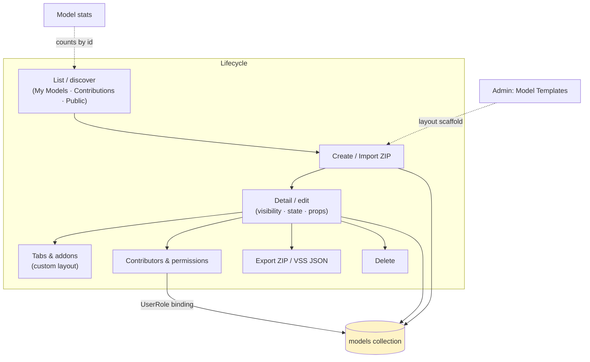
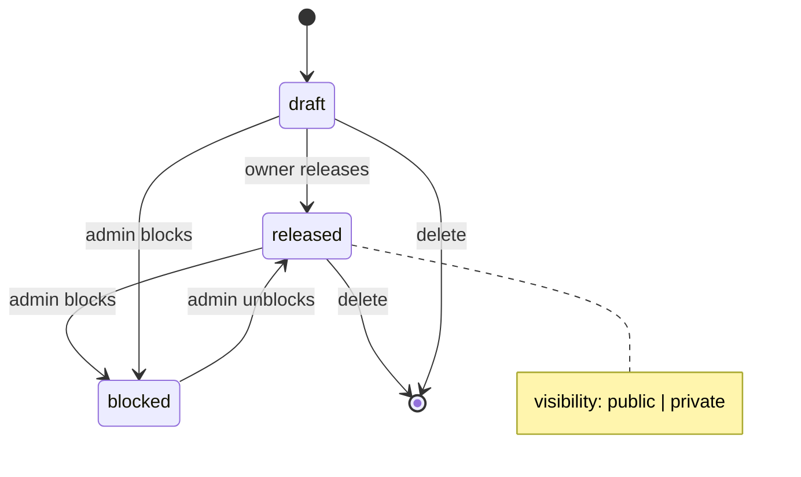
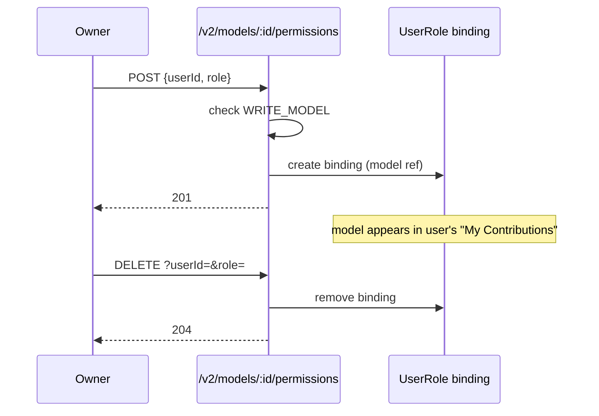

# Cluster: Models

The vehicle-model domain and its layout. Backend: `routes/v2/vehicle-data/model.route.js`, `models/model.model.js`. Frontend: `pages/{PageModelList,PageModelDetail}.tsx`, `layouts/ModelDetailLayout.tsx`.

---

## Model list / create / import

### Description

Browse models in three sections (My Models, My Contributions, Public); create a model; import a model from a ZIP archive.

### Who uses it / value

End users (discover models); model owners (create/import); the wider community (public discovery when `PUBLIC_VIEWING`).

### Acceptance criteria

- `GET /v2/models` (optional auth via `PUBLIC_VIEWING`) → `200` paginated list with query filters (`name`, `visibility`, `state`, `tenant_id`, `vehicle_category`, `main_api`, `id`, `created_by`, `is_contributor`, `include_stats`, `sortBy`, `page`, `limit`, `fields`).
- `GET /v2/models/all` → expanded/unpaginated aggregation of owned + contributed + public-released models (optional auth via `PUBLIC_VIEWING`; owned/contributed only populated for authenticated users).
- `POST /v2/models` (auth) → `201` new model. `POST /v2/models/stats` (optional auth) → `200 { statsById: { [modelId]: {...} } }` for the body `ids`.
- Import from ZIP (`zipUtils.ts`) creates a model from the archive contents.
- Signed-out with `PUBLIC_VIEWING=false` → `401` on list.

### Quality control

Create a model → appears in "My Models"; import a valid model ZIP → model created; sign out + `PUBLIC_VIEWING=true` → public models listed; `PUBLIC_VIEWING=false` → `401`.

### Security

Read optional via `PUBLIC_VIEWING`; create requires auth. Filters don't leak private models (server filters by access).

**Risks:**
- **Private-model enumeration:** without server-side access scoping, a signed-out or cross-tenant user could enumerate private models through list filters, leaking proprietary vehicle data and model IP.
- **Anonymous model creation:** a missing auth check on `POST` would let anonymous users spawn models inside any tenant, polluting namespaces and consuming storage.

### Data protection

Model metadata (name, description, visibility, state, images, tags) stored in `models`; images uploaded via the file service.

**Risks:**
- **Visibility misconfiguration:** an over-broad `WRITE_MODEL` grant or a wrong default could expose private models publicly.
- **Irreversible deletion:** deleted models are hard-removed (no soft-delete), so accidental or malicious deletion is permanent user-data loss.

## Model detail / edit

### Description

View/edit a model's name, home image, vehicle properties, visibility (public/private), state (draft/released/blocked), contributors; export the model as ZIP; download the computed VSS JSON; delete.

### Who uses it / value

Model owners (maintain models); contributors (collaborate); consumers (export/download).

### Acceptance criteria

- `GET /v2/models/:id` (optional auth) → `200` model (authorized users get `contributors`/`members` injected). `PATCH /v2/models/:id` → `200` (requires `WRITE_MODEL`). `DELETE /v2/models/:id` → `204` (requires `WRITE_MODEL`).
- Export ZIP / download computed VSS from the UI actions.
- No `WRITE_MODEL` → `403` on edit/delete.

### Quality control

Edit visibility to private → signed-out users can't see it; change state to released → appears publicly; export → valid ZIP; delete → gone from list.

### Security

Read `READ_MODEL`; write `WRITE_MODEL` (owner/admin/contributor). Owners bypass.

**Risks:**
- **Unauthorized state/visibility flip:** a broken `WRITE_MODEL` check would let any user flip a private model to `public`/`released`, exposing it.
- **Unauthorized delete:** missing checks would let a non-owner delete others' models — irreversible data loss.
- **Export exfiltration:** export bundles the model's prototype code/data, so a leaked edit token widens what an attacker can steal.

### Data protection

Visibility controls exposure; deleted models removed from the collection (no soft-delete). Export includes prototype code/data.

**Risks:**
- **Public exposure of embedded data:** flipping visibility to public exposes the model and its embedded prototype code/data to everyone — including data the owner believed was private.
- **Permanent destruction:** hard-delete means a compromised or malicious contributor can permanently destroy model data with no recovery trail.

## Model tabs & addons

### Description

Tabbed model layout (Overview / Prototype Library / Vehicle API + custom plugin tabs); owners add/reorder/hide tabs, set variant, configure a sidebar plugin and right-nav buttons; save the layout as a Model Template.

### Who uses it / value

Model owners (customize the workspace); end users (tailored model views); admins (define reusable layouts).

### Acceptance criteria

- Tab configuration stored on `model.custom_template` (`model_tabs`, `prototype_tabs`, `prototype_sidebar_plugin`, `prototype_right_nav_buttons`).
- Addon/tab management requires `WRITE_MODEL` + `ALLOW_NON_ADMIN_ADDON_CONFIG` (admins always allowed).
- "Save as Template" (admin) stores the layout as a Model Template.

### Quality control

Add a plugin addon tab → it renders via `PluginPageRender`; reorder/hide tabs → layout persists; as non-admin with `ALLOW_NON_ADMIN_ADDON_CONFIG=false` → addon config blocked.

### Security

Tab management gated by `WRITE_MODEL` + the addon-config flag. Plugins run unsandboxed (see [plugins.md](./plugins.md)).

**Risks:**
- **Malicious tab injection:** a plugin addon tab embeds arbitrary code running unsandboxed in visitors' browsers. If the `ALLOW_NON_ADMIN_ADDON_CONFIG` gate were bypassed, a non-admin could inject a hostile tab into every visitor's view (XSS / token theft).
- **Plugin supply chain:** a tab config references plugin IDs; a compromised or rogue plugin becomes an attack surface for all models using that layout.

### Data protection

Layout config stored on the model document; no secrets.

**Risks:**
- **Untrusted-code distribution:** the tab config is a persistence channel — a malicious layout can repeatedly steer users toward running untrusted plugins until it is noticed and removed.

## Model contributors & permissions

### Description

Add/remove authorized users (contributors/members) on a model; the model appears in their "My Contributions".

### Who uses it / value

Model owners (delegate editing); contributors (gain access).

### Acceptance criteria

- `POST /v2/models/:id/permissions {userId, role}` (requires `WRITE_MODEL`) → `201` adds authorized user.
- `DELETE /v2/models/:id/permissions?userId=&role=` (requires `WRITE_MODEL`) → `204` removes.

### Quality control

Add a contributor → they see the model under "My Contributions" and can edit (if `writeModel`); remove → access revoked.

### Security

Both operations require `WRITE_MODEL` on the model. Owners bypass.

**Risks:**
- **Privilege escalation:** a missing `WRITE_MODEL` check would let any user grant themselves or others write access to private models — escalation to data theft or tampering.

### Data protection

Creates/removes UserRole bindings scoped to the model `ref`.

**Risks:**
- **Relationship leak:** contributor bindings reveal who collaborates on which model (users ↔ business assets).
- **Persistence of mis-grants:** a leaked grant persists until manually revoked; with no audit trail of permission changes, mis-grants are hard to detect after the fact.

## Model stats

### Description

Aggregated stats (e.g. prototype counts) by model IDs, cached per request.

### Who uses it / value

End users (model badges/counts); owners (overview).

### Acceptance criteria

- `POST /v2/models/stats {ids:[...]}` (optional auth via `PUBLIC_VIEWING`) → `200 { statsById: { [modelId]: {...} } }`; empty/missing → `{ statsById: {} }`.

### Quality control

Request stats for a few model IDs → counts returned; request none → empty map.

### Security

Optional auth; respects access scoping.

**Risks:**
- **Metadata enumeration:** if the aggregation didn't respect access scoping, an attacker could probe arbitrary model IDs to confirm the existence and size of private models even when the list endpoint is locked down.

### Data protection

Aggregated only; no PII.

**Risks:**
- **Existence/scale inference:** counts alone reveal the existence and scale of models; combined with a listing gap this could confirm private assets.

## Model templates

### Description

Admin-managed scaffolds for model layouts (`custom_template`), with a single `default` template; seeded/managed via the templates admin page.

### Who uses it / value

Admins (standardize layouts); model creators (quick-start from a template).

### Acceptance criteria

- `GET /v2/model-template[/:id]` (public) → list/get; `POST /v2/model-template` → `201` (admin); `PUT/DELETE /v2/model-template/:id` → `200`/`204` (admin). Also at `/v2/system/model-template`.

### Quality control

Admin creates a template → it appears in the model-template manager; select it when creating a model → layout applied.

### Security

Read public; write requires `MANAGE_USERS`.

**Risks:**
- **Platform-wide payload:** templates apply to every model created from them. A compromised admin could seed a default template embedding a malicious plugin tab, pushing untrusted code to all future models.

### Data protection

Template config (tabs/prototype tabs/sidebar) stored; no secrets.

**Risks:**
- **Persistent distribution channel:** a malicious template propagates its layout and referenced plugins to all derived models until an admin notices and removes it.