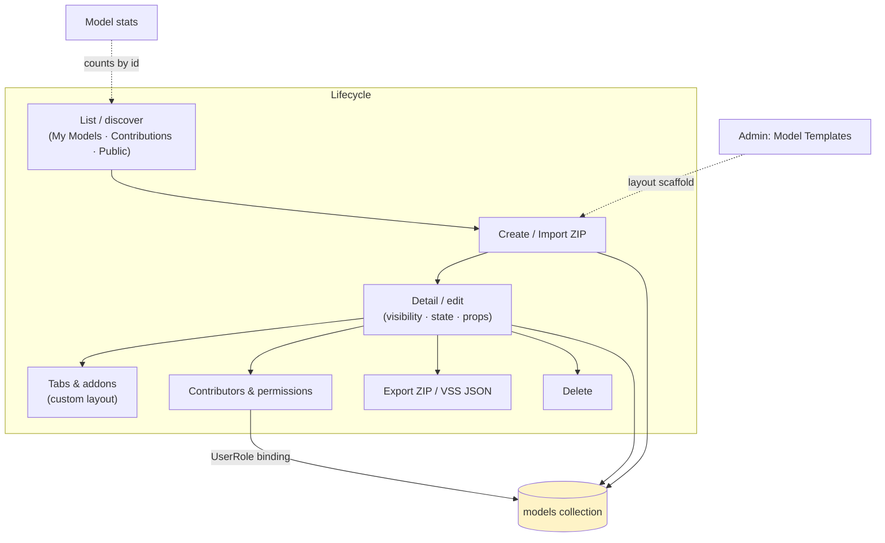
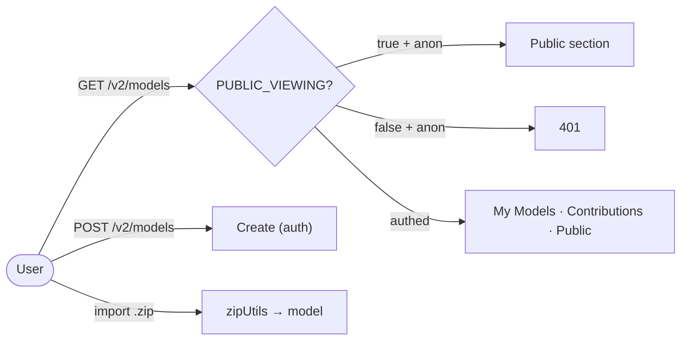
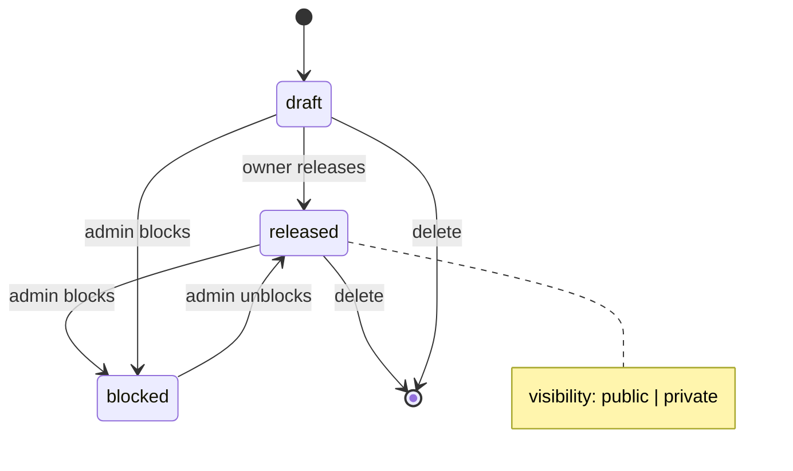
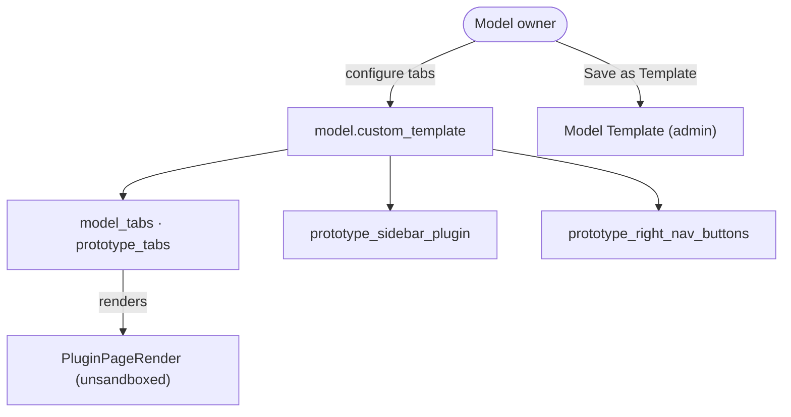
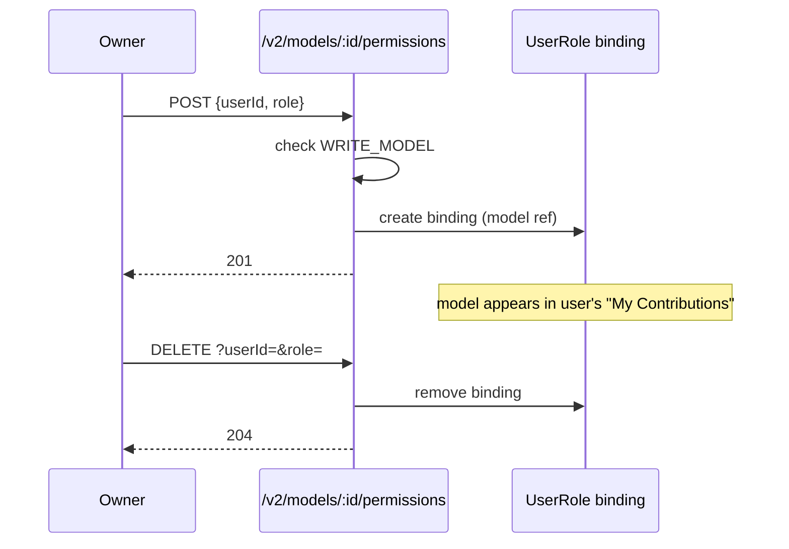

# Cluster: Models

Discover, create, and manage vehicle models — the container for every signal set, prototype, and dashboard built on the platform.

**Implementation:** `routes/v2/vehicle-data/model.route.js`, `models/model.model.js` (backend); `pages/{PageModelList,PageModelDetail}.tsx`, `layouts/ModelDetailLayout.tsx` (frontend).

---

## Capabilities in this cluster

| ID | Capability |
|----|------------|
| [CAP-MODEL-01](#cap-model-01--model-list--create--import) | Model list / create / import |
| [CAP-MODEL-02](#cap-model-02--model-detail--edit) | Model detail / edit |
| [CAP-MODEL-03](#cap-model-03--model-tabs--addons) | Model tabs & addons |
| [CAP-MODEL-04](#cap-model-04--model-contributors--permissions) | Model contributors & permissions |
| [CAP-MODEL-05](#cap-model-05--model-stats) | Model stats |
| [CAP-MODEL-06](#cap-model-06--model-templates) | Model templates |

## CAP-MODEL-01 — Model list / create / import

### Description

As a user, browse vehicle models across three sections — My Models, My Contributions, and Public — to discover models to build on. As a model owner, create a new model or import one from a ZIP archive to start prototyping.

### Who uses it / value

End users (discover models); model owners (create/import); the wider community (public discovery when `PUBLIC_VIEWING`).

### Acceptance criteria

- When I call `GET /v2/models` (optional auth via `PUBLIC_VIEWING`), the system returns `200` a paginated list I can filter by (`name`, `visibility`, `state`, `tenant_id`, `vehicle_category`, `main_api`, `id`, `created_by`, `is_contributor`, `include_stats`, `sortBy`, `page`, `limit`, `fields`).
- When I call `GET /v2/models/all`, the system returns an expanded/unpaginated aggregation of owned + contributed + public-released models (optional auth via `PUBLIC_VIEWING`; owned/contributed only populated for authenticated users).
- When I call `POST /v2/models` (auth), the system returns `201` a new model. When I call `POST /v2/models/stats` (optional auth), the system returns `200 { statsById: { [modelId]: {...} } }` for the body `ids`.
- When I import a model from a ZIP archive, the system creates the model from the archive contents.
- When I'm signed out and `PUBLIC_VIEWING=false`, the system returns `401` on list.

### Quality control

After I create a model, it appears in My Models; after I import a valid model ZIP, the model is created; when I sign out with `PUBLIC_VIEWING=true`, public models are listed; with `PUBLIC_VIEWING=false`, the list returns `401`.

### Security

Reading is optional via `PUBLIC_VIEWING`; creating a model requires me to be signed in. I only see models that are public or that I own/contribute to (owner bypass) — private models aren't leaked through list filters.

**Coverage:**
- **Auth:** Read optional via `PUBLIC_VIEWING`; create requires auth (JWT access token).
- **Authorization:** List — I only see public models plus ones I own or have a role-permission for (owner bypass); create — any signed-in user becomes the owner of the new model; non-admins are capped at 3 models unless they hold `UNLIMITED_MODEL`.
- **Input validation:** my query and body params are validated (create / list / listAll); invalid input is rejected.
- **Rate limiting:** not applied (`authLimiter` exists but is unused on every route).
- **Secrets:** none (no credentials in model metadata).

**Risks:**
- **Private-model enumeration:** without server-side access scoping, a signed-out or cross-tenant user could enumerate private models through list filters, leaking proprietary vehicle data and model IP.
- **Anonymous model creation:** a missing auth check on `POST` would let anonymous users spawn models inside any tenant, polluting namespaces and consuming storage.

### Data protection

Model metadata (name, description, visibility, state, images, tags) is stored on the model; images are uploaded via the file service.

**Coverage:**
- **Stored data:** `models` collection (name, description, visibility, state, images, tags, `created_by`, `custom_template`, `custom_api_sets`).
- **PII:** no (model metadata is not personal; `created_by` is a user ref, email not stored on the model).
- **Retention:** indefinite until hard delete (no soft-delete, no TTL).
- **Encryption:** bcrypt for user passwords (separate collection); TLS in transit; model data not encrypted at rest beyond Mongo defaults.
- **Logging:** request logs; no sensitive data logged (model metadata only).

**Risks:**
- **Visibility misconfiguration:** an over-broad `WRITE_MODEL` grant or a wrong default could expose private models publicly.
- **Irreversible deletion:** deleted models are hard-removed (no soft-delete), so accidental or malicious deletion is permanent user-data loss.

### Test coverage
- **E2E (Playwright):** 4 test case(s) in `vehicle-models.spec.ts` — SITEMAP: ✅
- **Unit (Jest):** none

## CAP-MODEL-02 — Model detail / edit

### Description

As a model owner or contributor, view and edit a model's name, home image, vehicle properties, visibility (public/private), state (draft/released/blocked), and contributors so that the model stays accurate and discoverable. As a consumer, export the model as a ZIP archive or download its computed VSS JSON to use the model elsewhere, and (as owner) delete a model I no longer need.

### Who uses it / value

Model owners (maintain models); contributors (collaborate); consumers (export/download).

### Acceptance criteria

- When I call `GET /v2/models/:id` (optional auth), the system returns `200` the model; when I have edit rights, the response includes `contributors`/`members`.
- When I call `PATCH /v2/models/:id` (requires `WRITE_MODEL`), the system returns `200`. When I call `DELETE /v2/models/:id` (requires `WRITE_MODEL`), the system returns `204`.
- When I trigger Export ZIP or download computed VSS from the UI, the system returns the archive / JSON.
- When I lack `WRITE_MODEL`, the system returns `403` on edit/delete.

### Quality control

When I set visibility to private, signed-out users can no longer see the model; when I set state to released, it appears publicly; when I export, I get a valid ZIP; when I delete, it's gone from the list.

### Security

I can read a model with `READ_MODEL` (owner/admin/contributor bypass), and edit or delete it with `WRITE_MODEL` (owner bypass).

**Coverage:**
- **Auth:** Read optional via `PUBLIC_VIEWING`; `PATCH`/`DELETE` require auth (JWT access token).
- **Authorization:** private-model read requires `READ_MODEL` (owner bypass); `PATCH`/`DELETE` require `WRITE_MODEL` (owner bypass).
- **Input validation:** my params/body are validated (get / update / delete); invalid input is rejected.
- **Rate limiting:** not applied (`authLimiter` exists but is unused).
- **Secrets:** none (no credentials on the model document).

**Risks:**
- **Unauthorized state/visibility flip:** a broken `WRITE_MODEL` check would let any user flip a private model to `public`/`released`, exposing it.
- **Unauthorized delete:** missing checks would let a non-owner delete others' models — irreversible data loss.
- **Export exfiltration:** export bundles the model's prototype code/data, so a leaked edit token widens what an attacker can steal.

### Data protection

The model's visibility controls who can see it; deleting a model removes it from the collection (no soft-delete). The export ZIP includes the model's prototype code/data.

**Coverage:**
- **Stored data:** `models` collection (visibility, state, props, `custom_template`); export bundles the model's prototype code/data.
- **PII:** no — contributor/member emails are masked in the model response when I have `WRITE_MODEL`.
- **Retention:** hard delete (no soft-delete, no snapshot); export data persists as long as the model exists.
- **Encryption:** bcrypt for user passwords (separate); TLS in transit; model data not encrypted at rest beyond Mongo defaults.
- **Logging:** request logs; template-fetch warnings logged; no sensitive data.

**Risks:**
- **Public exposure of embedded data:** flipping visibility to public exposes the model and its embedded prototype code/data to everyone — including data the owner believed was private.
- **Permanent destruction:** hard-delete means a compromised or malicious contributor can permanently destroy model data with no recovery trail.

### Test coverage
- **E2E (Playwright):** 4 test case(s) in `vehicle-models.spec.ts` — SITEMAP: ⚠️
- **Unit (Jest):** none

## CAP-MODEL-03 — Model tabs & addons

### Description

As a model owner, customize the model's tabbed workspace — Overview, Prototype Library, Vehicle API, plus custom plugin tabs — by adding, reordering, or hiding tabs, setting a variant, and configuring a sidebar plugin and right-nav buttons so that collaborators see the layout that fits the model. As an admin, save a layout as a Model Template for other creators to reuse.

### Who uses it / value

Model owners (customize the workspace); end users (tailored model views); admins (define reusable layouts).

### Acceptance criteria

- The tab configuration I save is stored on the model as `model_tabs`, `prototype_tabs`, `prototype_sidebar_plugin`, `prototype_right_nav_buttons`.
- When I manage addon/tab configuration, the system requires `WRITE_MODEL` + `ALLOW_NON_ADMIN_ADDON_CONFIG` (admins are always allowed).
- When I (as admin) choose "Save as Template", the system stores the layout as a Model Template.

### Quality control

When I add a plugin addon tab, it renders in the workspace; when I reorder or hide tabs, the layout persists; as a non-admin with `ALLOW_NON_ADMIN_ADDON_CONFIG=false`, addon configuration is blocked.

### Security

Tab management gated by `WRITE_MODEL` + the addon-config flag. Plugins run unsandboxed (see [plugins.md](./plugins.md)).

**Coverage:**
- **Auth:** Write requires auth (JWT); reads optional via `PUBLIC_VIEWING`.
- **Authorization:** `WRITE_MODEL` (owner bypass) + `ALLOW_NON_ADMIN_ADDON_CONFIG` flag (admins always allowed).
- **Input validation:** my `custom_template` payload is accepted as-is (shape not strictly validated).
- **Rate limiting:** not applied (`authLimiter` defined but unused).
- **Secrets:** none.

**Risks:**
- **Malicious tab injection:** a plugin addon tab embeds arbitrary code running unsandboxed in visitors' browsers. If the `ALLOW_NON_ADMIN_ADDON_CONFIG` gate were bypassed, a non-admin could inject a hostile tab into every visitor's view (XSS / token theft).
- **Plugin supply chain:** a tab config references plugin IDs; a compromised or rogue plugin becomes an attack surface for all models using that layout.

### Data protection

Layout config stored on the model document; no secrets.

**Coverage:**
- **Stored data:** `model.custom_template` (`model_tabs`, `prototype_tabs`, `prototype_sidebar_plugin`, `prototype_right_nav_buttons`) on the model doc.
- **PII:** no.
- **Retention:** follows the model (hard-deleted with it).
- **Encryption:** none beyond Mongo defaults / TLS in transit.
- **Logging:** request logs; no sensitive data.

**Risks:**
- **Untrusted-code distribution:** the tab config is a persistence channel — a malicious layout can repeatedly steer users toward running untrusted plugins until it is noticed and removed.

### Test coverage
- **E2E (Playwright):** 2 test case(s) in `plugin-management.spec.ts` — SITEMAP: ✅
- **Unit (Jest):** none

## CAP-MODEL-04 — Model contributors & permissions

### Description

As a model owner, add or remove authorized users (contributors/members) on my model so that they can collaborate, and the model shows up in their My Contributions section.

### Who uses it / value

Model owners (delegate editing); contributors (gain access).

### Acceptance criteria

- When I call `POST /v2/models/:id/permissions {userId, role}` (requires `WRITE_MODEL`), the system returns `201` and adds the authorized user.
- When I call `DELETE /v2/models/:id/permissions?userId=&role=` (requires `WRITE_MODEL`), the system returns `204` and removes the user.

### Quality control

After I add a contributor, they see the model under My Contributions and can edit (if granted `writeModel`); after I remove them, their access is revoked.

### Security

Both add and remove require `WRITE_MODEL` on the model (owner bypass).

**Coverage:**
- **Auth:** required (JWT access token).
- **Authorization:** both add and remove require `WRITE_MODEL` on the model (owner bypass).
- **Input validation:** I must send `userId` (required) and `role` ∈ {`model_contributor`,`model_member`} to add, and `userId`/`role` as query params to delete; invalid input is rejected.
- **Rate limiting:** not applied (`authLimiter` exists but is unused).
- **Secrets:** none.

**Risks:**
- **Privilege escalation:** a missing `WRITE_MODEL` check would let any user grant themselves or others write access to private models — escalation to data theft or tampering.

### Data protection

Adding/removing a contributor creates/removes a binding scoped to the model.

**Coverage:**
- **Stored data:** `userroles` collection (`user`, `role`, `ref` = model id).
- **PII:** yes — contributor/member user identities (user ↔ model relationship); the model response masks emails, but bindings reveal who collaborates on which model.
- **Retention:** bindings persist until explicitly revoked (hard delete); no TTL, no audit trail of permission changes.
- **Encryption:** none beyond Mongo defaults / TLS in transit.
- **Logging:** request logs; no sensitive data.

**Risks:**
- **Relationship leak:** contributor bindings reveal who collaborates on which model (users ↔ business assets).
- **Persistence of mis-grants:** a leaked grant persists until manually revoked; with no audit trail of permission changes, mis-grants are hard to detect after the fact.

### Test coverage
- **E2E (Playwright):** 0 — not covered — SITEMAP: ❌
- **Unit (Jest):** none

## CAP-MODEL-05 — Model stats

### Description

As a user, request aggregated stats (e.g. prototype counts) for a set of model IDs so that I can show model badges/counts in the UI.

### Who uses it / value

End users (model badges/counts); owners (overview).

### Acceptance criteria

- When I call `POST /v2/models/stats {ids:[...]}` (optional auth via `PUBLIC_VIEWING`), the system returns `200 { statsById: { [modelId]: {...} } }`; for empty/missing ids it returns `{ statsById: {} }`.

### Quality control

When I request stats for a few model IDs, counts are returned; when I request none, I get an empty map.

### Security

Optional auth; I only get stats for models I can read.

**Coverage:**
- **Auth:** optional via `PUBLIC_VIEWING`.
- **Authorization:** access-scoped — as an anonymous user I get stats only for public models; as a signed-in user I get stats only for models I can read (a global-read grant expands this to all).
- **Input validation:** I must send `ids` as an array of objectId (min 1); invalid input is rejected.
- **Rate limiting:** not applied (`authLimiter` exists but is unused).
- **Secrets:** none.

**Risks:**
- **Metadata enumeration:** if the aggregation didn't respect access scoping, an attacker could probe arbitrary model IDs to confirm the existence and size of private models even when the list endpoint is locked down.

### Data protection

Aggregated only; no PII.

**Coverage:**
- **Stored data:** none — counts are computed on demand and cached per request.
- **PII:** no (aggregated counts only).
- **Retention:** N/A (not persisted).
- **Encryption:** N/A (no stored data); TLS in transit.
- **Logging:** request logs; no sensitive data.

**Risks:**
- **Existence/scale inference:** counts alone reveal the existence and scale of models; combined with a listing gap this could confirm private assets.

### Test coverage
- **E2E (Playwright):** 0 — not covered — SITEMAP: ❌
- **Unit (Jest):** none

## CAP-MODEL-06 — Model templates

### Description

As an admin, manage scaffolds for model layouts (the `custom_template`) — including the single `default` template — so that creators can quick-start a new model from a standard layout.

### Who uses it / value

Admins (standardize layouts); model creators (quick-start from a template).

### Acceptance criteria

- When I call `GET /v2/model-template[/:id]` (public), the system returns the list/get; when I (as admin) call `POST /v2/model-template`, it returns `201`; `PUT/DELETE /v2/model-template/:id` return `200`/`204`. These are also available at `/v2/system/model-template`.

### Quality control

After I (as admin) create a template, it appears in the model-template manager; when I select it while creating a model, its layout is applied.

### Security

Anyone can read templates; writing requires `MANAGE_USERS` (admin).

**Coverage:**
- **Auth:** Read public (no auth); write requires auth (JWT access token).
- **Authorization:** write requires `manageUsers` (admin only); reads are public.
- **Input validation:** my params/body are validated (list / get / create / update / remove); invalid input is rejected.
- **Rate limiting:** not applied (`authLimiter` exists but is unused).
- **Secrets:** none.

**Risks:**
- **Platform-wide payload:** templates apply to every model created from them. A compromised admin could seed a default template embedding a malicious plugin tab, pushing untrusted code to all future models.

### Data protection

Template config (tabs/prototype tabs/sidebar) stored; no secrets.

**Coverage:**
- **Stored data:** `modeltemplates` collection (config layout, referenced plugin IDs, `created_by`, `updated_by`).
- **PII:** no.
- **Retention:** indefinite until hard delete (no soft-delete, no TTL).
- **Encryption:** none beyond Mongo defaults / TLS in transit.
- **Logging:** request logs; no sensitive data.

**Risks:**
- **Persistent distribution channel:** a malicious template propagates its layout and referenced plugins to all derived models until an admin notices and removes it.

### Test coverage
- **E2E (Playwright):** 1 test case(s) in `admin-extended.spec.ts` — SITEMAP: ✅
- **Unit (Jest):** none