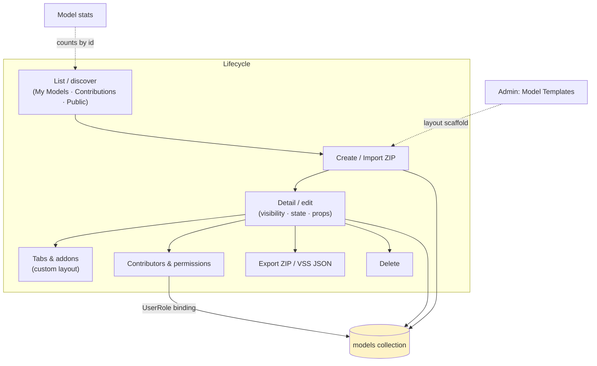
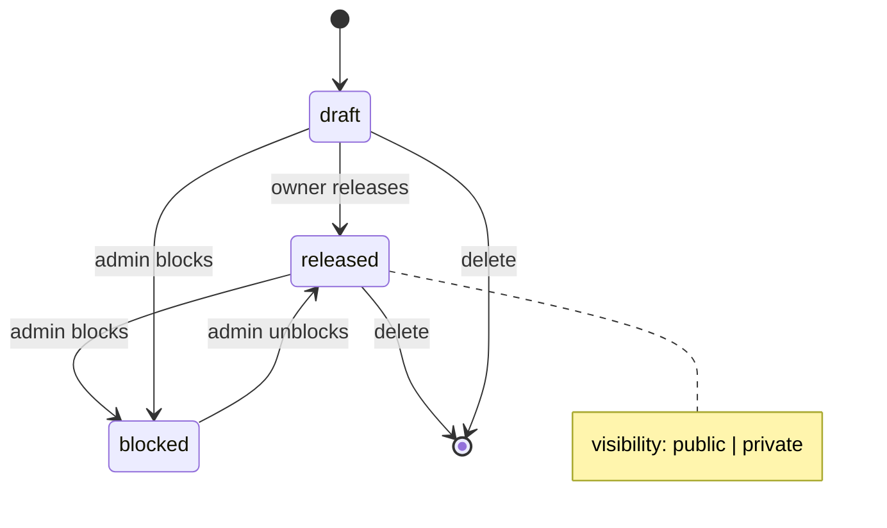
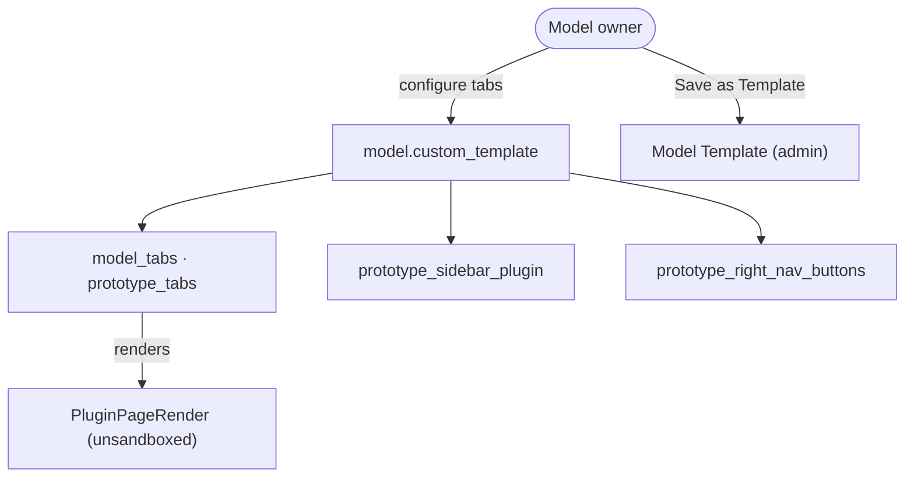
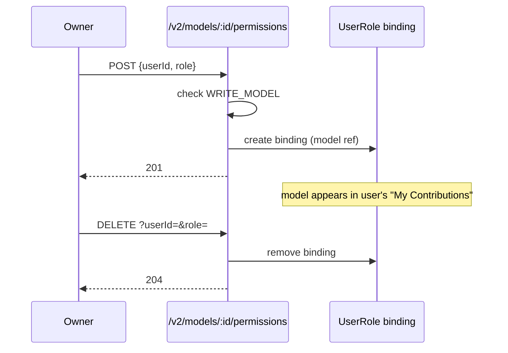
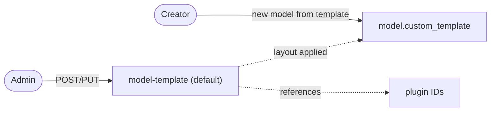

# Cluster: Models

Discover, create, and manage vehicle models — the container for every signal set, prototype, and dashboard built on the platform.

**Implementation:** `routes/v2/vehicle-data/model.route.js`, `models/model.model.js` (backend); `pages/{PageModelList,PageModelDetail}.tsx`, `layouts/ModelDetailLayout.tsx` (frontend).

---

## Capabilities in this cluster

| ID | Capability |
|----|------------|
| [CAP-MODEL-01](#cap-model-01--model-list--create--import) | Model list / create / import |
| [CAP-MODEL-02](#cap-model-02--model-detail--edit) | Model detail / edit |
| [CAP-MODEL-03](#cap-model-03--model-tabs--addons) | Model tabs & addons |
| [CAP-MODEL-04](#cap-model-04--model-contributors--permissions) | Model contributors & permissions |
| [CAP-MODEL-05](#cap-model-05--model-stats) | Model stats |
| [CAP-MODEL-06](#cap-model-06--model-templates) | Model templates |

## CAP-MODEL-01 — Model list / create / import

### Description

As a user, I can browse vehicle models in three sections — My Models, My Contributions, and Public — to discover models to build on. As a model owner, I can create a new model or import one from a ZIP file to start prototyping.

### Who uses it / value

End users (discover models); model owners (create/import); the wider community (public discovery when public viewing is on).

### Acceptance criteria

- When I open the Models page, I see models grouped into My Models, My Contributions, and Public (signed-out users see only Public, when public viewing is allowed).
- When I search by name, the list filters live; when I switch tabs, the corresponding section scrolls into view.
- When I click "Create New Model" and fill in the form, my new model is created and I'm taken to its detail page; it appears under "My Models".
- When I import a model from a ZIP file, the model is created from the archive; if a model with the same name already exists, I'm prompted to choose a different name (with a suggested alternative) before importing.
- When the archive is invalid or unreadable, I see an "Import failed" message.
- When I'm signed out and public viewing is off, I'm prompted to sign in instead of seeing the list.

### API contract

- `GET /v2/models` (optional auth via `PUBLIC_VIEWING`) → `200` paginated list; filters: `name`, `visibility`, `state`, `tenant_id`, `vehicle_category`, `main_api`, `id`, `created_by`, `is_contributor`, `include_stats`, `sortBy`, `page`, `limit`, `fields`.
- `GET /v2/models/all` → expanded/unpaginated aggregation of owned + contributed + public-released models (optional auth via `PUBLIC_VIEWING`; owned/contributed only populated for authenticated users).
- `POST /v2/models` (auth) → `201` new model. `POST /v2/models/stats` (optional auth) → `200 { statsById: { [modelId]: {...} } }` for the body `ids`.
- Import from ZIP creates a model from the archive contents.
- Signed-out with `PUBLIC_VIEWING=false` → `401` on list.

### Quality control

After I create a model, it appears in My Models; after I import a valid model ZIP, the model is created; when I sign out with `PUBLIC_VIEWING=true`, public models are listed; with `PUBLIC_VIEWING=false`, the list returns `401`.

### Security

Reading is optional via `PUBLIC_VIEWING`; creating a model requires me to be signed in. I only see models that are public or that I own/contribute to (owner bypass) — private models aren't leaked through list filters.

**Coverage:**
- **Auth:** Read optional via `PUBLIC_VIEWING`; create requires auth (JWT access token).
- **Authorization:** List — I only see public models plus ones I own or have a role-permission for (owner bypass); create — any signed-in user becomes the owner of the new model; non-admins are capped at 3 models unless they hold `UNLIMITED_MODEL`.
- **Input validation:** my query and body params are validated (create / list / listAll); invalid input is rejected.
- **Rate limiting:** not applied (`authLimiter` exists but is unused on every route).
- **Secrets:** none (no credentials in model metadata).

**Risks:**
- **Private-model enumeration:** without server-side access scoping, a signed-out or cross-tenant user could enumerate private models through list filters, leaking proprietary vehicle data and model IP. *Mitigation:* the system scopes list queries server-side to public + owned + role-permissioned models; verify the scope on every list endpoint.
- **Anonymous model creation:** a missing auth check on `POST` would let anonymous users spawn models inside any tenant, polluting namespaces and consuming storage. *Mitigation:* `POST /v2/models` requires auth and attaches the signed-in user as `created_by`; keep the auth middleware on the route and enforce the per-user 3-model cap server-side.

### Personal data processing
No — this capability does not process personal data. (`created_by` is a user reference, not personal data; no email/name is stored on the model.)
N/A
**Risks:**
- none — no personal data processed.

### AutoWRX data
Model metadata (name, description, visibility, state, images, tags) stored in the `models` collection; images via the file service.
**Coverage:**
- **Stored data:** `models` collection (name, description, visibility, state, images, tags, `created_by`, `custom_template`, `custom_api_sets`).
- **Retention:** indefinite until hard delete (no soft-delete, no TTL).
- **Encryption:** TLS in transit; model data not encrypted at rest beyond Mongo defaults.
- **Logging:** request logs; no sensitive data logged (model metadata only).
**Risks:**
- **Visibility misconfiguration:** an over-broad `WRITE_MODEL` grant or wrong default could expose private models publicly.
- **Irreversible deletion:** hard-removed (no soft-delete), so accidental or malicious deletion is permanent.

### Test coverage
- **E2E (Playwright):** 4 test case(s) in `vehicle-models.spec.ts` — SITEMAP: ✅
- **Estimated coverage:** ≈55% (est.) — 4 E2E cases cover list/create/import; ~7 acceptance paths; detail image/description paths uncovered.
- **Unit (Jest):** none

## CAP-MODEL-02 — Model detail / edit

### Description

As a model owner or contributor, I can view and edit a model's name, home image, vehicle properties, visibility (public/private), state (draft/released/blocked), and contributors so that the model stays accurate and discoverable. As a consumer, I can export the model as a ZIP archive or download its computed VSS JSON to use the model elsewhere, and (as owner) delete a model I no longer need.

### Who uses it / value

Model owners (maintain models); contributors (collaborate); consumers (export/download).

### Acceptance criteria

- When I open a model's detail page, I see its name, home image, vehicle properties, visibility, state, and contributors.
- When I have edit rights, I see Edit, Export, Download, and Delete actions; when I don't, those actions are hidden.
- When I edit the name and save, the model name updates; if a model with that name already exists, I'm shown a duplicate-name hint with a suggested alternative.
- When I update the home image, the new image uploads and appears.
- When I change visibility to private, signed-out users can no longer see the model; when I change state to released, it appears publicly; when I set state to blocked, it's marked blocked.
- When I click Export, a ZIP archive of the model downloads; when I click Download, the computed VSS JSON downloads.
- When I click Delete and confirm (typing the model name), the model is permanently removed and I'm sent back to the Models list.
- When I lack edit rights, I'm prevented from editing or deleting the model.

### API contract

- `GET /v2/models/:id` (optional auth) → `200` the model; when I have edit rights, the response includes `contributors`/`members`.
- `PATCH /v2/models/:id` (requires `WRITE_MODEL`) → `200`. `DELETE /v2/models/:id` (requires `WRITE_MODEL`) → `204`.
- Export ZIP / download computed VSS triggered from the UI returns the archive / JSON.
- Lacking `WRITE_MODEL` → `403` on edit/delete.

### Quality control

When I set visibility to private, signed-out users can no longer see the model; when I set state to released, it appears publicly; when I export, I get a valid ZIP; when I delete, it's gone from the list.

### Security

I can read a model with `READ_MODEL` (owner/admin/contributor bypass), and edit or delete it with `WRITE_MODEL` (owner bypass).

**Coverage:**
- **Auth:** Read optional via `PUBLIC_VIEWING`; `PATCH`/`DELETE` require auth (JWT access token).
- **Authorization:** private-model read requires `READ_MODEL` (owner bypass); `PATCH`/`DELETE` require `WRITE_MODEL` (owner bypass).
- **Input validation:** my params/body are validated (get / update / delete); invalid input is rejected.
- **Rate limiting:** not applied (`authLimiter` exists but is unused).
- **Secrets:** none (no credentials on the model document).

**Risks:**
- **Unauthorized state/visibility flip:** a broken `WRITE_MODEL` check would let any user flip a private model to `public`/`released`, exposing it. *Mitigation:* `PATCH /v2/models/:id` enforces `WRITE_MODEL` (owner bypass) server-side; keep the permission middleware on the route and add a regression test for the flip path.
- **Unauthorized delete:** missing checks would let a non-owner delete others' models — irreversible data loss. *Mitigation:* `DELETE` requires `WRITE_MODEL` (owner bypass); ensure the check runs before the hard-delete and cannot be bypassed by params.
- **Export exfiltration:** export bundles the model's prototype code/data, so a leaked edit token widens what an attacker can steal. *Mitigation:* export is gated behind the same `READ_MODEL`/owner access as the model detail; rotate/revoke tokens on suspected compromise and audit export downloads.

### Personal data processing
Yes — contributor/member user identities (user ↔ model relationship) and masked emails surfaced in the model response when I have `WRITE_MODEL`.
Contributor/member emails are collected from the user store, surfaced only in the model detail response to callers with `WRITE_MODEL` (masked otherwise), retained as long as the binding exists, protected by TLS in transit, and accessible only to the model owner/admin and granted contributors.
**Risks:**
- **Email exposure to non-writers:** if the masking gate were bypassed, contributor/member emails could leak to readers without `WRITE_MODEL`.

### AutoWRX data
The model's visibility controls who can see it; deleting a model removes it from the collection (no soft-delete). The export ZIP includes the model's prototype code/data.
**Coverage:**
- **Stored data:** `models` collection (visibility, state, props, `custom_template`); export bundles the model's prototype code/data.
- **Retention:** hard delete (no soft-delete, no snapshot); export data persists as long as the model exists.
- **Encryption:** TLS in transit; model data not encrypted at rest beyond Mongo defaults.
- **Logging:** request logs; template-fetch warnings logged; no sensitive data.
**Risks:**
- **Public exposure of embedded data:** flipping visibility to public exposes the model and its embedded prototype code/data to everyone — including data the owner believed was private.
- **Permanent destruction:** hard-delete means a compromised or malicious contributor can permanently destroy model data with no recovery trail.

### Test coverage
- **E2E (Playwright):** 4 test case(s) in `vehicle-models.spec.ts` — SITEMAP: ⚠️
- **Estimated coverage:** ≈50% (est.) — 4 E2E cases cover edit/visibility/export/delete; ~8 acceptance paths; state-flip, 403-on-no-WRITE_MODEL, and contributor-masking paths uncovered.
- **Unit (Jest):** none

## CAP-MODEL-03 — Model tabs & addons

### Description

As a model owner, I can customize the model's tabbed workspace — Overview, Prototype Library, Vehicle API, plus custom plugin tabs — by adding, reordering, or hiding tabs, setting a variant, and configuring a sidebar plugin and right-nav buttons so that collaborators see the layout that fits the model. As an admin, I can save a layout as a Model Template for other creators to reuse.

### Who uses it / value

Model owners (customize the workspace); end users (tailored model views); admins (define reusable layouts).

### Acceptance criteria

- When I configure tabs (add/reorder/hide) and save, the layout persists on the model and renders for everyone viewing it.
- When I add a plugin addon tab, it renders in the workspace; when I reorder or hide tabs, the new order/visibility persists.
- When I set a sidebar plugin or right-nav buttons, they render accordingly.
- When I'm a non-admin and addon configuration by non-admins is disabled, I'm prevented from configuring addon tabs/plugins.
- When I'm an admin, I can choose "Save as Template" to store the layout as a Model Template for reuse.

### API contract

- Tab configuration I save is stored on the model as `model_tabs`, `prototype_tabs`, `prototype_sidebar_plugin`, `prototype_right_nav_buttons`.
- Managing addon/tab configuration requires `WRITE_MODEL` + `ALLOW_NON_ADMIN_ADDON_CONFIG` (admins always allowed).
- Admin "Save as Template" stores the layout as a Model Template.

### Quality control

When I add a plugin addon tab, it renders in the workspace; when I reorder or hide tabs, the layout persists; as a non-admin with `ALLOW_NON_ADMIN_ADDON_CONFIG=false`, addon configuration is blocked.

### Security

Tab management gated by `WRITE_MODEL` + the addon-config flag. Plugins run unsandboxed (see [plugins.md](./plugins.md)).

**Coverage:**
- **Auth:** Write requires auth (JWT); reads optional via `PUBLIC_VIEWING`.
- **Authorization:** `WRITE_MODEL` (owner bypass) + `ALLOW_NON_ADMIN_ADDON_CONFIG` flag (admins always allowed).
- **Input validation:** my `custom_template` payload is accepted as-is (shape not strictly validated).
- **Rate limiting:** not applied (`authLimiter` defined but unused).
- **Secrets:** none.

**Risks:**
- **Malicious tab injection:** a plugin addon tab embeds arbitrary code running unsandboxed in visitors' browsers. If the `ALLOW_NON_ADMIN_ADDON_CONFIG` gate were bypassed, a non-admin could inject a hostile tab into every visitor's view (XSS / token theft). *Mitigation:* tab writes require `WRITE_MODEL` + the `ALLOW_NON_ADMIN_ADDON_CONFIG` flag (admins always allowed); keep the flag check server-side and prefer sandboxed plugin rendering (see [plugins.md](./plugins.md)).
- **Plugin supply chain:** a tab config references plugin IDs; a compromised or rogue plugin becomes an attack surface for all models using that layout. *Mitigation:* only reference plugins from trusted sources; admins should review referenced plugin IDs before saving a layout and remove rogue plugins from the registry.

### Personal data processing
No — this capability does not process personal data. (Tab/layout config references plugin IDs and model structure only; no email/name is stored on the layout.)
N/A
**Risks:**
- none — no personal data processed.

### AutoWRX data
Layout config stored on the model document; no secrets.
**Coverage:**
- **Stored data:** `model.custom_template` (`model_tabs`, `prototype_tabs`, `prototype_sidebar_plugin`, `prototype_right_nav_buttons`) on the model doc.
- **Retention:** follows the model (hard-deleted with it).
- **Encryption:** none beyond Mongo defaults / TLS in transit.
- **Logging:** request logs; no sensitive data.
**Risks:**
- **Untrusted-code distribution:** the tab config is a persistence channel — a malicious layout can repeatedly steer users toward running untrusted plugins until it is noticed and removed.

### Test coverage
- **E2E (Playwright):** 2 test case(s) in `plugin-management.spec.ts` — SITEMAP: ✅
- **Estimated coverage:** ≈45% (est.) — 2 E2E cases cover addon-tab add/reorder; ~5 acceptance paths; admin "Save as Template" and non-admin block paths uncovered.
- **Unit (Jest):** none

## CAP-MODEL-04 — Model contributors & permissions

### Description

As a model owner, I can add or remove authorized users (contributors/members) on my model so that they can collaborate, and the model shows up in their My Contributions section.

### Who uses it / value

Model owners (delegate editing); contributors (gain access).

### Acceptance criteria

- When I open the contributor list on my model, I see the current contributors/members.
- When I add a user as a contributor or member, they gain access and the model appears in their My Contributions section.
- When I remove a contributor, their access is revoked and the model no longer appears in their My Contributions.
- When I'm not the model owner (and don't have manage rights), I'm prevented from adding or removing contributors.

### API contract

- `POST /v2/models/:id/permissions {userId, role}` (requires `WRITE_MODEL`) → `201` adds the authorized user.
- `DELETE /v2/models/:id/permissions?userId=&role=` (requires `WRITE_MODEL`) → `204` removes the user.

### Quality control

After I add a contributor, they see the model under My Contributions and can edit (if granted `writeModel`); after I remove them, their access is revoked.

### Security

Both add and remove require `WRITE_MODEL` on the model (owner bypass).

**Coverage:**
- **Auth:** required (JWT access token).
- **Authorization:** both add and remove require `WRITE_MODEL` on the model (owner bypass).
- **Input validation:** I must send `userId` (required) and `role` ∈ {`model_contributor`,`model_member`} to add, and `userId`/`role` as query params to delete; invalid input is rejected.
- **Rate limiting:** not applied (`authLimiter` exists but is unused).
- **Secrets:** none.

**Risks:**
- **Privilege escalation:** a missing `WRITE_MODEL` check would let any user grant themselves or others write access to private models — escalation to data theft or tampering. *Mitigation:* both `POST` and `DELETE /v2/models/:id/permissions` enforce `WRITE_MODEL` (owner bypass) server-side; keep the check on the route and reject role values outside `{model_contributor,model_member}`.

### Personal data processing
Yes — contributor/member user identities (user ↔ model relationship). Bindings map a user id to a model id and role; collected from the user store on add, stored in the `userroles` collection, retained until explicitly revoked, protected by TLS in transit, and readable only by the model owner/admin and granted contributors (emails masked in the model response unless the caller has `WRITE_MODEL`).
**Risks:**
- **Relationship leak:** contributor bindings reveal who collaborates on which model (users ↔ business assets).

### AutoWRX data
Adding/removing a contributor creates/removes a binding scoped to the model.
**Coverage:**
- **Stored data:** `userroles` collection (`user`, `role`, `ref` = model id).
- **Retention:** bindings persist until explicitly revoked (hard delete); no TTL, no audit trail of permission changes.
- **Encryption:** none beyond Mongo defaults / TLS in transit.
- **Logging:** request logs; no sensitive data.
**Risks:**
- **Persistence of mis-grants:** a leaked grant persists until manually revoked; with no audit trail of permission changes, mis-grants are hard to detect after the fact.

### Test coverage
- **E2E (Playwright):** 0 — not covered — SITEMAP: ❌
- **Estimated coverage:** ≈0% (est.) — no E2E spec.
- **Unit (Jest):** none

## CAP-MODEL-05 — Model stats

### Description

As a user, I can see aggregated stats (e.g. prototype counts) for a set of models so that model badges/counts show in the UI.

### Who uses it / value

End users (model badges/counts); owners (overview).

### Acceptance criteria

- When I view model cards that show counts, the stats (e.g. prototype count) are displayed per model.
- When the models have no stats, I see empty/zero counts.
- When I'm signed out, I only see stats for public models; when signed in, I see stats for models I can read.

### API contract

- `POST /v2/models/stats {ids:[...]}` (optional auth via `PUBLIC_VIEWING`) → `200 { statsById: { [modelId]: {...} } }`; for empty/missing ids it returns `{ statsById: {} }`.

### Quality control

When I request stats for a few model IDs, counts are returned; when I request none, I get an empty map.

### Security

Optional auth; I only get stats for models I can read.

**Coverage:**
- **Auth:** optional via `PUBLIC_VIEWING`.
- **Authorization:** access-scoped — as an anonymous user I get stats only for public models; as a signed-in user I get stats only for models I can read (a global-read grant expands this to all).
- **Input validation:** I must send `ids` as an array of objectId (min 1); invalid input is rejected.
- **Rate limiting:** not applied (`authLimiter` exists but is unused).
- **Secrets:** none.

**Risks:**
- **Metadata enumeration:** if the aggregation didn't respect access scoping, an attacker could probe arbitrary model IDs to confirm the existence and size of private models even when the list endpoint is locked down. *Mitigation:* the stats aggregation is scoped to public + owned + role-permissioned models (anonymous → public only); verify the access scope on the aggregation pipeline and reject invalid `ids` early.

### Personal data processing
No — this capability does not process personal data. (Only aggregated counts keyed by model id; no user email/name is stored or returned.)
N/A
**Risks:**
- none — no personal data processed.

### AutoWRX data
Aggregated only; no operational data persisted.
**Coverage:**
- **Stored data:** none — counts are computed on demand and cached per request.
- **Retention:** N/A (not persisted).
- **Encryption:** N/A (no stored data); TLS in transit.
- **Logging:** request logs; no sensitive data.
**Risks:**
- **Existence/scale inference:** counts alone reveal the existence and scale of models; combined with a listing gap this could confirm private assets.

### Test coverage
- **E2E (Playwright):** 0 — not covered — SITEMAP: ❌
- **Estimated coverage:** ≈0% (est.) — no E2E spec.
- **Unit (Jest):** none

## CAP-MODEL-06 — Model templates

### Description

As an admin, I can manage scaffolds for model layouts — including the single default template — so that creators can quick-start a new model from a standard layout.

### Who uses it / value

Admins (standardize layouts); model creators (quick-start from a template).

### Acceptance criteria

- When I open the Model Template manager, I see the list of available templates.
- When I (as admin) create a new template, it appears in the manager.
- When I (as admin) edit or delete a template, the change persists / the template is removed.
- When I'm a non-admin, I'm prevented from creating, editing, or deleting templates.
- When I create a new model and select a template, its layout is applied to the new model.

### API contract

- `GET /v2/model-template[/:id]` (public) → list/get; `POST /v2/model-template` (admin) → `201`; `PUT /v2/model-template/:id` → `200`; `DELETE /v2/model-template/:id` → `204`. Also available at `/v2/system/model-template`.

### Quality control

After I (as admin) create a template, it appears in the model-template manager; when I select it while creating a model, its layout is applied.

### Security

Anyone can read templates; writing requires `MANAGE_USERS` (admin).

**Coverage:**
- **Auth:** Read public (no auth); write requires auth (JWT access token).
- **Authorization:** write requires `manageUsers` (admin only); reads are public.
- **Input validation:** my params/body are validated (list / get / create / update / remove); invalid input is rejected.
- **Rate limiting:** not applied (`authLimiter` exists but is unused).
- **Secrets:** none.

**Risks:**
- **Platform-wide payload:** templates apply to every model created from them. A compromised admin could seed a default template embedding a malicious plugin tab, pushing untrusted code to all future models. *Mitigation:* writes require `manageUsers` (admin only); review referenced plugin IDs before saving a default template and remove rogue plugins from the registry to break the distribution chain.

### Personal data processing
No — this capability does not process personal data. (`created_by`/`updated_by` are admin user references; no email/name is stored on the template.)
N/A
**Risks:**
- none — no personal data processed.

### AutoWRX data
Template config (tabs/prototype tabs/sidebar) stored; no secrets.
**Coverage:**
- **Stored data:** `modeltemplates` collection (config layout, referenced plugin IDs, `created_by`, `updated_by`).
- **Retention:** indefinite until hard delete (no soft-delete, no TTL).
- **Encryption:** none beyond Mongo defaults / TLS in transit.
- **Logging:** request logs; no sensitive data.
**Risks:**
- **Persistent distribution channel:** a malicious template propagates its layout and referenced plugins to all derived models until an admin notices and removes it.

### Test coverage
- **E2E (Playwright):** 1 test case(s) in `admin-extended.spec.ts` — SITEMAP: ✅
- **Estimated coverage:** ≈40% (est.) — 1 E2E case covers template create/list; ~3 acceptance paths; apply-to-new-model and delete paths uncovered.
- **Unit (Jest):** none