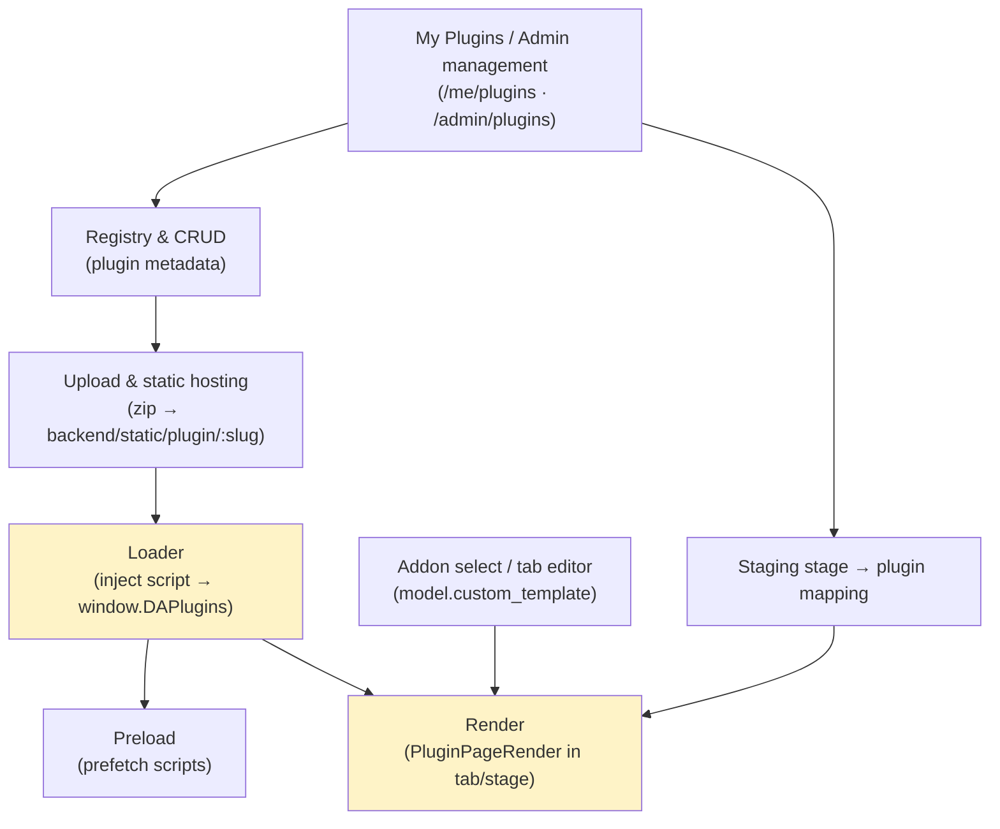
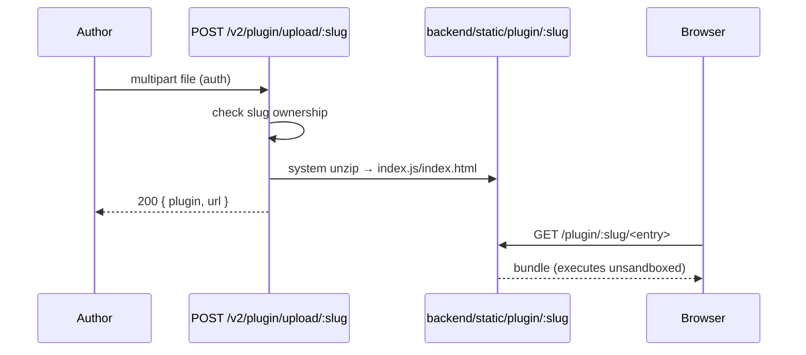
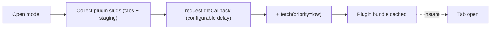
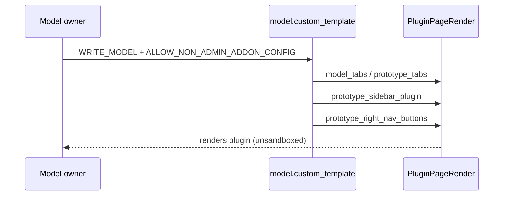

# Cluster: Plugins

The loadable-plugin system: a plugin is a standalone React bundle AutoWRX loads dynamically at runtime and renders inside a model/prototype tab or a deploy/staging stage. Backend: `routes/v2/system/plugin.route.js`, `controllers/plugin.controller.js`. Frontend: `components/organisms/{PluginPageRender,PluginForm}.tsx`. See the [Plugin Development guide](../guides/plugin/README.md) for authoring.

---

## Plugin registry & CRUD

### Description

Catalog of plugins (`type` `prototype_function` or `deploy`) with slug, image, description, internal/external flag, URL, config; slug auto-generated from name; ownership-gated edits.

### Who uses it / value

Plugin authors (publish plugins); model owners/admins (attach plugins as addon tabs).

### Acceptance criteria

- `GET /v2/plugin` (public) → list; `GET /v2/plugin/{admin,id/:id,slug/:slug}` → admin/own/by-id/by-slug; `GET /v2/plugin/mine` (auth) → own; `POST /v2/plugin` (auth) → `201`; `PUT /v2/plugin/:id` (auth + ownership/admin) → `200`; `DELETE /v2/plugin/:id` (auth + ownership/admin) → `204`.
- `slug` forbidden on update (immutable); auto-generated on create (unique with auto-suffix).

### Quality control

Create a plugin → slug generated; list shows it (public read); edit your own → ok; edit another user's → `403`; delete → `204`.

### Security

Reads public; writes require auth + ownership (or admin). The `checkPermission(ADMIN)` on the upload route is commented out — any authenticated user can upload (subject to per-slug ownership).

**Risks:**
- **Anonymous-style metadata spoofing:** public read access lets attackers enumerate all plugin slugs, URLs, and config, mapping the attack surface for later exploitation or impersonation via look-alike slugs.
- **Ownership bypass on update/delete:** a broken ownership check would let any authenticated user overwrite or delete another author's plugin, swapping a trusted bundle for a malicious one (supply-chain takeover).
- **Commented-out admin gate:** with the `ADMIN` check disabled on upload, any authenticated user can publish plugins, lowering the bar for injecting malicious code into the registry.

### Data protection

Plugin metadata + `config` (Mixed) stored in `plugins` with `created_by`/`updated_by`.

**Risks:**
- **Config secret leakage:** the `config` field is Mixed/untyped; if an author stores API keys or tokens in plugin config, the public `GET /v2/plugin` read exposes them to every visitor.
- **Author identity disclosure:** `created_by`/`updated_by` on a public-read document leaks which users author which plugins, enabling targeted harassment or account takeover of high-value authors.

## Internal plugin upload & static hosting

### Description

Upload a plugin zip, extract via system `unzip` into `backend/static/plugin/:slug`, auto-detect entry (`index.js`/`index.html`), serve at `/plugin/:slug/...`.

### Who uses it / value

Plugin authors (host plugins without an external CDN); admins (bundle system plugins).

### Acceptance criteria

- `POST /v2/plugin/upload/:slug` (auth; multipart `file`) → `200 { plugin, url }`; extracted to `backend/static/plugin/<slug>/`; served at `/plugin/<slug>/<entry>` with `is_internal=true`.
- Existing slug owned by another non-admin → `403`.

### Quality control

Upload a zip → extracted + served; re-upload same slug (owner) → updates; upload to another user's slug → `403`.

### Security

Auth required; ownership enforced on existing slug. Upload accepts any file type (50 MB limit) and runs system `unzip` — treat as trusted code. Admin gate commented out (see above).

**Risks:**
- **Zip-slip / arbitrary file write:** invoking system `unzip` on untrusted archives risks path-traversal (zip-slip) writing files outside `static/plugin/:slug`, potentially overwriting server code or config.
- **Malicious bundle execution:** the uploaded bundle runs unsandboxed in every visitor's browser; a compromised or rogue author can push XSS, token theft, or data-exfiltration code to all users who open the tab.
- **Unrestricted file type:** accepting any file type with only a 50 MB cap allows non-JS payloads (e.g. large binary blobs, polyglot files) to be hosted and abused for storage abuse or content-type confusion attacks.

### Data protection

Plugin bundle served publicly from `/plugin/<slug>/`; the bundle can contain arbitrary JS (executes in users' browsers).

**Risks:**
- **Public bundle exposure:** once hosted, the bundle is world-readable; any sensitive data baked into the bundle (author secrets, tenant data) is permanently exfiltrated and irretrievable.
- **Bundle persistence after delete:** extracted files under `backend/static/plugin/:slug` may persist on disk even if the registry record is deleted, leaving stale malicious code publicly reachable.

## Plugin loader

### Description

Fetches the plugin URL, injects a `<script>` (module first, classic fallback), primes `window.React`/`ReactDOM`/`require` shim + `__webpack_require__.cache`, polls `window.DAPlugins['page-plugin']` up to 15 s, renders `components.Page` or wraps imperative `mount`/`unmount`; caches registrations per slug.

### Who uses it / value

End users (plugin renders in tabs); plugin authors (the load contract).

### Acceptance criteria

- A tab referencing a plugin slug → host fetches metadata, injects script, plugin registers on `window.DAPlugins['page-plugin']`, renders with `{ data, editable, config, api }`.
- Registrations cached across unmounts (switching tabs doesn't re-inject). 15 s timeout on registration.

### Quality control

Open a plugin tab → plugin renders; switch tabs and back → no reload (cached); a plugin that fails to register in 15 s → timeout.

### Security

Same-origin, unsandboxed — full DOM/window access. Only public site configs surfaced (secrets never exposed). `editable` from `WRITE_MODEL` permission; advisory only (plugin can ignore).

**Risks:**
- **Unsandboxed code execution:** a loaded plugin has full access to `window`, DOM, cookies, and `localStorage`, enabling XSS, session-token theft, and silent exfiltration of any data the page holds.
- **Global namespace pollution:** priming `window.React`, `window.ReactDOM`, the `require` shim, and `__webpack_require__.cache` lets a malicious plugin tamper with shared globals, breaking or hijacking other plugins and the host app.
- **Advisory-only `editable`:** the `editable` flag is advisory; a plugin can ignore it and mutate model data despite the user lacking `WRITE_MODEL`, causing unauthorized data modification.

### Data protection

Plugin receives `data` (model/prototype), public site `config`, and the `PluginAPI`; no auth tokens/secrets passed.

**Risks:**
- **Model/prototype data exposure:** `data` passed to the plugin includes model and prototype contents; an unsandboxed plugin can exfiltrate proprietary vehicle data to an external endpoint.
- **`PluginAPI` abuse:** the `PluginAPI` surface, even without tokens, may expose endpoints a plugin can call to read or modify data the user didn't intend to expose.

## Plugin preloading

### Description

Background-prefetches plugin scripts for tabs/staging via `<link rel=prefetch>` + `fetch(priority=low)`.

### Who uses it / value

End users (faster tab loads).

### Acceptance criteria

- Collects plugin slugs from prototype tabs + staging; prefetches on idle (`requestIdleCallback`, configurable delay).

### Quality control

Open a model with plugin tabs → scripts prefetched → tab open is instant.

### Security

Prefetches external URLs with `credentials:'omit'`.

**Risks:**
- **External URL prefetch leak:** prefetching external plugin URLs reveals the user's browsing of a model to the external host (timing + access logs) even if the tab is never opened.
- **Untrusted bundle warmed:** prefetching warms the cache for a bundle that will execute unsandboxed; a compromised external host can swap the bundle between prefetch and load, defeating integrity assumptions.

### Data protection

Only fetches public bundle URLs.

**Risks:**
- **User activity inference:** prefetch patterns (which slugs, how many) can reveal which models a user visits, leaking usage patterns to external plugin hosts via referer/log entries.

## Sample plugins

### Description

`sample-tsx` (esbuild IIFE bundle) and `sample-esm` (no bundler) under `backend/static/plugin/`, demonstrating the registration contract.

### Who uses it / value

Plugin authors (reference implementations).

### Acceptance criteria

- Both register on `window.DAPlugins['page-plugin']`; `sample-tsx/build.sh` builds with esbuild (externalizes React).

### Quality control

Build sample-tsx → `index.js`; load via the test page → renders.

### Security

Same as any plugin (unsandboxed).

**Risks:**
- **Copy-paste of insecure patterns:** samples are the template authors copy; if a sample ships an insecure pattern (e.g. trusting `data`, calling `eval`), it propagates to community plugins.
- **Static asset tampering:** samples live under `backend/static/plugin/`; if write access is not restricted, an attacker who can modify them can poison the reference implementation every author trusts.

### Data protection

Static sample assets.

**Risks:**
- **No user data involved:** samples are static reference bundles with no user data; the residual risk is only that a tampered sample misleads authors into embedding malicious code.

## Addon select / custom tab editor

### Description

Pick a plugin addon to add as a custom tab; reorder/edit/hide tabs; set variant; configure a sidebar plugin + right-nav action buttons (incl. built-in Staging); choose open mode (dialog/page).

### Who uses it / value

Model owners (customize workspace); admins.

### Acceptance criteria

- Tab management requires `WRITE_MODEL` + `ALLOW_NON_ADMIN_ADDON_CONFIG` (admins always allowed).
- Tab config stored on `model.custom_template` (`model_tabs`/`prototype_tabs`/`prototype_sidebar_plugin`/`prototype_right_nav_buttons`).

### Quality control

Add an addon tab → it renders via `PluginPageRender`; reorder/hide → persists; configure Staging right-nav button → appears.

### Security

`WRITE_MODEL` + addon flag. Plugins unsandboxed.

**Risks:**
- **Malicious tab injection:** a non-admin bypassing `ALLOW_NON_ADMIN_ADDON_CONFIG` could inject a hostile plugin tab into every visitor's view, running arbitrary unsandboxed code (XSS / token theft) across the whole model audience.
- **Sidebar/right-nav persistence:** sidebar and right-nav buttons are always-visible surfaces; a malicious plugin placed there executes on every model open, not just when a tab is activated.
- **Supply-chain via referenced plugin IDs:** tab config references plugin IDs/slugs; if a referenced plugin is later compromised, the layout becomes a dormant delivery channel for malicious code.

### Data protection

Tab/layout config on the model document.

**Risks:**
- **Untrusted-code distribution channel:** the tab layout is a persisted delivery channel — a malicious layout keeps steering visitors toward running untrusted plugins until it is noticed and removed.
- **Layout as metadata leak:** `custom_template` reveals which plugins and staging stages a model relies on, exposing internal architecture to anyone with read access.

## My Plugins & admin Plugin management

### Description

Per-user plugin list (`/me/plugins`) + create/edit/delete; admin management (`/admin/plugins`) with four sections (Prototype Plugin, Deployment Plugin, Vehicle API Schema, Vehicle API/custom sets); configure deploy plugins per staging stage.

### Who uses it / value

Plugin authors (manage own plugins); admins (manage all + custom APIs).

### Acceptance criteria

- `/me/plugins` (auth; shown to non-admins only when `ALLOW_NON_ADMIN_ADDON_CONFIG`) → CRUD own plugins.
- `/admin/plugins` (`MANAGE_USERS`) → 4 sections; custom API sections hidden when `DISABLE_CUSTOM_API_SETS`.

### Quality control

Author creates a plugin via `/me/plugins` → usable as an addon; admin configures a deploy plugin per staging stage → it launches from Staging.

### Security

My Plugins auth; admin `MANAGE_USERS`; non-admin visibility gated by addon flag.

**Risks:**
- **Flag misconfiguration widens authoring:** if `ALLOW_NON_ADMIN_ADDON_CONFIG` defaults to true, any authenticated user can author and publish plugins, enlarging the supply-chain attack surface.
- **Admin plugin takeover:** a stolen `MANAGE_USERS` session lets an attacker reconfigure or replace any plugin (including deploy plugins that run during staging), turning admin actions into platform-wide compromise.
- **Deploy-plugin execution context:** deploy plugins configured per staging stage run in the staging/deploy pipeline; a malicious deploy plugin can interfere with deployments or exfiltrate build artifacts.

### Data protection

Plugin records + per-stage config (`STAGING_FRAME` site config holds stage → plugin mapping).

**Risks:**
- **Stage-to-plugin mapping exposure:** the `STAGING_FRAME` mapping reveals deployment topology (which stages run which plugins); an attacker can target the weakest plugin or stage for disruption.
- **Custom API set persistence:** Vehicle API/custom set records persist admin-defined API shapes; a malicious or compromised admin can silently alter API contracts that downstream consumers depend on.