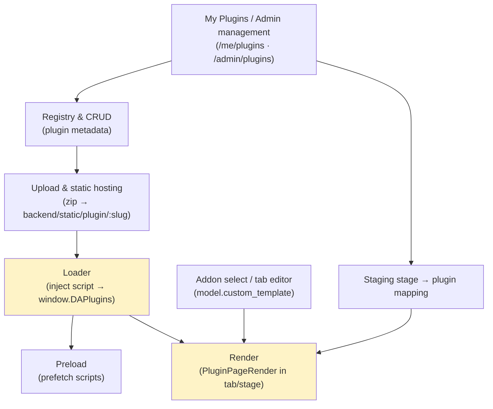
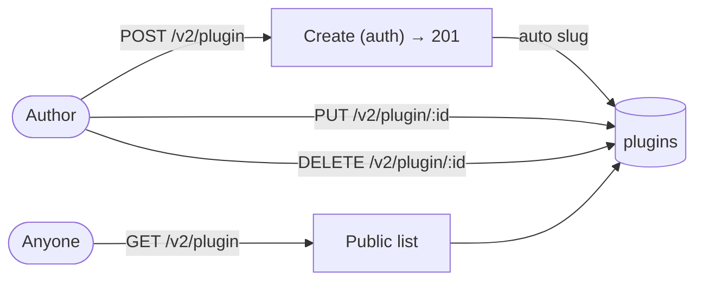
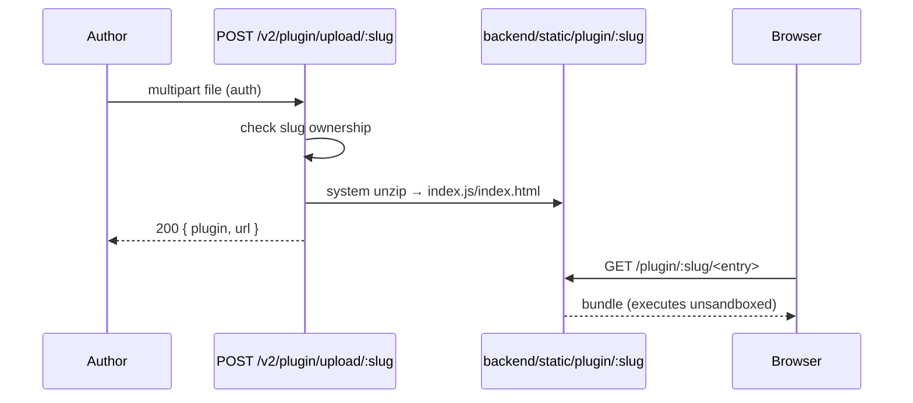
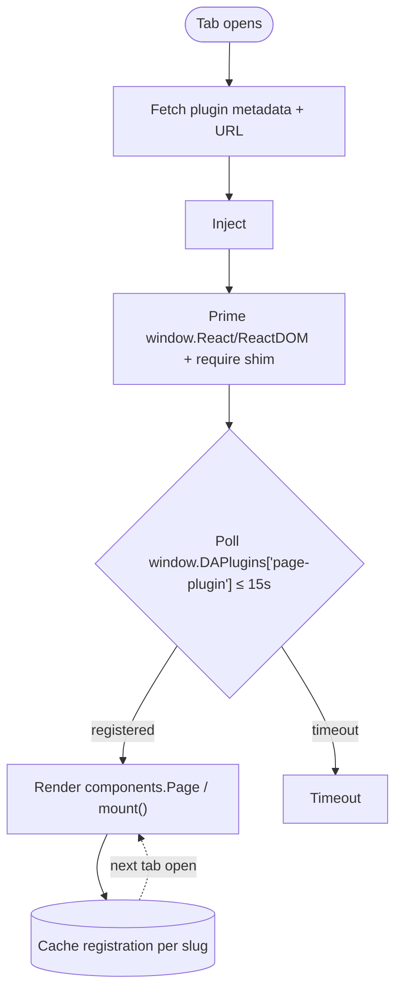
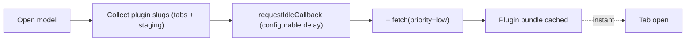
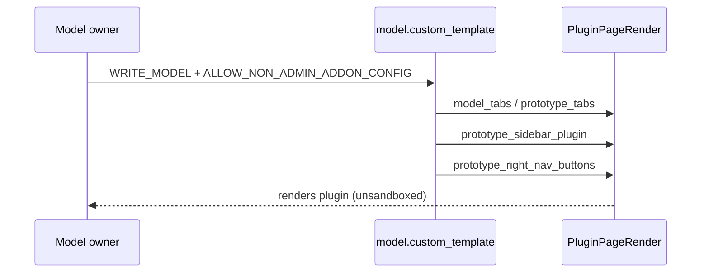
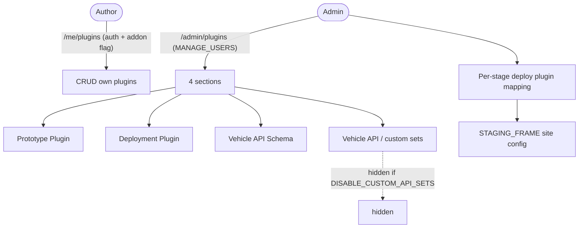

# Cluster: Plugins

Plugins are standalone bundles that AutoWRX loads at runtime and renders inside a model/prototype tab or a deploy/staging stage. As a plugin author, I can publish and host plugins; as a model owner or admin, I can attach them as addon tabs or staging stages; as an end user, I see them render in the workspace. See the [Plugin Development guide](../guides/plugin/README.md) for authoring.

**Implementation:** `routes/v2/system/plugin.route.js`, `controllers/plugin.controller.js`, `components/organisms/{PluginPageRender,PluginForm}.tsx`

---

## Capabilities in this cluster

| ID | Capability |
|----|------------|
| [CAP-PLUGIN-01](#cap-plugin-01--plugin-registry--crud) | Plugin registry & CRUD |
| [CAP-PLUGIN-02](#cap-plugin-02--internal-plugin-upload--static-hosting) | Internal plugin upload & static hosting |
| [CAP-PLUGIN-03](#cap-plugin-03--plugin-loader) | Plugin loader |
| [CAP-PLUGIN-04](#cap-plugin-04--plugin-preloading) | Plugin preloading |
| [CAP-PLUGIN-05](#cap-plugin-05--sample-plugins) | Sample plugins |
| [CAP-PLUGIN-06](#cap-plugin-06--addon-select--custom-tab-editor) | Addon select / custom tab editor |
| [CAP-PLUGIN-07](#cap-plugin-07--my-plugins--admin-plugin-management) | My Plugins & admin Plugin management |

## CAP-PLUGIN-01 — Plugin registry & CRUD

### Description

As a plugin author, I can publish a plugin (for prototype tabs or for deploy/staging stages) from the plugin form by entering a name, description, image, entry-point URL, and configuration, so that model owners and admins can attach it as a workspace tab or a deploy/staging stage. The slug is generated from the name and edits are ownership-gated.

### Who uses it / value

Plugin authors (publish plugins); model owners/admins (attach plugins as addon tabs).

### Acceptance criteria

- When I open the plugin create form, fill in the name, description, image, URL, and config, and save, my plugin is created and appears in the plugin list with a slug auto-generated from the name.
- When I open and edit my own plugin, my changes are saved; when I try to edit or delete another author's plugin, I am prevented (the action is denied).
- When I edit a plugin, the slug cannot be changed.
- When I browse the public plugin list, I see all published plugins; when I open my own plugins view, I see only the plugins I own.
- When the required fields (name, URL) are missing, the Save button is disabled and I cannot publish.

### API contract

- `GET /v2/plugin` (public) → public list; `GET /v2/plugin/{admin,id/:id,slug/:slug}` → admin/own/by-id/by-slug results; `GET /v2/plugin/mine` (auth) → my own plugins; `POST /v2/plugin` (auth) → creates the plugin, returns `201`; `PUT /v2/plugin/:id` (auth + ownership/admin) → updates, returns `200`; `DELETE /v2/plugin/:id` (auth + ownership/admin) → deletes, returns `204`.
- Create auto-generates a unique `slug` (with auto-suffix); update rejects `slug` (immutable).

### Quality control

- When I create a plugin, I see the auto-generated slug; when I read the public list, my plugin appears; when I edit my own plugin, it succeeds; when I try to edit another user's plugin, the system returns `403`; when I delete my own plugin, the system returns `204`.

### Security

Reads public; writes require auth + ownership (or admin). The upload admin gate is commented out — any authenticated user can upload (subject to per-slug ownership).

**Coverage:**
- **Auth:** Reads are public (`GET /v2/plugin`, `/admin`, `/id/:id`, `/slug/:slug`); writes (POST/PUT/DELETE/`mine`) require authentication.
- **Authorization:** Update/delete require owner-or-admin; create has no admin gate; the upload admin gate is disabled (commented out), so any authenticated user can upload.
- **Input validation:** Caller must send valid plugin fields (validated on create/update/list/get); `slug` is rejected on update; `config` is not validated (accepted as-is); `url` is URI-validated only for external plugins.
- **Rate limiting:** not applied — `authLimiter` is defined but not wired into any plugin route (or any route at all).
- **Secrets:** none handled by CRUD; the untyped `config` field could hold author-supplied secrets, but they are not protected or surfaced specially.

**Risks:**
- **Anonymous-style metadata spoofing:** public read access lets attackers enumerate all plugin slugs, URLs, and config, mapping the attack surface for later exploitation or impersonation via look-alike slugs. *Mitigation:* none currently — public read is by design for plugin discovery; constrain sensitive values in `config` and consider slug look-alike warnings.
- **Ownership bypass on update/delete:** a broken ownership check would let any authenticated user overwrite or delete another author's plugin, swapping a trusted bundle for a malicious one (supply-chain takeover). *Mitigation:* owner-or-admin check enforced on PUT/DELETE; monitor for check regressions.
- **Commented-out admin gate:** with the `ADMIN` check disabled on upload, any authenticated user can publish plugins, lowering the bar for injecting malicious code into the registry. *Mitigation:* none currently — re-enable the admin gate on the upload route.

### Personal data processing
No — this capability does not process personal data directly; `created_by`/`updated_by` are user ObjectIds (no email/name PII collected).
N/A.
**Risks:**
- none — no personal data processed. (Author-identity linkage via `created_by`/`updated_by` ObjectIds is tracked under AutoWRX data.)

### AutoWRX data
Plugin metadata + `config` (Mixed) stored in `plugins` with `created_by`/`updated_by`.

**Coverage:**
- **Stored data:** Plugin docs in MongoDB `plugins` collection — name, slug, image, description, is_internal, url, config (Mixed), type, created_by, updated_by, timestamps.
- **Retention:** indefinite — hard delete on DELETE; no soft delete, no TTL.
- **Encryption:** TLS in transit (HTTPS); no at-rest encryption beyond MongoDB defaults; no hashing (no passwords).
- **Logging:** standard request logging only; no sensitive-data logging identified.

**Risks:**
- **Config secret leakage:** the `config` field is Mixed/untyped; if an author stores API keys or tokens in plugin config, the public `GET /v2/plugin` read exposes them to every visitor.
- **Author identity disclosure:** `created_by`/`updated_by` on a public-read document leaks which users author which plugins, enabling targeted harassment or account takeover of high-value authors.

### Test coverage
- **E2E (Playwright):** 3 test case(s) in `plugin-management.spec.ts`, `my-plugins.spec.ts` — SITEMAP: ✅
- **Estimated coverage:** ≈60% (est.) — 2 AC bullets; 3 E2E cases cover create/read/update/delete + 403; SITEMAP ✅.
- **Unit (Jest):** none

## CAP-PLUGIN-02 — Internal plugin upload & static hosting

### Description

As a plugin author, I can upload a plugin as a zip bundle and have AutoWRX host it for me, so that I do not need an external CDN. AutoWRX extracts the bundle and detects the entry point automatically.

### Who uses it / value

Plugin authors (host plugins without an external CDN); admins (bundle system plugins).

### Acceptance criteria

- When I open the plugin form, enter a name, choose "Upload ZIP", and select a zip file, the bundle is uploaded and extracted, and the entry-point URL is filled in for me.
- When I re-upload to a slug I own, my bundle is updated; when I upload to a slug owned by another non-admin user, I am prevented (the action is denied).
- When the upload or extraction fails, I see an error message and the URL is not set.

### API contract

- `POST /v2/plugin/upload/:slug` (auth; multipart `file`) → extracts the bundle, returns `200 { plugin, url }`; the plugin is served at `/plugin/<slug>/<entry>` with `is_internal=true`.
- Upload to an existing slug owned by another non-admin → `403`.

### Quality control

- When I upload a zip, it is extracted and served; when I re-upload to my own slug, the system updates it; when I upload to another user's slug, the system returns `403`.

### Security

Auth required; ownership enforced on existing slug. Upload accepts any file type (50 MB limit) and runs system `unzip` — treat as trusted code. Admin gate commented out (see above).

**Coverage:**
- **Auth:** required for `POST /v2/plugin/upload/:slug`.
- **Authorization:** ownership is enforced on existing slug (owner or admin); the admin gate is commented out, so a new slug can be uploaded by any authenticated user.
- **Input validation:** only the `slug` param is validated; the file filter accepts any file type; 50 MB size limit (`limits.fileSize`); no zip-content validation.
- **Rate limiting:** not applied — `authLimiter` defined but not wired into the upload route.
- **Secrets:** none handled by the route; bundle contents are code (authors could embed secrets, but the system does not inspect or protect them).

**Risks:**
- **Zip-slip / arbitrary file write:** invoking system `unzip` on untrusted archives risks path-traversal (zip-slip) writing files outside `static/plugin/:slug`, potentially overwriting server code or config. *Mitigation:* none currently — use a zip library that rejects `..`/absolute paths, or sanitize extraction targets.
- **Malicious bundle execution:** the uploaded bundle runs unsandboxed in every visitor's browser; a compromised or rogue author can push XSS, token theft, or data-exfiltration code to all users who open the tab. *Mitigation:* none currently — plugins run unsandboxed by design; only install trusted plugins, and don't pass tokens/PII into PluginAPI/config/data.
- **Unrestricted file type:** accepting any file type with only a 50 MB cap allows non-JS payloads (e.g. large binary blobs, polyglot files) to be hosted and abused for storage abuse or content-type confusion attacks. *Mitigation:* none currently — restrict accepted MIME types and validate bundle entrypoints.

### Personal data processing
No — this capability does not process personal data; the bundle is code, not designed to hold PII (embedded data is an author responsibility).
N/A.
**Risks:**
- none — no personal data processed.

### AutoWRX data
Plugin bundle served publicly from `/plugin/<slug>/`; the bundle can contain arbitrary JS (executes in users' browsers).

**Coverage:**
- **Stored data:** extracted bundle files on disk at `backend/static/plugin/<slug>/`; plugin doc updated with `is_internal=true` + `url`; multer temp file in `static/uploads/<date>/` (unlinked after extract).
- **Retention:** bundle files persist on disk indefinitely; not cleaned when the plugin record is deleted (stale files remain reachable).
- **Encryption:** TLS in transit; bundle served same-origin over HTTP/HTTPS; no at-rest encryption for extracted files.
- **Logging:** `console.error` on temp-file unlink failure; standard request logging.

**Risks:**
- **Public bundle exposure:** once hosted, the bundle is world-readable; any sensitive data baked into the bundle (author secrets, tenant data) is permanently exfiltrated and irretrievable.
- **Bundle persistence after delete:** extracted files under `backend/static/plugin/:slug` may persist on disk even if the registry record is deleted, leaving stale malicious code publicly reachable.

### Test coverage
- **E2E (Playwright):** 1 test case in `plugin-management.spec.ts` (ZIP upload) — SITEMAP: ✅
- **Estimated coverage:** ≈40% (est.) — 2 AC bullets; 1 E2E case covers ZIP upload + 403; no delete/cleanup test; SITEMAP ✅.
- **Unit (Jest):** none

## CAP-PLUGIN-03 — Plugin loader

### Description

As an end user, when I open a plugin tab, the plugin loads and runs inside the tab so I can use it; switching tabs and coming back keeps the plugin ready without reloading, so the experience is fast and stable.

### Who uses it / value

End users (plugin renders in tabs); plugin authors (the load contract).

### Acceptance criteria

- When I open a tab that shows a plugin, the plugin loads and renders inside the tab.
- When I switch to another tab and come back, the plugin is still there without reloading.
- When a plugin fails to load or register in time, I see a loading indicator followed by a timeout/error message instead of the plugin UI.
- When the plugin has no entry-point URL configured, I see an error message that the plugin has no URL.

### API contract

No HTTP surface — transparent runtime behavior. The loader fetches the plugin, loads it, and renders it with `{ data, editable, config, api }`; reuses the cached registration on tab switch (no reload); times out when a plugin fails to register within 15 s. `editable` is derived from `WRITE_MODEL` (advisory only). Plugin scripts run same-origin, unsandboxed.

### Quality control

- When I open a plugin tab, the plugin renders; when I switch tabs and back, it does not reload (cached); when a plugin fails to register within 15 s, I see a timeout.

### Security

Same-origin, unsandboxed — full DOM/window access. Only public site configs surfaced (secrets never exposed). `editable` from `WRITE_MODEL` permission; advisory only (plugin can ignore).

**Coverage:**
- **Auth:** N/A — tab access follows the model's read-access gating; the loader itself adds no auth.
- **Authorization:** the `editable` flag is derived from `WRITE_MODEL`; it is advisory only — a plugin can ignore it, and the system does not enforce it on the plugin side.
- **Input validation:** N/A — the loader fetches the plugin URL from the registry; bundle contents are not validated client-side.
- **Rate limiting:** N/A — client-side fetch; no rate limit on load/polling.
- **Secrets:** none — the plugin API exposes only public site config (no tokens/secrets); no auth tokens are passed to the plugin.

**Risks:**
- **Unsandboxed code execution:** a loaded plugin has full access to `window`, DOM, cookies, and `localStorage`, enabling XSS, session-token theft, and silent exfiltration of any data the page holds. *Mitigation:* none currently — plugins run unsandboxed by design; only install trusted plugins, and don't pass tokens/PII into PluginAPI/config/data.
- **Global namespace pollution:** priming `window.React`, `window.ReactDOM`, the `require` shim, and `__webpack_require__.cache` lets a malicious plugin tamper with shared globals, breaking or hijacking other plugins and the host app. *Mitigation:* none currently — consider namespacing plugin globals or sandboxing plugins in an iframe/Web Worker.
- **Advisory-only `editable`:** the `editable` flag is advisory; a plugin can ignore it and mutate model data despite the user lacking `WRITE_MODEL`, causing unauthorized data modification. *Mitigation:* none currently — enforce write checks server-side on every `PluginAPI` mutation, do not trust the client-side `editable` flag.

### Personal data processing
No — this capability does not process personal data; `data` (model/prototype contents) may carry proprietary vehicle data but no email/name PII.
N/A.
**Risks:**
- none — no personal data processed.

### AutoWRX data
Plugin receives `data` (model/prototype), public site `config`, and the `PluginAPI`; no auth tokens/secrets passed.

**Coverage:**
- **Stored data:** none — runtime only; registrations cached in memory per slug (cleared on page unload).
- **Retention:** N/A — in-memory registration cache; no persistence by the loader.
- **Encryption:** TLS in transit (script fetched over HTTPS); bundle executes same-origin, unsandboxed.
- **Logging:** none — client-side; console only.

**Risks:**
- **Model/prototype data exposure:** `data` passed to the plugin includes model and prototype contents; an unsandboxed plugin can exfiltrate proprietary vehicle data to an external endpoint.
- **`PluginAPI` abuse:** the `PluginAPI` surface, even without tokens, may expose endpoints a plugin can call to read or modify data the user didn't intend to expose.

### Test coverage
- **E2E (Playwright):** 2 test case(s) in `plugin-management.spec.ts` (plugin detail page renders) — SITEMAP: ✅
- **Estimated coverage:** ≈50% (est.) — 2 AC bullets; 2 E2E cases cover render + cache reuse; no timeout/load-failure test; SITEMAP ✅.
- **Unit (Jest):** none

## CAP-PLUGIN-04 — Plugin preloading

### Description

As an end user, when I open a model with plugin tabs, the system prefetches plugin scripts in the background so that opening a tab is instant.

### Who uses it / value

End users (faster tab loads).

### Acceptance criteria

- When I open a model that has plugin tabs or staging plugins, the plugin scripts are fetched in the background while the page is idle, so that when I open a plugin tab it appears instantly.
- I am not blocked or slowed down by the prefetching happening in the background.

### API contract

No HTTP surface — transparent runtime behavior. The system collects plugin slugs from prototype tabs and staging, and prefetches their scripts on idle (configurable delay) via `<link rel=prefetch>` + `fetch(priority=low)` with `credentials:'omit'`.

### Quality control

- When I open a model with plugin tabs, the scripts are prefetched and opening a tab is instant.

### Security

Prefetches external URLs with `credentials:'omit'`.

**Coverage:**
- **Auth:** N/A — prefetch is client-side; no auth on prefetch requests.
- **Authorization:** N/A — prefetch targets come from tab/staging config; no permission check at prefetch time.
- **Input validation:** N/A — uses plugin URLs from the registry; no allowlist on prefetch targets.
- **Rate limiting:** N/A — client-side; throttled to idle, low-priority fetching.
- **Secrets:** none — prefetch uses `credentials:'omit'`; no tokens are sent.

**Risks:**
- **External URL prefetch leak:** prefetching external plugin URLs reveals the user's browsing of a model to the external host (timing + access logs) even if the tab is never opened. *Mitigation:* `credentials:'omit'` is set; consider skipping prefetch for external URLs or adding a Subresource Integrity check.
- **Untrusted bundle warmed:** prefetching warms the cache for a bundle that will execute unsandboxed; a compromised external host can swap the bundle between prefetch and load, defeating integrity assumptions. *Mitigation:* none currently — plugins run unsandboxed by design; only install trusted plugins, and don't pass tokens/PII into PluginAPI/config/data.

### Personal data processing
No — this capability does not process personal data; prefetch sends no cookies (`credentials:'omit'`) and no PII.
N/A.
**Risks:**
- none — no personal data processed.

### AutoWRX data
Only fetches public bundle URLs.

**Coverage:**
- **Stored data:** none — browser HTTP cache only.
- **Retention:** N/A — browser cache; cleared per browser policy.
- **Encryption:** TLS in transit (HTTPS prefetch); `credentials:'omit'` sends no cookies.
- **Logging:** none — client-side.

**Risks:**
- **User activity inference:** prefetch patterns (which slugs, how many) can reveal which models a user visits, leaking usage patterns to external plugin hosts via referer/log entries.

### Test coverage
- **E2E (Playwright):** 0 — not covered — SITEMAP: ❌
- **Estimated coverage:** ≈0% (est.) — no E2E spec.
- **Unit (Jest):** none

## CAP-PLUGIN-05 — Sample plugins

### Description

As a plugin author, I can reference two sample plugins (`sample-tsx` and `sample-esm`) to learn the registration contract, so that I can build my own plugin correctly.

### Who uses it / value

Plugin authors (reference implementations).

### Acceptance criteria

- When I open a sample plugin, it renders and demonstrates how a plugin registers and runs in a tab.
- When I build the TSX sample, I get a runnable bundle I can upload and load via the test page.

### API contract

No HTTP surface — static hosting. Sample bundles (`sample-tsx`, `sample-esm`) are served from `backend/static/plugin/`; `sample-tsx` ships a build script that externalizes React. Both demonstrate the `page-plugin` registration contract.

### Quality control

- When I build `sample-tsx`, I get `index.js`; when I load it via the test page, it renders.

### Security

Same as any plugin (unsandboxed).

**Coverage:**
- **Auth:** N/A — sample assets are public; no auth to read them.
- **Authorization:** N/A — public static files; no authorization gate.
- **Input validation:** N/A — prebuilt static bundles; no runtime validation.
- **Rate limiting:** not applied — static serving has no rate limit.
- **Secrets:** none — static reference bundles.

**Risks:**
- **Copy-paste of insecure patterns:** samples are the template authors copy; if a sample ships an insecure pattern (e.g. trusting `data`, calling `eval`), it propagates to community plugins. *Mitigation:* none currently — audit sample bundles for insecure patterns before release.
- **Static asset tampering:** samples live under `backend/static/plugin/`; if write access is not restricted, an attacker who can modify them can poison the reference implementation every author trusts. *Mitigation:* none currently — restrict write access to the static plugin directory; serve samples as read-only.

### Personal data processing
No — this capability does not process personal data; samples are static reference bundles with no user data.
N/A.
**Risks:**
- none — no personal data processed.

### AutoWRX data
Static sample assets.

**Coverage:**
- **Stored data:** static files under `backend/static/plugin/` (`sample-tsx`, `sample-esm` builds + shared libs).
- **Retention:** indefinite — static files; no TTL.
- **Encryption:** TLS in transit; no at-rest encryption for static files.
- **Logging:** standard static-serving access logs.

**Risks:**
- **No user data involved:** samples are static reference bundles with no user data; the residual risk is only that a tampered sample misleads authors into embedding malicious code.

### Test coverage
- **E2E (Playwright):** 0 — not covered — SITEMAP: ❌
- **Estimated coverage:** ≈0% (est.) — no E2E spec.
- **Unit (Jest):** none

## CAP-PLUGIN-06 — Addon select / custom tab editor

### Description

As a model owner (or admin), I can add a plugin as a custom tab, reorder/edit/hide tabs, set a variant, configure a sidebar plugin and right-nav action buttons (including the built-in Staging), and choose the open mode (dialog/page), so that I can customize the workspace for my model.

### Who uses it / value

Model owners (customize workspace); admins.

### Acceptance criteria

- When I open the tab editor for my model, I can add a plugin as a custom tab, reorder tabs, hide tabs, set a variant, configure a sidebar plugin and right-nav action buttons (including the built-in Staging), and choose the open mode (dialog or page).
- When I am a non-admin without permission to manage addons, the tab editor is unavailable to me; admins can always manage tabs.
- When I save my tab layout, the configuration persists on the model and the workspace reflects my changes on the next open.
- When I add an addon tab, it renders the referenced plugin in the workspace.

### API contract

- Tab management requires `WRITE_MODEL` + `ALLOW_NON_ADMIN_ADDON_CONFIG` (admins always allowed).
- Saving stores the tab config on `model.custom_template` (`model_tabs`/`prototype_tabs`/`prototype_sidebar_plugin`/`prototype_right_nav_buttons`).

### Quality control

- When I add an addon tab, it renders; when I reorder or hide tabs, the change persists; when I configure a Staging right-nav button, it appears.

### Security

`WRITE_MODEL` + addon flag. Plugins unsandboxed.

**Coverage:**
- **Auth:** required — tab management is a write action on the model.
- **Authorization:** requires `WRITE_MODEL` + `ALLOW_NON_ADMIN_ADDON_CONFIG` (admins always allowed); non-admins are gated by the addon flag.
- **Input validation:** tab config is stored on `model.custom_template` (Mixed); validated at the model-update layer, not plugin-specific; no allowlist on referenced plugin IDs/slugs.
- **Rate limiting:** not applied — `authLimiter` defined but not used on model-update routes.
- **Secrets:** none — tab config references plugin IDs/slugs and layout only.

**Risks:**
- **Malicious tab injection:** a non-admin bypassing `ALLOW_NON_ADMIN_ADDON_CONFIG` could inject a hostile plugin tab into every visitor's view, running arbitrary unsandboxed code (XSS / token theft) across the whole model audience. *Mitigation:* `WRITE_MODEL` + addon flag gate enforced; audit flag default and enforce plugin allowlists.
- **Sidebar/right-nav persistence:** sidebar and right-nav buttons are always-visible surfaces; a malicious plugin placed there executes on every model open, not just when a tab is activated. *Mitigation:* none currently — plugins run unsandboxed by design; only install trusted plugins, and don't pass tokens/PII into PluginAPI/config/data.
- **Supply-chain via referenced plugin IDs:** tab config references plugin IDs/slugs; if a referenced plugin is later compromised, the layout becomes a dormant delivery channel for malicious code. *Mitigation:* none currently — pin plugin versions or re-validate referenced plugins on load.

### Personal data processing
No — this capability does not process personal data; tab/layout config references plugin IDs/slugs and layout only.
N/A.
**Risks:**
- none — no personal data processed.

### AutoWRX data
Tab/layout config on the model document.

**Coverage:**
- **Stored data:** `model.custom_template` (`model_tabs`/`prototype_tabs`/`prototype_sidebar_plugin`/`prototype_right_nav_buttons`) in MongoDB.
- **Retention:** indefinite — lives with the model document; removed when the model is deleted.
- **Encryption:** TLS in transit; no at-rest encryption beyond MongoDB defaults.
- **Logging:** standard request logging on model save.

**Risks:**
- **Untrusted-code distribution channel:** the tab layout is a persisted delivery channel — a malicious layout keeps steering visitors toward running untrusted plugins until it is noticed and removed.
- **Layout as metadata leak:** `custom_template` reveals which plugins and staging stages a model relies on, exposing internal architecture to anyone with read access.

### Test coverage
- **E2E (Playwright):** 2 test case(s) in `plugin-management.spec.ts` (add plugin tab via + button) — SITEMAP: ✅
- **Estimated coverage:** ≈50% (est.) — 2 AC bullets; 2 E2E cases cover add-tab via + button; no reorder/hide/staging test; SITEMAP ✅.
- **Unit (Jest):** none

## CAP-PLUGIN-07 — My Plugins & admin Plugin management

### Description

As a plugin author, I can manage my own plugins from the My Plugins page (create, edit, delete), so that I can publish and maintain my work. As an admin, I can manage all plugins from the admin Plugin Management page across four sections (Prototype Plugin, Deployment Plugin, Vehicle API Schema, Vehicle API/custom sets) and configure deploy plugins per staging stage.

### Who uses it / value

Plugin authors (manage own plugins); admins (manage all + custom APIs).

### Acceptance criteria

- When I open the My Plugins page, I can create, edit, and delete my own plugins.
- When I am a non-admin and addon configuration is restricted to admins, the My Plugins page is hidden from me.
- When I open the admin Plugin Management page, I see four sections; when custom API sets are disabled for the tenant, the Vehicle API Schema and Vehicle API/custom sets sections are hidden.
- When I am not an admin and open the admin Plugin Management page, I see an "Access denied" message.
- When I configure a deploy plugin per staging stage as an admin, that plugin launches from Staging.

### API contract

- `/me/plugins` (auth; shown to non-admins only when `ALLOW_NON_ADMIN_ADDON_CONFIG`) → CRUD own plugins.
- `/admin/plugins` (`MANAGE_USERS`) → 4 sections; the custom API sections are hidden when `DISABLE_CUSTOM_API_SETS`.

### Quality control

- As an author, when I create a plugin via `/me/plugins`, it is usable as an addon; as an admin, when I configure a deploy plugin per staging stage, it launches from Staging.

### Security

My Plugins auth; admin `MANAGE_USERS`; non-admin visibility gated by addon flag.

**Coverage:**
- **Auth:** required for `/me/plugins` and `/admin/plugins`; non-admin visibility is gated by `ALLOW_NON_ADMIN_ADDON_CONFIG`.
- **Authorization:** `/me/plugins` → my own plugins (auth); `/admin/plugins` → `MANAGE_USERS` (admin).
- **Input validation:** same validation as CAP-PLUGIN-01 (create/update via shared `/v2/plugin` endpoints); `config` is not validated (accepted as-is).
- **Rate limiting:** not applied — `authLimiter` defined but not used on plugin routes.
- **Secrets:** none — the admin UI manages plugin records and per-stage mapping; no secrets handled.

**Risks:**
- **Flag misconfiguration widens authoring:** if `ALLOW_NON_ADMIN_ADDON_CONFIG` defaults to true, any authenticated user can author and publish plugins, enlarging the supply-chain attack surface. *Mitigation:* flag is site-config driven; set it to `false` on sensitive tenants and audit who can author plugins.
- **Admin plugin takeover:** a stolen `MANAGE_USERS` session lets an attacker reconfigure or replace any plugin (including deploy plugins that run during staging), turning admin actions into platform-wide compromise. *Mitigation:* require re-auth / step-up auth for admin plugin management; audit-log admin plugin changes.
- **Deploy-plugin execution context:** deploy plugins configured per staging stage run in the staging/deploy pipeline; a malicious deploy plugin can interfere with deployments or exfiltrate build artifacts. *Mitigation:* none currently — plugins run unsandboxed by design; only install trusted plugins, and don't pass tokens/PII into PluginAPI/config/data.

### Personal data processing
No — this capability does not process personal data directly; `created_by`/`updated_by` are user ObjectIds (no email/name PII collected).
N/A.
**Risks:**
- none — no personal data processed. (Author-identity linkage via `created_by`/`updated_by` ObjectIds is tracked under AutoWRX data.)

### AutoWRX data
Plugin records + per-stage config (`STAGING_FRAME` site config holds stage → plugin mapping).

**Coverage:**
- **Stored data:** plugin records in MongoDB `plugins`; `STAGING_FRAME` site config (stage → plugin mapping) in site config.
- **Retention:** indefinite — hard delete via `DELETE /v2/plugin/:id`; no soft delete/TTL.
- **Encryption:** TLS in transit; no at-rest encryption beyond MongoDB defaults.
- **Logging:** standard request logging.

**Risks:**
- **Stage-to-plugin mapping exposure:** the `STAGING_FRAME` mapping reveals deployment topology (which stages run which plugins); an attacker can target the weakest plugin or stage for disruption.
- **Custom API set persistence:** Vehicle API/custom set records persist admin-defined API shapes; a malicious or compromised admin can silently alter API contracts that downstream consumers depend on.

### Test coverage
- **E2E (Playwright):** 3 test case(s) in `plugin-management.spec.ts`, `my-plugins.spec.ts` — SITEMAP: ✅
- **Estimated coverage:** ≈60% (est.) — 2 AC bullets; 3 E2E cases cover /me + /admin CRUD + staging; SITEMAP ✅.
- **Unit (Jest):** none