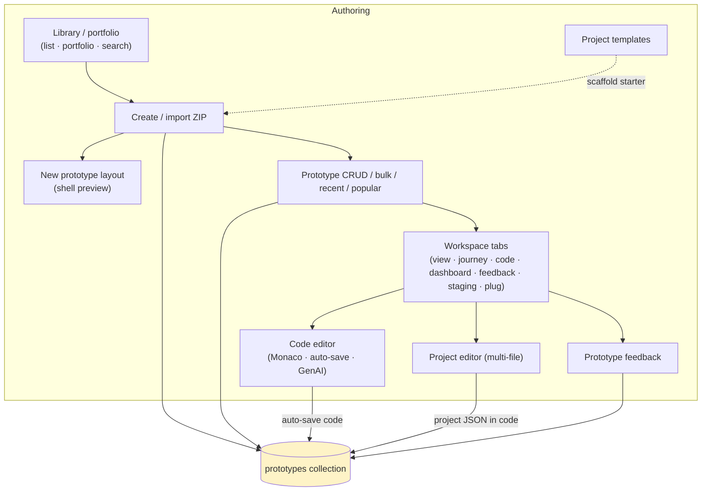
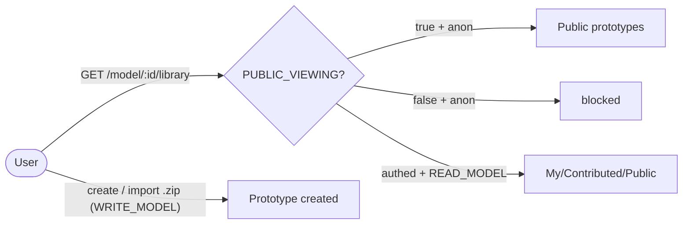
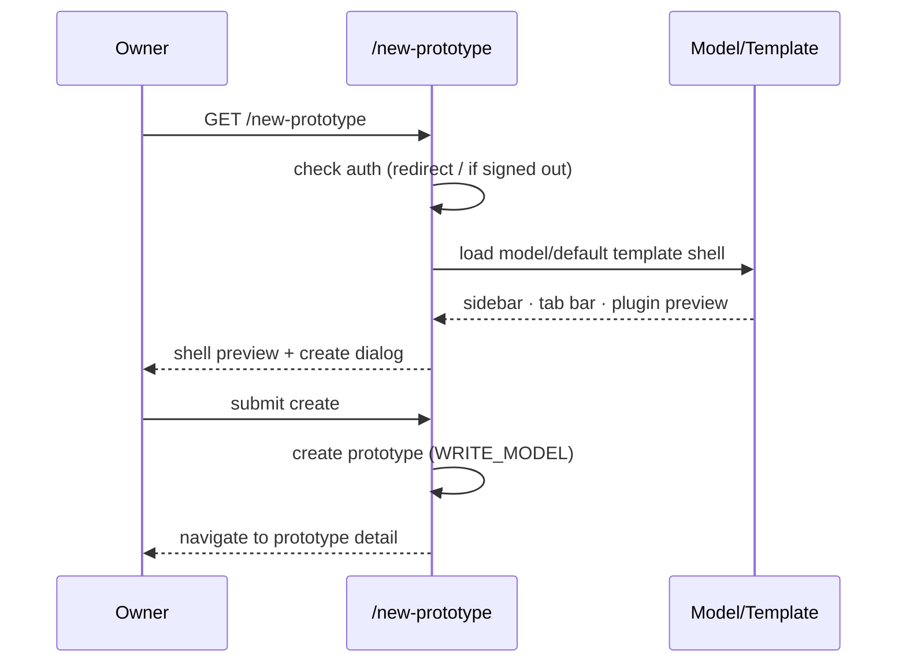
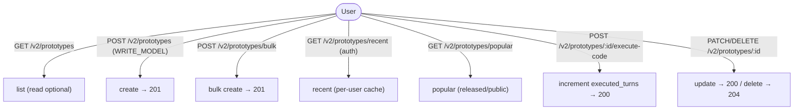
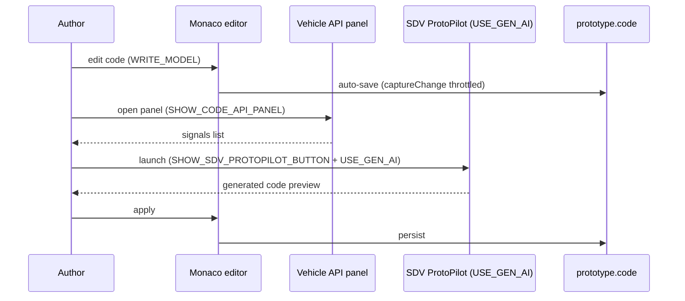
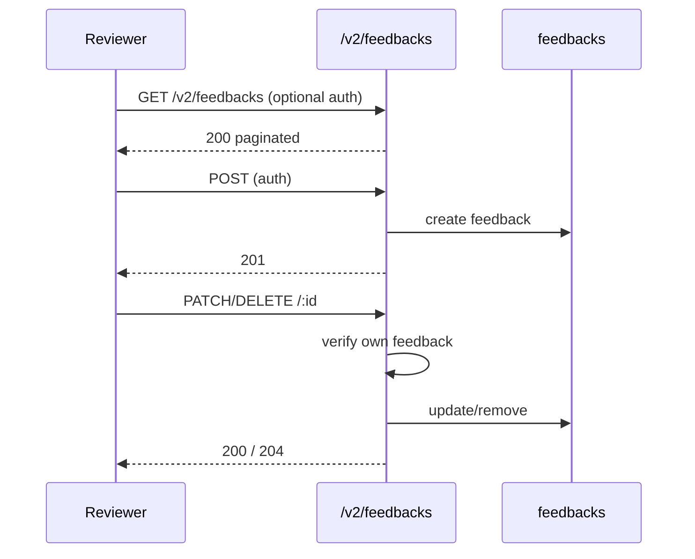
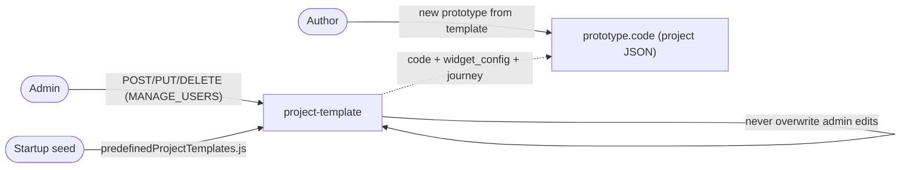

# Cluster: Prototypes & Code

As a model author or contributor, I can create, organize, and iterate on a model's prototypes — browsing the library, scaffolding new prototypes from templates, editing code in the browser, gathering reviewer feedback, and publishing starter projects — so I can build and share SDV features end to end.

**Implementation:** `routes/v2/vehicle-data/prototype.route.js`, `models/prototype.model.js`; frontend `pages/{PagePrototypeLibrary,PagePrototypeDetail}.tsx`, `layouts/NewPrototypeLayout.tsx`.



---

## Capabilities in this cluster

| ID | Capability |
|----|------------|
| [CAP-PROTO-01](#cap-proto-01--prototype-library) | Prototype library |
| [CAP-PROTO-02](#cap-proto-02--new-prototype-layout) | New prototype layout |
| [CAP-PROTO-03](#cap-proto-03--prototype-crud--bulk--recent--popular--execute-code) | Prototype CRUD / bulk / recent / popular / execute-code |
| [CAP-PROTO-04](#cap-proto-04--prototype-workspace-tabs) | Prototype workspace (tabs) |
| [CAP-PROTO-05](#cap-proto-05--code-editor) | Code editor |
| [CAP-PROTO-06](#cap-proto-06--project-editor-multi-file) | Project editor (multi-file) |
| [CAP-PROTO-07](#cap-proto-07--prototype-feedback) | Prototype feedback |
| [CAP-PROTO-08](#cap-proto-08--project-templates) | Project templates |


## CAP-PROTO-01 — Prototype library

### Description

As a model owner or contributor, I can browse, search, and sort a model's prototypes across list and portfolio views, and create new prototypes or import them from a ZIP archive, so I can manage and showcase my model's SDV work.

### Who uses it / value

Model owners/contributors (manage prototypes); end users (browse/portfolio).

### Acceptance criteria

- When I open `/model/:id/library[/:tab(list|portfolio)[/:prototype_id]]`, the system renders the library.
- When I create or import a prototype, the system requires `WRITE_MODEL`; when I browse, the system allows public viewing only while `PUBLIC_VIEWING` is on.
- When I submit a duplicate name, the system offers alternative name suggestions.

### Quality control

As a creator, I create a prototype and it appears in the list; I switch between list and portfolio views; I import a prototype ZIP and a prototype is created; I sort by name and the list is ordered.



### Security

Creating or importing requires `WRITE_MODEL`; browsing is public only under `PUBLIC_VIEWING`, with private models requiring `READ_MODEL`.

**Coverage:**
- **Auth:** Optional via `PUBLIC_VIEWING` for reads; required for create/import.
- **Authorization:** `WRITE_MODEL` required to create/import; private-model reads gated by `READ_MODEL`; reads scoped to models I can access.
- **Input validation:** I must send `model_id` as an objectId and `name` up to 255 chars; ZIP import entries are not path-traversal sanitized.
- **Rate limiting:** not applied (the global auth rate limiter is unused).
- **Secrets:** none.

**Risks:**
- **Private-prototype enumeration:** if server-side access scoping lags behind `PUBLIC_VIEWING`, a signed-out or cross-tenant user could enumerate private prototypes through list/portfolio filters, leaking proprietary SDV code.
- **Malicious ZIP import:** import reads archive contents; an attacker-crafted archive could exploit path traversal or oversized payloads during extraction to corrupt storage or inject code.

### Data protection

Prototype metadata and code are stored; import reads archive contents.

**Coverage:**
- **Stored data:** `prototypes` collection (name, code, model_id, description, image_file, created_by); ZIP archive contents read during import.
- **PII:** no — only prototype metadata and author reference.
- **Retention:** indefinite (hard delete on `DELETE`, no soft-delete/TTL).
- **Encryption:** none at rest; TLS in transit via platform.
- **Logging:** change log records create/update/remove; malformed `extend`/`requirements_data` JSON triggers a warning.

**Risks:**
- **Source data loss on bad import:** a malformed or hostile ZIP could overwrite or shadow existing prototype code during import without a rollback path.
- **Code exposure via visibility:** a prototype under a private model still stores full source code; a misapplied `PUBLIC_VIEWING` toggle exposes that code to anonymous users.

### Test coverage
- **E2E (Playwright):** 4 test case(s) in `prototype.spec.ts` + `prototype-extended.spec.ts` — SITEMAP: ✅
- **Unit (Jest):** none

## CAP-PROTO-02 — New prototype layout

### Description

As a model owner, I can use a guided full-page create flow that previews the selected model's (or default template's) prototype shell — sidebar, tab bar, plugin preview — behind the create dialog, then takes me to my new prototype, so I can start a prototype with a clear picture of the result.

### Who uses it / value

Model owners (a guided create experience).

### Acceptance criteria

- When I open `/new-prototype` without signing in, the system redirects me to `/`.
- When `ENABLE_NEW_PROTOTYPE_PAGE` is on (default `false`), the system enables the `/new-prototype` flow.
- When I pass `?create-model`, the system supports model-creation mode.

### Quality control

With the flag on, I open `/new-prototype`, see the shell preview and create dialog, submit, and the system navigates me to the new prototype detail; signed out, I'm redirected to `/`.



### Security

Access requires sign-in; the flow is gated by `ENABLE_NEW_PROTOTYPE_PAGE`.

**Coverage:**
- **Auth:** required (redirects to `/` if signed out); gated by `ENABLE_NEW_PROTOTYPE_PAGE`.
- **Authorization:** the underlying create re-checks `WRITE_MODEL` (CAP-PROTO-03).
- **Input validation:** my create submission is validated (`model_id` objectId, `name` max 255); preview reads the model/template shell.
- **Rate limiting:** not applied.
- **Secrets:** none.

**Risks:**
- **Flag-bypass create:** if the `ENABLE_NEW_PROTOTYPE_PAGE` guard were bypassed or the underlying create endpoint didn't re-check `WRITE_MODEL`, an unauthenticated user reaching `/new-prototype` could open a model-scoped create flow.
- **Template-driven code injection:** the shell preview loads a template's plugin config; a compromised template could render unsandboxed plugin code during creation.

### Data protection

No extra data is stored; the system reads the model/template to preview.

**Coverage:**
- **Stored data:** none directly (preview only); the subsequent create stores a prototype via CAP-PROTO-03.
- **PII:** no.
- **Retention:** N/A (no data stored by this capability).
- **Encryption:** none (preview read of model/template).
- **Logging:** none specific.

**Risks:**
- **Template data leakage:** previewing the default template exposes template layout/plugin references to any author; a misconfigured template could leak references to private plugins or internal assets.

### Test coverage
- **E2E (Playwright):** 1 test case(s) in `prototype.spec.ts` — SITEMAP: ✅
- **Unit (Jest):** none

## CAP-PROTO-03 — Prototype CRUD / bulk / recent / popular / execute-code

### Description

As a prototype owner, I can create, update, and delete prototypes — including bulk create — so I can manage their lifecycle; as an end user, I can browse my recent prototypes and a popular (top-executed, released, public) list, and the system counts each code execution so popularity reflects real use.

### Who uses it / value

Owners (lifecycle); end users (discover recent/popular); analytics (execution counts).

### Acceptance criteria

- When I call `GET /v2/prototypes`, the system returns the list (public browsing when `PUBLIC_VIEWING` is on); when I call `POST /v2/prototypes`, the system requires `WRITE_MODEL` and creates a prototype.
- When I call `POST /v2/prototypes/bulk`, the system bulk-creates and returns `201`.
- When I call `GET /v2/prototypes/recent` (signed in), the system returns `200` with my recent prototypes.
- When I call `GET /v2/prototypes/popular`, the system returns `200` with top-executed/released/public prototypes.
- When I call `GET /v2/prototypes/:id`, the system returns `200` (private models require `READ_MODEL`); when I call `PATCH /v2/prototypes/:id`, it returns `200`; when I call `DELETE /v2/prototypes/:id`, it returns `204`.
- When I call `POST /v2/prototypes/:id/execute-code`, the system returns `200` and increments the execution counter.

### Quality control

I create a prototype and get `201`; I run code and the execute counter increments; my recent list reflects my activity; the popular list shows released/public prototypes.



### Security

Writes require `WRITE_MODEL`; the recent list requires sign-in; reads are public only under `PUBLIC_VIEWING`, with private models gated by `READ_MODEL`.

**Coverage:**
- **Auth:** reads optional via `PUBLIC_VIEWING`; writes, `recent`, and `execute-code` require sign-in.
- **Authorization:** `WRITE_MODEL` required for `POST`/`PATCH`/`DELETE`/`bulk`; private-model reads gated by `READ_MODEL`.
- **Input validation:** I must send `model_id` as an objectId, `name` up to 255 chars, and a valid `state` value.
- **Rate limiting:** not applied — bulk-create and execute-code are unguarded.
- **Secrets:** none.

**Risks:**
- **Bulk-create abuse:** `POST /v2/prototypes/bulk` without rate limiting lets an attacker spawn many prototypes, exhausting storage and polluting the model namespace.
- **Counter inflation:** `execute-code` is unauthenticated relative to popularity ranking; an attacker could inflate `executed_turns` to manipulate the popular list.
- **Cross-tenant read:** if `READ_MODEL` isn't enforced for private models on `GET /v2/prototypes/:id`, a user could read private prototype code by ID.

### Data protection

The system stores `last_viewed`, `executed_turns`, `rated_by`, and `state` per prototype; the recent list is sourced from the cache service.

**Coverage:**
- **Stored data:** `prototypes` (last_viewed, executed_turns, rated_by Map, state, code); recent list sourced from the external cache (`CACHE_URL`, `/get-recent-activities/:userId`).
- **PII:** no direct PII; the recent list is a per-user activity trail (prototype ids + times) tied to my userId.
- **Retention:** indefinite (hard delete, no soft-delete; recent-cache retention governed by the external cache service).
- **Encryption:** none at rest; TLS in transit.
- **Logging:** change log records create/update/remove; cache fetch failures are logged.

**Risks:**
- **Activity profiling:** `last_viewed` and recent lists are per-user activity trails; a compromised account exposes which prototypes a user touched and when.
- **Irreversible delete:** `DELETE /v2/prototypes/:id` hard-removes the prototype (no soft-delete), so accidental or malicious deletion is permanent source-data loss.

### Test coverage
- **E2E (Playwright):** 4 test case(s) in `prototype.spec.ts` + `prototype-extended.spec.ts` + `prototype-runtime.spec.ts` — SITEMAP: ⚠️
- **Unit (Jest):** none

## CAP-PROTO-04 — Prototype workspace (tabs)

### Description

As a prototype author or reviewer, I can open a prototype's workspace and switch between built-in tabs (view, journey, code, dashboard, feedback, staging, plug) plus custom plugin tabs, and configure right-nav actions, so I can build, review, stage, and present a prototype in one place.

### Who uses it / value

Authors (build); reviewers (feedback); operators (staging); end users (view).

### Acceptance criteria

- When I open `/model/:id/library/prototype/:pid[/:tab]`, the system renders the workspace with tabs `view|journey|code|dashboard|feedback|staging|plug`.
- When I manage addon tabs, the system requires `WRITE_MODEL` and `ALLOW_NON_ADMIN_ADDON_CONFIG`; when I choose "Save as Template", the system requires admin; Staging requires sign-in and prototype code.
- I can collapse the plugin sidebar, add/manage addon tabs, and use the "Customize Layout" editor.

### Quality control

I switch each tab and the correct content renders; I add an addon tab and it loads; I reorder tabs and the order persists; for a code-less prototype, Staging is hidden.


### Security

Tab management requires `WRITE_MODEL` + `ALLOW_NON_ADMIN_ADDON_CONFIG`; Staging requires sign-in; a plugin tab can access the page like any other script (unsandboxed).

**Coverage:**
- **Auth:** reads optional via `PUBLIC_VIEWING`; addon/tab management requires sign-in + `WRITE_MODEL` + `ALLOW_NON_ADMIN_ADDON_CONFIG`; Staging requires sign-in.
- **Authorization:** `WRITE_MODEL` for addon add/manage; "Save as Template" requires admin (`MANAGE_USERS`).
- **Input validation:** tab/addon config is loosely validated (`extend` accepts any JSON, `widget_config` a JSON string); a plugin tab can access the page like any other script.
- **Rate limiting:** not applied.
- **Secrets:** none.

**Risks:**
- **Malicious addon tab:** plugins run unsandboxed via `PluginPageRender`; if the `ALLOW_NON_ADMIN_ADDON_CONFIG` gate were bypassed, a non-admin could inject a hostile tab into every visitor's view (XSS / token theft).
- **Staging bypass:** Staging requires auth + prototype code; a missing check could expose staging execution to anonymous users or code-less prototypes.

### Data protection

Tab config and `extend` (the plugin data sink) are stored on the prototype; `last_viewed` is updated on each visit.

**Coverage:**
- **Stored data:** `prototype.extend` (Mixed, plugin data sink), tab/right-nav config, `last_viewed` updated per visit.
- **PII:** no direct PII; `last_viewed` is a viewing log tied to my session.
- **Retention:** indefinite (lives with the prototype; hard-deleted with it).
- **Encryption:** none at rest; TLS in transit.
- **Logging:** change log records updates; view tracking persisted to `last_viewed`.

**Risks:**
- **Plugin data sink persistence:** `extend` stores arbitrary plugin-supplied data on the prototype; a malicious plugin could persist hostile payloads that re-activate on every visit.
- **View-tracking exposure:** `last_viewed` updates on every visit, creating a fine-grained viewing log tied to the visitor's session.

### Test coverage
- **E2E (Playwright):** 8 test case(s) in `prototype.spec.ts` + `prototype-extended.spec.ts` + `prototype-tabs.spec.ts` — SITEMAP: ⚠️
- **Unit (Jest):** none

## CAP-PROTO-05 — Code editor

### Description

As a prototype author, I can write and edit SDV code in the Monaco editor with auto-save, browse the Vehicle API panel, launch the SDV ProtoPilot GenAI tool to generate code, and view a diff of changes, so I can iterate on my prototype's code efficiently.

### Who uses it / value

Prototype authors (write/edit SDV code); GenAI users (generate code).

### Acceptance criteria

- When I edit code, the system requires `WRITE_MODEL` and auto-saves my changes; the language label reflects Python or Rust.
- When `SHOW_CODE_API_PANEL=true`, the system shows the Vehicle API panel.
- When `SHOW_SDV_PROTOPILOT_BUTTON=true` and I have `USE_GEN_AI`, the system shows the SDV ProtoPilot button.
- When `SHOW_CODE_DIFF=true`, the system shows a code diff after generation.

### Quality control

I edit code and it auto-saves; I open the API panel and see the signals list; I run ProtoPilot and see a generated-code preview, then apply it; I toggle diff and see the changes.



### Security

Editing requires `WRITE_MODEL`; GenAI is gated by `USE_GEN_AI` and the `SHOW_SDV_PROTOPILOT_BUTTON` flag.

**Coverage:**
- **Auth:** required for edit.
- **Authorization:** `WRITE_MODEL`.
- **Input validation:** `code` accepts any string (including empty) — no language or safety validation; GenAI output is applied directly to my prototype code.
- **Rate limiting:** not applied; GenAI calls go to the external `GENAI_SDV_APP_ENDPOINT`.
- **Secrets:** the GenAI endpoint config (`GENAI_SDV_APP_ENDPOINT`, `USE_GEN_AI`) lives in site config, not in my prototype.

**Risks:**
- **GenAI prompt-injection:** generated code from ProtoPilot is applied to `prototype.code`; a malicious prompt could inject code that runs in staging or exfiltrates prototype data when later executed.
- **Unauthed auto-save:** if the `WRITE_MODEL` check were skipped on the auto-save path, any viewer could overwrite an author's code with no version history to revert.

### Data protection

My code (potentially large) is stored in `prototype.code`; auto-save writes frequently.

**Coverage:**
- **Stored data:** `prototype.code` (string or JSON project descriptor); auto-save writes frequently (throttled).
- **PII:** no (source code only).
- **Retention:** indefinite (no version history; hard-deleted with the prototype).
- **Encryption:** none at rest; TLS in transit.
- **Logging:** change log records updates; code content is not logged by this path.

**Risks:**
- **Source data loss on autosave:** frequent auto-save with no history means a bad paste or GenAI apply can irreversibly overwrite the author's prior code with no recovery trail.
- **Large-payload bloat:** unthrottled code growth could bloat the `prototypes` document, degrading backups and reads.

### Test coverage
- **E2E (Playwright):** 2 test case(s) in `prototype-tabs.spec.ts` + `prototype-runtime.spec.ts` — SITEMAP: ⚠️
- **Unit (Jest):** none

## CAP-PROTO-06 — Project editor (multi-file)

### Description

As an author of a multi-file SDV project, I can use a file-tree editor to create, rename, and delete files and folders, open multiple file tabs, track unsaved changes, save-all, import/export a ZIP, and edit each file in its own Monaco editor — so I can build structured, multi-file prototypes.

### Who uses it / value

Authors of multi-file SDV projects.

### Acceptance criteria

- When my `prototype.code` is a JSON project, the system activates the project editor; editing requires `WRITE_MODEL`.
- I can create/rename/delete files and folders, open tabs, save-all, and import/export a ZIP.

### Quality control

I add a file and it appears in the tree; I edit and save-all and it persists; I export a ZIP and get a valid archive containing my files.

```mermaid
flowchart TD
    A([Author]) -->|"activate when code = JSON project"| PE["Project editor"]
    PE -->|create/rename/delete| T["File tree"]
    PE -->|open tabs| Tabs["Per-file Monaco"]
    PE -->|save-all (WRITE_MODEL)| DB["prototype.code (JSON)"]
    PE -->|import .zip| ZI["parse archive → files"]
    PE -->|export .zip| ZO["ZIP archive of all files"]
```

### Security

Editing requires `WRITE_MODEL`. GitHub-based git sync is partially wired but not active.

**Coverage:**
- **Auth:** required.
- **Authorization:** `WRITE_MODEL`.
- **Input validation:** file ops act on paths inside the JSON project — `../` traversal is not explicitly validated; ZIP import must sanitize entry names.
- **Rate limiting:** not applied.
- **Secrets:** partial GitHub auth wiring exists for an intended git sync (not active).

**Risks:**
- **Path traversal in file ops:** create/rename/delete operate on paths inside the JSON project; without validation an attacker could craft `../` paths to escape the project root and overwrite unrelated files.
- **ZIP import traversal:** importing a ZIP with malicious entry names (`../`) could write files outside the project tree if extraction doesn't sanitize paths.
- **Partial git-sync exposure:** the partial GitHub auth wiring, if reachable, could leak credentials or push prototype code to an unintended remote.

### Data protection

The whole project is stored as JSON in `prototype.code`; an export ZIP contains every file.

**Coverage:**
- **Stored data:** entire project as JSON in `prototype.code`; export ZIP bundles all files.
- **PII:** no (project source files).
- **Retention:** indefinite (no per-file history; the whole project is overwritten on save-all).
- **Encryption:** none at rest; TLS in transit.
- **Logging:** change log records updates.

**Risks:**
- **Bulk source loss:** a single destructive file delete or a corrupt save-all overwrites the entire project JSON; with no per-file history, the whole project can be lost at once.
- **Export exfiltration:** export ZIP bundles every project file, so a leaked edit token lets an attacker steal the complete multi-file source in one action.

### Test coverage
- **E2E (Playwright):** 0 — not covered — SITEMAP: ❌
- **Unit (Jest):** none

## CAP-PROTO-07 — Prototype feedback

### Description

As a reviewer, I can leave star-rated feedback (need addressed, relevance, ease of use — 1 to 5, averaged) with a description and interview metadata, and manage my own feedback, so I can help owners improve their prototypes.

### Who uses it / value

Reviewers (give feedback); owners (improve prototypes).

### Acceptance criteria

- When I call `GET /v2/feedbacks`, the system returns `200` paginated (public browsing when `PUBLIC_VIEWING` is on).
- When I call `POST /v2/feedbacks` (signed in), the system creates feedback and returns `201`.
- When I call `PATCH /v2/feedbacks/:id` or `DELETE /v2/feedbacks/:id`, the system returns `200` or `204` and only lets me act on my own feedback.
- In the UI `feedback` tab, I can list feedback, add it via a form, and delete only my own.

### Quality control

I add feedback and it appears with the averaged score; I try to delete another user's feedback and it's not allowed; pagination works.



### Security

Adding feedback requires sign-in; deleting or editing is limited to my own feedback.

**Coverage:**
- **Auth:** `POST`/`PATCH`/`DELETE` require sign-in; `GET` optional via `PUBLIC_VIEWING`.
- **Authorization:** `PATCH`/`DELETE` are own-only (the system rejects acting on another user's feedback with FORBIDDEN).
- **Input validation:** I must send scores 1–5, a required `interviewee.name`, and `description`/`question`/`recommendation` up to 2000 chars.
- **Rate limiting:** not applied — burner-account spam is possible.
- **Secrets:** none.

**Risks:**
- **Impersonated feedback:** if the own-only check on `PATCH/DELETE` is missing, a user could delete or alter others' feedback, manipulating a prototype's averaged scores.
- **Anonymous spam:** `POST` only requires sign-in, so a burner account could flood feedback with biased ratings to inflate or tank a prototype's score.

### Data protection

Feedback stores interviewee (name/organization), scores, and `ref`/`model_id`; no secrets.

**Coverage:**
- **Stored data:** `feedbacks` collection (interviewee name/organization, scores, description, ref/ref_type/model_id, created_by, avg_score).
- **PII:** yes — interviewee name + organization; `created_by` user reference.
- **Retention:** indefinite (hard delete on `DELETE`; no soft-delete/TTL).
- **Encryption:** none at rest; TLS in transit.
- **Logging:** standard request logging; no sensitive data explicitly logged.

**Risks:**
- **PII exposure:** `interviewee` name/organization is PII; a public `GET /v2/feedbacks` could expose reviewer and interviewee identities to anonymous users.
- **Relationship inference:** feedback records tie a reviewer and interviewee to a specific prototype and model, leaking business relationships.

### Test coverage
- **E2E (Playwright):** 1 test case(s) in `prototype-extended.spec.ts` — SITEMAP: ✅
- **Unit (Jest):** none

## CAP-PROTO-08 — Project templates

### Description

As an admin, I can manage scaffolds for starter projects (code + widget_config + customer_journey) so authors can quick-start new prototypes from a template; as an author, I can pick a template to pre-populate my project. Template names are case-insensitive unique, and predefined templates are seeded at startup.

### Who uses it / value

Admins (standardize starters); authors (quick-start).

### Acceptance criteria

- When I call `GET /v2/project-template[/:id]`, the system returns the public list or a single template (also available at `/v2/system/project-template`).
- When I call `POST /v2/project-template` as admin, the system creates a template and returns `201`.
- When I call `PUT /v2/project-template/:id` as admin, it returns `200`; when I call `DELETE /v2/project-template/:id` as admin, it returns `204`.
- The system seeds predefined templates at startup and never overwrites my admin edits.

### Quality control

As admin I create a template; as author I see it selectable when creating a prototype; I pick it and the project is pre-populated.



### Security

Reads are public; writes require admin permission (`ADMIN`).

**Coverage:**
- **Auth:** reads are public (signed-out can read); writes require sign-in + `ADMIN`.
- **Authorization:** `ADMIN` for `POST`/`PUT`/`DELETE`; non-admin reads are filtered to `visibility: 'public'`.
- **Input validation:** I must send `name` (required, max 255), `data` as a JSON string (required), and `visibility` as `public` or `private`.
- **Rate limiting:** not applied.
- **Secrets:** none.

**Risks:**
- **Platform-wide payload:** templates apply to every prototype created from them. A compromised admin could seed a template embedding hostile code, pushing it to all new projects.
- **Seed-supply chain:** the predefined seed (`predefinedProjectTemplates.js`) runs at startup; a compromised seed file silently seeds malicious starter code into every deployment.

### Data protection

Template data (code/widget_config/journey) is stored; no secrets.

**Coverage:**
- **Stored data:** `projecttemplates` collection (name, description, data JSON, visibility, created_by, updated_by); seeded at startup (seed never overwrites admin edits).
- **PII:** no.
- **Retention:** indefinite (hard delete on `DELETE`; seeded defaults re-insert only if absent).
- **Encryption:** none at rest; TLS in transit.
- **Logging:** seed outcome logged; no sensitive data logged.

**Risks:**
- **Persistent distribution channel:** a malicious template propagates its code, widget config, and journey to all derived prototypes until an admin notices and removes it.
- **Starter-code IP leakage:** templates are public-read; any proprietary starter code placed in a template is exposed to anonymous users.

### Test coverage
- **E2E (Playwright):** 0 — not covered — SITEMAP: ❌
- **Unit (Jest):** none