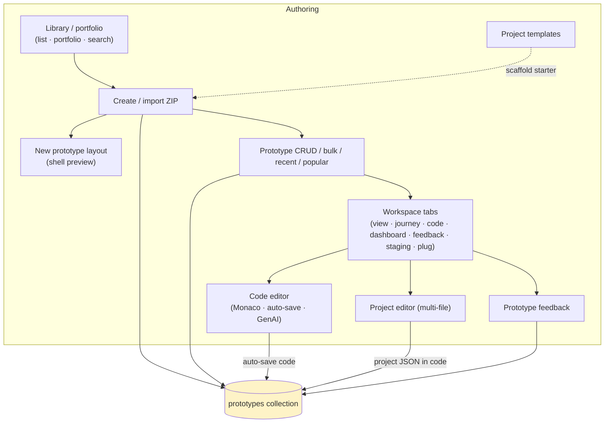
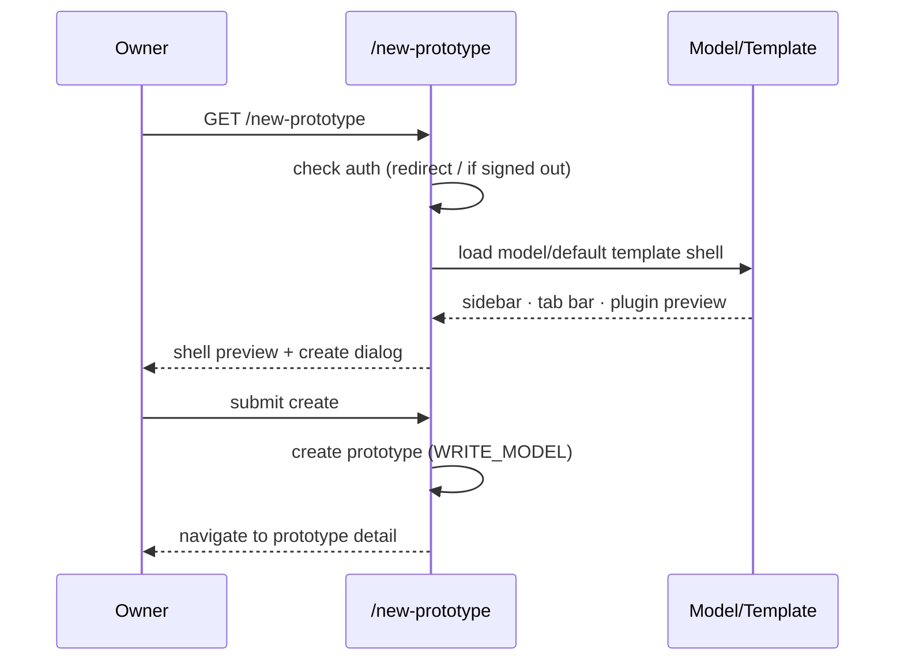
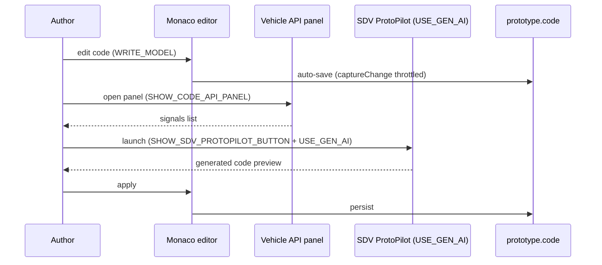
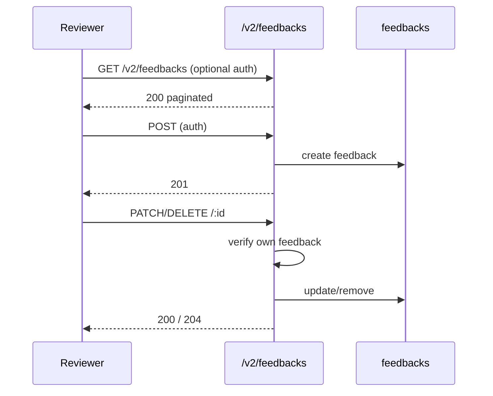

# Cluster: Prototypes & Code

Authoring and structuring a model's prototypes. Backend: `routes/v2/vehicle-data/prototype.route.js`, `models/prototype.model.js`. Frontend: `pages/{PagePrototypeLibrary,PagePrototypeDetail}.tsx`, `layouts/NewPrototypeLayout.tsx`.



---

## Capabilities in this cluster

| ID | Capability |
|----|------------|
| [CAP-PROTO-01](#cap-proto-01--prototype-library) | Prototype library |
| [CAP-PROTO-02](#cap-proto-02--new-prototype-layout) | New prototype layout |
| [CAP-PROTO-03](#cap-proto-03--prototype-crud--bulk--recent--popular--execute-code) | Prototype CRUD / bulk / recent / popular / execute-code |
| [CAP-PROTO-04](#cap-proto-04--prototype-workspace-tabs) | Prototype workspace (tabs) |
| [CAP-PROTO-05](#cap-proto-05--code-editor) | Code editor |
| [CAP-PROTO-06](#cap-proto-06--project-editor-multi-file) | Project editor (multi-file) |
| [CAP-PROTO-07](#cap-proto-07--prototype-feedback) | Prototype feedback |
| [CAP-PROTO-08](#cap-proto-08--project-templates) | Project templates |


## CAP-PROTO-01 — Prototype library

### Description

List/portfolio views of a model's prototypes; search, sort (Newest/Oldest/Name/Rating/Last/First viewed), filter; create a prototype (inline dialog, or the `/new-prototype` page when `ENABLE_NEW_PROTOTYPE_PAGE`); import from ZIP.

### Who uses it / value

Model owners/contributors (manage prototypes); end users (browse/portfolio).

### Acceptance criteria

- Routes `/model/:id/library[/:tab(list|portfolio)[/:prototype_id]]` render the library.
- Create/import require `WRITE_MODEL`; viewing subject to `PUBLIC_VIEWING`.
- Duplicate-name detection offers suggestions.

### Quality control

Create a prototype → appears in the list; switch list/portfolio; import a prototype ZIP → created; sort by name → ordered.


### Security

Create/import `WRITE_MODEL`; reads respect `PUBLIC_VIEWING` + `READ_MODEL` for private models.

**Risks:**
- **Private-prototype enumeration:** if server-side access scoping lags behind `PUBLIC_VIEWING`, a signed-out or cross-tenant user could enumerate private prototypes through list/portfolio filters, leaking proprietary SDV code.
- **Malicious ZIP import:** import reads archive contents; an attacker-crafted archive could exploit path traversal or oversized payloads during extraction to corrupt storage or inject code.

### Data protection

Prototype metadata + code stored in `prototypes`; import reads archive contents.

**Risks:**
- **Source data loss on bad import:** a malformed or hostile ZIP could overwrite or shadow existing prototype code during import without a rollback path.
- **Code exposure via visibility:** a prototype under a private model still stores full source code; a misapplied `PUBLIC_VIEWING` toggle exposes that code to anonymous users.

## CAP-PROTO-02 — New prototype layout

### Description

Full-page create flow that previews the selected model's (or default template's) prototype shell — sidebar, tab bar, plugin preview — behind the create dialog, then navigates to the new prototype.

### Who uses it / value

Model owners (a guided create experience).

### Acceptance criteria

- Route `/new-prototype` (auth; redirects to `/` if signed out); feature-flagged on by `ENABLE_NEW_PROTOTYPE_PAGE` (default `false`).
- Supports `?create-model` mode.

### Quality control

With the flag on, open `/new-prototype` → shell preview + create dialog → navigates to the new prototype detail; signed-out → redirected to `/`.



### Security

Auth required.

**Risks:**
- **Flag-bypass create:** if the `ENABLE_NEW_PROTOTYPE_PAGE` guard were bypassed or the underlying create endpoint didn't re-check `WRITE_MODEL`, an unauthenticated user reaching `/new-prototype` could open a model-scoped create flow.
- **Template-driven code injection:** the shell preview loads a template's plugin config; a compromised template could render unsandboxed plugin code during creation.

### Data protection

No extra data; reads model/template to preview.

**Risks:**
- **Template data leakage:** previewing the default template exposes template layout/plugin references to any author; a misconfigured template could leak references to private plugins or internal assets.

## CAP-PROTO-03 — Prototype CRUD / bulk / recent / popular / execute-code

### Description

Create/update/delete prototypes; bulk create; recent (cached per-user activity) and popular (top-executed, released, public) lists; execute-code counter.

### Who uses it / value

Owners (lifecycle); end users (discover recent/popular); analytics (execution counts).

### Acceptance criteria

- `GET/POST /v2/prototypes` (read optional, write `WRITE_MODEL`); `POST /v2/prototypes/bulk` → `201`; `GET /v2/prototypes/recent` (auth) → `200`; `GET /v2/prototypes/popular` (optional) → `200`; `GET/PATCH/DELETE /v2/prototypes/:id` → `200`/`200`/`204`; `POST /v2/prototypes/:id/execute-code` → `200` increments counter.
- Private models require `READ_MODEL` for reads.

### Quality control

Create → `201`; run code → execute counter increments; recent reflects your activity; popular shows released/public.


### Security

Write `WRITE_MODEL`; recent requires auth; reads respect `PUBLIC_VIEWING` + model access.

**Risks:**
- **Bulk-create abuse:** `POST /v2/prototypes/bulk` without rate limiting lets an attacker spawn many prototypes, exhausting storage and polluting the model namespace.
- **Counter inflation:** `execute-code` is unauthenticated relative to popularity ranking; an attacker could inflate `executed_turns` to manipulate the popular list.
- **Cross-tenant read:** if `READ_MODEL` isn't enforced for private models on `GET /v2/prototypes/:id`, a user could read private prototype code by ID.

### Data protection

`last_viewed`, `executed_turns`, `rated_by` (Map), `state` stored per prototype.

**Risks:**
- **Activity profiling:** `last_viewed` and recent lists are per-user activity trails; a compromised account exposes which prototypes a user touched and when.
- **Irreversible delete:** `DELETE /v2/prototypes/:id` hard-removes the prototype (no soft-delete), so accidental or malicious deletion is permanent source-data loss.

## CAP-PROTO-04 — Prototype workspace (tabs)

### Description

The prototype detail page with built-in tabs plus custom plugin (addon) tabs and configurable right-nav action buttons; records `last_viewed` and recent-prototype.

### Who uses it / value

Authors (build); reviewers (feedback); operators (staging); end users (view).

### Acceptance criteria

- Routes `/model/:id/library/prototype/:pid[/:tab]` with tabs `view|journey|code|dashboard|feedback|staging|plug`.
- Addon/tab management requires `WRITE_MODEL` + `ALLOW_NON_ADMIN_ADDON_CONFIG`; "Save as Template" requires admin; Staging requires auth + prototype code.
- Plugin sidebar collapsible; addon add/manage + "Customize Layout" editor available.

### Quality control

Switch each tab → correct content renders; add an addon tab → it loads via `PluginPageRender`; reorder tabs → persists; Staging hidden for a code-less prototype.


### Security

Tab management `WRITE_MODEL` + addon flag; Staging auth-gated. Plugins unsandboxed.

**Risks:**
- **Malicious addon tab:** plugins run unsandboxed via `PluginPageRender`; if the `ALLOW_NON_ADMIN_ADDON_CONFIG` gate were bypassed, a non-admin could inject a hostile tab into every visitor's view (XSS / token theft).
- **Staging bypass:** Staging requires auth + prototype code; a missing check could expose staging execution to anonymous users or code-less prototypes.

### Data protection

Tab config + `extend` (plugin data sink) stored on the prototype; `last_viewed` updated on visit.

**Risks:**
- **Plugin data sink persistence:** `extend` stores arbitrary plugin-supplied data on the prototype; a malicious plugin could persist hostile payloads that re-activate on every visit.
- **View-tracking exposure:** `last_viewed` updates on every visit, creating a fine-grained viewing log tied to the visitor's session.

## CAP-PROTO-05 — Code editor

### Description

Monaco editor with auto-save; resizable Vehicle API panel; SDV ProtoPilot GenAI launcher; code diff view; language label; multi-file Project Editor when code is a JSON project.

### Who uses it / value

Prototype authors (write/edit SDV code); GenAI users (generate code).

### Acceptance criteria

- Edit requires `WRITE_MODEL`; API panel shown when `SHOW_CODE_API_PANEL=true`; SDV ProtoPilot button shown when `SHOW_SDV_PROTOPILOT_BUTTON=true` + `USE_GEN_AI`; diff when `SHOW_CODE_DIFF=true`.
- Auto-save persists code; language label reflects Python/Rust.

### Quality control

Edit code → auto-saves; open API panel → signals list; run ProtoPilot → generated code preview → apply; toggle diff → shows changes.



### Security

Edit `WRITE_MODEL`; GenAI gated by `USE_GEN_AI` + flag.

**Risks:**
- **GenAI prompt-injection:** generated code from ProtoPilot is applied to `prototype.code`; a malicious prompt could inject code that runs in staging or exfiltrates prototype data when later executed.
- **Unauthed auto-save:** if the `WRITE_MODEL` check were skipped on the auto-save path, any viewer could overwrite an author's code with no version history to revert.

### Data protection

Code (potentially large text) stored in `prototype.code`; auto-save writes frequently (throttled by `captureChange`).

**Risks:**
- **Source data loss on autosave:** frequent auto-save with no history means a bad paste or GenAI apply can irreversibly overwrite the author's prior code with no recovery trail.
- **Large-payload bloat:** unthrottled code growth could bloat the `prototypes` document, degrading backups and reads.

## CAP-PROTO-06 — Project editor (multi-file)

### Description

File-tree editor with create/rename/delete files & folders, open tabs, unsaved-change tracking, save-all, import/export ZIP, per-file Monaco. Activated when prototype code is a JSON project descriptor.

### Who uses it / value

Authors of multi-file SDV projects.

### Acceptance criteria

- Activated when `prototype.code` is a JSON project; edit requires `WRITE_MODEL`.
- File ops (create/rename/delete), tabs, save-all, import/export ZIP all functional.

### Quality control

Add a file → appears in tree; edit + save-all → persisted; export ZIP → valid archive containing files.

```mermaid
flowchart TD
    A([Author]) -->|"activate when code = JSON project"| PE["Project editor"]
    PE -->|create/rename/delete| T["File tree"]
    PE -->|open tabs| Tabs["Per-file Monaco"]
    PE -->|save-all (WRITE_MODEL)| DB["prototype.code (JSON)"]
    PE -->|import .zip| ZI["parse archive → files"]
    PE -->|export .zip| ZO["ZIP archive of all files"]
```

### Security

Edit `WRITE_MODEL`. GitHub auth wiring available for intended git sync (partial).

**Risks:**
- **Path traversal in file ops:** create/rename/delete operate on paths inside the JSON project; without validation an attacker could craft `../` paths to escape the project root and overwrite unrelated files.
- **ZIP import traversal:** importing a ZIP with malicious entry names (`../`) could write files outside the project tree if extraction doesn't sanitize paths.
- **Partial git-sync exposure:** the partial GitHub auth wiring, if reachable, could leak credentials or push prototype code to an unintended remote.

### Data protection

Whole project stored as JSON in `prototype.code`; export contains all files.

**Risks:**
- **Bulk source loss:** a single destructive file delete or a corrupt save-all overwrites the entire project JSON; with no per-file history, the whole project can be lost at once.
- **Export exfiltration:** export ZIP bundles every project file, so a leaked edit token lets an attacker steal the complete multi-file source in one action.

## CAP-PROTO-07 — Prototype feedback

### Description

Star-rated feedback (need addressed / relevance / ease of use, 1–5, averaged) with description and interview metadata; add/delete own; pagination.

### Who uses it / value

Reviewers (give feedback); owners (improve prototypes).

### Acceptance criteria

- `GET /v2/feedbacks` (optional auth) → `200` paginated; `POST` (auth) → `201`; `PATCH/DELETE /:id` → `200`/`204` (own feedback).
- UI tab `feedback` lists feedback, add via form, delete own only.

### Quality control

Add feedback → appears with averaged score; delete another user's feedback → not allowed; pagination works.



### Security

Add requires sign-in; delete limited to own.

**Risks:**
- **Impersonated feedback:** if the own-only check on `PATCH/DELETE` is missing, a user could delete or alter others' feedback, manipulating a prototype's averaged scores.
- **Anonymous spam:** `POST` only requires sign-in, so a burner account could flood feedback with biased ratings to inflate or tank a prototype's score.

### Data protection

Feedback stores `interviewee` (name/organization), scores, `ref`/`model_id`; no secrets.

**Risks:**
- **PII exposure:** `interviewee` name/organization is PII; a public `GET /v2/feedbacks` could expose reviewer and interviewee identities to anonymous users.
- **Relationship inference:** feedback records tie a reviewer and interviewee to a specific prototype and model, leaking business relationships.

## CAP-PROTO-08 — Project templates

### Description

Admin-managed scaffolds for starter projects (code + widget_config + customer_journey); predefined templates seeded on startup; case-insensitive unique name.

### Who uses it / value

Admins (standardize starters); authors (quick-start).

### Acceptance criteria

- `GET /v2/project-template[/:id]` (public) → list/get; `POST` → `201` (admin); `PUT/DELETE /:id` → `200`/`204` (admin). Also at `/v2/system/project-template`.
- Seeded via `predefinedProjectTemplates.js` (never overwriting admin edits).

### Quality control

Admin creates a template → selectable when creating a prototype; pick it → project pre-populated.


### Security

Read public; write `MANAGE_USERS`.

**Risks:**
- **Platform-wide payload:** templates apply to every prototype created from them. A compromised admin could seed a template embedding hostile code, pushing it to all new projects.
- **Seed-supply chain:** the predefined seed (`predefinedProjectTemplates.js`) runs at startup; a compromised seed file silently seeds malicious starter code into every deployment.

### Data protection

Template data (code/widget_config/journey) stored; no secrets.

**Risks:**
- **Persistent distribution channel:** a malicious template propagates its code, widget config, and journey to all derived prototypes until an admin notices and removes it.
- **Starter-code IP leakage:** templates are public-read; any proprietary starter code placed in a template is exposed to anonymous users.