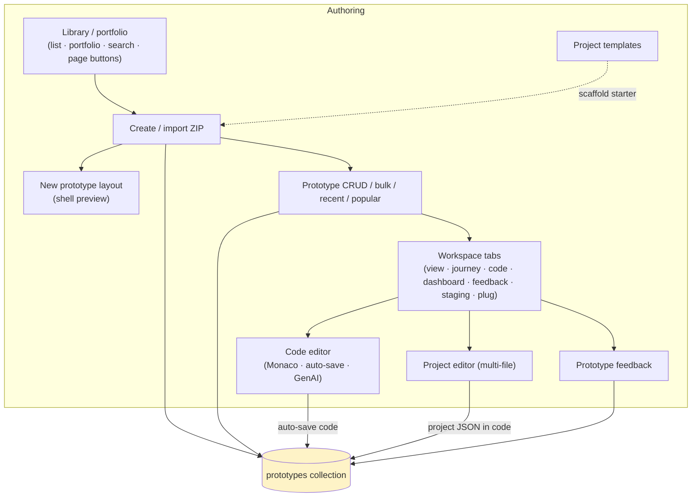
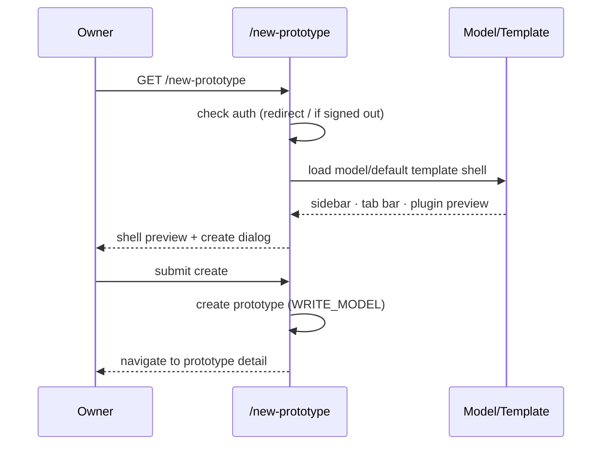
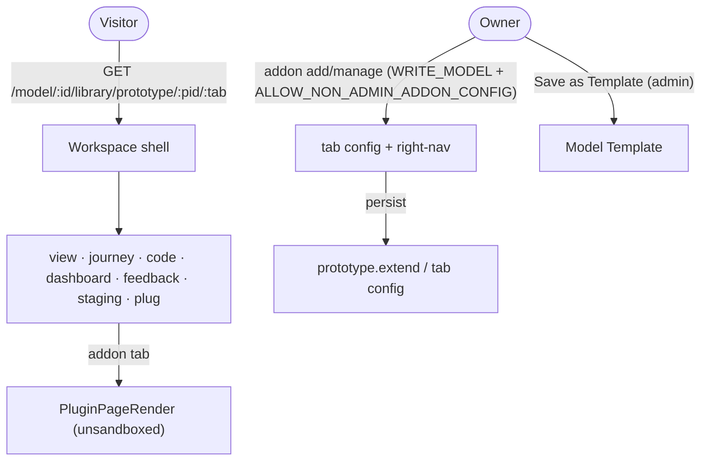
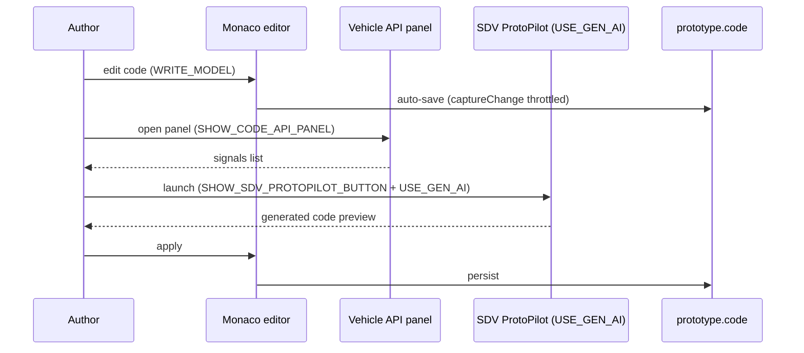
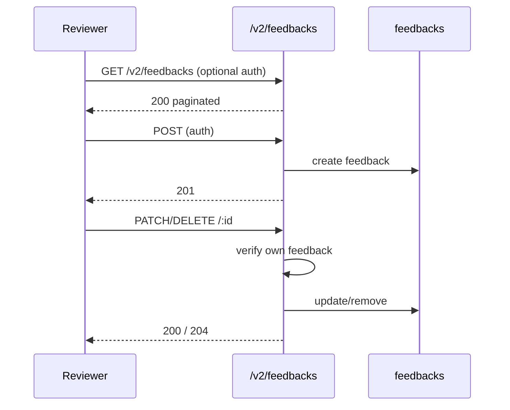
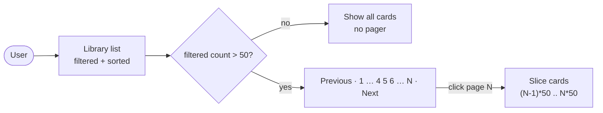

# Cluster: Prototypes & Code

As a model author or contributor, I can create, organize, and iterate on a model's prototypes — browsing the library, scaffolding new prototypes from templates, editing code in the browser, gathering reviewer feedback, and publishing starter projects — so I can build and share SDV features end to end.

**Implementation:** `routes/v2/vehicle-data/prototype.route.js`, `models/prototype.model.js`; frontend `pages/{PagePrototypeLibrary,PagePrototypeDetail}.tsx`, `layouts/NewPrototypeLayout.tsx`.



---

## Capabilities in this cluster

| ID | Capability |
|----|------------|
| [CAP-PROTO-01](#cap-proto-01--prototype-library) | Prototype library |
| [CAP-PROTO-02](#cap-proto-02--new-prototype-layout) | New prototype layout |
| [CAP-PROTO-03](#cap-proto-03--prototype-crud--bulk--recent--popular--execute-code) | Prototype CRUD / bulk / recent / popular / execute-code |
| [CAP-PROTO-04](#cap-proto-04--prototype-workspace-tabs) | Prototype workspace (tabs) |
| [CAP-PROTO-05](#cap-proto-05--code-editor) | Code editor |
| [CAP-PROTO-06](#cap-proto-06--project-editor-multi-file) | Project editor (multi-file) |
| [CAP-PROTO-07](#cap-proto-07--prototype-feedback) | Prototype feedback |
| [CAP-PROTO-08](#cap-proto-08--project-templates) | Project templates |
| [CAP-PROTO-09](#cap-proto-09--page-number-buttons) | Page-number buttons (medium) |


## CAP-PROTO-01 — Prototype library

| Actor | Where | Personal data | E2E coverage |
|---|---|---|---|
| owner / user / guest | Prototype library (`/model/:id/library`) | ❌ No | ✅ 4 cases, ≈80% (est.) |

### Description

As a model owner or contributor, I can browse, search, and sort a model's prototypes across list and portfolio views, and create new prototypes or import them from a ZIP archive, so I can manage and showcase my model's SDV work.

### Who uses it / value

Model owners/contributors (manage prototypes); end users (browse/portfolio).

### Acceptance criteria

- When a **user** opens the Library page at **Prototype library (`/model/:id/library`)**, they see the model's prototypes as cards in a list view, and they can switch between List and Portfolio views.
- When a **user** opens a large library at **Prototype library (`/model/:id/library`)**, they page through prototypes via CAP-PROTO-09 (Previous / page-number / Next).
- When a **user** views a model at **Prototype library (`/model/:id/library`)**, the Prototype Library tab badge shows the API `totalResults` count for that model, not the length of a single page of results.
- When a **user** types in the search box at **Prototype library (`/model/:id/library`)**, the list filters to prototypes whose name matches; when they pick a sort option (Last view, First view, Newest, Oldest, Name A-Z, Name Z-A, Rating), the list reorders accordingly.
- When a **guest** (or a **user** lacking write permission) views the library at **Prototype library (`/model/:id/library`)**, the Create New Prototype and Import Prototype controls appear dimmed and are not clickable; when an **owner** with write permission views it, they can open the create dialog or import a prototype.
- When an **owner** imports a ZIP at **Prototype library (`/model/:id/library`)**, they are limited to `.zip` files under 10 MB; a non-ZIP or oversized file shows an error message and the import is blocked.
- When an **owner** confirms an import at **Prototype library (`/model/:id/library`)**, they are asked to confirm the prototype name; on success the new prototype appears in the library and they are taken to its detail page.
- When an **owner** types a prototype (or model) name that already exists at **Prototype library (`/model/:id/library`)**, they are shown a duplicate-name hint with a suggested alternative name, and the Create button stays disabled until they change it.
- When a **user** opens a library with no prototypes at **Prototype library (`/model/:id/library`)**, they see an empty "No prototype found. Please create a new prototype." state.
- When a **guest** is not signed in (or can't access a private model) at **Prototype library (`/model/:id/library`)** and public viewing is off, they are prevented from browsing that model's prototypes.

### API contract

- Page route: `GET /model/:id/library[/:tab(list|portfolio)[/:prototype_id]]` — renders the library (auth optional via `PUBLIC_VIEWING`; private-model reads gated by `READ_MODEL`).
- Create / import a prototype requires `WRITE_MODEL`.
- Public browsing is allowed only while `PUBLIC_VIEWING` is on; private models require `READ_MODEL`.
- Duplicate-name submissions return alternative-name suggestions.
- ZIP import: `.zip` only, max 10 MB; archive entries are not path-traversal sanitized.

### Quality control

As a creator, I create a prototype and it appears in the list; I switch between list and portfolio views; I import a prototype ZIP and a prototype is created; I sort by name and the list is ordered; the Prototype Library tab count matches the API total (paging controls: CAP-PROTO-09).


### Security

Creating or importing requires `WRITE_MODEL`; browsing is public only under `PUBLIC_VIEWING`, with private models requiring `READ_MODEL`.

**Coverage:**
- **Auth:** Optional via `PUBLIC_VIEWING` for reads; required for create/import.
- **Authorization:** `WRITE_MODEL` required to create/import; private-model reads gated by `READ_MODEL`; reads scoped to models I can access.
- **Input validation:** I must send `model_id` as an objectId and `name` up to 255 chars; ZIP import entries are not path-traversal sanitized.
- **Rate limiting:** not applied (the global auth rate limiter is unused).
- **Secrets:** none.

**Risks:**
- **Private-prototype enumeration:** if server-side access scoping lags behind `PUBLIC_VIEWING`, a signed-out or cross-tenant user could enumerate private prototypes through list/portfolio filters, leaking proprietary SDV code. *Mitigation:* enforce `READ_MODEL` server-side on list/portfolio filters before returning; deny-by-default when scoping state is unclear.
- **Malicious ZIP import:** import reads archive contents; an attacker-crafted archive could exploit path traversal or oversized payloads during extraction to corrupt storage or inject code. *Mitigation:* none currently — sanitize ZIP entry paths (reject `../` and absolute paths) and cap entry size/count before extraction.

### Personal data processing

❌ No — this capability does not process personal data (the `created_by` field holds an internal userId reference; names/emails live in the Identity cluster).

N/A.

**Risks:**
- none — no personal data processed.

### AutoWRX data

Prototype metadata and code are stored; import reads archive contents.

**Coverage:**
- **Stored data:** `prototypes` collection (name, code, model_id, description, image_file, created_by); ZIP archive contents read during import.
- **Retention:** indefinite (hard delete on `DELETE`, no soft-delete/TTL).
- **Encryption:** none at rest; TLS in transit via platform.
- **Logging:** change log records create/update/remove; malformed `extend`/`requirements_data` JSON triggers a warning.

**Risks:**
- **Source data loss on bad import:** a malformed or hostile ZIP could overwrite or shadow existing prototype code during import without a rollback path.
- **Code exposure via visibility:** a prototype under a private model still stores full source code; a misapplied `PUBLIC_VIEWING` toggle exposes that code to anonymous users.

### Test coverage
- **E2E (Playwright):** 4 test case(s) in `prototype.spec.ts` + `prototype-extended.spec.ts` — SITEMAP: ✅
- **Estimated coverage:** ≈80% (est.) — 3 acceptance-criteria paths, 4 E2E cases cover create/browse/import + duplicate-name; SITEMAP ✅.
- **Unit (Jest):** none

## CAP-PROTO-02 — New prototype layout

| Actor | Where | Personal data | E2E coverage |
|---|---|---|---|
| owner | New prototype dialog (`/new-prototype`) | ❌ No | ✅ 1 case, ≈35% (est.) |

### Description

As a model owner, I can use a guided full-page create flow that previews the selected model's (or default template's) prototype shell — sidebar, tab bar, plugin preview — behind the create dialog, then takes me to my new prototype, so I can start a prototype with a clear picture of the result.

### Who uses it / value

Model owners (a guided create experience).

### Acceptance criteria

- When a **guest** opens the full-page create flow at **New prototype dialog (`/new-prototype`)** while signed out, they are redirected to the home page.
- When an **owner** is signed in and the flow is enabled at **New prototype dialog (`/new-prototype`)**, they see the selected model's (or default template's) prototype shell — sidebar, tab bar, and plugin preview — rendered behind the create dialog.
- When an **owner** opens the flow in model-creation mode (via the `?create-model` query) at **New prototype dialog (`/new-prototype`)**, they get the create-model dialog instead of the create-prototype dialog.
- When an **owner** submits the create form with a valid name (and optionally a chosen template) at **New prototype dialog (`/new-prototype`)**, a new prototype is created and they are navigated to its detail page.
- When an **owner** closes the create dialog without submitting at **New prototype dialog (`/new-prototype`)**, they are taken back to where they came from (or the library).
- When an **owner** views the library while the full-page flow is disabled at **Prototype library (`/model/:id/library`)**, the Create button opens the inline create dialog instead (CAP-PROTO-01).

### API contract

- Page route: `GET /new-prototype` — requires sign-in (redirects to `/` if signed out); the flow is gated by `ENABLE_NEW_PROTOTYPE_PAGE` (default `false`).
- `?create-model` query param → model-creation mode.
- Create submission validated: `model_id` as objectId, `name` up to 255 chars; the underlying create re-checks `WRITE_MODEL` (CAP-PROTO-03).
- Preview reads the model/default template shell; no data stored by this capability (the subsequent create stores a prototype via CAP-PROTO-03).

### Quality control

With the flag on, I open `/new-prototype`, see the shell preview and create dialog, submit, and the system navigates me to the new prototype detail; signed out, I'm redirected to `/`.



### Security

Access requires sign-in; the flow is gated by `ENABLE_NEW_PROTOTYPE_PAGE`.

**Coverage:**
- **Auth:** required (redirects to `/` if signed out); gated by `ENABLE_NEW_PROTOTYPE_PAGE`.
- **Authorization:** the underlying create re-checks `WRITE_MODEL` (CAP-PROTO-03).
- **Input validation:** my create submission is validated (`model_id` objectId, `name` max 255); preview reads the model/template shell.
- **Rate limiting:** not applied.
- **Secrets:** none.

**Risks:**
- **Flag-bypass create:** if the `ENABLE_NEW_PROTOTYPE_PAGE` guard were bypassed or the underlying create endpoint didn't re-check `WRITE_MODEL`, an unauthenticated user reaching `/new-prototype` could open a model-scoped create flow. *Mitigation:* re-check `WRITE_MODEL` server-side on the create endpoint regardless of the flag; flag defaults to `false`.
- **Template-driven code injection:** the shell preview loads a template's plugin config; a compromised template could render unsandboxed plugin code during creation. *Mitigation:* none currently — plugins run unsandboxed by design; only install trusted plugins.

### Personal data processing

❌ No — this capability does not process personal data.

N/A.

**Risks:**
- none — no personal data processed.

### AutoWRX data

No extra data is stored; the system reads the model/template to preview.

**Coverage:**
- **Stored data:** none directly (preview only); the subsequent create stores a prototype via CAP-PROTO-03.
- **Retention:** N/A (no data stored by this capability).
- **Encryption:** none (preview read of model/template).
- **Logging:** none specific.

**Risks:**
- **Template data leakage:** previewing the default template exposes template layout/plugin references to any author; a misconfigured template could leak references to private plugins or internal assets.

### Test coverage
- **E2E (Playwright):** 1 test case(s) in `prototype.spec.ts` — SITEMAP: ✅
- **Estimated coverage:** ≈35% (est.) — 3 acceptance-criteria paths, 1 E2E case covers signed-out redirect + create-navigation; flag-on/`?create-model` modes lightly covered; SITEMAP ✅.
- **Unit (Jest):** none

## CAP-PROTO-03 — Prototype CRUD / bulk / recent / popular / execute-code

| Actor | Where | Personal data | E2E coverage |
|---|---|---|---|
| owner / user / guest | Prototype library (`/model/:id/library`) + Home (`/`) | ❌ No | ⚠️ 4 cases, ≈55% (est.) |

### Description

As a prototype owner, I can create, update, and delete prototypes — including bulk create — so I can manage their lifecycle; as an end user, I can browse my recent prototypes and a popular (top-executed, released, public) list, and the system counts each code execution so popularity reflects real use.

### Who uses it / value

Owners (lifecycle); end users (discover recent/popular); analytics (execution counts).

### Acceptance criteria

- When a **user** browses the library or home page at **Prototype library (`/model/:id/library`)** / **Home (`/`)**, they see the prototype list; when public viewing is on, anonymous visitors can browse public prototypes, and when it's off they're blocked.
- When an **owner** creates a prototype (via the create dialog or ZIP import) with write permission at **Prototype library (`/model/:id/library`)**, it's created and they are taken to it; when a **user** lacks write permission, the create/import controls are disabled.
- When a **user** is signed in and opens the home page at **Home (`/`)**, they see a "Recent Prototypes" section listing prototypes they recently visited; when a **guest** is signed out, the section is hidden.
- When a **user** opens the home page at **Home (`/`)**, they see a "Popular Prototypes" section (top-executed, released, public prototypes); when public viewing is off and a **guest** is signed out, clicking a popular prototype prompts them to sign in.
- When a **user** runs a prototype's code (staging/runtime) at **Prototype workspace (`/model/:id/library/prototype/:pid/staging`)**, its execution counter is counted so popularity reflects real use.
- When a **user** opens a prototype under a private model they can't access at **Prototype workspace (`/model/:id/library/prototype/:pid`)**, they are prevented from viewing it.
- When an **owner** or **admin** deletes a prototype at **Prototype library (`/model/:id/library`)**, it's removed from the library and no longer appears.

### API contract

- `GET /v2/prototypes` → `200` (public browsing when `PUBLIC_VIEWING` is on; reads optional via `PUBLIC_VIEWING`).
- `POST /v2/prototypes` → requires `WRITE_MODEL`, creates a prototype → `201`.
- `POST /v2/prototypes/bulk` → bulk-creates → `201`.
- `GET /v2/prototypes/recent` (signed in) → `200` with my recent prototypes.
- `GET /v2/prototypes/popular` → `200` with top-executed/released/public prototypes.
- `GET /v2/prototypes/:id` → `200` (private models require `READ_MODEL`).
- `PATCH /v2/prototypes/:id` → `200`.
- `DELETE /v2/prototypes/:id` → `204`.
- `POST /v2/prototypes/:id/execute-code` → `200` and increments the execution counter.
- Auth: reads optional via `PUBLIC_VIEWING`; writes, `recent`, and `execute-code` require sign-in.
- Authorization: `WRITE_MODEL` required for `POST`/`PATCH`/`DELETE`/`bulk`; private-model reads gated by `READ_MODEL`.
- Input validation: `model_id` as objectId, `name` up to 255 chars, valid `state` value.
- Rate limiting: not applied — bulk-create and execute-code are unguarded.

### Quality control

I create a prototype and get `201`; I run code and the execute counter increments; my recent list reflects my activity; the popular list shows released/public prototypes.


### Security

Writes require `WRITE_MODEL`; the recent list requires sign-in; reads are public only under `PUBLIC_VIEWING`, with private models gated by `READ_MODEL`.

**Coverage:**
- **Auth:** reads optional via `PUBLIC_VIEWING`; writes, `recent`, and `execute-code` require sign-in.
- **Authorization:** `WRITE_MODEL` required for `POST`/`PATCH`/`DELETE`/`bulk`; private-model reads gated by `READ_MODEL`.
- **Input validation:** I must send `model_id` as an objectId, `name` up to 255 chars, and a valid `state` value.
- **Rate limiting:** not applied — bulk-create and execute-code are unguarded.
- **Secrets:** none.

**Risks:**
- **Bulk-create abuse:** `POST /v2/prototypes/bulk` without rate limiting lets an attacker spawn many prototypes, exhausting storage and polluting the model namespace. *Mitigation:* none currently — wire authLimiter / add a per-user bulk-create throttle.
- **Counter inflation:** `execute-code` is unauthenticated relative to popularity ranking; an attacker could inflate `executed_turns` to manipulate the popular list. *Mitigation:* none currently — require auth for `execute-code` and cap increments per session/user.
- **Cross-tenant read:** if `READ_MODEL` isn't enforced for private models on `GET /v2/prototypes/:id`, a user could read private prototype code by ID. *Mitigation:* enforce `READ_MODEL` server-side on every `GET /v2/prototypes/:id` whose parent model is private.

### Personal data processing

❌ No — this capability does not process personal data (the recent list and `last_viewed`/`rated_by` use internal userId references; names/emails live in the Identity cluster).

N/A.

**Risks:**
- none — no personal data processed.

### AutoWRX data

The system stores `last_viewed`, `executed_turns`, `rated_by`, and `state` per prototype; the recent list is sourced from the cache service.

**Coverage:**
- **Stored data:** `prototypes` (last_viewed, executed_turns, rated_by Map, state, code); recent list sourced from the external cache (`CACHE_URL`, `/get-recent-activities/:userId`).
- **Retention:** indefinite (hard delete, no soft-delete; recent-cache retention governed by the external cache service).
- **Encryption:** none at rest; TLS in transit.
- **Logging:** change log records create/update/remove; cache fetch failures are logged.

**Risks:**
- **Activity profiling:** `last_viewed` and recent lists are per-user activity trails; a compromised account exposes which prototypes a user touched and when.
- **Irreversible delete:** `DELETE /v2/prototypes/:id` hard-removes the prototype (no soft-delete), so accidental or malicious deletion is permanent source-data loss.

### Test coverage
- **E2E (Playwright):** 4 test case(s) in `prototype.spec.ts` + `prototype-extended.spec.ts` + `prototype-runtime.spec.ts` — SITEMAP: ⚠️
- **Estimated coverage:** ≈55% (est.) — 7 acceptance-criteria paths, 4 E2E cases cover list/create/bulk/recent/popular/CRUD; `execute-code` counter and private-read paths untested; SITEMAP ⚠️.
- **Unit (Jest):** none

## CAP-PROTO-04 — Prototype workspace (tabs)

| Actor | Where | Personal data | E2E coverage |
|---|---|---|---|
| owner / user / guest | Prototype workspace (`/model/:id/library/prototype/:pid/:tab`) | ❌ No | ⚠️ 8 cases, ≈90% (est.) |

### Description

As a prototype author or reviewer, I can open a prototype's workspace and switch between built-in tabs (view, journey, code, dashboard, feedback, staging, plug) plus custom plugin tabs, and configure right-nav actions, so I can build, review, stage, and present a prototype in one place.

### Who uses it / value

Authors (build); reviewers (feedback); operators (staging); end users (view).

### Acceptance criteria

- When a **user** opens a prototype's workspace at **Prototype workspace (`/model/:id/library/prototype/:pid/:tab`)**, they see the tab bar with built-in tabs (Overview, Customer Journey, SDV Code, Dashboard, Feedback) plus any custom plugin tabs and a Staging right-nav action; the first visible tab is shown by default.
- When a **user** clicks a built-in tab at **Prototype workspace (`/model/:id/library/prototype/:pid/:tab`)**, its content renders; when they click a custom plugin tab, the plugin's page loads.
- When an **owner** has write permission and non-admin addon config is allowed at **Prototype workspace (`/model/:id/library/prototype/:pid/:tab`)**, they see a "+" button to add addon tabs and a "Customize Layout…" menu item; otherwise both are hidden.
- When an **owner** adds an addon tab at **Prototype workspace (`/model/:id/library/prototype/:pid/:tab`)**, they pick a plugin and a label; if that plugin is already added, they are told it's already in the tabs; on success the new tab appears.
- When an **owner** opens "Customize Layout" at **Prototype workspace (`/model/:id/library/prototype/:pid/:tab`)**, they can reorder, show/hide, and rename tabs, set the sidebar plugin, tab style and border radius, and configure right-nav buttons; on save the layout persists.
- When an **admin** views the workspace at **Prototype workspace (`/model/:id/library/prototype/:pid/:tab`)**, they see a "Save Prototype as Template" menu item; non-admins don't see it.
- When a **user** opens a code-less prototype at **Prototype workspace (`/model/:id/library/prototype/:pid/staging`)**, the Staging tab is hidden and they are redirected to the Code tab; when a **guest** is signed out and opens Staging, they are shown an "Authentication Required" prompt to sign in.
- When a **user** collapses the plugin sidebar at **Prototype workspace (`/model/:id/library/prototype/:pid/:tab`)**, it collapses to a thin strip and they can expand it again.

### API contract

- Page route: `GET /model/:id/library/prototype/:pid[/:tab]` — renders the workspace with tabs `view|journey|code|dashboard|feedback|staging|plug` (reads optional via `PUBLIC_VIEWING`).
- Addon tab add/manage requires `WRITE_MODEL` + `ALLOW_NON_ADMIN_ADDON_CONFIG`.
- "Save as Template" requires admin (`MANAGE_USERS`).
- Staging requires sign-in + prototype code.
- Plugin tabs render via `PluginPageRender` (unsandboxed — a plugin tab can access the page like any other script).
- Tab/addon config persisted on `prototype.extend` / `model.custom_template` (right-nav, sidebar plugin, tab variant/border-radius).
- `extend` accepts any JSON; `widget_config` a JSON string — loosely validated.
- Rate limiting: not applied.

### Quality control

I switch each tab and the correct content renders; I add an addon tab and it loads; I reorder tabs and the order persists; for a code-less prototype, Staging is hidden.



### Security

Tab management requires `WRITE_MODEL` + `ALLOW_NON_ADMIN_ADDON_CONFIG`; Staging requires sign-in; a plugin tab can access the page like any other script (unsandboxed).

**Coverage:**
- **Auth:** reads optional via `PUBLIC_VIEWING`; addon/tab management requires sign-in + `WRITE_MODEL` + `ALLOW_NON_ADMIN_ADDON_CONFIG`; Staging requires sign-in.
- **Authorization:** `WRITE_MODEL` for addon add/manage; "Save as Template" requires admin (`MANAGE_USERS`).
- **Input validation:** tab/addon config is loosely validated (`extend` accepts any JSON, `widget_config` a JSON string); a plugin tab can access the page like any other script.
- **Rate limiting:** not applied.
- **Secrets:** none.

**Risks:**
- **Malicious addon tab:** plugins run unsandboxed via `PluginPageRender`; if the `ALLOW_NON_ADMIN_ADDON_CONFIG` gate were bypassed, a non-admin could inject a hostile tab into every visitor's view (XSS / token theft). *Mitigation:* none currently — plugins run unsandboxed by design; only install trusted plugins.
- **Staging bypass:** Staging requires auth + prototype code; a missing check could expose staging execution to anonymous users or code-less prototypes. *Mitigation:* enforce auth + code-present check server-side before staging execution.

### Personal data processing

❌ No — this capability does not process personal data (`last_viewed` is tied to an internal userId/session reference; names/emails live in the Identity cluster).

N/A.

**Risks:**
- none — no personal data processed.

### AutoWRX data

Tab config and `extend` (the plugin data sink) are stored on the prototype; `last_viewed` is updated on each visit.

**Coverage:**
- **Stored data:** `prototype.extend` (Mixed, plugin data sink), tab/right-nav config, `last_viewed` updated per visit.
- **Retention:** indefinite (lives with the prototype; hard-deleted with it).
- **Encryption:** none at rest; TLS in transit.
- **Logging:** change log records updates; view tracking persisted to `last_viewed`.

**Risks:**
- **Plugin data sink persistence:** `extend` stores arbitrary plugin-supplied data on the prototype; a malicious plugin could persist hostile payloads that re-activate on every visit.
- **View-tracking exposure:** `last_viewed` updates on every visit, creating a fine-grained viewing log tied to the visitor's session.

### Test coverage
- **E2E (Playwright):** 8 test case(s) in `prototype.spec.ts` + `prototype-extended.spec.ts` + `prototype-tabs.spec.ts` — SITEMAP: ⚠️
- **Estimated coverage:** ≈90% (est.) — 3 acceptance-criteria paths, 8 E2E cases cover tab switching/addon manage/layout/reorder + staging-hidden; SITEMAP ⚠️.
- **Unit (Jest):** none

## CAP-PROTO-05 — Code editor

| Actor | Where | Personal data | E2E coverage |
|---|---|---|---|
| owner | Code tab (`/model/:id/library/prototype/:pid/code`) | ❌ No | ⚠️ 2 cases, ≈50% (est.) |

### Description

As a prototype author, I can write and edit SDV code in the Monaco editor with auto-save, browse the Vehicle API panel, launch the SDV ProtoPilot GenAI tool to generate code, and view a diff of changes, so I can iterate on my prototype's code efficiently.

### Who uses it / value

Prototype authors (write/edit SDV code); GenAI users (generate code).

### Acceptance criteria

- When an **owner** opens the Code tab at **Code tab (`/model/:id/library/prototype/:pid/code`)**, they see the Monaco editor with their prototype's code and a language label (Python or Rust); when a **user** lacks write permission, the editor is read-only.
- When an **owner** edits code with write permission at **Code tab (`/model/:id/library/prototype/:pid/code`)**, their changes auto-save periodically and on blur, and persist to the prototype.
- When an **owner** views the Code tab with the Vehicle API panel shown at **Code tab (`/model/:id/library/prototype/:pid/code`)**, they see the vehicle signals list beside the editor, and they can resize or collapse it.
- When an **owner** with GenAI permission views the Code tab with the SDV ProtoPilot button shown at **Code tab (`/model/:id/library/prototype/:pid/code`)**, they can launch the GenAI dialog, generate code, preview it, and apply it to their editor.
- When an **owner** has code diff enabled and their code changes (via GenAI or a plugin) at **Code tab (`/model/:id/library/prototype/:pid/code`)**, a "Show Diff" toggle appears comparing the previous version with the current; they can show or hide the diff.
- When an **owner** opens a prototype whose code is a JSON project (an array) at **Code tab (`/model/:id/library/prototype/:pid/code`)**, the multi-file project editor (CAP-PROTO-06) loads instead of the single-file Monaco editor.

### API contract

- Editing / auto-save requires `WRITE_MODEL`; persisted via `PATCH /v2/prototypes/:id` with body `{ code }` → `200`.
- `SHOW_CODE_API_PANEL=true` → Vehicle API panel shown.
- `SHOW_SDV_PROTOPILOT_BUTTON=true` + `USE_GEN_AI` permission → SDV ProtoPilot button shown.
- `SHOW_CODE_DIFF=true` → code diff shown after generation.
- GenAI calls go to the external `GENAI_SDV_APP_ENDPOINT`; GenAI output is applied directly to `prototype.code`.
- Auto-save is throttled (`captureChange`); no version history.
- `code` accepts any string (including empty) — no language or safety validation.
- Auth: required for edit. Rate limiting: not applied.

### Quality control

I edit code and it auto-saves; I open the API panel and see the signals list; I run ProtoPilot and see a generated-code preview, then apply it; I toggle diff and see the changes.



### Security

Editing requires `WRITE_MODEL`; GenAI is gated by `USE_GEN_AI` and the `SHOW_SDV_PROTOPILOT_BUTTON` flag.

**Coverage:**
- **Auth:** required for edit.
- **Authorization:** `WRITE_MODEL`.
- **Input validation:** `code` accepts any string (including empty) — no language or safety validation; GenAI output is applied directly to my prototype code.
- **Rate limiting:** not applied; GenAI calls go to the external `GENAI_SDV_APP_ENDPOINT`.
- **Secrets:** the GenAI endpoint config (`GENAI_SDV_APP_ENDPOINT`, `USE_GEN_AI`) lives in site config, not in my prototype.

**Risks:**
- **GenAI prompt-injection:** generated code from ProtoPilot is applied to `prototype.code`; a malicious prompt could inject code that runs in staging or exfiltrates prototype data when later executed. *Mitigation:* none currently — review generated code before apply; sandbox staging execution.
- **Unauthed auto-save:** if the `WRITE_MODEL` check were skipped on the auto-save path, any viewer could overwrite an author's code with no version history to revert. *Mitigation:* re-check `WRITE_MODEL` server-side on every auto-save PATCH.

### Personal data processing

❌ No — this capability does not process personal data (source code only).

N/A.

**Risks:**
- none — no personal data processed.

### AutoWRX data

My code (potentially large) is stored in `prototype.code`; auto-save writes frequently.

**Coverage:**
- **Stored data:** `prototype.code` (string or JSON project descriptor); auto-save writes frequently (throttled).
- **Retention:** indefinite (no version history; hard-deleted with the prototype).
- **Encryption:** none at rest; TLS in transit.
- **Logging:** change log records updates; code content is not logged by this path.

**Risks:**
- **Source data loss on autosave:** frequent auto-save with no history means a bad paste or GenAI apply can irreversibly overwrite the author's prior code with no recovery trail.
- **Large-payload bloat:** unthrottled code growth could bloat the `prototypes` document, degrading backups and reads.

### Test coverage
- **E2E (Playwright):** 2 test case(s) in `prototype-tabs.spec.ts` + `prototype-runtime.spec.ts` — SITEMAP: ⚠️
- **Estimated coverage:** ≈50% (est.) — 4 acceptance-criteria paths, 2 E2E cases cover edit/auto-save + API panel; GenAI launch + diff toggle lightly covered; SITEMAP ⚠️.
- **Unit (Jest):** none

## CAP-PROTO-06 — Project editor (multi-file)

| Actor | Where | Personal data | E2E coverage |
|---|---|---|---|
| owner | Project editor (`/model/:id/library/prototype/:pid/code`) | ❌ No | ❌ 0 cases, ≈0% (est.) |

### Description

As an author of a multi-file SDV project, I can use a file-tree editor to create, rename, and delete files and folders, open multiple file tabs, track unsaved changes, save-all, import/export a ZIP, and edit each file in its own Monaco editor — so I can build structured, multi-file prototypes.

### Who uses it / value

Authors of multi-file SDV projects.

### Acceptance criteria

- When an **owner** opens a prototype whose code is a JSON project (an array) at **Project editor (`/model/:id/library/prototype/:pid/code`)**, the multi-file project editor activates in the Code tab; otherwise the single-file Monaco editor is used.
- When an **owner** creates a file or folder at **Project editor (`/model/:id/library/prototype/:pid/code`)**, they enter a name in the tree; an empty name, invalid characters (`:*?"<>|`), reserved names (CON, PRN, …), or leading/trailing spaces show an error; a duplicate name at the target location shows an error.
- When an **owner** renames, moves, or deletes an item at **Project editor (`/model/:id/library/prototype/:pid/code`)**, the tree updates; deleting a folder asks for confirmation and removes its contents; closing a file with unsaved changes asks whether to save, discard, or cancel.
- When an **owner** opens multiple files at **Project editor (`/model/:id/library/prototype/:pid/code`)**, each opens in its own tab with its own Monaco editor; unsaved files are marked.
- When an **owner** presses Ctrl/Cmd+S at **Project editor (`/model/:id/library/prototype/:pid/code`)**, they save the current file; Ctrl/Cmd+Shift+S saves all; structural changes (add/rename/move/delete) auto-save.
- When an **owner** imports a ZIP at **Project editor (`/model/:id/library/prototype/:pid/code`)**, a confirmation warns that the current project will be replaced; on success the tree is replaced; on a malformed archive they see an error. When they export, they download a ZIP of all their files named after the prototype.
- When a **user** lacks write permission at **Project editor (`/model/:id/library/prototype/:pid/code`)**, editing is disabled.

### API contract

- Activates when `prototype.code` is a JSON project (array); editing requires `WRITE_MODEL`; persisted via `PATCH /v2/prototypes/:id` with `code` = JSON string of the file tree → `200`.
- File ops act on paths inside the JSON project — `../` traversal is not explicitly validated.
- ZIP import must sanitize entry names (currently no sanitization — reject `../` and absolute paths).
- Binary files > 500 KB are ignored on import/export; binary content stored base64-encoded.
- Partial GitHub auth wiring exists for an intended git sync (not active).
- No direct HTTP surface of its own — persistence via the CAP-PROTO-03 update endpoint.
- Auth: required. Rate limiting: not applied.

### Quality control

I add a file and it appears in the tree; I edit and save-all and it persists; I export a ZIP and get a valid archive containing my files.

```mermaid
flowchart TD
    A([Author]) -->|"activate when code = JSON project"| PE["Project editor"]
    PE -->|create/rename/delete| T["File tree"]
    PE -->|open tabs| Tabs["Per-file Monaco"]
    PE -->|save-all (WRITE_MODEL)| DB["prototype.code (JSON)"]
    PE -->|import .zip| ZI["parse archive → files"]
    PE -->|export .zip| ZO["ZIP archive of all files"]
```

### Security

Editing requires `WRITE_MODEL`. GitHub-based git sync is partially wired but not active.

**Coverage:**
- **Auth:** required.
- **Authorization:** `WRITE_MODEL`.
- **Input validation:** file ops act on paths inside the JSON project — `../` traversal is not explicitly validated; ZIP import must sanitize entry names.
- **Rate limiting:** not applied.
- **Secrets:** partial GitHub auth wiring exists for an intended git sync (not active).

**Risks:**
- **Path traversal in file ops:** create/rename/delete operate on paths inside the JSON project; without validation an attacker could craft `../` paths to escape the project root and overwrite unrelated files. *Mitigation:* none currently — normalize and validate paths, reject `../` and absolute paths before any file op.
- **ZIP import traversal:** importing a ZIP with malicious entry names (`../`) could write files outside the project tree if extraction doesn't sanitize paths. *Mitigation:* none currently — sanitize ZIP entry names, reject absolute/`../` paths during extraction.
- **Partial git-sync exposure:** the partial GitHub auth wiring, if reachable, could leak credentials or push prototype code to an unintended remote. *Mitigation:* none currently — disable/remove the unused GitHub auth wiring until git sync is active.

### Personal data processing

❌ No — this capability does not process personal data (project source files only).

N/A.

**Risks:**
- none — no personal data processed.

### AutoWRX data

The whole project is stored as JSON in `prototype.code`; an export ZIP contains every file.

**Coverage:**
- **Stored data:** entire project as JSON in `prototype.code`; export ZIP bundles all files.
- **Retention:** indefinite (no per-file history; the whole project is overwritten on save-all).
- **Encryption:** none at rest; TLS in transit.
- **Logging:** change log records updates.

**Risks:**
- **Bulk source loss:** a single destructive file delete or a corrupt save-all overwrites the entire project JSON; with no per-file history, the whole project can be lost at once.
- **Export exfiltration:** export ZIP bundles every project file, so a leaked edit token lets an attacker steal the complete multi-file source in one action.

### Test coverage
- **E2E (Playwright):** 0 — not covered — SITEMAP: ❌
- **Estimated coverage:** ≈0% (est.) — no E2E spec.
- **Unit (Jest):** none

## CAP-PROTO-07 — Prototype feedback

| Actor | Where | Personal data | E2E coverage |
|---|---|---|---|
| user / owner | Feedback tab (`/model/:id/library/prototype/:pid/feedback`) | ✅ Yes — interviewee name + organization, reviewer reference | ✅ 1 case, ≈25% (est.) |

### Description

As a reviewer, I can leave star-rated feedback (need addressed, relevance, ease of use — 1 to 5, averaged) with a description and interview metadata, and manage my own feedback, so I can help owners improve their prototypes.

### Who uses it / value

Reviewers (give feedback); owners (improve prototypes).

### Acceptance criteria

- When a **user** opens the Feedback tab at **Feedback tab (`/model/:id/library/prototype/:pid/feedback`)**, they see the prototype's overall average star rating and a paginated list of feedback entries (interviewee name, organization, per-criterion star ratings, question, recommendation); when there's no feedback they see "No feedback found."
- When a **user** is signed in at **Feedback tab (`/model/:id/library/prototype/:pid/feedback`)**, they see an "Add Feedback" button; when a **guest** is signed out, they can browse feedback only if public viewing is on, otherwise they are blocked.
- When a **user** submits the feedback form at **Feedback tab (`/model/:id/library/prototype/:pid/feedback`)**, they must provide an interviewee name and the three star ratings (needs addressed, relevance, ease of use); on success their feedback appears in the list and the overall average updates.
- When a **user** views feedback they authored at **Feedback tab (`/model/:id/library/prototype/:pid/feedback`)**, they see a "Delete Your Feedback" button; they can delete only their own feedback — other users' entries show no delete control, and deleting asks for confirmation.
- When a **user** paginates at **Feedback tab (`/model/:id/library/prototype/:pid/feedback`)**, the page changes and the list updates.

### API contract

- `GET /v2/feedbacks` → `200` paginated (public browsing when `PUBLIC_VIEWING` is on; auth optional via `PUBLIC_VIEWING`).
- `POST /v2/feedbacks` (signed in) → creates feedback → `201`.
- `PATCH /v2/feedbacks/:id` → `200`; `DELETE /v2/feedbacks/:id` → `204`; both are own-only (the system returns `FORBIDDEN` for non-owners).
- Auth: `POST`/`PATCH`/`DELETE` require sign-in; `GET` optional via `PUBLIC_VIEWING`.
- Authorization: `PATCH`/`DELETE` are own-only.
- Input validation: scores 1–5, a required `interviewee.name`, and `description`/`question`/`recommendation` up to 2000 chars.
- Rate limiting: not applied — burner-account spam is possible.

### Quality control

I add feedback and it appears with the averaged score; I try to delete another user's feedback and it's not allowed; pagination works.



### Security

Adding feedback requires sign-in; deleting or editing is limited to my own feedback.

**Coverage:**
- **Auth:** `POST`/`PATCH`/`DELETE` require sign-in; `GET` optional via `PUBLIC_VIEWING`.
- **Authorization:** `PATCH`/`DELETE` are own-only (the system rejects acting on another user's feedback with FORBIDDEN).
- **Input validation:** I must send scores 1–5, a required `interviewee.name`, and `description`/`question`/`recommendation` up to 2000 chars.
- **Rate limiting:** not applied — burner-account spam is possible.
- **Secrets:** none.

**Risks:**
- **Impersonated feedback:** if the own-only check on `PATCH/DELETE` is missing, a user could delete or alter others' feedback, manipulating a prototype's averaged scores. *Mitigation:* enforce the own-only check server-side on `PATCH/DELETE` (the system already returns FORBIDDEN for non-owners).
- **Anonymous spam:** `POST` only requires sign-in, so a burner account could flood feedback with biased ratings to inflate or tank a prototype's score. *Mitigation:* none currently — wire authLimiter / add a per-account feedback throttle.

### Personal data processing

✅ Yes — interviewee `name` + `organization`, and the `created_by` reviewer user reference.

Collected from the reviewer via the feedback form; stored in the `feedbacks` collection; retained indefinitely (hard delete on `DELETE`, no soft-delete/TTL); no at-rest encryption (TLS in transit); accessible to signed-in users via `GET /v2/feedbacks` (public when `PUBLIC_VIEWING` is on) and to the feedback's author/owner for `PATCH`/`DELETE`.

**Risks:**
- **PII exposure:** `interviewee` name/organization is PII; a public `GET /v2/feedbacks` could expose reviewer and interviewee identities to anonymous users.
- **Relationship inference:** feedback records tie a reviewer and interviewee to a specific prototype and model, leaking business relationships.

### AutoWRX data

Feedback stores scores, description, and `ref`/`ref_type`/`model_id`; `avg_score` is derived.

**Coverage:**
- **Stored data:** `feedbacks` collection (scores, description, question, recommendation, ref/ref_type/model_id, avg_score).
- **Retention:** indefinite (hard delete on `DELETE`; no soft-delete/TTL).
- **Encryption:** none at rest; TLS in transit.
- **Logging:** standard request logging; no sensitive data explicitly logged.

**Risks:**
- **Averaged-score integrity:** `avg_score` is derived from stored feedback; bulk or biased submissions distort prototype rankings displayed to users.

### Test coverage
- **E2E (Playwright):** 1 test case(s) in `prototype-extended.spec.ts` — SITEMAP: ✅
- **Estimated coverage:** ≈25% (est.) — 4 acceptance-criteria paths, 1 E2E case covers add + delete-own; `GET` pagination and public-browsing paths lightly covered; SITEMAP ✅.
- **Unit (Jest):** none

## CAP-PROTO-08 — Project templates

| Actor | Where | Personal data | E2E coverage |
|---|---|---|---|
| admin / owner | Prototype Templates manager (admin) + New prototype dialog (`/new-prototype`) | ❌ No | ❌ 0 cases, ≈0% (est.) |

### Description

As an admin, I can manage scaffolds for starter projects (code + widget_config + customer_journey) so authors can quick-start new prototypes from a template; as an author, I can pick a template to pre-populate my project. Template names are case-insensitive unique, and predefined templates are seeded at startup.

### Who uses it / value

Admins (standardize starters); authors (quick-start).

### Acceptance criteria

- When an **admin** opens the Prototype Templates manager at **Prototype Templates manager (admin)**, they see all templates (public and private) as cards with a language icon, name, description, and visibility badge; when none exist they see an empty "No prototype templates yet" state.
- When an **admin** creates a new template (name, description, visibility, and code/widget_config/customer_journey data) via "New Template", edits one by clicking its card, or deletes one via a confirmation dialog ("permanently delete … cannot be undone") at **Prototype Templates manager (admin)**, the template list updates accordingly.
- When an **owner** creates a prototype and picks a template from the template selector at **New prototype dialog (`/new-prototype`)**, the chosen template pre-populates their new prototype's code, language, dashboard config, and customer journey.
- When predefined templates are seeded at startup, an **admin** sees them appear in the selector at **Prototype Templates manager (admin)** but they never overwrite their admin edits.
- When a non-admin **owner** opens the create selector at **New prototype dialog (`/new-prototype`)**, they only see public templates; they cannot open the template manager.

### API contract

- `GET /v2/project-template[/:id]` → public list or a single template (also available at `/v2/system/project-template`); non-admin reads are filtered to `visibility: 'public'`.
- `POST /v2/project-template` (admin) → creates a template → `201`.
- `PUT /v2/project-template/:id` (admin) → `200`.
- `DELETE /v2/project-template/:id` (admin) → `204`.
- Auth: reads are public (signed-out can read); writes require sign-in + `ADMIN`.
- Authorization: `ADMIN` for `POST`/`PUT`/`DELETE`; non-admin reads filtered to `visibility: 'public'`.
- Input validation: `name` (required, max 255), `data` as a JSON string (required), `visibility` as `public` or `private`.
- Predefined templates seeded at startup (`predefinedProjectTemplates.js`); the seed never overwrites admin edits.
- Rate limiting: not applied.

### Quality control

As admin I create a template; as author I see it selectable when creating a prototype; I pick it and the project is pre-populated.


### Security

Reads are public; writes require admin permission (`ADMIN`).

**Coverage:**
- **Auth:** reads are public (signed-out can read); writes require sign-in + `ADMIN`.
- **Authorization:** `ADMIN` for `POST`/`PUT`/`DELETE`; non-admin reads are filtered to `visibility: 'public'`.
- **Input validation:** I must send `name` (required, max 255), `data` as a JSON string (required), and `visibility` as `public` or `private`.
- **Rate limiting:** not applied.
- **Secrets:** none.

**Risks:**
- **Platform-wide payload:** templates apply to every prototype created from them. A compromised admin could seed a template embedding hostile code, pushing it to all new projects. *Mitigation:* restrict `ADMIN`/template writes to vetted admins; review template code before publish.
- **Seed-supply chain:** the predefined seed (`predefinedProjectTemplates.js`) runs at startup; a compromised seed file silently seeds malicious starter code into every deployment. *Mitigation:* pin/verify the predefined seed file in version control; audit startup seed logs.

### Personal data processing

❌ No — this capability does not process personal data (`created_by`/`updated_by` hold internal userId references; names/emails live in the Identity cluster).

N/A.

**Risks:**
- none — no personal data processed.

### AutoWRX data

Template data (code/widget_config/journey) is stored; no secrets.

**Coverage:**
- **Stored data:** `projecttemplates` collection (name, description, data JSON, visibility, created_by, updated_by); seeded at startup (seed never overwrites admin edits).
- **Retention:** indefinite (hard delete on `DELETE`; seeded defaults re-insert only if absent).
- **Encryption:** none at rest; TLS in transit.
- **Logging:** seed outcome logged; no sensitive data logged.

**Risks:**
- **Persistent distribution channel:** a malicious template propagates its code, widget config, and journey to all derived prototypes until an admin notices and removes it.
- **Starter-code IP leakage:** templates are public-read; any proprietary starter code placed in a template is exposed to anonymous users.

### Test coverage
- **E2E (Playwright):** 0 — not covered — SITEMAP: ❌
- **Estimated coverage:** ≈0% (est.) — no E2E spec.
- **Unit (Jest):** none
## CAP-PROTO-09 — Page-number buttons

| Actor | Where | Personal data | E2E coverage |
|---|---|---|---|
| owner / user / guest | Prototype library (`/model/:id/library`) | ❌ No | ✅ 3 UI + helper cases, ≈85% (est.) |

**Complexity:** medium

### Description

As a model owner, contributor, or guest browsing a model, I can jump directly to a page of prototypes via numbered buttons (and Previous / Next) on the Prototype Library list so I can reach every prototype without scrolling an unbounded grid.

### Who uses it / value

Model owners/contributors and end users browsing large libraries (50+ prototypes after search/sort).

### Acceptance criteria

- When a **user** opens a library with more than 50 prototypes (after search/sort) at **Prototype library (`/model/:id/library`)**, they see Previous / page-number / Next controls under the card grid; at or below 50 filtered prototypes, the pager is hidden.
- When a **user** opens a library with more than 7 pages at **Prototype library (`/model/:id/library`)**, they see a truncated page-number window (at most 7 number buttons) with ellipsis; every page remains reachable via Previous / Next and the visible numbers.
- When a **user** clicks a page-number button at **Prototype library (`/model/:id/library`)**, the grid shows that page’s up-to-50 cards and the clicked number is marked active.
- When a **user** clicks Next or Previous at **Prototype library (`/model/:id/library`)**, the grid moves one page forward or back; Previous is disabled on page 1 and Next is disabled on the last page.
- When a **user** changes search or sort at **Prototype library (`/model/:id/library`)**, paging resets to page 1 over the newly filtered/sorted full set (search and sort apply to all prototypes, then the result is paged).

### API contract

- No dedicated HTTP surface — UI paging over the full model prototype list already loaded for CAP-PROTO-01 (`GET /v2/prototypes?model_id=…` walked page-by-page client-side).
- Page size is fixed at 50 cards per page in the library list UI.
- Visible page-number buttons are capped at 7 (sliding window with ellipsis) via `getVisiblePageItems`.

### Quality control

Open a model with more than 50 prototypes at `/model/:id/library/list`, confirm page-number buttons appear, click `2`, confirm a different set of cards, click Previous back to page 1; narrow search so results ≤ 50 and confirm the pager disappears. With 8+ pages, confirm ellipsis appears and not every page number is shown.



### Security

Same read gating as CAP-PROTO-01 (library browse). Page-number buttons only change client-side slicing of already-authorized results.

**Coverage:**
- **Auth:** Optional via `PUBLIC_VIEWING` for library reads (same as CAP-PROTO-01).
- **Authorization:** private-model reads gated by `READ_MODEL`; pager does not widen access.
- **Input validation:** page index clamped to `1..totalPages` in the UI; no server input.
- **Rate limiting:** N/A (no extra HTTP calls for page clicks).
- **Secrets:** none.

**Risks:**
- **Stale full-list cache:** if the client holds an outdated full prototype list, page-number navigation could show deleted or omit newly created prototypes until refetch. *Mitigation:* invalidate/refetch model prototype queries after create/import/delete (same cache keys as CAP-PROTO-01).

### Personal data processing

❌ No — this capability does not process personal data.

**Risks:**
- none — no personal data processed.

### AutoWRX data

None beyond the prototype list already loaded for CAP-PROTO-01; page selection is ephemeral UI state.

**Coverage:**
- **Stored data:** none (page index is client state only).
- **Retention:** N/A.
- **Encryption:** N/A.
- **Logging:** none.

**Risks:**
- none — no additional operational data stored.

### Test coverage
- **E2E (Playwright):** 3 UI case(s) in `prototype-extended.spec.ts` + helper cases in `pagination-utils.spec.ts` — SITEMAP: ✅
- **Estimated coverage:** ≈85% (est.) — pager visibility, page-2 navigation, ellipsis truncation; search/sort reset-to-page-1 lightly covered via existing search/sort cases.
- **Unit (Jest):** none (frontend has no Jest runner; helper covered via Playwright `pagination-utils.spec.ts`)

**Implementation:** `frontend/src/utils/pagination.ts` (`getVisiblePageItems`); `frontend/src/components/organisms/PrototypeLibraryList.tsx` (`DaPaging` / page-number buttons / `DaPaginationEllipsis`, `PAGE_SIZE = 50`).
