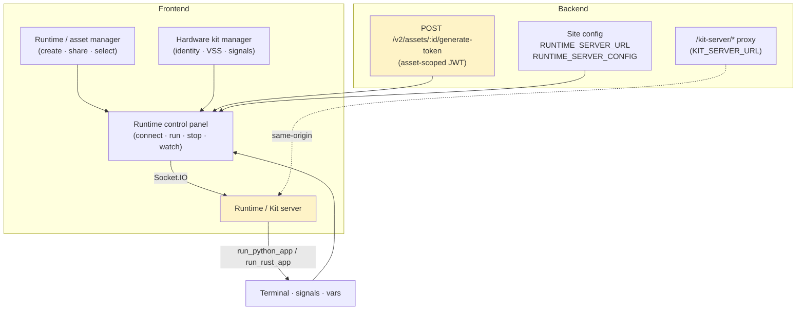
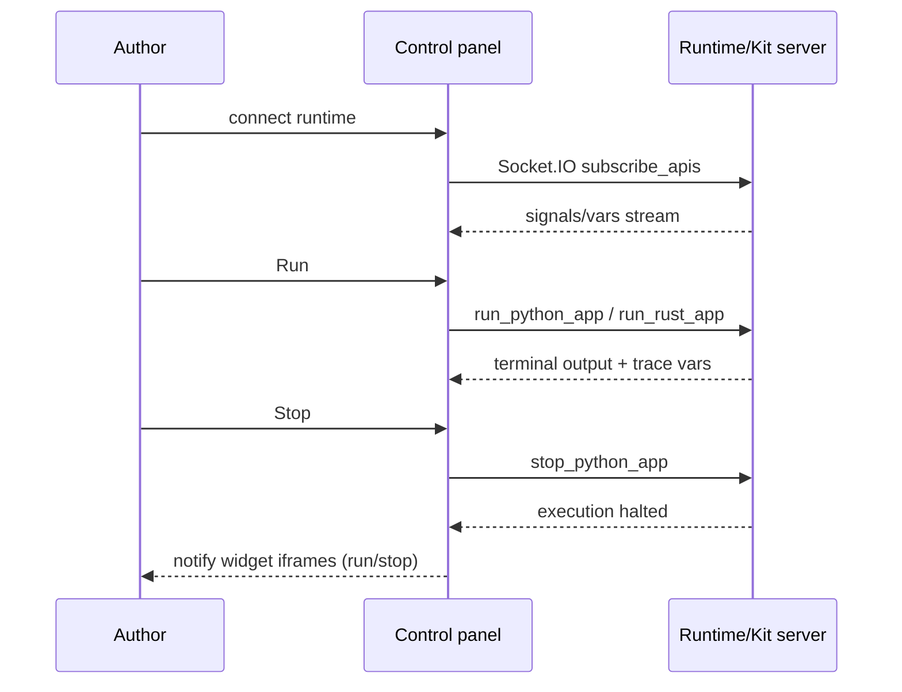
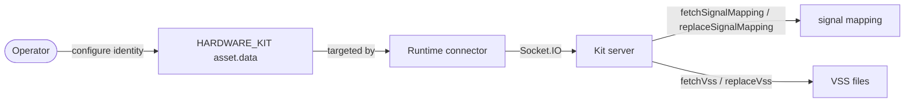
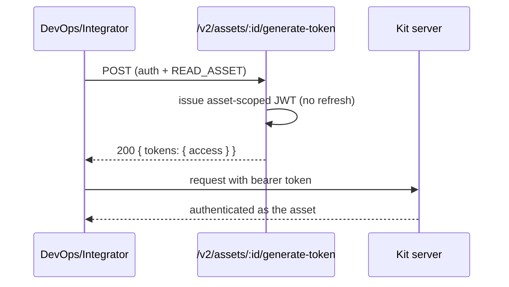

# Cluster: Runtime & Hardware Kits

Run your prototype's Python/C++/Rust code on cloud or hardware runtimes, watch live signals and trace variables, and manage the runtime/kit assets you connect to.

**Implementation:** `frontend/src/components/molecules/{DaRuntimeControl,DaRuntimeConnector}.tsx`, `frontend/src/stores/runtimeStore.ts`, `backend/src/app.js` (kit proxy), `backend/src/controllers/asset.controller.js` (generateToken).

---

## Capabilities in this cluster

| ID | Capability |
|----|------------|
| [CAP-RUNTIME-01](#cap-runtime-01--runtime-control-panel) | Runtime control panel |
| [CAP-RUNTIME-02](#cap-runtime-02--runtime--asset-manager) | Runtime / asset manager |
| [CAP-RUNTIME-03](#cap-runtime-03--hardware-kit-manager) | Hardware kit manager |
| [CAP-RUNTIME-04](#cap-runtime-04--asset-access-tokens) | Asset access tokens |
| [CAP-RUNTIME-05](#cap-runtime-05--kit-server-proxy) | Kit server proxy |
| [CAP-RUNTIME-06](#cap-runtime-06--runtime-server-config) | Runtime server config |

## CAP-RUNTIME-01 — Runtime control panel

### Description

As a prototype author, I can run my prototype's Python/C++/Rust code against the live vehicle API from the runtime panel, watch real-time signals and trace variables, request pip installs, rebuild/revert the vehicle model, point at a custom runtime URL, and stop the run when done.

### Who uses it / value

Prototype authors (run/test code); hardware-kit operators.

### Acceptance criteria

- When I connect a runtime, the system streams live signals and trace variables into the panel; when I press Run, the system executes my Python or Rust app on the connected runtime and streams terminal output back to me; when I press Stop, the system halts execution.
- The runtime server is set by `RUNTIME_SERVER_URL` / `RUNTIME_SERVER_CONFIG`; a custom runtime URL I enter overrides the instance default for my session.
- Read requires `READ_MODEL`.

### Quality control

Connect a cloud runtime, run a Python prototype, and confirm the terminal shows output and signals update; press Stop and confirm execution halts; request a pip install and confirm the dependency is fetched; trigger a vehicle-model rebuild and confirm the kit rebuilds.

### Security

Read `READ_MODEL`. Direct Socket.IO to external kit server (auth via asset token). Rust remote compile sends code to a remote compiler.

**Coverage:**
- **Auth:** Required — opening the control panel requires `READ_MODEL`; the runtime connection authenticates to the kit server with an asset-scoped JWT (asset access token).
- **Authorization:** `READ_MODEL` on the prototype's model (owner bypass); the kit server authorizes each action by the asset token's scope.
- **Input validation:** Not backend-validated — code and run/stop/pip-install commands flow over the direct runtime channel; no validation on this path.
- **Rate limiting:** Not applied — the direct runtime channel has no limiter; `authLimiter` is defined but not wired to any route.
- **Secrets:** The asset access token is a bearer secret carried on the runtime channel; no other secrets handled by the panel.

**Risks:**
- **Workspace escape via runtime:** the connected kit server executes arbitrary prototype code (Python/Rust); a compromised or rogue kit could reach back into browser context or shared storage and escape the prototype workspace. *Mitigation:* the system relays via the kit server over an authenticated Socket.IO channel; don't pass tokens to the runtime.
- **Remote compile code exfiltration:** Rust remote compile ships source to an external compiler — a hostile or misconfigured compiler endpoint receives the user's prototype IP. *Mitigation:* none currently — pin the remote compiler endpoint and restrict it to trusted hosts.
- **Token theft over Socket.IO:** the direct Socket.IO channel carries the asset token; an XSS in the panel or a tampered custom runtime URL (localStorage) could leak it. *Mitigation:* none currently — validate the custom runtime URL and avoid persisting the asset token in localStorage.

### Personal data processing

No — this capability does not process personal data. Signal/var values and prototype code are not personal data.

**Risks:**
- none — no personal data processed.

### AutoWRX data

Runtime signal values are transient (kept in memory, not persisted); prototype code sent to the kit/remote compiler for execution.

**Coverage:**
- **Stored data:** None on the backend — signal/var values are transient in the browser session; the panel does not persist code.
- **Retention:** N/A — transient, session-scoped in the browser; not persisted.
- **Encryption:** In transit on the runtime channel (TLS deployment-dependent); nothing stored at rest by the panel.
- **Logging:** Standard logger only; the runtime server logs "a user connected" — no signal/code/token logging observed.

**Risks:**
- **Prototype code exposure:** code is sent to the kit server / remote compiler for execution — a compromised runtime retains and exfiltrates prototype IP.
- **Signal-value leak:** transient signal/var values flowing into `runtimeStore` could be captured by a malicious widget iframe notified on run/stop.

### Test coverage
- **E2E (Playwright):** 1 test case in `prototype-runtime.spec.ts` — SITEMAP: ✅
- **Estimated coverage:** ≈33% (est.) — 1 E2E covers connect/run/stop; pip-install and rebuild paths untested across 3 acceptance criteria.
- **Unit (Jest):** none

## CAP-RUNTIME-02 — Runtime / asset manager

### Description

As a user, I can create, list, share, edit, and delete my cloud-runtime and hardware-kit assets, and choose which runtime is active for my prototype, so that I can manage the runtimes and kits I use.

### Who uses it / value

End users (manage their runtimes/kits); collaborators (shared access).

### Acceptance criteria

- When I create, share, edit, or delete a runtime/kit asset, the system applies the change to my assets; when I select an active runtime, the control panel uses it.
- Auth required.

### Quality control

Create a cloud-runtime asset and confirm it is selectable in the control panel; share it and confirm a collaborator can select it; delete it and confirm it is gone.

### Security

Auth required; sharing via `WRITE_ASSET` (see [assets-sharing.md](./assets-sharing.md)).

**Coverage:**
- **Auth:** Required on all asset routes.
- **Authorization:** `READ_ASSET` for get, `WRITE_ASSET` for update/delete/share (owner bypass); create is auth-only.
- **Input validation:** Validated on create/update; `data` has no schema or size guard; `type` is not constrained to `USER_ASSET_TYPES` at the validation layer.
- **Rate limiting:** Not applied — `authLimiter` is defined but not wired to the asset routes.
- **Secrets:** Asset `data` may hold kit endpoint URLs and connection config — stored at rest with no app-level encryption; no separate secret store.

**Risks:**
- **Kit endpoint tampering:** any user with edit access can repoint an asset's endpoint to an attacker-controlled kit server, redirecting all runs (and tokens) to it. *Mitigation:* none currently — require re-auth or admin approval before changing an asset's endpoint URL.
- **Shared-runtime hijack:** a shared runtime's `WRITE_ASSET` grant lets collaborators reconfigure the kit; a mis-grant widens the attacker set who can tamper with the active runtime. *Mitigation:* none currently — default shares to `read_asset` and audit `write_asset` grants.

### Personal data processing

No — this capability does not process personal data. `created_by` is a userId reference, not personal data.

**Risks:**
- none — no personal data processed.

### AutoWRX data

Asset `data` (e.g. endpoint config) stored in `assets`.

**Coverage:**
- **Stored data:** `name`, `type`, `data` (Mixed), `created_by`, timestamps — persisted in the `assets` collection.
- **Retention:** Indefinite until hard-deleted (no soft delete, no TTL).
- **Encryption:** No app-level at-rest encryption; in transit TLS deployment-dependent.
- **Logging:** Standard logger; no asset-data logging observed.

**Risks:**
- **Endpoint credential exposure:** asset `data` may embed kit endpoint URLs and connection config; a leaked or over-shared asset exposes the path and parameters to reach a hardware kit.

### Test coverage
- **E2E (Playwright):** 1 test case in `my-assets.spec.ts` (create + delete runtime asset via the manager UI) — SITEMAP: ✅
- **Estimated coverage:** ≈50% (est.) — 1 E2E covers create/delete; share/select-active-runtime untested across 2 acceptance criteria.
- **Unit (Jest):** none

## CAP-RUNTIME-03 — Hardware kit manager

### Description

As a hardware-kit operator, I can configure my hardware kit's identity and connection so that the runtime connector can target it, and fetch or replace the kit's signal mapping and VSS files.

### Who uses it / value

Hardware-kit operators.

### Acceptance criteria

- When I open a `HARDWARE_KIT` asset from My Assets, the system lets me configure the kit identity the runtime connector targets; auth required.
- When I fetch or replace the kit's signal mapping or VSS files, the system applies the operation against the connected kit.

### Quality control

Configure a kit and confirm the runtime connector can target it; fetch and replace the kit's signal mapping and VSS files and confirm the operations take effect on the kit.

### Security

Auth required; kit operations open their own Socket.IO to the kit server.

**Coverage:**
- **Auth:** Required — kit operations go through the asset (`READ_ASSET`/`WRITE_ASSET`); the manager authenticates to the kit server with the asset token.
- **Authorization:** `READ_ASSET`/`WRITE_ASSET` on the `HARDWARE_KIT` asset (owner bypass); the kit server enforces per-asset token scope.
- **Input validation:** Not backend-validated — kit operations flow over the direct kit channel; no validation on this path.
- **Rate limiting:** Not applied — the direct kit channel has no limiter; `authLimiter` is not wired.
- **Secrets:** Kit identity/connection config held in asset `data`; the asset token is used as a bearer secret.

**Risks:**
- **Hardware kit tampering:** `replaceSignalMapping`/`replaceVss` mutate the kit's signal/VSS files; a stolen asset token or broken auth check lets an attacker rewrite the kit's mapping and corrupt vehicle data. *Mitigation:* the system relays via the kit server over an authenticated Socket.IO channel; enforce `WRITE_ASSET` on replace ops.
- **Direct kit channel abuse:** the manager's own Socket.IO to the kit server bypasses backend mediation, so a compromised kit identity can issue arbitrary kit commands unchecked. *Mitigation:* none currently — mediate kit commands through the backend and validate the asset token per command.

### Personal data processing

No — this capability does not process personal data. Kit identity is configuration, not personal data.

**Risks:**
- none — no personal data processed.

### AutoWRX data

Kit connection config in the asset `data`; signal/VSS files read/written on the kit.

**Coverage:**
- **Stored data:** Kit connection config in `assets.data`; signal/VSS files live on the kit server, not the backend.
- **Retention:** Asset config indefinite until hard-deleted; on-kit files overwritten by replace operations (no backend-side recovery).
- **Encryption:** No app-level at-rest encryption for asset `data`; kit-server storage is governed by the kit.
- **Logging:** Standard logger; no kit-config or signal-mapping logging observed.

**Risks:**
- **Kit data destruction:** `replaceSignalMapping`/`replaceVss` overwrite on-kit files — a malicious or mistaken replace permanently destroys the prior mapping/VSS with no backend-side recovery.
- **Connection-config leak:** kit identity/connection config stored in asset `data` is a persistent credential; an over-shared or leaked asset hands operators-of-the-kit access to attackers.

### Test coverage
- **E2E (Playwright):** 0 — not covered — SITEMAP: ❌
- **Estimated coverage:** ≈0% (est.) — no E2E spec
- **Unit (Jest):** none

## CAP-RUNTIME-04 — Asset access tokens

### Description

As a DevOps/integrator, I can mint an access token bound to my asset so that an external runtime or kit client can authenticate as that asset without my user credentials.

### Who uses it / value

DevOps/integrators (programmatic runtime access); the kit server (authenticating requests).

### Acceptance criteria

- When I call `POST /v2/assets/:id/generate-token` (auth + `READ_ASSET`), the system returns `200 { tokens: { access } }` — an asset-scoped token with no refresh.
- When I present that token to the kit server/runtime, the system treats the caller as the asset's identity.

### Quality control

Generate a token and use it against the kit server; confirm the call is authenticated as the asset; call without it and confirm the request is unauthorized.

### Security

Requires auth + `READ_ASSET` on the asset. Asset tokens are access-only (short-lived), no refresh — reduces exposure if leaked.

**Coverage:**
- **Auth:** Required on `POST /v2/assets/:id/generate-token`.
- **Authorization:** `READ_ASSET` on the asset (owner bypass); the issued token is asset-scoped.
- **Input validation:** Validates `id` (objectId) only; no request body.
- **Rate limiting:** Not applied — `authLimiter` is defined but not wired to the route.
- **Secrets:** The issued JWT is a bearer credential (access-only, no refresh), signed with the JWT secret.

**Risks:**
- **Bearer credential theft:** the token is a bearer credential; any leak (logs, localStorage, referrer) lets the holder act as the asset against the kit server for the token's lifetime. *Mitigation:* tokens are access-only (short-lived, no refresh); avoid persisting them beyond memory.
- **Scope over-grant:** if `READ_ASSET` is granted too broadly, users who can read an asset can mint tokens that authenticate as it — escalating readers to runtime actors. *Mitigation:* none currently — restrict token minting to `WRITE_ASSET` or admin only.

### Personal data processing

No — this capability does not process personal data. The token carries asset identity, not personal data.

**Risks:**
- none — no personal data processed.

### AutoWRX data

Token is a bearer credential — treat as a secret; no persistence client-side beyond memory.

**Coverage:**
- **Stored data:** None persisted by the endpoint — the token is returned in the response body only; no refresh token is stored.
- **Retention:** Token valid until JWT expiry (short-lived access token); no refresh; no server-side persistence.
- **Encryption:** JWT signed (HMAC with the JWT secret); in transit TLS deployment-dependent.
- **Logging:** Standard logger; the token is not logged.

**Risks:**
- **Persistent token leakage:** a token persisted anywhere beyond memory (devtools, network logs, shared dashboards) survives until expiry and enables silent kit access as the asset.

### Test coverage
- **E2E (Playwright):** 0 — not covered — SITEMAP: ❌
- **Estimated coverage:** ≈0% (est.) — no E2E spec
- **Unit (Jest):** none

## CAP-RUNTIME-05 — Kit server proxy

### Description

As an API caller or frontend integrator, I can reach the kit server through the same-origin `/kit-server/*` path so that browser runtime connections work without exposing a cross-origin endpoint.

### Who uses it / value

The frontend runtime connector (a same-origin entry point to the kit server); DevOps (centralize kit access).

### Acceptance criteria

- When I send a request to `/kit-server/*`, the system proxies it to `KIT_SERVER_URL` and upgrades websockets.
- The route is active only when `KIT_SERVER_URL` is configured.

### Quality control

With `KIT_SERVER_URL` set, confirm runtime connections via `/kit-server` succeed; without it, confirm the route is inactive.

### Security

Passthrough — the kit server enforces its own auth (often via asset tokens). CSP/connect-src must allow the kit server.

**Coverage:**
- **Auth:** Passthrough — the backend does not authenticate; the kit server enforces auth (asset token).
- **Authorization:** None at the proxy — delegated to the kit server.
- **Input validation:** None — passthrough; no validation.
- **Rate limiting:** Not applied — the proxy has no limiter; `authLimiter` is not wired.
- **Secrets:** No secrets handled by the proxy; tokens pass through in transit only.

**Risks:**
- **SSRF via misconfigured `KIT_SERVER_URL`:** an admin misconfiguration (or compromise of the admin setting) could point `/kit-server/*` at an internal host, turning the backend into an SSRF proxy reachable from any browser. *Mitigation:* none currently — validate `KIT_SERVER_URL` against an allow-list of external hosts.
- **Auth-bypass perception:** because the proxy is a passthrough, a frontend that assumes same-origin = trusted could skip token checks and reach the kit server unauthenticated. *Mitigation:* the kit server enforces its own asset-token auth; the frontend must still send the token.

### Personal data processing

No — this capability does not process personal data. The proxy does not inspect or store payload.

**Risks:**
- none — no personal data processed.

### AutoWRX data

Proxies runtime traffic; no storage on the backend.

**Coverage:**
- **Stored data:** None — the proxy relays traffic; it is active only when `KIT_SERVER_URL` is configured.
- **Retention:** N/A — no storage.
- **Encryption:** In transit TLS deployment-dependent; websockets are upgraded.
- **Logging:** Proxy errors are surfaced by the proxy defaults; no payload logging.

**Risks:**
- **Traffic interception:** the proxy relays runtime traffic (including tokens and prototype code) in transit; a misconfigured `KIT_SERVER_URL` to an attacker host silently exfiltrates both.

### Test coverage
- **E2E (Playwright):** 0 — not covered — SITEMAP: ❌
- **Estimated coverage:** ≈0% (est.) — no E2E spec
- **Unit (Jest):** none

## CAP-RUNTIME-06 — Runtime server config

### Description

As an admin/DevOps, I can point my instance at a runtime/kit server via `RUNTIME_SERVER_URL` (the server address) and `RUNTIME_SERVER_CONFIG` (connection options) so that prototype runtime connections target the right server, and confirm reachability through the health endpoint.

### Who uses it / value

Admins/DevOps (point instances at a kit server).

### Acceptance criteria

- When I read the public site config, the system returns `RUNTIME_SERVER_URL` / `RUNTIME_SERVER_CONFIG`; when I write as admin, the system updates them.
- When I call the health endpoint, the system reports whether the runtime server is reachable.

### Quality control

Change `RUNTIME_SERVER_URL` and confirm runtime connections use the new server; call the health endpoint and confirm it reflects the runtime-server status.

### Security

Public read (URL only, no secrets); admin write.

**Coverage:**
- **Auth:** Public read (site-config public endpoint); admin write (`MANAGE_USERS`/admin).
- **Authorization:** Admin-only write; public read returns URL/config only.
- **Input validation:** Schema validation on admin write; public read is unvalidated.
- **Rate limiting:** Not applied — `authLimiter` is not wired to site-config routes.
- **Secrets:** `RUNTIME_SERVER_CONFIG` is not expected to hold secrets; the URL is non-secret.

**Risks:**
- **Public URL tampering signal:** the public-read URL reveals the runtime server's origin to anonymous users, enabling targeted attacks against the kit server. *Mitigation:* none currently — restrict public read to non-sensitive metadata, or hide the URL behind auth.
- **Admin-only write bypass:** a missing admin check on the config write would let any user repoint all clients' runtime traffic to a hostile server. *Mitigation:* the system enforces admin-only write (`MANAGE_USERS`); audit config changes.

### Personal data processing

No — this capability does not process personal data. URL and connection options are not personal data.

**Risks:**
- none — no personal data processed.

### AutoWRX data

URL + Socket.IO options only; `RUNTIME_SERVER_CONFIG` should not hold secrets.

**Coverage:**
- **Stored data:** `RUNTIME_SERVER_URL` + `RUNTIME_SERVER_CONFIG` in site config.
- **Retention:** Indefinite until admin-updated (no TTL).
- **Encryption:** No app-level at-rest encryption; the public-read endpoint exposes config to anonymous users.
- **Logging:** Standard logger; config values are not specially logged.

**Risks:**
- **Secret leakage into config:** if `RUNTIME_SERVER_CONFIG` is mistakenly used to hold credentials (despite the guidance), the public-read site config would expose them to anonymous users.

### Test coverage
- **E2E (Playwright):** 0 — not covered — SITEMAP: ❌
- **Estimated coverage:** ≈0% (est.) — no E2E spec
- **Unit (Jest):** none