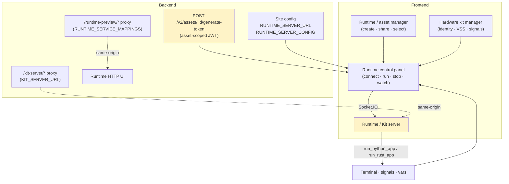
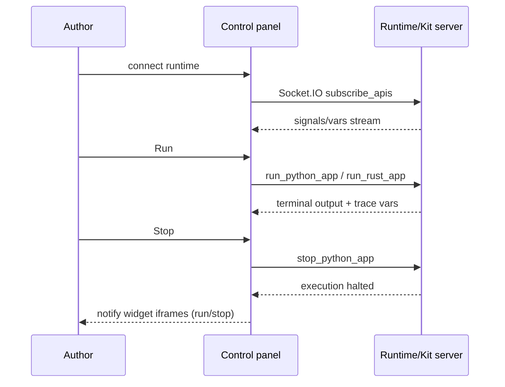
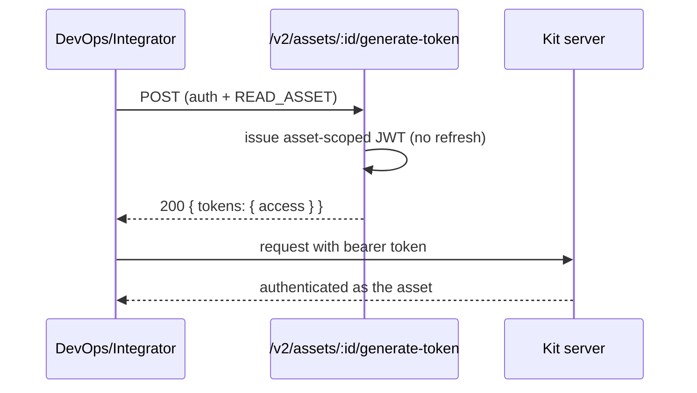
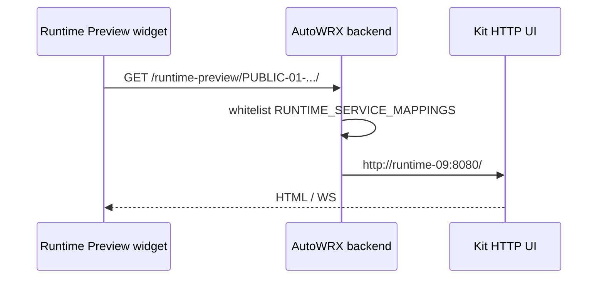

# Cluster: Runtime & Hardware Kits

Run your prototype's Python/C++/Rust code on cloud or hardware runtimes, watch live signals and trace variables, and manage the runtime/kit assets you connect to.

**Implementation:** `frontend/src/components/molecules/{DaRuntimeControl,DaRuntimeConnector}.tsx`, `frontend/src/stores/runtimeStore.ts`, `backend/src/app.js` (kit proxy + runtime-preview proxy), `backend/src/config/runtimeConfig.js`, `backend/src/controllers/asset.controller.js` (generateToken).

---

## Capabilities in this cluster

| ID | Capability |
|----|------------|
| [CAP-RUNTIME-01](#cap-runtime-01--runtime-control-panel) | Runtime control panel |
| [CAP-RUNTIME-02](#cap-runtime-02--runtime--asset-manager) | Runtime / asset manager |
| [CAP-RUNTIME-03](#cap-runtime-03--hardware-kit-manager) | Hardware kit manager |
| [CAP-RUNTIME-04](#cap-runtime-04--asset-access-tokens) | Asset access tokens |
| [CAP-RUNTIME-05](#cap-runtime-05--kit-server-proxy) | Kit server proxy |
| [CAP-RUNTIME-06](#cap-runtime-06--runtime-server-config) | Runtime server config |
| [CAP-RUNTIME-07](#cap-runtime-07--runtime-http-preview-proxy) | Runtime HTTP preview proxy |

## CAP-RUNTIME-01 — Runtime control panel

| Actor | Where | Personal data | E2E coverage |
|---|---|---|---|
| user | Runtime panel (`/model/:id/prototype/:id?tab=runtime`) | ❌ No | ✅ 1 case, ≈33% (est.) |

### Description

As a prototype author, I can run, stop, and watch my prototype's Python/C++/Rust code from the runtime control panel — seeing live terminal output, vehicle signals, and trace variables — and manage dependencies and the vehicle model from the same panel, so that I can test my prototype against a live runtime without leaving the workspace.

### Who uses it / value

Prototype authors (run/test code); hardware-kit operators.

### Acceptance criteria

- When a **user** expands the runtime control panel at **Runtime panel (`/model/:id/prototype/:id?tab=runtime`)** and picks a runtime from the Runtime selector, the panel connects; when they press Run, their prototype's code executes on the connected runtime and the Terminal tab streams its output; when they press Stop, execution halts and the Run button becomes available again.
- When a **user** has no runtime selected at **Runtime panel (`/model/:id/prototype/:id?tab=runtime`)**, the Run button is disabled and shows a hint to select a runtime; when nothing is running, the Stop button is disabled.
- When a **user** opens the Signals Watch tab at **Runtime panel (`/model/:id/prototype/:id?tab=runtime`)**, they see live values for the vehicle APIs their prototype uses and can write a value back to the runtime; when they open the Vars Watch tab (C++ prototypes), they see trace variables and can write values back.
- When a **user** chooses "Install New Python Library" from the Send Request menu at **Runtime panel (`/model/:id/prototype/:id?tab=runtime`)** and types a library name, the runtime fetches the dependency and they see the result in the terminal; when they choose "Rebuild Vehicle Model" or "Revert to default Vehicle Model", the runtime applies the change.
- When a **user** opens "Config Runtime Server" at **Runtime panel (`/model/:id/prototype/:id?tab=runtime`)** and enters a custom runtime URL, their session uses that server instead of the instance default; when they clear it, the panel falls back to the default runtime.
- When a **guest** (not signed in) or a **user** lacking read access to the prototype's model tries to open the control panel at **Runtime panel (`/model/:id/prototype/:id?tab=runtime`)**, they are prevented from opening it.

### API contract

No HTTP surface on the backend — the panel talks to the kit/runtime server over a direct Socket.IO channel. Permission gating, config keys, and channel events:

- Read requires `READ_MODEL` permission on the prototype's model (owner bypass).
- Runtime server set by site-config keys `RUNTIME_SERVER_URL` (server address) and `RUNTIME_SERVER_CONFIG` (Socket.IO connection options, JSON). A custom runtime URL entered in the "Config Runtime Server" dialog overrides the instance default for the session (stored in `localStorage` under `customKitServer`).
- The runtime channel authenticates to the kit server with an asset access token (CAP-RUNTIME-04).
- Socket.IO events over the runtime channel: `subscribe_apis`, `run_python_app` / `run_rust_app`, `stop_python_app`, `writeSignalsValue`, `writeVarsValue`, `listPythonLibs`, `requestInstallLib`, `builldVehicleModel`, `revertToDefaultVehicleModel`, `loadMockSignals`, `setMockSignals`; the runtime pushes signals/vars/terminal output and `lsOfRunner` / `lsOfApiSubscriber` info back to the panel.
- Rust remote compile ships source to an external compiler (`DaRemoteCompileRust`); on `compile-done` the compiled binary is run via `runBinApp`.
- Widget iframes are notified on run/stop via `postMessage({ action: 'run-app' | 'stop-app' })`.

### Quality control

Connect a cloud runtime, run a Python prototype, and confirm the terminal shows output and signals update; press Stop and confirm execution halts; request a pip install and confirm the dependency is fetched; trigger a vehicle-model rebuild and confirm the kit rebuilds.

### Security

Read `READ_MODEL`. Direct Socket.IO to external kit server (auth via asset token). Rust remote compile sends code to a remote compiler.

**Coverage:**
- **Auth:** Required — opening the control panel requires `READ_MODEL`; the runtime connection authenticates to the kit server with an asset-scoped JWT (asset access token).
- **Authorization:** `READ_MODEL` on the prototype's model (owner bypass); the kit server authorizes each action by the asset token's scope.
- **Input validation:** Not backend-validated — code and run/stop/pip-install commands flow over the direct runtime channel; no validation on this path.
- **Rate limiting:** Not applied — the direct runtime channel has no limiter; `authLimiter` is defined but not wired to any route.
- **Secrets:** The asset access token is a bearer secret carried on the runtime channel; no other secrets handled by the panel.

**Risks:**
- **Workspace escape via runtime:** the connected kit server executes arbitrary prototype code (Python/Rust); a compromised or rogue kit could reach back into browser context or shared storage and escape the prototype workspace. *Mitigation:* the system relays via the kit server over an authenticated Socket.IO channel; don't pass tokens to the runtime.
- **Remote compile code exfiltration:** Rust remote compile ships source to an external compiler — a hostile or misconfigured compiler endpoint receives the user's prototype IP. *Mitigation:* none currently — pin the remote compiler endpoint and restrict it to trusted hosts.
- **Token theft over Socket.IO:** the direct Socket.IO channel carries the asset token; an XSS in the panel or a tampered custom runtime URL (localStorage) could leak it. *Mitigation:* none currently — validate the custom runtime URL and avoid persisting the asset token in localStorage.

### Personal data processing

❌ No — this capability does not process personal data. Signal/var values and prototype code are not personal data.

**Risks:**
- none — no personal data processed.

### AutoWRX data

Runtime signal values are transient (kept in memory, not persisted); prototype code sent to the kit/remote compiler for execution.

**Coverage:**
- **Stored data:** None on the backend — signal/var values are transient in the browser session; the panel does not persist code.
- **Retention:** N/A — transient, session-scoped in the browser; not persisted.
- **Encryption:** In transit on the runtime channel (TLS deployment-dependent); nothing stored at rest by the panel.
- **Logging:** Standard logger only; the runtime server logs "a user connected" — no signal/code/token logging observed.

**Risks:**
- **Prototype code exposure:** code is sent to the kit server / remote compiler for execution — a compromised runtime retains and exfiltrates prototype IP.
- **Signal-value leak:** transient signal/var values flowing into `runtimeStore` could be captured by a malicious widget iframe notified on run/stop.

### Test coverage
- **E2E (Playwright):** 1 test case in `prototype-runtime.spec.ts` — SITEMAP: ✅
- **Estimated coverage:** ≈33% (est.) — 1 E2E covers connect/run/stop; pip-install and rebuild paths untested across 3 acceptance criteria.
- **Unit (Jest):** none

## CAP-RUNTIME-02 — Runtime / asset manager

| Actor | Where | Personal data | E2E coverage |
|---|---|---|---|
| user | Runtime / asset manager dialog | ❌ No | ✅ 1 case, ≈50% (est.) |

### Description

As a prototype author, I can add a cloud runtime by its runtime code, rename it, share it with collaborators, remove it from my list, and pick which runtime is active for my prototype, so that I can keep and switch between the runtimes I use.

### Who uses it / value

End users (manage their runtimes/kits); collaborators (shared access).

### Acceptance criteria

- When a **user** opens the runtime manager from the control panel ("Add Runtime") at **Runtime / asset manager dialog**, they see their cloud runtimes listed; when they enter a runtime code and click Add, the runtime appears in their list and becomes selectable in the control panel.
- When a **user** clicks the edit icon on a runtime at **Runtime / asset manager dialog** and changes its name, the list updates to the new name; when they click the delete icon and confirm, the runtime is removed from their list and is no longer selectable.
- When a **user** clicks the share icon at **Runtime / asset manager dialog**, the share dialog opens and they can share the runtime with collaborators (CAP-ASSET-04); when a collaborator opens their manager, they see the shared runtime.
- When a **user** tries to add a runtime with an empty name at **Runtime / asset manager dialog**, the Add button is disabled; when a create, rename, or delete fails, they see a failure toast and their list is unchanged.
- When a **guest** (not signed in) tries to open the manager at **Runtime / asset manager dialog**, they are prevented from opening it.

### API contract

The runtime manager is a UI over the asset endpoints (full contract in CAP-ASSET-01). All routes require auth.

- `POST /v2/assets` (auth) → `200` — create asset; body `{ name: string, type: 'CLOUD_RUNTIME', data: any }`.
- `GET /v2/assets` (auth) → `200` — list own + shared assets; query `name`, `type`, `sortBy`, `limit`, `page`.
- `PATCH /v2/assets/:id` (auth + `WRITE_ASSET`, owner bypass) → `200` (empty body) — update; body `{ name?, type?, data? }` (min 1 field); `404` if not found.
- `DELETE /v2/assets/:id` (auth + `WRITE_ASSET`, owner bypass) → `200` — delete; `404` if not found.
- Sharing: `POST /v2/assets/:id/permissions` / `DELETE /v2/assets/:id/permissions` (see CAP-ASSET-04).
- The active runtime is chosen in the control panel's Runtime selector (client-side); no endpoint for "set active".

### Quality control

Create a cloud-runtime asset and confirm it is selectable in the control panel; share it and confirm a collaborator can select it; delete it and confirm it is gone.

### Security

Auth required; sharing via `WRITE_ASSET` (see [assets-sharing.md](./assets-sharing.md)).

**Coverage:**
- **Auth:** Required on all asset routes.
- **Authorization:** `READ_ASSET` for get, `WRITE_ASSET` for update/delete/share (owner bypass); create is auth-only.
- **Input validation:** Validated on create/update; `data` has no schema or size guard; `type` is not constrained to `USER_ASSET_TYPES` at the validation layer.
- **Rate limiting:** Not applied — `authLimiter` is defined but not wired to the asset routes.
- **Secrets:** Asset `data` may hold kit endpoint URLs and connection config — stored at rest with no app-level encryption; no separate secret store.

**Risks:**
- **Kit endpoint tampering:** any user with edit access can repoint an asset's endpoint to an attacker-controlled kit server, redirecting all runs (and tokens) to it. *Mitigation:* none currently — require re-auth or admin approval before changing an asset's endpoint URL.
- **Shared-runtime hijack:** a shared runtime's `WRITE_ASSET` grant lets collaborators reconfigure the kit; a mis-grant widens the attacker set who can tamper with the active runtime. *Mitigation:* none currently — default shares to `read_asset` and audit `write_asset` grants.

### Personal data processing

❌ No — this capability does not process personal data. `created_by` is a userId reference, not personal data.

**Risks:**
- none — no personal data processed.

### AutoWRX data

Asset `data` (e.g. endpoint config) stored in `assets`.

**Coverage:**
- **Stored data:** `name`, `type`, `data` (Mixed), `created_by`, timestamps — persisted in the `assets` collection.
- **Retention:** Indefinite until hard-deleted (no soft delete, no TTL).
- **Encryption:** No app-level at-rest encryption; in transit TLS deployment-dependent.
- **Logging:** Standard logger; no asset-data logging observed.

**Risks:**
- **Endpoint credential exposure:** asset `data` may embed kit endpoint URLs and connection config; a leaked or over-shared asset exposes the path and parameters to reach a hardware kit.

### Test coverage
- **E2E (Playwright):** 1 test case in `my-assets.spec.ts` (create + delete runtime asset via the manager UI) — SITEMAP: ✅
- **Estimated coverage:** ≈50% (est.) — 1 E2E covers create/delete; share/select-active-runtime untested across 2 acceptance criteria.
- **Unit (Jest):** none

## CAP-RUNTIME-03 — Hardware kit manager

| Actor | Where | Personal data | E2E coverage |
|---|---|---|---|
| operator | Hardware kit manager dialog | ❌ No | ❌ 0 cases, ≈0% (est.) |

### Description

As a hardware-kit operator, I can open my hardware kit from My Assets, edit its signal-mapping (Config) and VSS files in a code editor, and push them to or pull them from the kit, so that the runtime connector targets a correctly-configured kit.

### Who uses it / value

Hardware-kit operators.

### Acceptance criteria

- When an **operator** opens a `HARDWARE_KIT` asset from My Assets and clicks the manage (kit) icon at **Hardware kit manager dialog**, the hardware kit manager opens with Config and VSS tabs.
- When an **operator** clicks "Load from device" on the Config (or VSS) tab at **Hardware kit manager dialog**, the kit's current signal-mapping (or VSS) file is loaded into the editor; when they edit the content and click "Set to device", the file is written to the kit.
- When an **operator** sets a new VSS file at **Hardware kit manager dialog**, the kit rebuilds its vehicle model from the new VSS shortly after.
- When the kit is unreachable or an operation fails at **Hardware kit manager dialog**, the Load/Set buttons show a loading state and time out without applying the change.
- When a **guest** (not signed in) or a **user** lacking read access to the asset tries to open the manager at **Hardware kit manager dialog**, they are prevented from opening it.

### API contract

No HTTP surface on the backend — the manager opens its own Socket.IO channel to the kit server. Asset gating and channel events:

- Asset access gated by `READ_ASSET`/`WRITE_ASSET` on the `HARDWARE_KIT` asset (owner bypass) via the My Assets entry point (CAP-ASSET-01).
- The manager authenticates to the kit server with an asset access token (CAP-RUNTIME-04) over a `DaRuntimeConnector` channel (`isDeployMode`, `targetPrefix=['Kit-','PilotCar-']`, `forceKitId=<kitName>`).
- Kit server URL from site-config `RUNTIME_SERVER_URL`.
- Socket.IO operations: `readFile(filePath)`, `writeFile(filePath, fileContent)`, `builldVehicleModel(vss)`.
- File paths: `/app/remote_access/signal-config.json` (Config), `/app/remote_access/vss.json` (VSS).

### Quality control

Configure a kit and confirm the runtime connector can target it; fetch and replace the kit's signal mapping and VSS files and confirm the operations take effect on the kit.

### Security

Auth required; kit operations open their own Socket.IO to the kit server.

**Coverage:**
- **Auth:** Required — kit operations go through the asset (`READ_ASSET`/`WRITE_ASSET`); the manager authenticates to the kit server with the asset token.
- **Authorization:** `READ_ASSET`/`WRITE_ASSET` on the `HARDWARE_KIT` asset (owner bypass); the kit server enforces per-asset token scope.
- **Input validation:** Not backend-validated — kit operations flow over the direct kit channel; no validation on this path.
- **Rate limiting:** Not applied — the direct kit channel has no limiter; `authLimiter` is not wired.
- **Secrets:** Kit identity/connection config held in asset `data`; the asset token is used as a bearer secret.

**Risks:**
- **Hardware kit tampering:** `replaceSignalMapping`/`replaceVss` mutate the kit's signal/VSS files; a stolen asset token or broken auth check lets an attacker rewrite the kit's mapping and corrupt vehicle data. *Mitigation:* the system relays via the kit server over an authenticated Socket.IO channel; enforce `WRITE_ASSET` on replace ops.
- **Direct kit channel abuse:** the manager's own Socket.IO to the kit server bypasses backend mediation, so a compromised kit identity can issue arbitrary kit commands unchecked. *Mitigation:* none currently — mediate kit commands through the backend and validate the asset token per command.

### Personal data processing

❌ No — this capability does not process personal data. Kit identity is configuration, not personal data.

**Risks:**
- none — no personal data processed.

### AutoWRX data

Kit connection config in the asset `data`; signal/VSS files read/written on the kit.

**Coverage:**
- **Stored data:** Kit connection config in `assets.data`; signal/VSS files live on the kit server, not the backend.
- **Retention:** Asset config indefinite until hard-deleted; on-kit files overwritten by replace operations (no backend-side recovery).
- **Encryption:** No app-level at-rest encryption for asset `data`; kit-server storage is governed by the kit.
- **Logging:** Standard logger; no kit-config or signal-mapping logging observed.

**Risks:**
- **Kit data destruction:** `replaceSignalMapping`/`replaceVss` overwrite on-kit files — a malicious or mistaken replace permanently destroys the prior mapping/VSS with no backend-side recovery.
- **Connection-config leak:** kit identity/connection config stored in asset `data` is a persistent credential; an over-shared or leaked asset hands operators-of-the-kit access to attackers.

### Test coverage
- **E2E (Playwright):** 0 — not covered — SITEMAP: ❌
- **Estimated coverage:** ≈0% (est.) — no E2E spec
- **Unit (Jest):** none

## CAP-RUNTIME-04 — Asset access tokens

| Actor | Where | Personal data | E2E coverage |
|---|---|---|---|
| integrator | Backend API (no page) | ❌ No | ❌ 0 cases, ≈0% (est.) |

### Description

As a DevOps/integrator, I can mint an access token bound to my asset (via the API — there is no in-app button) so that an external runtime or kit client can authenticate as that asset without my user credentials.

### Who uses it / value

DevOps/integrators (programmatic runtime access); the kit server (authenticating requests).

### Acceptance criteria

- When an **integrator** mints an access token for their asset at **Backend API (no page)**, they receive a token they can hand to their kit/runtime; when the kit/runtime presents that token, the system treats the caller as that asset's identity.
- When the kit/runtime calls without a valid token at **Backend API (no page)**, the request is rejected as unauthenticated.
- When a **user** lacks read access to the asset and tries to mint a token at **Backend API (no page)**, they are prevented from minting it.
- There is no in-app UI button to mint a token — an **integrator** obtains it via the API at **Backend API (no page)** and hands it to the kit out of band.

### API contract

- `POST /v2/assets/:id/generate-token` (auth + `READ_ASSET`, owner bypass) → `200 { tokens: { access } }` — asset-scoped JWT, no refresh token; `404` if the asset is not found.
- Validates `id` (objectId) only; no request body.
- No rate limiting — `authLimiter` is defined but not wired to the route.

### Quality control

Generate a token and use it against the kit server; confirm the call is authenticated as the asset; call without it and confirm the request is unauthorized.

### Security

Requires auth + `READ_ASSET` on the asset. Asset tokens are access-only (short-lived), no refresh — reduces exposure if leaked.

**Coverage:**
- **Auth:** Required on `POST /v2/assets/:id/generate-token`.
- **Authorization:** `READ_ASSET` on the asset (owner bypass); the issued token is asset-scoped.
- **Input validation:** Validates `id` (objectId) only; no request body.
- **Rate limiting:** Not applied — `authLimiter` is defined but not wired to the route.
- **Secrets:** The issued JWT is a bearer credential (access-only, no refresh), signed with the JWT secret.

**Risks:**
- **Bearer credential theft:** the token is a bearer credential; any leak (logs, localStorage, referrer) lets the holder act as the asset against the kit server for the token's lifetime. *Mitigation:* tokens are access-only (short-lived, no refresh); avoid persisting them beyond memory.
- **Scope over-grant:** if `READ_ASSET` is granted too broadly, users who can read an asset can mint tokens that authenticate as it — escalating readers to runtime actors. *Mitigation:* none currently — restrict token minting to `WRITE_ASSET` or admin only.

### Personal data processing

❌ No — this capability does not process personal data. The token carries asset identity, not personal data.

**Risks:**
- none — no personal data processed.

### AutoWRX data

Token is a bearer credential — treat as a secret; no persistence client-side beyond memory.

**Coverage:**
- **Stored data:** None persisted by the endpoint — the token is returned in the response body only; no refresh token is stored.
- **Retention:** Token valid until JWT expiry (short-lived access token); no refresh; no server-side persistence.
- **Encryption:** JWT signed (HMAC with the JWT secret); in transit TLS deployment-dependent.
- **Logging:** Standard logger; the token is not logged.

**Risks:**
- **Persistent token leakage:** a token persisted anywhere beyond memory (devtools, network logs, shared dashboards) survives until expiry and enables silent kit access as the asset.

### Test coverage
- **E2E (Playwright):** 0 — not covered — SITEMAP: ❌
- **Estimated coverage:** ≈0% (est.) — no E2E spec
- **Unit (Jest):** none

## CAP-RUNTIME-05 — Kit server proxy

| Actor | Where | Personal data | E2E coverage |
|---|---|---|---|
| operator | Operator config (`.env` / admin) | ❌ No | ❌ 0 cases, ≈0% (est.) |

### Description

As a prototype author, my browser's runtime connection works against the kit server through the instance's same-origin path, so that my prototype runs against the connected runtime without cross-origin errors; I never configure this directly — I just see my prototype run.

### Who uses it / value

The frontend runtime connector (a same-origin entry point to the kit server); DevOps (centralize kit access).

### Acceptance criteria

- When an **operator** configures the instance with a kit server at **Operator config (`.env` / admin)**, a **user**'s browser runtime connection works without cross-origin errors and their prototype runs against the connected runtime at **Runtime panel (`/model/:id/prototype/:id?tab=runtime`)**.
- When the instance is not configured with a kit server at **Operator config (`.env` / admin)**, the runtime connection is unavailable.
- A **user** never sees or configures the proxy path at **Runtime panel (`/model/:id/prototype/:id?tab=runtime`)** — it is transparent to them.

### API contract

No HTTP surface for users — the backend proxies the kit server transparently. Operator config and proxy behavior:

- `app.use('/kit-server', createProxyMiddleware({ target: KIT_SERVER_URL, changeOrigin: true, ws: true, pathRewrite: { '^/kit-server': '' } }))` — proxies `/kit-server/*` to `KIT_SERVER_URL` (`config.services.kitServer.url`, env `KIT_SERVER_URL`) and upgrades websockets.
- Active only when `KIT_SERVER_URL` is configured.
- Passthrough — the backend does not authenticate; the kit server enforces its own auth (asset token). CSP `connect-src` must allow the kit server.

### Quality control

With `KIT_SERVER_URL` set, confirm runtime connections via `/kit-server` succeed; without it, confirm the route is inactive.

### Security

Passthrough — the kit server enforces its own auth (often via asset tokens). CSP/connect-src must allow the kit server.

**Coverage:**
- **Auth:** Passthrough — the backend does not authenticate; the kit server enforces auth (asset token).
- **Authorization:** None at the proxy — delegated to the kit server.
- **Input validation:** None — passthrough; no validation.
- **Rate limiting:** Not applied — the proxy has no limiter; `authLimiter` is not wired.
- **Secrets:** No secrets handled by the proxy; tokens pass through in transit only.

**Risks:**
- **SSRF via misconfigured `KIT_SERVER_URL`:** an admin misconfiguration (or compromise of the admin setting) could point `/kit-server/*` at an internal host, turning the backend into an SSRF proxy reachable from any browser. *Mitigation:* none currently — validate `KIT_SERVER_URL` against an allow-list of external hosts.
- **Auth-bypass perception:** because the proxy is a passthrough, a frontend that assumes same-origin = trusted could skip token checks and reach the kit server unauthenticated. *Mitigation:* the kit server enforces its own asset-token auth; the frontend must still send the token.

### Personal data processing

❌ No — this capability does not process personal data. The proxy does not inspect or store payload.

**Risks:**
- none — no personal data processed.

### AutoWRX data

Proxies runtime traffic; no storage on the backend.

**Coverage:**
- **Stored data:** None — the proxy relays traffic; it is active only when `KIT_SERVER_URL` is configured.
- **Retention:** N/A — no storage.
- **Encryption:** In transit TLS deployment-dependent; websockets are upgraded.
- **Logging:** Proxy errors are surfaced by the proxy defaults; no payload logging.

**Risks:**
- **Traffic interception:** the proxy relays runtime traffic (including tokens and prototype code) in transit; a misconfigured `KIT_SERVER_URL` to an attacker host silently exfiltrates both.

### Test coverage
- **E2E (Playwright):** 0 — not covered — SITEMAP: ❌
- **Estimated coverage:** ≈0% (est.) — no E2E spec
- **Unit (Jest):** none

## CAP-RUNTIME-06 — Runtime server config

| Actor | Where | Personal data | E2E coverage |
|---|---|---|---|
| admin | Admin → Site Config (`/admin/site-config`) | ❌ No | ❌ 0 cases, ≈0% (est.) |

### Description

As an admin, I can point my instance at a runtime/kit server (server address + connection options) from Admin → Site Config, and confirm reachability from the health page, so that prototype runtime connections target the right server.

### Who uses it / value

Admins/DevOps (point instances at a kit server).

### Acceptance criteria

- When an **admin** sets the runtime server address and connection options at **Admin → Site Config (`/admin/site-config`)**, prototype runtime connections use the new server.
- When an **admin** opens the health page, they see whether the runtime server is reachable and how long the check took.
- When the runtime server URL is not configured at **Admin → Site Config (`/admin/site-config`)**, the health page shows the runtime server as skipped.
- When a **user** who is a non-admin tries to change the runtime server config at **Admin → Site Config (`/admin/site-config`)**, they are prevented; anonymous users can see only the public value.

### API contract

- Public read: `GET /v2/site-configs/public` / `GET /v2/site-configs/public/:key` → returns `RUNTIME_SERVER_URL` and `RUNTIME_SERVER_CONFIG` (URL/connection options only, no secrets).
- Admin write: `PATCH /v2/site-configs/...` (admin / `MANAGE_USERS`) → updates `RUNTIME_SERVER_URL` / `RUNTIME_SERVER_CONFIG`; schema-validated.
- Health: `GET /v2/health` → `runtimeServer` status (`ok` / `skipped` / `error`) with message `Reachable in Xms (URL)` or `RUNTIME_SERVER_URL not configured`.
- Site-config keys: `RUNTIME_SERVER_URL` (default `https://kit.digitalauto.tech`), `RUNTIME_SERVER_CONFIG` (Socket.IO options).

### Quality control

Change `RUNTIME_SERVER_URL` and confirm runtime connections use the new server; call the health endpoint and confirm it reflects the runtime-server status.

### Security

Public read (URL only, no secrets); admin write.

**Coverage:**
- **Auth:** Public read (site-config public endpoint); admin write (`MANAGE_USERS`/admin).
- **Authorization:** Admin-only write; public read returns URL/config only.
- **Input validation:** Schema validation on admin write; public read is unvalidated.
- **Rate limiting:** Not applied — `authLimiter` is not wired to site-config routes.
- **Secrets:** `RUNTIME_SERVER_CONFIG` is not expected to hold secrets; the URL is non-secret.

**Risks:**
- **Public URL tampering signal:** the public-read URL reveals the runtime server's origin to anonymous users, enabling targeted attacks against the kit server. *Mitigation:* none currently — restrict public read to non-sensitive metadata, or hide the URL behind auth.
- **Admin-only write bypass:** a missing admin check on the config write would let any user repoint all clients' runtime traffic to a hostile server. *Mitigation:* the system enforces admin-only write (`MANAGE_USERS`); audit config changes.

### Personal data processing

❌ No — this capability does not process personal data. URL and connection options are not personal data.

**Risks:**
- none — no personal data processed.

### AutoWRX data

URL + Socket.IO options only; `RUNTIME_SERVER_CONFIG` should not hold secrets.

**Coverage:**
- **Stored data:** `RUNTIME_SERVER_URL` + `RUNTIME_SERVER_CONFIG` in site config.
- **Retention:** Indefinite until admin-updated (no TTL).
- **Encryption:** No app-level at-rest encryption; the public-read endpoint exposes config to anonymous users.
- **Logging:** Standard logger; config values are not specially logged.

**Risks:**
- **Secret leakage into config:** if `RUNTIME_SERVER_CONFIG` is mistakenly used to hold credentials (despite the guidance), the public-read site config would expose them to anonymous users.

### Test coverage
- **E2E (Playwright):** 0 — not covered — SITEMAP: ❌
- **Estimated coverage:** ≈0% (est.) — no E2E spec
- **Unit (Jest):** none

## CAP-RUNTIME-07 — Runtime HTTP preview proxy

| Actor | Where | Personal data | E2E coverage |
|---|---|---|---|
| operator | Operator config (`.env`) | ❌ No | ❌ 0 cases, ≈0% (est.) |

### Description

As a prototype author, I can see the selected runtime's HTTP UI inside the Runtime Preview dashboard widget, so that I watch the app's own page without leaving the dashboard. As an operator, I map runtime names to kit HTTP hosts at deploy time so that preview works on the instance.

### Who uses it / value

Authors and demo audiences (see the runtime UI in the dashboard); DevOps (wire kit HTTP services into the AutoWRX origin).

### Acceptance criteria

- When an **operator** configures runtime-name-to-service mappings at **Operator config (`.env`)** and a **user** adds Runtime Preview and selects a mapped kit at **Dashboard (runtime) (`/model/:id/prototype/:id?tab=dashboard`)**, the widget shows that kit's HTTP UI.
- When an **operator** has not configured those mappings at **Operator config (`.env`)**, a **user** opening Runtime Preview at **Dashboard (runtime) (`/model/:id/prototype/:id?tab=dashboard`)** sees an empty/unavailable preview instead of the kit UI.
- When a **user** starts the prototype at **Dashboard (runtime) (`/model/:id/prototype/:id?tab=dashboard`)**, the preview reloads; when they stop it, the widget shows that no application is running.
- A **user** never types the preview proxy path at **Dashboard (runtime) (`/model/:id/prototype/:id?tab=dashboard`)** — the widget builds it from the selected runtime name.

### API contract

No HTTP surface for users — the backend proxies kit HTTP UIs transparently. Operator config and proxy behavior:

- `GET|WS /runtime-preview/:runtimeName/…` (auth required) → proxied to the mapped target; websocket upgrades enabled (`ws: true`). Unauthenticated HTTP requests receive **401** regardless of `PUBLIC_VIEWING`. WS upgrades bypass the HTTP gate and rely on the proxy `router()` for name/mapping validation only.
- `:runtimeName` must match `^[a-zA-Z0-9-]+$`; otherwise **400** blank HTML (`INVALID_RUNTIME_NAME`).
- Target from env `RUNTIME_SERVICE_MAPPINGS` (`RUNTIME_NAME:service` → `http://service:8080`; `RUNTIME_NAME:host:port` or absolute URL also accepted). Unmapped name → **502** blank HTML (`RUNTIME_NOT_CONFIGURED`).
- Connection errors → **502** blank HTML (not JSON). Proxy `timeout` / `proxyTimeout` 3000 ms.
- Optional `RUNTIME_PREFIX` stripped from the path name before lookup.
- Default port **8080** is the kit HTTP UI on the playground compose network (kit-manager is 3090).

**Implementation:** `backend/src/app.js` (`/runtime-preview` proxy), `backend/src/config/runtimeConfig.js` (`getRuntimeTarget`).

### Quality control

With `RUNTIME_SERVICE_MAPPINGS` set, open a dashboard that includes Runtime Preview, select a mapped kit, press Run, and confirm the kit HTTP UI appears (including websocket UIs). Without the env var, confirm the preview stays blank/unavailable.

### Security

Authenticated users only on HTTP — unauthenticated requests receive 401. WS upgrade events bypass the Express gate; the proxy `router()` enforces name/mapping validation but not session auth. CSP `frame-src` / `connect-src` must allow the preview path.

**Coverage:**
- **Auth:** Required — `auth()` on the HTTP gate; unauthenticated requests receive 401 on all deployments (not tied to `PUBLIC_VIEWING`). WS upgrade events skip the Express gate; the proxy `router()` enforces name/mapping validation but not session auth.
- **Authorization:** None at the proxy — any authenticated caller can fetch a mapped runtime name.
- **Input validation:** Path segment `^[a-zA-Z0-9-]+$`; targets only from `RUNTIME_SERVICE_MAPPINGS` (env whitelist).
- **Rate limiting:** Not applied — the proxy has no limiter; `authLimiter` is not wired.
- **Secrets:** No secrets handled by the proxy; kit responses pass through in transit only.

**Risks:**
- **Same-origin preview of user-controlled HTML:** kit HTML is re-served under the AutoWRX origin, so a prototype page could read that origin's storage. *Mitigation:* applied — the preview iframe carries `sandbox="allow-scripts allow-forms"` with `allow-same-origin` omitted, giving the iframe a distinct opaque origin and blocking access to AutoWRX `localStorage`/cookies. Note: kit UIs that make credentialed same-origin requests may need `allow-same-origin` re-added, at which point the sandbox isolation is reduced.
- **SSRF via path param:** a caller could try to make the proxy fetch an arbitrary URL. *Mitigation:* targets come only from the env whitelist; the name regex blocks traversal and `pathRewrite` injection.
- **SSRF via misconfigured `RUNTIME_SERVICE_MAPPINGS`:** an operator mapping to an internal host turns the backend into a proxy to that host. *Mitigation:* none currently — keep mappings to kit HTTP services only.

### Personal data processing

❌ No — this capability does not process personal data. The proxy does not inspect or store payload.

**Risks:**
- none — no personal data processed.

### AutoWRX data

Proxies kit HTTP traffic; no storage on the backend.

**Coverage:**
- **Stored data:** None — mappings live in process env (`RUNTIME_SERVICE_MAPPINGS`); the proxy relays traffic.
- **Retention:** N/A — no storage.
- **Encryption:** In transit TLS deployment-dependent; websockets are upgraded.
- **Logging:** Proxy warns on invalid name, missing mapping, and connection errors; no payload logging.

**Risks:**
- **Traffic interception:** the proxy relays kit HTTP/WS traffic in transit; a mapping pointed at an attacker host would exfiltrate preview requests.

### Test coverage
- **E2E (Playwright):** 0 — not covered — SITEMAP: ❌
- **Estimated coverage:** ≈0% (est.) — no E2E spec
- **Unit (Jest):** none

**Risks:**
- **Secret leakage into config:** if `RUNTIME_SERVER_CONFIG` is mistakenly used to hold credentials (despite the guidance), the public-read site config would expose them to anonymous users.

### Test coverage
- **E2E (Playwright):** 0 — not covered — SITEMAP: ❌
- **Estimated coverage:** ≈0% (est.) — no E2E spec
- **Unit (Jest):** none