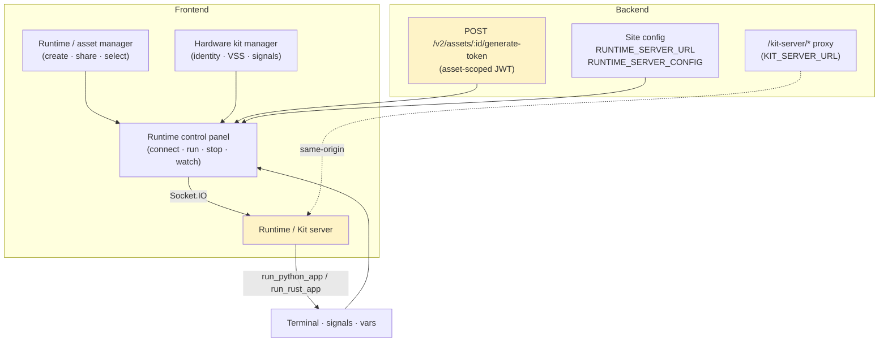
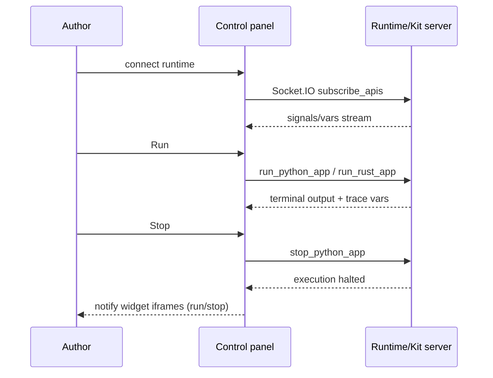
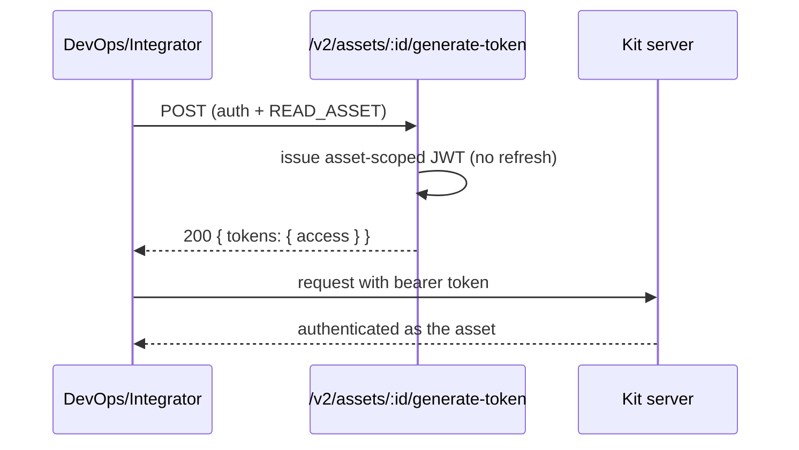

# Cluster: Runtime & Hardware Kits

Executing prototype code on cloud/hardware runtimes. The frontend connects **directly** to the runtime/kit server; the backend reverse-proxies and issues asset tokens. Frontend: `components/molecules/{DaRuntimeControl,DaRuntimeConnector}.tsx`, `stores/runtimeStore.ts`. Backend: `app.js` (kit proxy), `controllers/asset.controller.js` (generateToken).

---

## Capabilities in this cluster

| ID | Capability |
|----|------------|
| [CAP-RUNTIME-01](#cap-runtime-01--runtime-control-panel) | Runtime control panel |
| [CAP-RUNTIME-02](#cap-runtime-02--runtime--asset-manager) | Runtime / asset manager |
| [CAP-RUNTIME-03](#cap-runtime-03--hardware-kit-manager) | Hardware kit manager |
| [CAP-RUNTIME-04](#cap-runtime-04--asset-access-tokens) | Asset access tokens |
| [CAP-RUNTIME-05](#cap-runtime-05--kit-server-proxy) | Kit server proxy |
| [CAP-RUNTIME-06](#cap-runtime-06--runtime-server-config) | Runtime server config |

## CAP-RUNTIME-01 — Runtime control panel

### Description

Right-side panel on Code/Dashboard tabs: select/connect a runtime (cloud or hardware kit), Run/Stop, terminal output, signals watch, vars watch (C++), mock services, runtime usage, request pip install, rebuild/revert vehicle model, custom runtime URL, Rust remote compile; notifies widget iframes of run/stop.

### Who uses it / value

Prototype authors (run/test code); hardware-kit operators.

### Acceptance criteria

- Connect to a runtime → `subscribe_apis` over Socket.IO → signals/vars stream into the UI; Run → `run_python_app`/`run_rust_app`; Stop → `stop_python_app`; terminal + trace vars update.
- Server URL from `RUNTIME_SERVER_URL`, options from `RUNTIME_SERVER_CONFIG`; custom runtime URL overrides (localStorage).
- Read requires `READ_MODEL`.

### Quality control

Connect a cloud runtime → Run a Python prototype → terminal shows output + signals update; Stop → execution halts; pip install → dependency fetched; rebuild vehicle model → kit rebuilds.

### Security

Read `READ_MODEL`. Direct Socket.IO to external kit server (auth via asset token). Rust remote compile sends code to a remote compiler.

**Coverage:**
- **Auth:** Required — the runtime connection authenticates to the external kit server via Socket.IO `handshake.query.access_token` (asset-scoped JWT); the control panel itself is gated by `READ_MODEL`.
- **Authorization:** `READ_MODEL` permission on the prototype's model (owner bypass); the kit server authorizes actions by asset-token scope.
- **Input validation:** Not backend-validated — code and commands (`run_python_app`/`run_rust_app`/`stop_python_app`/pip install) flow over the direct frontend→kit Socket.IO channel; no Joi validation on this path.
- **Rate limiting:** Not applied — the direct Socket.IO channel to the kit server has no limiter; `authLimiter` is defined but not wired to any route.
- **Secrets:** Asset access token is carried in the Socket.IO query string and treated as a bearer secret; no other secrets handled by the panel.

**Risks:**
- **Workspace escape via runtime:** the connected kit server executes arbitrary prototype code (Python/Rust); a compromised or rogue kit could reach back into browser context or shared storage and escape the prototype workspace.
- **Remote compile code exfiltration:** Rust remote compile ships source to an external compiler — a hostile or misconfigured compiler endpoint receives the user's prototype IP.
- **Token theft over Socket.IO:** the direct Socket.IO channel carries the asset token; an XSS in the panel or a tampered custom runtime URL (localStorage) could leak it.

### Data protection

Runtime signal values are transient (`runtimeStore`); prototype code sent to the kit/remote compiler for execution.

**Coverage:**
- **Stored data:** None on the backend — signal/var values are transient in frontend `runtimeStore`; the panel does not persist code.
- **PII:** No — signal/var values and prototype code are not personal data.
- **Retention:** N/A — transient, session-scoped in `runtimeStore`; not persisted.
- **Encryption:** In transit via Socket.IO (TLS deployment-dependent); nothing stored at rest by the panel.
- **Logging:** Standard logger only; the Socket.IO server logs "a user connected" — no signal/code/token logging observed.

**Risks:**
- **Prototype code exposure:** code is sent to the kit server / remote compiler for execution — a compromised runtime retains and exfiltrates prototype IP.
- **Signal-value leak:** transient signal/var values flowing into `runtimeStore` could be captured by a malicious widget iframe notified on run/stop.

### Test coverage
- **E2E (Playwright):** 1 test case in `prototype-runtime.spec.ts` — SITEMAP: ✅
- **Unit (Jest):** none

## CAP-RUNTIME-02 — Runtime / asset manager

### Description

Dialog to create/list/share/edit/delete cloud-runtime and hardware-kit assets; select the active runtime.

### Who uses it / value

End users (manage their runtimes/kits); collaborators (shared access).

### Acceptance criteria

- Create/share/edit/delete assets; selecting an active runtime drives the control panel.
- Auth required.

### Quality control

Create a cloud runtime asset → selectable in the control panel; share it → collaborator can select; delete → gone.

### Security

Auth required; sharing via `WRITE_ASSET` (see [assets-sharing.md](./assets-sharing.md)).

**Coverage:**
- **Auth:** Required (`auth()` on the asset routes).
- **Authorization:** `READ_ASSET` for get, `WRITE_ASSET` for update/delete/share (owner bypass); create is auth-only.
- **Input validation:** Joi validation (`assetValidation.createAsset`/`updateAsset`); `data` is `Joi.any()` — no schema or size guard; `type` not constrained to `USER_ASSET_TYPES` at the validation layer.
- **Rate limiting:** Not applied — `authLimiter` is defined but not wired to the asset routes.
- **Secrets:** Asset `data` may hold kit endpoint URLs and connection config — stored at rest (no app-level encryption); no separate secret store.

**Risks:**
- **Kit endpoint tampering:** any user with edit access can repoint an asset's endpoint to an attacker-controlled kit server, redirecting all runs (and tokens) to it.
- **Shared-runtime hijack:** a shared runtime's `WRITE_ASSET` grant lets collaborators reconfigure the kit; a mis-grant widens the attacker set who can tamper with the active runtime.

### Data protection

Asset `data` (e.g. endpoint config) stored in `assets`.

**Coverage:**
- **Stored data:** `name`, `type`, `data` (Mixed), `created_by`, timestamps in the MongoDB `assets` collection.
- **PII:** No direct PII; `created_by` is a userId reference.
- **Retention:** Indefinite until hard-deleted (no soft delete, no TTL).
- **Encryption:** No app-level at-rest encryption; in transit TLS deployment-dependent.
- **Logging:** Standard logger; no asset-data logging observed.

**Risks:**
- **Endpoint credential exposure:** asset `data` may embed kit endpoint URLs and connection config; a leaked or over-shared asset exposes the path and parameters to reach a hardware kit.

### Test coverage
- **E2E (Playwright):** 1 test case in `my-assets.spec.ts` (create + delete runtime asset via the manager UI) — SITEMAP: ✅
- **Unit (Jest):** none

## CAP-RUNTIME-03 — Hardware kit manager

### Description

Configure a hardware-kit asset's identity/connection.

### Who uses it / value

Hardware-kit operators.

### Acceptance criteria

- Launched from My Assets for `HARDWARE_KIT` assets; auth required; configures the kit identity used by the connector.
- signals/VSS ops (`fetchSignalMapping`, `replaceSignalMapping`, `fetchVss`, `replaceVss`) work against the kit.

### Quality control

Configure a kit → the connector can target it; signals/VSS ops (`fetchSignalMapping`, `replaceSignalMapping`, `fetchVss`, `replaceVss`) work against the kit.

### Security

Auth required; kit operations open their own Socket.IO to the kit server.

**Coverage:**
- **Auth:** Required — kit operations go through the asset (`auth()` + `READ_ASSET`/`WRITE_ASSET`); the manager's own Socket.IO to the kit server uses the asset token.
- **Authorization:** `READ_ASSET`/`WRITE_ASSET` on the `HARDWARE_KIT` asset (owner bypass); the kit server enforces per-asset token scope.
- **Input validation:** Not backend-validated — kit ops (`fetchSignalMapping`/`replaceSignalMapping`/`fetchVss`/`replaceVss`) flow over the direct Socket.IO channel; no Joi validation on this path.
- **Rate limiting:** Not applied — direct Socket.IO channel to the kit server; `authLimiter` not wired.
- **Secrets:** Kit identity/connection config held in asset `data`; the asset token is used as a bearer secret.

**Risks:**
- **Hardware kit tampering:** `replaceSignalMapping`/`replaceVss` mutate the kit's signal/VSS files; a stolen asset token or broken auth check lets an attacker rewrite the kit's mapping and corrupt vehicle data.
- **Direct kit channel abuse:** the manager's own Socket.IO to the kit server bypasses backend mediation, so a compromised kit identity can issue arbitrary kit commands unchecked.

### Data protection

Kit connection config in the asset `data`; signal/VSS files read/written on the kit.

**Coverage:**
- **Stored data:** Kit connection config in `assets.data` (Mongo); signal/VSS files live on the kit server, not the backend.
- **PII:** No direct PII; kit identity is configuration, not personal data.
- **Retention:** Asset config indefinite until hard-deleted; on-kit files overwritten by replace ops (no backend-side recovery).
- **Encryption:** No app-level at-rest encryption for asset `data`; kit-server storage is governed by the kit.
- **Logging:** Standard logger; no kit-config or signal-mapping logging observed.

**Risks:**
- **Kit data destruction:** `replaceSignalMapping`/`replaceVss` overwrite on-kit files — a malicious or mistaken replace permanently destroys the prior mapping/VSS with no backend-side recovery.
- **Connection-config leak:** kit identity/connection config stored in asset `data` is a persistent credential; an over-shared or leaked asset hands operators-of-the-kit access to attackers.

### Test coverage
- **E2E (Playwright):** 0 — not covered — SITEMAP: ❌
- **Unit (Jest):** none

## CAP-RUNTIME-04 — Asset access tokens

### Description

Issues a JWT bound to an Asset (no refresh token) so external/runtime clients authenticate as the asset for kit-server/runtime access.

### Who uses it / value

DevOps/integrators (programmatic runtime access); the kit server (authenticating requests).

### Acceptance criteria

- `POST /v2/assets/:id/generate-token` (auth + `READ_ASSET`) → `200 { tokens: { access } }` (asset-scoped, no refresh).
- The token is accepted by the kit server/runtime as the asset's identity.

### Quality control

Generate a token → use it against the kit server → authenticated as the asset; without it → unauthorized.

### Security

Requires auth + `READ_ASSET` on the asset. Asset tokens are access-only (short-lived), no refresh — reduces exposure if leaked.

**Coverage:**
- **Auth:** Required (`auth()` on `POST /v2/assets/:id/generate-token`).
- **Authorization:** `READ_ASSET` on the asset (owner bypass); the issued token is asset-scoped.
- **Input validation:** Joi `generateToken` validates `id` (objectId) only; no request body.
- **Rate limiting:** Not applied — `authLimiter` is defined but not wired to the route.
- **Secrets:** The issued JWT is a bearer credential (access-only, no refresh), signed with `config.jwt.secret`.

**Risks:**
- **Bearer credential theft:** the token is a bearer credential; any leak (logs, localStorage, referrer) lets the holder act as the asset against the kit server for the token's lifetime.
- **Scope over-grant:** if `READ_ASSET` is granted too broadly, users who can read an asset can mint tokens that authenticate as it — escalating readers to runtime actors.

### Data protection

Token is a bearer credential — treat as a secret; no persistence client-side beyond memory.

**Coverage:**
- **Stored data:** None persisted by the endpoint — the token is returned in the response body only; no refresh token is stored.
- **PII:** No — the token carries asset identity, not personal data.
- **Retention:** Token valid until JWT expiry (short-lived access token); no refresh; no server-side persistence.
- **Encryption:** JWT signed (HMAC with `config.jwt.secret`); in transit TLS deployment-dependent.
- **Logging:** Standard logger; the token is not logged by the controller.

**Risks:**
- **Persistent token leakage:** a token persisted anywhere beyond memory (devtools, network logs, shared dashboards) survives until expiry and enables silent kit access as the asset.

### Test coverage
- **E2E (Playwright):** 0 — not covered — SITEMAP: ❌
- **Unit (Jest):** none

## CAP-RUNTIME-05 — Kit server proxy

### Description

Reverse-proxies `/kit-server/*` to the configured `KIT_SERVER_URL` (websocket-aware, path-rewrite).

### Who uses it / value

The frontend runtime connector (a same-origin entry point to the kit server); DevOps (centralize kit access).

### Acceptance criteria

- `ALL /kit-server/*` proxied to `KIT_SERVER_URL`; websockets upgraded.
- Conditional on `KIT_SERVER_URL` being configured.

### Quality control

With `KIT_SERVER_URL` set, runtime connections via `/kit-server` succeed; without it, the route is inactive.

### Security

Passthrough — the kit server enforces its own auth (often via asset tokens). CSP/connect-src must allow the kit server.

**Coverage:**
- **Auth:** Passthrough — the backend does not authenticate; the kit server enforces auth (asset token).
- **Authorization:** None at the proxy — delegated to the kit server.
- **Input validation:** None — `createProxyMiddleware` passthrough; no Joi validation.
- **Rate limiting:** Not applied — the proxy has no limiter; `authLimiter` is not wired.
- **Secrets:** No secrets handled by the proxy; tokens pass through in transit only.

**Risks:**
- **SSRF via misconfigured `KIT_SERVER_URL`:** an admin misconfiguration (or compromise of the admin setting) could point `/kit-server/*` at an internal host, turning the backend into an SSRF proxy reachable from any browser.
- **Auth-bypass perception:** because the proxy is a passthrough, a frontend that assumes same-origin = trusted could skip token checks and reach the kit server unauthenticated.

### Data protection

Proxies runtime traffic; no storage on the backend.

**Coverage:**
- **Stored data:** None — the proxy relays traffic; it is active only when `KIT_SERVER_URL` is configured.
- **PII:** No — the proxy does not inspect or store payload.
- **Retention:** N/A — no storage.
- **Encryption:** In transit TLS deployment-dependent; websockets are upgraded (`ws: true`).
- **Logging:** Proxy errors are surfaced by `http-proxy-middleware` defaults; no payload logging.

**Risks:**
- **Traffic interception:** the proxy relays runtime traffic (including tokens and prototype code) in transit; a misconfigured `KIT_SERVER_URL` to an attacker host silently exfiltrates both.

### Test coverage
- **E2E (Playwright):** 0 — not covered — SITEMAP: ❌
- **Unit (Jest):** none

## CAP-RUNTIME-06 — Runtime server config

### Description

Site-config `RUNTIME_SERVER_URL` + `RUNTIME_SERVER_CONFIG` (Socket.IO client options) drive frontend runtime connections; health-checked by the health endpoint.

### Who uses it / value

Admins/DevOps (point instances at a kit server).

### Acceptance criteria

- Site-config public read; admin write. Health endpoint reports runtime-server reachability.

### Quality control

Change `RUNTIME_SERVER_URL` → runtime connections use the new server; health check reflects status.

### Security

Public read (URL only, no secrets); admin write.

**Coverage:**
- **Auth:** Public read (site-config public endpoint); admin write (`MANAGE_USERS`/admin).
- **Authorization:** Admin-only write; public read returns URL/config only.
- **Input validation:** Site-config schema validation on admin write (siteConfig validation); public read is unvalidated.
- **Rate limiting:** Not applied — `authLimiter` is not wired to site-config routes.
- **Secrets:** `RUNTIME_SERVER_CONFIG` is not expected to hold secrets; the URL is non-secret.

**Risks:**
- **Public URL tampering signal:** the public-read URL reveals the runtime server's origin to anonymous users, enabling targeted attacks against the kit server.
- **Admin-only write bypass:** a missing admin check on the config write would let any user repoint all clients' runtime traffic to a hostile server.

### Data protection

URL + Socket.IO options only; `RUNTIME_SERVER_CONFIG` should not hold secrets.

**Coverage:**
- **Stored data:** `RUNTIME_SERVER_URL` + `RUNTIME_SERVER_CONFIG` in site config (Mongo).
- **PII:** No — URL and Socket.IO options are not personal data.
- **Retention:** Indefinite until admin-updated (no TTL).
- **Encryption:** No app-level at-rest encryption; the public-read endpoint exposes config to anonymous users.
- **Logging:** Standard logger; config values are not specially logged.

**Risks:**
- **Secret leakage into config:** if `RUNTIME_SERVER_CONFIG` is mistakenly used to hold credentials (despite the guidance), the public-read site config would expose them to anonymous users.

### Test coverage
- **E2E (Playwright):** 0 — not covered — SITEMAP: ❌
- **Unit (Jest):** none