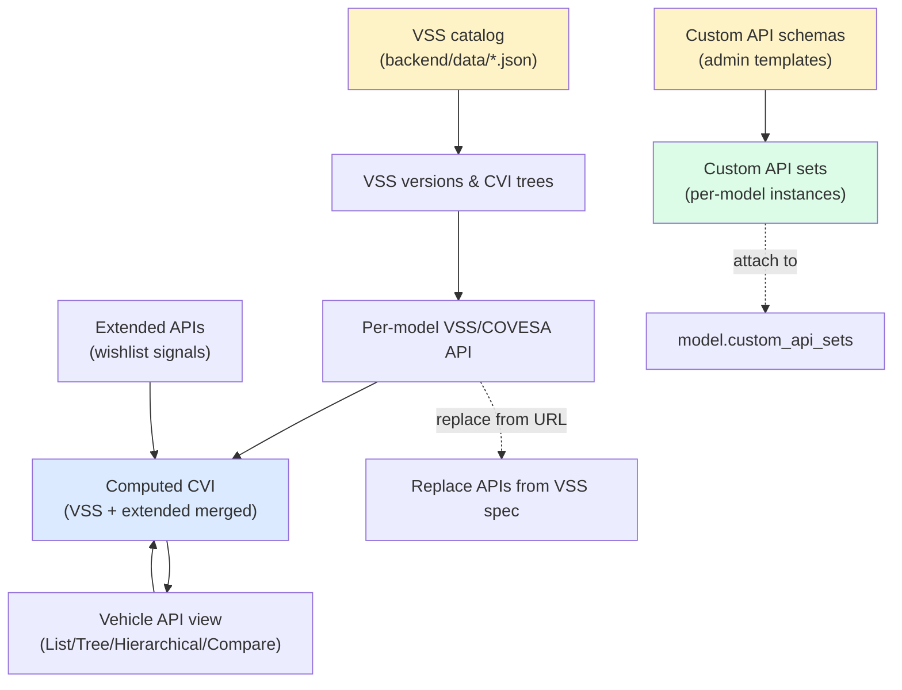
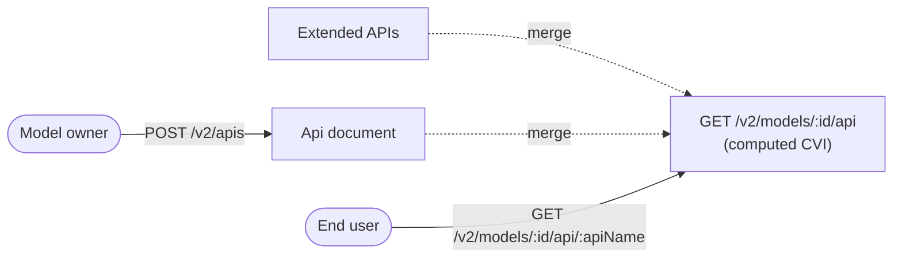
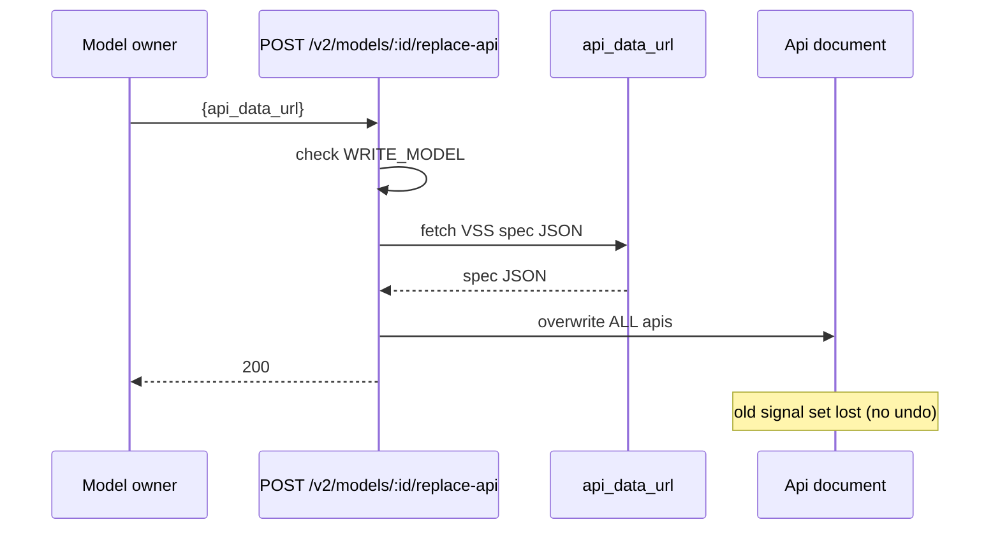
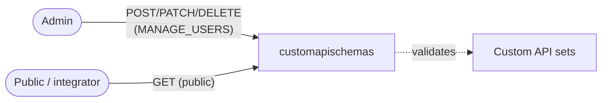

# Cluster: Vehicle APIs

The signal/API layer over models: VSS/COVESA, extended (wishlist) signals, and the admin-defined Custom APIs. Backend: `routes/v2/vehicle-data/{api,extendedApi,custom-api-set}.route.js`, `routes/v2/system/custom-api-schema.route.js`, `models/{api,extendedApi,customApiSchema,customApiSet}.model.js`. Frontend: `pages/PageVehicleApi.tsx`, `components/organisms/{ViewApiCovesa,CustomApi*}.tsx`.

---

## VSS versions & CVI trees

### Description

Lists available VSS (Vehicle Signal Specification) versions from `backend/data/*.json` and serves a version's computed CVI (Computed Vehicle Interface) tree.

### Who uses it / value

End users (browse signals); integrators (pick a VSS version); the platform (canonical signal catalog).

### Acceptance criteria

- `GET /v2/apis/vss` → `200` list of versions (e.g. `['4.0','3.1.1',…]`).
- `GET /v2/apis/vss/:name` → `200` that version's CVI tree.
- Static `GET /vss/:version/:filename` serves the raw JSON (1-hour cache; RC→rc normalization).

### Quality control

List versions → non-empty; fetch a version's tree → returns the CVI object; static `/vss/<version>/<file>` returns JSON.

### Security

Public (no auth).

**Risks:**
- **Path-traversal in static serving:** the static `GET /vss/:version/:filename` handler maps URL segments to files under `backend/data/`; a weak normalization/caching path could be abused to read arbitrary JSON files from the server if segment sanitization misses encoded or `..` paths.
- **Catalog exposure:** the unauthenticated version list discloses every VSS version the platform supports, giving an attacker the full signal taxonomy to target downstream integrations against.

### Data protection

Static reference data only; no PII.

**Risks:**
- **Stale-spec leakage:** cached (1-hour) static JSON can keep serving a deprecated/superseded VSS version long after an admin intends to retire it, so consumers keep building against data the platform believed retired.

## Per-model VSS/COVESA API CRUD + computed tree

### Description

Each model has an `Api` document holding its VSS definition; the computed API merges VSS + extended (wishlist) APIs into a single tree.

### Who uses it / value

Model owners (define the signal set); end users (consume signals in dashboards/code).

### Acceptance criteria

- `POST /v2/apis` (auth) → `201` create `Api`; `GET /v2/apis/:id` → `200`; `PATCH` → `200`; `DELETE` → `204`; `GET /v2/apis/model_id/:modelId` → `200` the model's API.
- `GET /v2/models/:id/api` (optional auth) → `200` computed CVI (VSS + extended merged); `GET /v2/models/:id/api/:apiName` → `200` one API's detail (`name`, `datatype`, `type`, `unit?`, `min?`, `max?`, `description?`).

### Quality control

Create an API for a model → computed tree includes it; fetch `Vehicle.Speed` detail → returns datatype/unit.

### Security

Read optional via `PUBLIC_VIEWING`; write requires auth (owner/admin).

**Risks:**
- **Computed-tree leak of private signals:** `GET /v2/models/:id/api` is optional-auth via `PUBLIC_VIEWING`; if a private model's computed tree were served without the access-scoping check, its entire signal definition set would leak to anonymous callers.
- **Unauthorized signal tampering:** a missing auth check on `PATCH /v2/apis/:id` would let any authenticated user rewrite another tenant's signal definitions, corrupting dashboards and downstream consumers.

### Data protection

API definitions stored in `apis` (references `model` + `created_by`).

**Risks:**
- **Cross-tenant signal inference:** `created_by` and `model` references in `Api` documents can reveal which user owns which model's signal set; a listing gap could expose private ownership relationships.

## Replace APIs from a VSS spec

### Description

Replace **all** APIs for a model from a VSS spec JSON at a URL.

### Who uses it / value

Model owners (swap the signal set to a new VSS version).

### Acceptance criteria

- `POST /v2/models/:id/replace-api {api_data_url}` (requires `WRITE_MODEL`) → `200`; missing `api_data_url` → `400`. ⚠️ Destructive — replaces all APIs.

### Quality control

Replace from a VSS URL → computed tree changes to the new spec; verify with `GET /v2/models/:id/api`.

### Security

Requires `WRITE_MODEL`.

**Risks:**
- **SSRF via `api_data_url`:** the server fetches the user-supplied URL to pull the VSS spec; without an allowlist or internal-address blocking, an attacker with `WRITE_MODEL` can make the server probe internal services (`http://169.254.169.254/…`, localhost admin ports).
- **Destructive overwrite by a stolen token:** a single call replaces the entire `Api` document, so a leaked `WRITE_MODEL` token lets an attacker wipe a model's signal set irreversibly in one request.

### Data protection

Overwrites the model's `Api` document; the old set is lost (no undo beyond change logs).

**Risks:**
- **Irreversible signal-set loss:** the old API set is hard-overwritten with no soft-delete or snapshot, so a malicious or mistaken replace permanently destroys the prior signal definitions — recoverable only from change logs if they exist.

## Vehicle API view (List / Tree / Hierarchical / Compare)

### Description

UI to browse the computed COVESA/VSS APIs in List, Tree, Hierarchical, and a VSS comparator; download computed VSS; upload/replace VSS; switch VSS version.

### Who uses it / value

End users (explore signals); model owners (compare/replace VSS).

### Acceptance criteria

- Routes `/model/:id/api`, `/model/:id/api/covesa/:api` render the views; download returns computed VSS JSON; replace/upload requires `WRITE_MODEL`.
- View subject to `PUBLIC_VIEWING`; replace requires `WRITE_MODEL`.

### Quality control

Switch view modes → tree/list/hierarchy render; compare two versions → diffs shown; download → valid JSON.

### Security

Read optional; replace `WRITE_MODEL`.

**Risks:**
- **Download exfiltration:** the download action returns the full computed VSS JSON, so a `PUBLIC_VIEWING=true` misconfiguration or a leaked read path hands the entire signal definition set to an anonymous user.
- **Replace-action privilege bypass:** the replace/upload path in the UI must enforce `WRITE_MODEL` server-side; relying on UI hiding alone would let a crafted `POST /v2/models/:id/replace-api` call succeed for any authenticated user.

### Data protection

Computed from stored `Api`/`ExtendedApi`; download exposes the model's signal definitions.

**Risks:**
- **Bulk signal export:** a single download bundles every signal (including extended/wishlist signals unique to the model), giving one request a high-value exfiltration payload if access scoping is wrong.

## Extended APIs (wishlist signals)

### Description

Custom per-model signals layered on top of the VSS tree; merged into the computed API.

### Who uses it / value

Model owners (add signals beyond standard VSS); end users (use the extended signals).

### Acceptance criteria

- `GET /v2/extendedApis?model=<id>` (optional auth; caller must have model access) → `200` list; `POST` → `201`; `GET /by-api-and-model?apiName=&model=` → `200`; `GET/PATCH/DELETE /:id` → `200`/`200`/`204`.
- `GET /` requires `model` query; `by-api-and-model` requires `apiName` + `model`; no access → `403`.
- Unique per `(apiName, model)`.

### Quality control

Create an extended signal → appears in the computed tree; create a duplicate `(apiName, model)` → rejected; access another user's private model → `403`.

### Security

Read optional; write requires auth + model access. Uniqueness enforced.

**Risks:**
- **Cross-tenant signal injection:** if the model-access check on `POST` were bypassed, an authenticated user could inject extended signals into another tenant's private model, polluting its computed CVI.
- **Uniqueness-bypass collision:** the `(apiName, model)` unique index is the only dedupe guard; a race or a check that runs before index validation could create duplicate signals that confuse downstream consumers.

### Data protection

Stored in `extendedapis` with `(apiName, model)` unique index.

**Risks:**
- **Wishlist-signal disclosure:** extended signals often encode proprietary behavior beyond standard VSS; a read-path gap would expose this proprietary wishlist to unauthorized users.

## Custom API schemas

### Description

Admin-defined API schema templates (`type` tree/list/graph) with a JSON `schema`, `id_format`, `relationships`, `tree_config`, `display_mapping`; used to validate Custom API Sets.

### Who uses it / value

Admins (define custom API shapes); integrators (non-COVESA APIs like REST/USP).

### Acceptance criteria

- `GET /v2/custom-api-schema[/:id]` (public) → list/get; `POST/PATCH/DELETE /v2/custom-api-schema[/:id]` (admin) → `201`/`200`/`204`. Mounted at both `/v2/system/custom-api-schema` (frontend) and the bare `/v2/custom-api-schema`.
- Create requires `schema` (JSON string); old `attributes` field is gone.
- Item validation against the schema is basic (full JSON-schema validation is a TODO).

### Quality control

Admin creates a `list` schema with a `schema` string → `201`; non-admin create → `403`; list → public reads it.

### Security

Read public; write requires `MANAGE_USERS`. No secrets in schemas.

**Risks:**
- **Platform-wide validation template poisoning:** schemas are the validation gate for every Custom API Set; a compromised admin could push a permissive `schema` that accepts arbitrary malicious API payloads into all derived sets.
- **Weak validation as an attack surface:** item validation is only basic (full JSON-schema validation is a TODO), so malformed or oversized `schema` strings could trigger parser/DB issues in downstream set storage.

### Data protection

Schema definitions stored in `customapischemas` (`code` unique).

**Risks:**
- **Schema tampering without audit:** a modified schema silently re-shapes what every Custom API Set accepts; without an audit trail of schema changes, a tampered template is hard to detect after malicious sets have been created.

## Custom API sets

### Description

Instances of a Custom API Schema, attachable to a model (`model.custom_api_sets`); scope system (public) / user (owner-only); item-level add/update/remove with validation.

### Who uses it / value

End users/admins (create per-model API sets); model consumers (view custom APIs alongside COVESA).

### Acceptance criteria

- `GET /v2/custom-api-sets` (optional auth via `PUBLIC_VIEWING`) → `200` (system sets public, user sets owner-only); `POST` (auth) → `201`; `GET /:id` (optional auth via `PUBLIC_VIEWING`) → `200`; `PATCH/DELETE /:id` (auth + ownership) → `200`/`204`.
- `POST /:id/items {item:{…}}` → `200`; `PATCH/DELETE /:id/items/:itemId` → `200`.
- UI hidden when `DISABLE_CUSTOM_API_SETS=true`; adding a set to a model requires `WRITE_MODEL`.
- Create validates `data` against the referenced schema (`customApiSchemaService.validateApiData`).

### Quality control

Create a system-scoped set → any authenticated user can read; create a user-scoped set → only owner reads; add an item → appears in the set; toggle `DISABLE_CUSTOM_API_SETS` → UI hidden.

### Security

⚠️ No admin gate for system-scope sets — any authenticated user can create/update/delete a system-scoped set (only user-scope is owner-gated). Reads respect scope + `PUBLIC_VIEWING`. Item ops require auth.

**Risks:**
- **System-scope set takeover:** because system-scope sets have no admin gate, any authenticated user (not just admins) can create, update, or delete system-scoped sets that every tenant reads — a low-privilege account can tamper with shared, platform-visible API definitions.
- **Cross-tenant system-set pollution:** a system-scoped set is public across tenants; without ownership/tenant scoping on system-scope writes, one user can push hostile or malformed API definitions visible to all consumers, with no admin approval step.
- **Item-level bypass:** `POST/PATCH/DELETE /:id/items` require auth but not re-validated ownership on every item op in the spec — if item ops aren't scoped to the set owner, any authenticated user could mutate another user's set items.

### Data protection

Sets stored in `customapisets` with `owner`/`created_by`; entire API set in one document (`data.items[]`, mind 16 MB limit).

**Risks:**
- **Document-growth DoS:** the whole set lives in one MongoDB document capped at 16 MB; an attacker who can append items unbounded could push the document toward the limit, corrupting or rejecting the entire set's storage.
- **Owner-data leak via system scope:** a user mistakenly creating a system-scoped set instead of a user-scoped one exposes their custom API definitions (potentially proprietary) to every authenticated user — an irreversible misclassification with no prompt to revert.