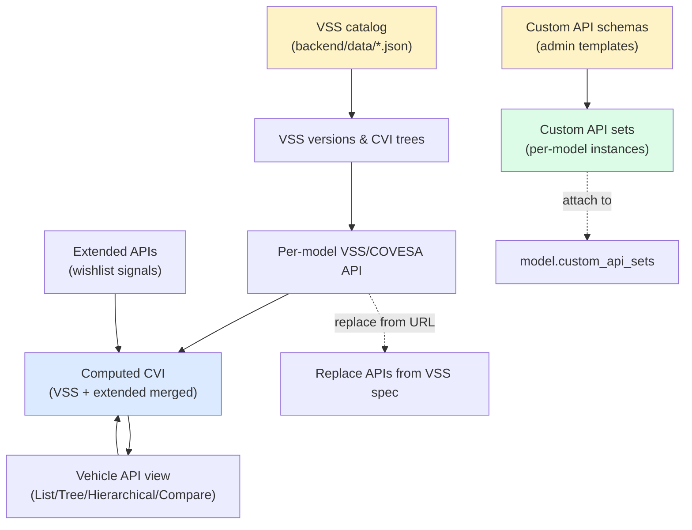
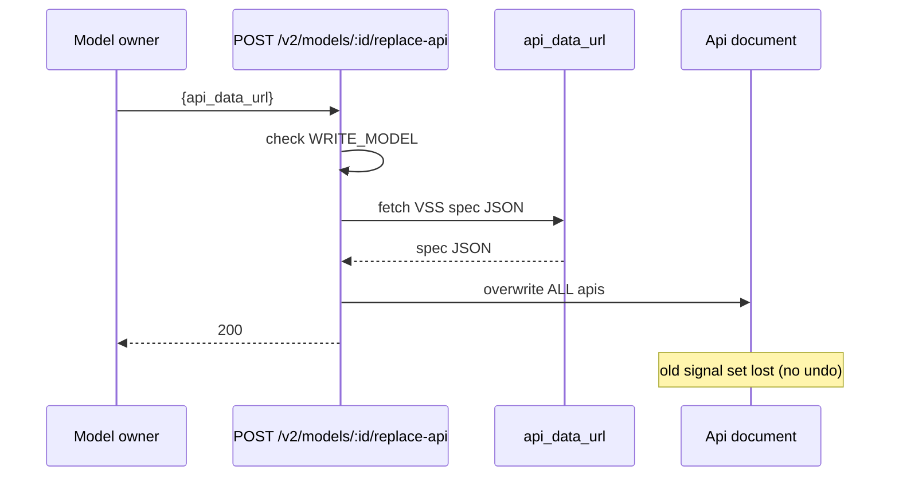
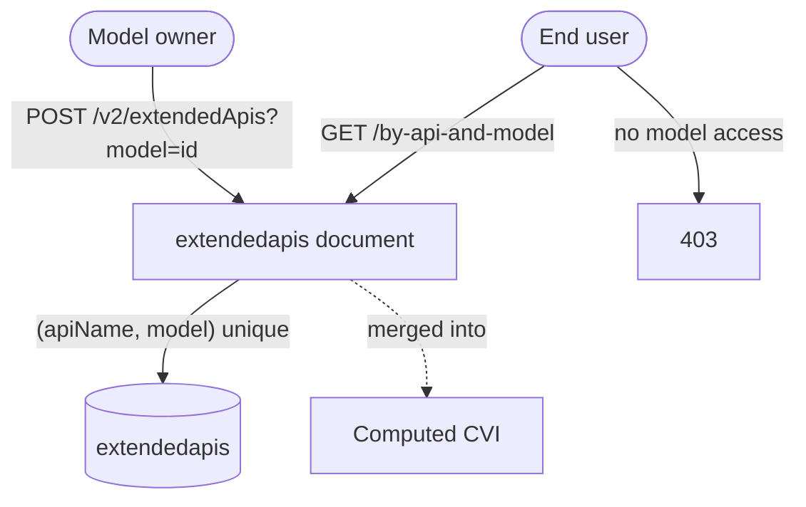
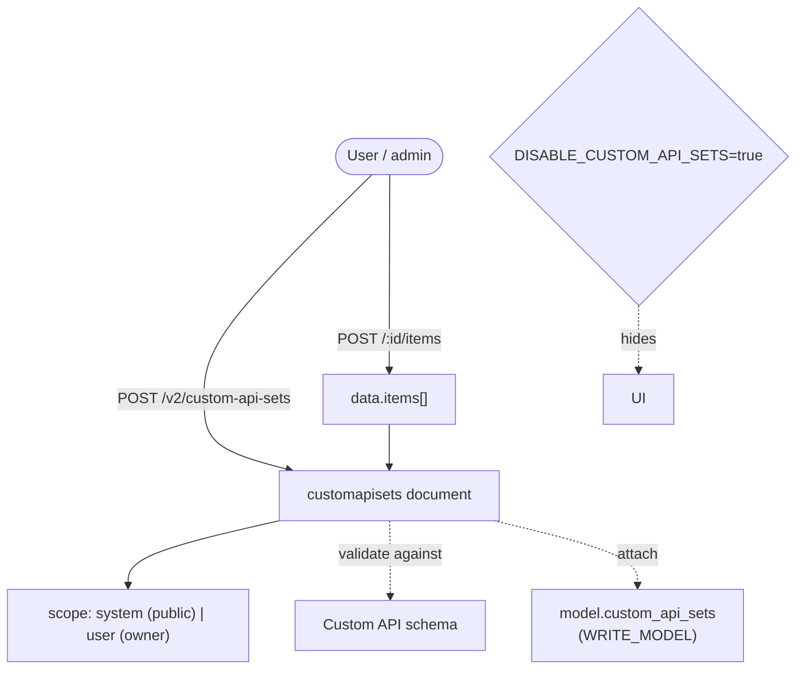

# Cluster: Vehicle APIs

Browse, define, and manage the signal/API layer for a model — VSS/COVESA signals, extended (wishlist) signals, and admin-defined Custom APIs — so that dashboards, prototypes, and downstream integrations have signals to consume.

**Implementation:** `routes/v2/vehicle-data/{api,extendedApi,custom-api-set}.route.js`, `routes/v2/system/custom-api-schema.route.js`, `models/{api,extendedApi,customApiSchema,customApiSet}.model.js` (backend); `pages/PageVehicleApi.tsx`, `components/organisms/{ViewApiCovesa,CustomApi*}.tsx` (frontend).

---

## Capabilities in this cluster

| ID | Capability |
|----|------------|
| [CAP-VAPI-01](#cap-vapi-01--vss-versions--cvi-trees) | VSS versions & CVI trees |
| [CAP-VAPI-02](#cap-vapi-02--per-model-vsscovesa-api-crud--computed-tree) | Per-model VSS/COVESA API CRUD + computed tree |
| [CAP-VAPI-03](#cap-vapi-03--replace-apis-from-a-vss-spec) | Replace APIs from a VSS spec |
| [CAP-VAPI-04](#cap-vapi-04--vehicle-api-view-list--tree--hierarchical--compare) | Vehicle API view (List / Tree / Hierarchical / Compare) |
| [CAP-VAPI-05](#cap-vapi-05--extended-apis-wishlist-signals) | Extended APIs (wishlist signals) |
| [CAP-VAPI-06](#cap-vapi-06--custom-api-schemas) | Custom API schemas |
| [CAP-VAPI-07](#cap-vapi-07--custom-api-sets) | Custom API sets |

## CAP-VAPI-01 — VSS versions & CVI trees

### Description

As an end user or integrator, list the available VSS (Vehicle Signal Specification) versions and fetch a version's computed CVI (Computed Vehicle Interface) tree so that I can browse the canonical signal catalog and pick a version to build against.

### Who uses it / value

End users (browse signals); integrators (pick a VSS version); the platform (canonical signal catalog).

### Acceptance criteria

- When I call `GET /v2/apis/vss`, the system returns `200` a list of versions (e.g. `['4.0','3.1.1',…]`).
- When I call `GET /v2/apis/vss/:name`, the system returns `200` that version's CVI tree.
- When I call the static `GET /vss/:version/:filename`, the system serves the raw JSON (1-hour cache; RC→rc normalization).

### Quality control

When I list versions, I get a non-empty list; when I fetch a version's tree, I get the CVI object; when I fetch the static `/vss/<version>/<file>`, I get JSON back.

### Security

Public — anyone can call these without signing in.

**Coverage:**
- **Auth:** public (no auth) — anonymous.
- **Authorization:** none (public endpoints; no resource checks).
- **Input validation:** for `/vss/:name` I must send a `name` (required string); for the static `/vss/:version/:filename` the `version` must match `^v\d+\.` (with RC→rc normalization), and `filename` is not used to resolve the file — so path traversal via `filename` is not possible.
- **Rate limiting:** not applied (`authLimiter` exists but is unused).
- **Secrets:** none.

**Risks:**
- **Path-traversal in static serving:** the static `GET /vss/:version/:filename` handler maps URL segments to files under `backend/data/`; a weak normalization/caching path could be abused to read arbitrary JSON files from the server if segment sanitization misses encoded or `..` paths.
- **Catalog exposure:** the unauthenticated version list discloses every VSS version the platform supports, giving an attacker the full signal taxonomy to target downstream integrations against.

### Data protection

Static reference data only; no PII.

**Coverage:**
- **Stored data:** none — static reference JSON files.
- **PII:** no (reference signal data).
- **Retention:** N/A (static files; 1-hour cache on `/vss/:version/:filename`).
- **Encryption:** none (public static JSON); TLS in transit.
- **Logging:** the static handler logs the requested path/version/filename; no sensitive data.

**Risks:**
- **Stale-spec leakage:** cached (1-hour) static JSON can keep serving a deprecated/superseded VSS version long after an admin intends to retire it, so consumers keep building against data the platform believed retired.

### Test coverage
- **E2E (Playwright):** 0 — not covered — SITEMAP: ❌
- **Unit (Jest):** none

## CAP-VAPI-02 — Per-model VSS/COVESA API CRUD + computed tree

### Description

As a model owner, define the VSS/COVESA signal set for my model. As an end user, read the computed CVI tree that merges VSS and extended (wishlist) signals into one view so that dashboards and code have a single signal tree to consume.

### Who uses it / value

Model owners (define the signal set); end users (consume signals in dashboards/code).

### Acceptance criteria

- When I call `POST /v2/apis` (auth), the system returns `201` the new API; `GET /v2/apis/:id` → `200`; `PATCH` → `200`; `DELETE` → `204`; `GET /v2/apis/model_id/:modelId` → `200` the model's API.
- When I call `GET /v2/models/:id/api` (optional auth), the system returns `200` the computed CVI (VSS + extended merged); `GET /v2/models/:id/api/:apiName` → `200` one API's detail (`name`, `datatype`, `type`, `unit?`, `min?`, `max?`, `description?`).

### Quality control

After I create an API for a model, the computed tree includes it; when I fetch the `Vehicle.Speed` detail, I get the datatype/unit.

### Security

Reading the computed tree is optional via `PUBLIC_VIEWING`; creating/editing/deleting an API requires auth (owner/admin).

**Coverage:**
- **Auth:** computed-tree reads optional via `PUBLIC_VIEWING`; `POST`/`PATCH`/`DELETE` on `Api` require auth (JWT). Note: `GET /v2/apis/model_id/:modelId` has no auth at all.
- **Authorization:** computed tree — public models are readable by anyone; private models require `READ_MODEL` (owner bypass); `PATCH`/`DELETE` on an `Api` are restricted to owner-or-admin; ⚠️ `POST /v2/apis` lets any signed-in user create an `Api` for any model id (no model-access check on create).
- **Input validation:** I must send `model` (objectId) + `cvi` (jsonString) to create; get/update params are validated; invalid input is rejected.
- **Rate limiting:** not applied (`authLimiter` exists but is unused).
- **Secrets:** none.

**Risks:**
- **Computed-tree leak of private signals:** `GET /v2/models/:id/api` is optional-auth via `PUBLIC_VIEWING`; if a private model's computed tree were served without the access-scoping check, its entire signal definition set would leak to anonymous callers.
- **Unauthorized signal tampering:** a missing auth check on `PATCH /v2/apis/:id` would let any authenticated user rewrite another tenant's signal definitions, corrupting dashboards and downstream consumers.

### Data protection

API definitions are stored linked to the model and the creating user.

**Coverage:**
- **Stored data:** `apis` collection (`model` ref, `cvi` JSON, `created_by`).
- **PII:** no (signal definitions; `created_by` is a user ref).
- **Retention:** hard delete (no soft-delete, no snapshot).
- **Encryption:** none beyond Mongo defaults / TLS in transit.
- **Logging:** request logs; no sensitive data.

**Risks:**
- **Cross-tenant signal inference:** `created_by` and `model` references in `Api` documents can reveal which user owns which model's signal set; a listing gap could expose private ownership relationships.

### Test coverage
- **E2E (Playwright):** 2 test case(s) in `vehicle-api.spec.ts` — SITEMAP: ✅
- **Unit (Jest):** none

## CAP-VAPI-03 — Replace APIs from a VSS spec

### Description

As a model owner, replace **all** APIs for my model by pointing the system at a VSS spec JSON URL so that the model's signal set is swapped to a new VSS version.

### Who uses it / value

Model owners (swap the signal set to a new VSS version).

### Acceptance criteria

- When I call `POST /v2/models/:id/replace-api {api_data_url}` (requires `WRITE_MODEL`), the system returns `200`; if `api_data_url` is missing, it returns `400`. ⚠️ This is destructive — it replaces all APIs.

### Quality control

After I replace from a VSS URL, the computed tree changes to the new spec; I can verify with `GET /v2/models/:id/api`.

### Security

Requires `WRITE_MODEL` (owner bypass).

**Coverage:**
- **Auth:** required (JWT access token).
- **Authorization:** requires `WRITE_MODEL` (owner bypass).
- **Input validation:** I must send `api_data_url` (required string); missing → `400`. ⚠️ No SSRF allowlist — the system fetches the URL I supply, so I can point it at internal addresses.
- **Rate limiting:** not applied (`authLimiter` exists but is unused).
- **Secrets:** none (the URL is user-supplied, not a stored secret).

**Risks:**
- **SSRF via `api_data_url`:** the server fetches the user-supplied URL to pull the VSS spec; without an allowlist or internal-address blocking, an attacker with `WRITE_MODEL` can make the server probe internal services (`http://169.254.169.254/…`, localhost admin ports).
- **Destructive overwrite by a stolen token:** a single call replaces the entire `Api` document, so a leaked `WRITE_MODEL` token lets an attacker wipe a model's signal set irreversibly in one request.

### Data protection

Calling replace overwrites the model's API document; the old set is lost (no undo beyond change logs).

**Coverage:**
- **Stored data:** overwrites the model's `Api` document and hard-deletes/recreates `extendedapis` for the model.
- **PII:** no.
- **Retention:** old `Api` set hard-overwritten (no soft-delete, no snapshot); `extendedapis` hard-deleted.
- **Encryption:** none beyond Mongo defaults / TLS in transit.
- **Logging:** the model id and `api_data_url` are logged (the URL is logged — may carry query params).

**Risks:**
- **Irreversible signal-set loss:** the old API set is hard-overwritten with no soft-delete or snapshot, so a malicious or mistaken replace permanently destroys the prior signal definitions — recoverable only from change logs if they exist.

### Test coverage
- **E2E (Playwright):** 0 — not covered — SITEMAP: ❌
- **Unit (Jest):** none

## CAP-VAPI-04 — Vehicle API view (List / Tree / Hierarchical / Compare)

### Description

As an end user, browse the computed COVESA/VSS APIs in List, Tree, Hierarchical, and a VSS comparator view, and download the computed VSS. As a model owner, upload or replace the VSS and switch VSS version from the UI.

### Who uses it / value

End users (explore signals); model owners (compare/replace VSS).

### Acceptance criteria

- When I open `/model/:id/api` or `/model/:id/api/covesa/:api`, the system renders the corresponding view; when I download, it returns the computed VSS JSON; when I replace/upload, the system requires `WRITE_MODEL`.
- Browsing the view is subject to `PUBLIC_VIEWING`; replacing requires `WRITE_MODEL`.

### Quality control

When I switch view modes, tree/list/hierarchy render; when I compare two versions, diffs are shown; when I download, I get valid JSON.

### Security

Browsing the view is optional via `PUBLIC_VIEWING`; replacing requires `WRITE_MODEL`.

**Coverage:**
- **Auth:** read optional via `PUBLIC_VIEWING`; replace/upload requires auth (JWT) + `WRITE_MODEL`.
- **Authorization:** computed-tree read — public models readable by anyone, private require `READ_MODEL` (owner bypass); replace requires `WRITE_MODEL` (owner bypass).
- **Input validation:** params on the underlying endpoints are validated; view modes are rendered client-side (no server validation of view mode).
- **Rate limiting:** not applied (`authLimiter` exists but is unused).
- **Secrets:** none.

**Risks:**
- **Download exfiltration:** the download action returns the full computed VSS JSON, so a `PUBLIC_VIEWING=true` misconfiguration or a leaked read path hands the entire signal definition set to an anonymous user.
- **Replace-action privilege bypass:** the replace/upload path in the UI must enforce `WRITE_MODEL` server-side; relying on UI hiding alone would let a crafted `POST /v2/models/:id/replace-api` call succeed for any authenticated user.

### Data protection

The view is computed from stored API/extended-API data; downloading exposes the model's signal definitions.

**Coverage:**
- **Stored data:** none new (computed on demand); download exposes the full signal set.
- **PII:** no.
- **Retention:** N/A (computed on demand).
- **Encryption:** none (public signal data); TLS in transit.
- **Logging:** request logs; no sensitive data.

**Risks:**
- **Bulk signal export:** a single download bundles every signal (including extended/wishlist signals unique to the model), giving one request a high-value exfiltration payload if access scoping is wrong.

### Test coverage
- **E2E (Playwright):** 2 test case(s) in `vehicle-api.spec.ts` — SITEMAP: ✅
- **Unit (Jest):** none

## CAP-VAPI-05 — Extended APIs (wishlist signals)

### Description

As a model owner, add custom per-model signals (wishlist signals) on top of the VSS tree so that my model can expose signals beyond the standard set. As an end user, these extended signals are merged into the computed API I consume.

### Who uses it / value

Model owners (add signals beyond standard VSS); end users (use the extended signals).

### Acceptance criteria

- When I call `GET /v2/extendedApis?model=<id>` (optional auth; I must have model access), the system returns `200` the list; `POST` → `201`; `GET /by-api-and-model?apiName=&model=` → `200`; `GET/PATCH/DELETE /:id` → `200`/`200`/`204`.
- `GET /` requires a `model` query; `by-api-and-model` requires `apiName` + `model`; without access, the system returns `403`.
- Each `(apiName, model)` combination is unique.

### Quality control

After I create an extended signal, it appears in the computed tree; when I create a duplicate `(apiName, model)`, it's rejected; when I access another user's private model, I get `403`.

### Security

Reading is optional via `PUBLIC_VIEWING`; writing requires auth + model access; uniqueness is enforced.

**Coverage:**
- **Auth:** reads optional via `PUBLIC_VIEWING`; create/update/delete require auth (JWT).
- **Authorization:** create requires `WRITE_MODEL` on the target model (owner bypass); reads follow model access (public allowed, else `READ_MODEL`/owner); update/delete require `WRITE_MODEL` on the signal's model (owner bypass). Unique `(apiName, model)` index.
- **Input validation:** I must send `model` to list; on update, `apiName` must start with `Vehicle.`; create/update params are validated; invalid input is rejected.
- **Rate limiting:** not applied (`authLimiter` exists but is unused).
- **Secrets:** none.

**Risks:**
- **Cross-tenant signal injection:** if the model-access check on `POST` were bypassed, an authenticated user could inject extended signals into another tenant's private model, polluting its computed CVI.
- **Uniqueness-bypass collision:** the `(apiName, model)` unique index is the only dedupe guard; a race or a check that runs before index validation could create duplicate signals that confuse downstream consumers.

### Data protection

Extended signals are stored with a unique `(apiName, model)` index.

**Coverage:**
- **Stored data:** `extendedapis` collection (`apiName`, `model`, `skeleton`, `datatype`, …); unique index `(apiName, model)`.
- **PII:** no.
- **Retention:** hard delete (no soft-delete); removed when the model is deleted or when `replace-api` runs.
- **Encryption:** none beyond Mongo defaults / TLS in transit.
- **Logging:** request logs; no sensitive data.

**Risks:**
- **Wishlist-signal disclosure:** extended signals often encode proprietary behavior beyond standard VSS; a read-path gap would expose this proprietary wishlist to unauthorized users.

### Test coverage
- **E2E (Playwright):** 0 — not covered — SITEMAP: ❌
- **Unit (Jest):** none

## CAP-VAPI-06 — Custom API schemas

### Description

As an admin, define API schema templates (with `type` tree/list/graph, a JSON `schema`, `id_format`, `relationships`, `tree_config`, `display_mapping`) that integrators use to validate non-COVESA Custom API Sets (e.g. REST/USP).

### Who uses it / value

Admins (define custom API shapes); integrators (non-COVESA APIs like REST/USP).

### Acceptance criteria

- When I call `GET /v2/custom-api-schema[/:id]` (public), the system returns the list/get; when I (as admin) call `POST/PATCH/DELETE /v2/custom-api-schema[/:id]`, it returns `201`/`200`/`204`. These are mounted at both `/v2/system/custom-api-schema` (frontend) and the bare `/v2/custom-api-schema`.
- To create one I must send `schema` (JSON string); the old `attributes` field is gone.
- Items are validated against the schema only basically (full JSON-schema validation is a TODO).

### Quality control

When I (as admin) create a `list` schema with a `schema` string, I get `201`; as a non-admin I get `403`; the public list reads it back.

### Security

Anyone can read schemas; writing requires `MANAGE_USERS` (admin). No secrets in schemas.

**Coverage:**
- **Auth:** read public (no auth); write requires auth (JWT) + `manageUsers`.
- **Authorization:** write requires `manageUsers` (admin only); reads are public.
- **Input validation:** I must send `code`/`name`/`type`/`schema` to create; params are validated (list/get/update/delete); invalid input is rejected. Item validation against the schema is basic (full JSON-schema validation is a TODO).
- **Rate limiting:** not applied (`authLimiter` exists but is unused).
- **Secrets:** none (schema definitions only).

**Risks:**
- **Platform-wide validation template poisoning:** schemas are the validation gate for every Custom API Set; a compromised admin could push a permissive `schema` that accepts arbitrary malicious API payloads into all derived sets.
- **Weak validation as an attack surface:** item validation is only basic (full JSON-schema validation is a TODO), so malformed or oversized `schema` strings could trigger parser/DB issues in downstream set storage.

### Data protection

Schema definitions stored in `customapischemas` (`code` unique).

**Coverage:**
- **Stored data:** `customapischemas` collection (`code` unique, `name`, `type`, `schema` JSON string, `relationships`, `tree_config`, `display_mapping`, `version`, `is_active`, `created_by`).
- **PII:** no.
- **Retention:** indefinite until hard delete (no soft-delete, no TTL).
- **Encryption:** none beyond Mongo defaults / TLS in transit.
- **Logging:** request logs; no sensitive data.

**Risks:**
- **Schema tampering without audit:** a modified schema silently re-shapes what every Custom API Set accepts; without an audit trail of schema changes, a tampered template is hard to detect after malicious sets have been created.

### Test coverage
- **E2E (Playwright):** 0 — not covered — SITEMAP: ❌
- **Unit (Jest):** none

## CAP-VAPI-07 — Custom API sets

### Description

As a user or admin, create instances of a Custom API Schema and attach them to a model so that consumers see custom APIs alongside COVESA. I can scope a set as system (public) or user (owner-only) and add/update/remove items with validation.

### Who uses it / value

End users/admins (create per-model API sets); model consumers (view custom APIs alongside COVESA).

### Acceptance criteria

- When I call `GET /v2/custom-api-sets` (optional auth via `PUBLIC_VIEWING`), the system returns `200` (system sets are public, user sets are owner-only); `POST` (auth) → `201`; `GET /:id` (optional auth via `PUBLIC_VIEWING`) → `200`; `PATCH/DELETE /:id` (auth + ownership) → `200`/`204`.
- When I call `POST /:id/items {item:{…}}`, the system returns `200`; `PATCH/DELETE /:id/items/:itemId` → `200`.
- The UI is hidden when `DISABLE_CUSTOM_API_SETS=true`; attaching a set to a model requires `WRITE_MODEL`.
- On create, my `data` is validated against the referenced schema.

### Quality control

After I create a system-scoped set, any authenticated user can read it; after a user-scoped set, only I (the owner) can read it; after I add an item, it appears in the set; when I toggle `DISABLE_CUSTOM_API_SETS`, the UI is hidden.

### Security

⚠️ No admin gate for system-scope sets — any signed-in user can create/update/delete a system-scoped set (only user-scope is owner-gated). Reads respect scope + `PUBLIC_VIEWING`. Item ops require auth.

**Coverage:**
- **Auth:** reads optional via `PUBLIC_VIEWING`; writes/item ops require auth (JWT).
- **Authorization:** reads — scope + `PUBLIC_VIEWING` (system public, user owner-only); writes — user-scope is owner-gated; ⚠️ system-scope has NO admin gate — any signed-in user can create/update/delete system-scoped sets and items. Attaching a set to a model requires `WRITE_MODEL`.
- **Input validation:** I must send `custom_api_schema`/`custom_api_schema_code`/`scope`/`name`/`data.items` to create; `data` is validated against the referenced schema; item-level validation is basic (full JSON-schema validation is a TODO).
- **Rate limiting:** not applied (`authLimiter` exists but is unused).
- **Secrets:** none.

**Risks:**
- **System-scope set takeover:** because system-scope sets have no admin gate, any authenticated user (not just admins) can create, update, or delete system-scoped sets that every tenant reads — a low-privilege account can tamper with shared, platform-visible API definitions.
- **Cross-tenant system-set pollution:** a system-scoped set is public across tenants; without ownership/tenant scoping on system-scope writes, one user can push hostile or malformed API definitions visible to all consumers, with no admin approval step.
- **Item-level bypass:** `POST/PATCH/DELETE /:id/items` require auth but not re-validated ownership on every item op in the spec — if item ops aren't scoped to the set owner, any authenticated user could mutate another user's set items.

### Data protection

Sets are stored with an `owner`/`created_by`; the entire API set lives in one document (`data.items[]` — mind the 16 MB limit).

**Coverage:**
- **Stored data:** `customapisets` collection (`custom_api_schema` ref, `custom_api_schema_code`, `scope`, `owner`, `created_by`, `name`, `description`, `avatar`, `provider_url`, `data.items[]`, `data.metadata`); entire set in one document (16 MB Mongo limit).
- **PII:** no (API definitions; `owner` is a user ref).
- **Retention:** hard delete (no soft-delete, no snapshot).
- **Encryption:** none beyond Mongo defaults / TLS in transit.
- **Logging:** request logs; no sensitive data.

**Risks:**
- **Document-growth DoS:** the whole set lives in one MongoDB document capped at 16 MB; an attacker who can append items unbounded could push the document toward the limit, corrupting or rejecting the entire set's storage.
- **Owner-data leak via system scope:** a user mistakenly creating a system-scoped set instead of a user-scoped one exposes their custom API definitions (potentially proprietary) to every authenticated user — an irreversible misclassification with no prompt to revert.

### Test coverage
- **E2E (Playwright):** 0 — not covered — SITEMAP: ❌
- **Unit (Jest):** none