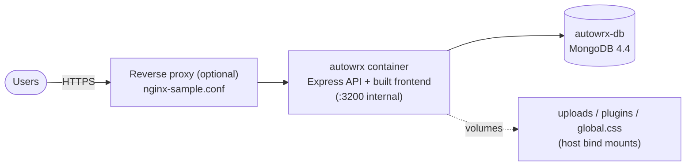

# Deployment

How AutoWRX is deployed to production: a **single application image** (the
backend serves both the API and the built frontend) plus **MongoDB**, run with
Docker Compose from the [`instance-setup/`](../../../instance-setup) directory.

> **Canonical step-by-step:** the
> [Instance Setup Guide](../../../instance-setup/instance-setup-guide.md) in
> `instance-setup/` is the authoritative walkthrough (it also ships as an asset
> on every GitHub Release). This page is the overview and reference.

---

## 1. Architecture



- **One app container** — `ghcr.io/eclipse-autowrx/autowrx/autowrx`. The
  backend serves the API under `/v2` and the frontend build as static files
  (see [Architecture Overview](../../architecture/README.md)).
- **One database container** — `mongo:4.4.6`, data in a named Docker volume.
- **No API gateway** — there is no separate gateway/proxy service in the stack;
  put your own reverse proxy (nginx/Traefik) in front for TLS if needed
  (`instance-setup/nginx-sample.conf` is a starting point).

## 2. Quick start

```bash
git clone https://github.com/eclipse-autowrx/autowrx.git   # or download the
cd autowrx/instance-setup                                  # release tarball

cp .env.prod.sample .env.prod        # then EDIT it (secrets, CORS, admin)
./up.sh                              # = docker compose -f docker-compose.prod.yml
                                     #     --env-file .env.prod up -d
```

Verify: `docker compose -f docker-compose.prod.yml --env-file .env.prod ps`,
then open `http://<host>:<FRONTEND_PORT>`.

Stop with `./down.sh`.

## 3. Configuration (`.env.prod`)

| Variable | Purpose | Default |
|---|---|---|
| `NAME` | Instance name (prefixes container/volume/network names) | `prod` |
| `FRONTEND_PORT` | Host port mapped to the app container's `:3200` | `3200` |
| `JWT_SECRET` | **Change it.** Signs all tokens | — |
| `JWT_COOKIE_NAME` | Refresh-cookie name | `token` |
| `CORS_ORIGINS` | Comma-separated **regex** allowlist (see [CORS reference](../../reference/cors.md)) | — |
| `ADMIN_EMAILS` / `ADMIN_PASSWORD` | Admin user(s) bootstrapped on first run | — |
| `MONGODB_DATABASE` | Database name | `autowrx` |
| `GENAI_URL` | Optional external GenAI service | unset |
| `KIT_SERVER_URL` | Optional kit/runtime server override (also settable at runtime via the `RUNTIME_SERVER_URL` site config) | unset |
| `UPLOAD_PATH_HOST` / `PLUGIN_PATH_HOST` / `GLOBAL_CSS_PATH_HOST` | Host paths for persisted uploads, internal plugins, and the admin-editable global CSS | `./data/…` |

MongoDB is reachable only on the internal Docker network by default (the host
port mapping is commented out in the compose file).

## 4. Persistence

| Data | Where |
|---|---|
| Database | named volume `${NAME}-autowrx-dbdata` |
| User uploads | `${UPLOAD_PATH_HOST}` bind mount |
| Internal plugins | `${PLUGIN_PATH_HOST}` bind mount |
| Global CSS (admin theming) | `${GLOBAL_CSS_PATH_HOST}` bind mount |

Back up the named volume and the `data/` bind mounts together.

## 5. Custom builtin widgets (optional)

Overlay the widgets compose file to mount your own builtin-widgets from the
host:

```bash
docker compose -f docker-compose.prod.yml -f docker-compose.widgets.yml \
  --env-file .env.prod up -d
```

## 6. Releases & upgrades

Releases are **date-tagged**: pushing a git tag `vYYYY.MM.DD` triggers
[`build-docker.yml`](../../../.github/workflows/build-docker.yml), which
publishes the image as `vYYYY.MM.DD`, `YYYY.MM.DD`, `YYYY.MM` (month-rolling),
and `latest`, and attaches the `instance-setup/` files to a GitHub Release.

The compose file tracks **`:latest`** by default, so upgrading is:

```bash
docker compose -f docker-compose.prod.yml --env-file .env.prod pull autowrx
docker compose -f docker-compose.prod.yml --env-file .env.prod up -d
```

To **pin a version** (recommended for production), edit the `image:` tag in
`docker-compose.prod.yml` to a date tag, e.g.
`ghcr.io/eclipse-autowrx/autowrx/autowrx:v2026.06.30`, then `pull` + `up -d`.
Roll back the same way with the previous tag.

## 7. Security checklist

- Set a strong `JWT_SECRET` and `ADMIN_PASSWORD`; restrict `CORS_ORIGINS` to
  your domains.
- Terminate TLS at your reverse proxy; the refresh cookie is `Secure` +
  `SameSite=None` in production (see
  [Auth & Security](../../architecture/auth-security.md)).
- Keep MongoDB off the public network (default).
- The full checklist lives in the
  [Instance Setup Guide](../../../instance-setup/instance-setup-guide.md#security-checklist).
