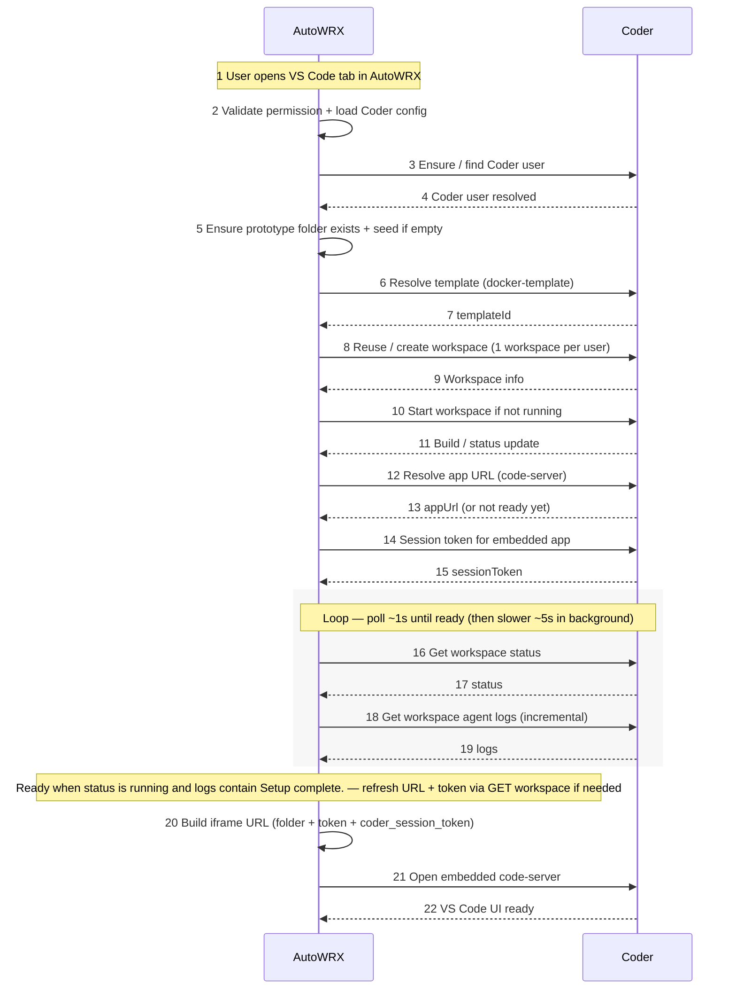

# Coder: VS Code tab open flow

High-level sequence when the user opens the embedded VS Code tab (prepare, poll, iframe). See `coder-integration-flow.md` for full detail.

```mermaid
sequenceDiagram
    participant AutoWRX
    participant Coder

    Note over AutoWRX: 1 User opens VS Code tab in AutoWRX

    AutoWRX->>AutoWRX: 2 Validate permission + load Coder config

    AutoWRX->>Coder: 3 Ensure / find Coder user
    Coder-->>AutoWRX: 4 Coder user resolved

    AutoWRX->>AutoWRX: 5 Ensure prototype folder exists + seed if empty

    AutoWRX->>Coder: 6 Resolve template (docker-template)
    Coder-->>AutoWRX: 7 templateId

    AutoWRX->>Coder: 8 Reuse / create workspace (1 workspace per user)
    Coder-->>AutoWRX: 9 Workspace info

    AutoWRX->>Coder: 10 Start workspace if not running
    Coder-->>AutoWRX: 11 Build / status update

    AutoWRX->>Coder: 12 Resolve app URL (code-server)
    Coder-->>AutoWRX: 13 appUrl (or not ready yet)

    AutoWRX->>Coder: 14 Session token for embedded app
    Coder-->>AutoWRX: 15 sessionToken

    rect rgba(240,240,240,0.5)
        Note over AutoWRX,Coder: Loop — poll ~1s until ready (then slower ~5s in background)
        AutoWRX->>Coder: 16 Get workspace status
        Coder-->>AutoWRX: 17 status
        AutoWRX->>Coder: 18 Get workspace agent logs (incremental)
        Coder-->>AutoWRX: 19 logs
    end

    Note over AutoWRX: Ready when status is running and logs contain Setup complete. — refresh URL + token via GET workspace if needed

    AutoWRX->>AutoWRX: 20 Build iframe URL (folder + token + coder_session_token)

    AutoWRX->>Coder: 21 Open embedded code-server
    Coder-->>AutoWRX: 22 VS Code UI ready
```
