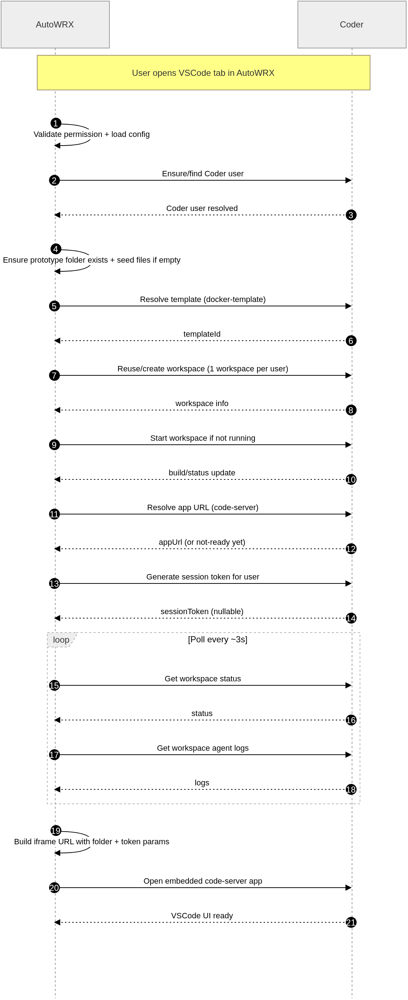

# Coder Integration Flow

This document rewrites the Coder sequence flow. It is intended to describe runtime behavior in a linear, actor-by-actor format.

## Cast

  - **User**: the person opening a prototype and using the VSCode tab.
  - **Frontend (AutoWRX UI)**: the browser app.
  - **Backend (AutoWRX API)**: orchestration layer and permission gate.
  - **Site Config**: source of Coder-related configuration values.
  - **MongoDB**: stores user/prototype/model metadata.
  - **Coder API**: external workspace platform API (`/api/v2`).
  - **Host File System**: stores prototype folders under `PROTOTYPES_PATH`.
  - **Workspace Container**: the running code-server environment created by Coder template.

## Execution Walkthrough

### Phase 1: VSCode tab initialization

1. **User -> Frontend**: Open prototype page and switch to the VSCode tab.
2. **Frontend -> Backend**: `POST /system/coder/workspace/{prototypeId}/prepare`

### Phase 2: Configuration and authorization checks

1. **Backend -> Site Config**: Load `VSCODE_ENABLE`, `CODER_URL`, `CODER_ADMIN_API_KEY`, `PROTOTYPES_PATH`.
2. **Site Config -> Backend**: returns current values.
3. **Backend (decision)**:

  - If `VSCODE_ENABLE` is false: return `403` (`VSCode integration is disabled`).
  - Otherwise continue.

4. **Backend -> MongoDB**: Load prototype, model, and current user documents.
5. **Backend (decision)**:

  - If user does not have `READ_MODEL` permission for the prototype: return `403`.
  - Otherwise continue orchestration.

### Phase 3: User/workspace reconciliation on Coder

1. **Backend -> Coder API**: Resolve Coder identity (`find-or-create user`).
   (Authenticated with `Coder-Session-Token: CODER_ADMIN_API_KEY`.)
2. **Coder API -> Backend**: returns Coder user identity.
3. **Backend -> Host File System**: Ensure directory exists at `PROTOTYPES_PATH/{userId}/{prototypeFolder}`.
4. **Backend -> Host File System**: If directory is empty, seed initial files from prototype content.
5. **Backend -> Coder API**: Resolve template id for `docker-template`.
6. **Coder API -> Backend**: returns template id.
7. **Backend (decision)**:

  - If user already has a valid `coder_workspace_id`: reuse workspace.
  - Else: create/recover one workspace for this user, then persist workspace id/name in MongoDB.

8. **Backend -> Coder API**: Start workspace when current state is not `running`.
9. **Backend -> Coder API**: Resolve app URL for app slug `code-server`.
10. **Backend -> Coder API**: Generate session token for the Coder user.
11. **Backend -> Frontend**: returns payload:

  - `workspaceId`
  - `workspaceName`
  - `status`
  - `appUrl` (if ready enough to resolve)
  - `sessionToken` (nullable)
  - `folderPath`

### Phase 4: Readiness polling loop

1. **Frontend (loop every ~3 seconds)**:

  - **Frontend -> Backend**: `GET /system/coder/workspace/{prototypeId}/status`
  - **Frontend -> Backend**: `GET /system/coder/workspace/{prototypeId}/logs?after={lastLogId}`

2. **Backend -> Coder API**:

  - Reads workspace status.
  - Reads workspace-agent logs.

3. **Backend -> Frontend**: sends status/log updates.
4. **Frontend (decision)**:

  - Keep waiting until:
    - workspace status is `running`, and
    - logs include readiness signal (`"Setup complete."`).
  - If status becomes `failed` or `canceled`, show error state.

### Phase 5: Embedded editor rendering

1. **Frontend** builds iframe URL from `appUrl`:

  - append `folder` query param (prototype path inside container),
  - append `token` and `coder_session_token` query params when `sessionToken` is available.

2. **Frontend -> Workspace Container (via Coder app routing)**: load embedded code-server.
3. **Workspace Container -> User**: VSCode web editor is ready.

## Reference Diagram

