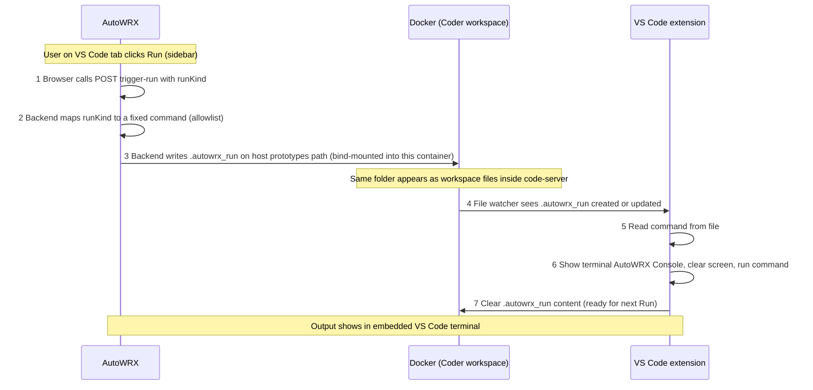

# Coder: Run button → VS Code terminal

Sequence for dashboard **Run** while the VS Code tab is active (`trigger-run` → `.autowrx_run` → autowrx-runner extension).

```mermaid
sequenceDiagram
    participant AutoWRX
    participant Docker as Docker (Coder workspace)
    participant Ext as VS Code extension

    Note over AutoWRX: User on VS Code tab clicks Run (sidebar)

    AutoWRX->>AutoWRX: 1 Browser calls POST trigger-run with runKind

    AutoWRX->>AutoWRX: 2 Backend maps runKind to a fixed command (allowlist)

    AutoWRX->>Docker: 3 Backend writes .autowrx_run on host prototypes path (bind-mounted into this container)

    Note over Docker: Same folder appears as workspace files inside code-server

    Docker->>Ext: 4 File watcher sees .autowrx_run created or updated

    Ext->>Ext: 5 Read command from file

    Ext->>Ext: 6 Show terminal AutoWRX Console, clear screen, run command

    Ext->>Docker: 7 Clear .autowrx_run content (ready for next Run)

    Note over AutoWRX,Ext: Output shows in embedded VS Code terminal
```
